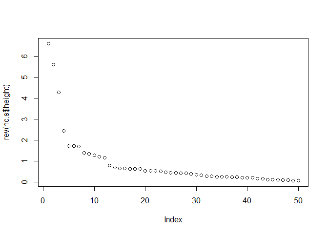
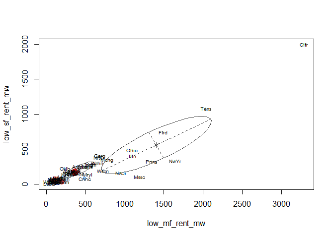
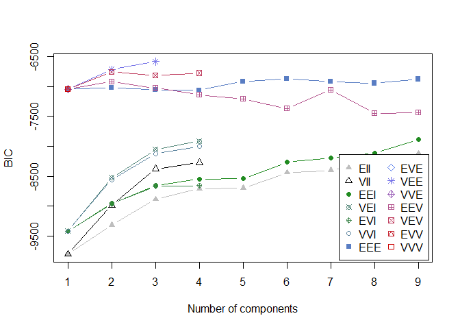
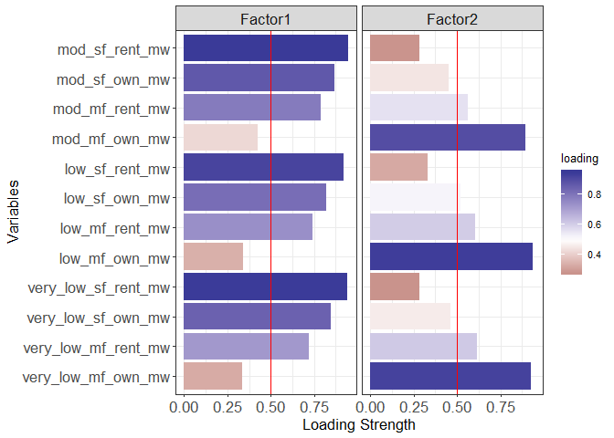

Project\_Solar\_Energy
================
Nguyen Nguyen
April 1, 2019

``` r
library(readr)
library(dplyr)
#install.packages('corrplot')
library(corrplot)
library(stringr)
#install.packages('BBmisc') #correlation plot
library(BBmisc)
library(ggplot2)
#install.packages('ggfortify')  #mapping biplot
library(ggfortify)
#install.packages('tidyverse')
library(tidyverse)
#install.packages('usmap') #us map by state or county
library(usmap)
#install.packages('factoextra')
library(factoextra)
library(mclust)
library(sem)
library(semPlot)
#install.packages('rgl') #3D plotting
library(rgl)
library(reshape2)
```

**County-level aggregation** \#\# Using
SUM

``` r
county_solar_potential <- read_csv("C:/Users/nguye/Documents/TTU/6350/Group Project/county_solar_potential.csv")
county_solar_potential <-county_solar_potential[,-1]
capacity_potential_lmi <- county_solar_potential %>%
  select(state_name:county_name,area_km2,very_low_mf_own_mw:mod_sf_rent_mw) 
# Correlation matrix
cormatrix <- round(cor(capacity_potential_lmi[,4:15]),4)
```

``` r
head(capacity_potential_lmi)
```

    ## # A tibble: 6 x 15
    ##   state_name county_name area_km2 very_low_mf_own~ very_low_mf_ren~
    ##   <chr>      <chr>          <dbl>            <dbl>            <dbl>
    ## 1 Alabama    Autauga Co~    1565.            0.109             3.90
    ## 2 Alabama    Baldwin Co~    4225.            1.72             17.2 
    ## 3 Alabama    Barbour Co~    2343.            0.182             5.91
    ## 4 Alabama    Bibb County    1622.            0.127             1.45
    ## 5 Alabama    Blount Cou~    1685.            0.110             3.47
    ## 6 Alabama    Bullock Co~    1619.            0.124             2.00
    ## # ... with 10 more variables: very_low_sf_own_mw <dbl>,
    ## #   very_low_sf_rent_mw <dbl>, low_mf_own_mw <dbl>, low_mf_rent_mw <dbl>,
    ## #   low_sf_own_mw <dbl>, low_sf_rent_mw <dbl>, mod_mf_own_mw <dbl>,
    ## #   mod_mf_rent_mw <dbl>, mod_sf_own_mw <dbl>, mod_sf_rent_mw <dbl>

\#Check NA

``` r
colSums(is.na(capacity_potential_lmi))
```

    ##          state_name         county_name            area_km2 
    ##                   0                   0                   0 
    ##  very_low_mf_own_mw very_low_mf_rent_mw  very_low_sf_own_mw 
    ##                   0                   0                   0 
    ## very_low_sf_rent_mw       low_mf_own_mw      low_mf_rent_mw 
    ##                   0                   0                   0 
    ##       low_sf_own_mw      low_sf_rent_mw       mod_mf_own_mw 
    ##                   0                   0                   0 
    ##      mod_mf_rent_mw       mod_sf_own_mw      mod_sf_rent_mw 
    ##                   0                   0                   0

\#Observations with low values, assigned as
0

``` r
capacity_potential_lmi$COUNT <- rowSums(abs(capacity_potential_lmi[,4:15]) < 0.000000000000001)
sum(capacity_potential_lmi$COUNT > 5)
```

    ## [1] 13

\#counties with nearly more than \>= 50% variables of zero values

``` r
capacity_potential_lmi[capacity_potential_lmi$COUNT>5,]
```

    ## # A tibble: 13 x 16
    ##    state_name county_name area_km2 very_low_mf_own~ very_low_mf_ren~
    ##    <chr>      <chr>          <dbl>            <dbl>            <dbl>
    ##  1 Alaska     Kusilvak C~  46627.                 0         0       
    ##  2 Hawaii     Kalawao Co~     31.1                0         0.0461  
    ##  3 Montana    Prairie Co~   4513.                 0         0       
    ##  4 North Dak~ Slope Coun~   3158.                 0         0       
    ##  5 South Dak~ Oglala Lak~   5430.                 0         0       
    ##  6 Texas      Armstrong ~   2367.                 0         0       
    ##  7 Texas      Kent County   2339.                 0         0       
    ##  8 Texas      Loving Cou~   1753.                 0         0       
    ##  9 Texas      McMullen C~   2996.                 0         0.000573
    ## 10 Texas      Roberts Co~   2394.                 0         0       
    ## 11 Texas      Terrell Co~   6107.                 0         0       
    ## 12 Utah       Daggett Co~   1866.                 0         0       
    ## 13 Utah       Piute Coun~   1985.                 0         0       
    ## # ... with 11 more variables: very_low_sf_own_mw <dbl>,
    ## #   very_low_sf_rent_mw <dbl>, low_mf_own_mw <dbl>, low_mf_rent_mw <dbl>,
    ## #   low_sf_own_mw <dbl>, low_sf_rent_mw <dbl>, mod_mf_own_mw <dbl>,
    ## #   mod_mf_rent_mw <dbl>, mod_sf_own_mw <dbl>, mod_sf_rent_mw <dbl>,
    ## #   COUNT <dbl>

\#remove counties with from more than \>= 50% variables of zero
values

``` r
capacity_potential_lmi_clean <- capacity_potential_lmi[capacity_potential_lmi$COUNT<6,]
```

\#Scatter plot

``` r
pairs(scale(capacity_potential_lmi_clean[,4:15]))
```

<!-- -->

\#Extract numerical parts - **all counties**

``` r
num_vabs_cp_lmi <- as.data.frame(capacity_potential_lmi_clean[,4:15])
```

Correlation plot

``` r
corr_mat = round(cor(num_vabs_cp_lmi),2)
corrplot(corr_mat)
```

<!-- -->

\#Combine names of states and counties

``` r
a <- abbreviate(capacity_potential_lmi_clean$state_name)
b <- abbreviate(capacity_potential_lmi_clean$county_name)
rownames(num_vabs_cp_lmi) <- str_c(a,b,sep='_')
```

*Outliers*

``` r
plot(num_vabs_cp_lmi$very_low_mf_rent_mw,num_vabs_cp_lmi$very_low_sf_own_mw,type='n')
text(num_vabs_cp_lmi$very_low_mf_rent_mw,num_vabs_cp_lmi$very_low_sf_own_mw,labels=rownames(num_vabs_cp_lmi))
```

<!-- -->

``` r
plot(num_vabs_cp_lmi$low_mf_rent_mw,num_vabs_cp_lmi$very_low_sf_rent_mw,type='n')
text(num_vabs_cp_lmi$low_mf_rent_mw,num_vabs_cp_lmi$very_low_sf_rent_mw,labels=rownames(num_vabs_cp_lmi))
```

<!-- -->
Based on above 2 plots, potential outliers: California\_LosAngeles.

**Standardize the
dataset**

``` r
num_vabs_cp_lmi.s <- normalize(num_vabs_cp_lmi, method = "standardize", range = c(0, 1), margin = 2, on.constant = "quiet")
```

*Sun Belt
states*

``` r
sunbelt <- c('Florida','Georgia','South Carolina','Alabama','Mississippi', 'Louisiana','Texas','New Mexico','Arizona','Nevada','California')
sunbelt %in% capacity_potential_lmi_clean$state_name
```

    ##  [1] TRUE TRUE TRUE TRUE TRUE TRUE TRUE TRUE TRUE TRUE TRUE

``` r
capacity_potential_lmi_clean$sunbelt <- 'Other'
capacity_potential_lmi_clean$sunbelt[capacity_potential_lmi_clean$state_name %in% sunbelt] <- 'SunBelt'
```

**Principle Component Analysis for County-level** \#Assumption: dataset
is multivariate normality. \# Principal Component Analysis - County
level

``` r
lmi_pca <- princomp(num_vabs_cp_lmi.s, cor=T)
summary(lmi_pca,loadings=T)
```

    ## Importance of components:
    ##                           Comp.1     Comp.2    Comp.3      Comp.4
    ## Standard deviation     3.2116511 1.09404365 0.4607711 0.340102015
    ## Proportion of Variance 0.8595586 0.09974429 0.0176925 0.009639115
    ## Cumulative Proportion  0.8595586 0.95930288 0.9769954 0.986634494
    ##                             Comp.5      Comp.6      Comp.7       Comp.8
    ## Standard deviation     0.286144075 0.208451075 0.122160033 0.0919821497
    ## Proportion of Variance 0.006823203 0.003620988 0.001243589 0.0007050597
    ## Cumulative Proportion  0.993457697 0.997078684 0.998322274 0.9990273336
    ##                              Comp.9      Comp.10      Comp.11      Comp.12
    ## Standard deviation     0.0709531713 0.0559377564 0.0485392337 3.394929e-02
    ## Proportion of Variance 0.0004195294 0.0002607527 0.0001963381 9.604622e-05
    ## Cumulative Proportion  0.9994468630 0.9997076157 0.9999039538 1.000000e+00
    ## 
    ## Loadings:
    ##                     Comp.1 Comp.2 Comp.3 Comp.4 Comp.5 Comp.6 Comp.7
    ## very_low_mf_own_mw   0.256  0.491  0.243  0.329  0.128  0.161  0.465
    ## very_low_mf_rent_mw  0.299        -0.511         0.402  0.357 -0.235
    ## very_low_sf_own_mw   0.297 -0.142  0.385 -0.318  0.445  0.185  0.289
    ## very_low_sf_rent_mw  0.286 -0.323  0.159  0.390  0.233  0.213 -0.462
    ## low_mf_own_mw        0.262  0.486  0.115        -0.210  0.148 -0.115
    ## low_mf_rent_mw       0.302        -0.502 -0.118 -0.151         0.151
    ## low_sf_own_mw        0.302         0.138 -0.489 -0.381  0.250       
    ## low_sf_rent_mw       0.289 -0.285         0.284 -0.580  0.200       
    ## mod_mf_own_mw        0.274  0.417  0.119               -0.422 -0.501
    ## mod_mf_rent_mw       0.304        -0.385         0.120 -0.488  0.297
    ## mod_sf_own_mw        0.301 -0.164  0.199 -0.383        -0.291 -0.138
    ## mod_sf_rent_mw       0.286 -0.321  0.142  0.393        -0.371  0.166
    ##                     Comp.8 Comp.9 Comp.10 Comp.11 Comp.12
    ## very_low_mf_own_mw   0.370  0.205  0.192   0.167   0.151 
    ## very_low_mf_rent_mw  0.270        -0.424   0.103  -0.190 
    ## very_low_sf_own_mw  -0.504  0.146 -0.189  -0.125         
    ## very_low_sf_rent_mw -0.101 -0.111  0.537                 
    ## low_mf_own_mw       -0.165 -0.535         -0.388  -0.370 
    ## low_mf_rent_mw      -0.157         0.178  -0.372   0.630 
    ## low_sf_own_mw        0.133 -0.267          0.574   0.125 
    ## low_sf_rent_mw      -0.106  0.485 -0.125          -0.312 
    ## mod_mf_own_mw       -0.245  0.349 -0.199   0.192   0.210 
    ## mod_mf_rent_mw      -0.192         0.340   0.291  -0.419 
    ## mod_sf_own_mw        0.576  0.163  0.160  -0.436  -0.127 
    ## mod_sf_rent_mw       0.127 -0.420 -0.481           0.226

``` r
head(lmi_pca$scores)
```

    ##                     Comp.1       Comp.2       Comp.3       Comp.4
    ## Albm_AtgC       -0.6031745 -0.176262792  0.108597999 -0.007922843
    ## Albm_BldwC       0.9242353 -0.661779237  0.469501046 -0.367768454
    ## Albm_BarborCnty -0.8195113 -0.017534736 -0.038733209  0.089139667
    ## Albm_BbbC       -0.8654339 -0.004962149  0.001715614  0.016225702
    ## Albm_BlntC      -0.5324278 -0.179119569  0.149008216 -0.134531133
    ## Albm_BllckC     -0.9906950  0.062489693 -0.040073916  0.066063215
    ##                        Comp.5      Comp.6      Comp.7        Comp.8
    ## Albm_AtgC       -0.0006979332 0.009794918 -0.01336466  0.0344991939
    ## Albm_BldwC       0.0389261353 0.015384795  0.17104577  0.0156335008
    ## Albm_BarborCnty  0.0420916267 0.036066680 -0.03140990 -0.0212253993
    ## Albm_BbbC       -0.0819832364 0.016529495  0.02272799  0.0003662287
    ## Albm_BlntC      -0.0570454066 0.058019881  0.01403276  0.0146318229
    ## Albm_BllckC     -0.0235732674 0.016781142  0.01217041 -0.0210096750
    ##                        Comp.9       Comp.10      Comp.11      Comp.12
    ## Albm_AtgC        0.0002104765  0.0174180489 -0.044096769 -0.001373494
    ## Albm_BldwC      -0.0080808071 -0.0895910066 -0.008225151 -0.031950077
    ## Albm_BarborCnty -0.0001918164  0.0238040168  0.010036630 -0.008913505
    ## Albm_BbbC        0.0009992047 -0.0004983123  0.020017095  0.004093740
    ## Albm_BlntC       0.0407727122  0.0094932019 -0.020070052 -0.011147763
    ## Albm_BllckC      0.0019293549 -0.0034462828  0.016797070 -0.004834748

``` r
biplot(lmi_pca) 
```


``` r
num_vabs_cp_lmi.s$sunbelt <- capacity_potential_lmi_clean$sunbelt
```

``` r
autoplot(princomp(num_vabs_cp_lmi[,-13],cor=T),loadings=TRUE,loadings.label=TRUE,loadings.label.size=5,loadings.label.colour='black',data=num_vabs_cp_lmi.s,colour='sunbelt',loadings.colour='black',size=5)+
  theme(legend.position="bottom",legend.title=element_text(size=15),legend.text=element_text(size=14))
```


**State level** \#Extract numerical parts - *states only*

``` r
capacity_potential_lmi_state <- capacity_potential_lmi_clean %>%
  group_by(state_name) %>%
  summarise_at(vars(area_km2,very_low_mf_own_mw:mod_sf_rent_mw),sum,na.rm=TRUE)
#View(capacity_potential_lmi_state)
str(capacity_potential_lmi_state)
```

    ## Classes 'tbl_df', 'tbl' and 'data.frame':    51 obs. of  14 variables:
    ##  $ state_name         : chr  "Alabama" "Alaska" "Arizona" "Arkansas" ...
    ##  $ area_km2           : num  133736 1462040 295233 137732 409371 ...
    ##  $ very_low_mf_own_mw : num  38 19.2 121.9 18.7 623.8 ...
    ##  $ very_low_mf_rent_mw: num  783 144 872 525 5358 ...
    ##  $ very_low_sf_own_mw : num  1036 72.8 928 620 4078.6 ...
    ##  $ very_low_sf_rent_mw: num  654.6 35.6 713.2 448.5 3663.6 ...
    ##  $ low_mf_own_mw      : num  23.8 17.8 77.7 8.8 581.8 ...
    ##  $ low_mf_rent_mw     : num  290 102 404 197 3283 ...
    ##  $ low_sf_own_mw      : num  491 56 513 235 3556 ...
    ##  $ low_sf_rent_mw     : num  185.6 20.5 253.7 108.8 1995.4 ...
    ##  $ mod_mf_own_mw      : num  52.1 29.6 182.2 23.8 937.7 ...
    ##  $ mod_mf_rent_mw     : num  460 121 695 348 4040 ...
    ##  $ mod_sf_own_mw      : num  1197.8 95.6 1255.4 725.5 6055.5 ...
    ##  $ mod_sf_rent_mw     : num  335.6 26.2 500.6 251.3 2574.8 ...

\#Scatter
plot

``` r
pairs(scale(capacity_potential_lmi_state[,3:14]))
```

<!-- -->

\#States
names

``` r
num_vabs_cp_lmi_state <- as.data.frame(capacity_potential_lmi_state[,3:14])
rownames(num_vabs_cp_lmi_state) <- abbreviate(capacity_potential_lmi_state$state_name)
head(num_vabs_cp_lmi_state)
```

    ##      very_low_mf_own_mw very_low_mf_rent_mw very_low_sf_own_mw
    ## Albm           38.00439            782.6642         1036.01008
    ## Alsk           19.20963            143.9318           72.79007
    ## Arzn          121.90779            871.5131          927.95947
    ## Arkn           18.71943            525.0153          620.04182
    ## Clfr          623.82574           5357.5609         4078.64815
    ## Clrd           85.60916            560.2952          484.12842
    ##      very_low_sf_rent_mw low_mf_own_mw low_mf_rent_mw low_sf_own_mw
    ## Albm           654.62948     23.777390       290.1103     491.12184
    ## Alsk            35.64174     17.787692       101.6557      56.01345
    ## Arzn           713.20661     77.729516       403.7399     512.51434
    ## Arkn           448.52548      8.802054       197.0092     235.15874
    ## Clfr          3663.56807    581.754537      3282.7480    3556.39976
    ## Clrd           320.25751     86.869493       376.2525     450.75822
    ##      low_sf_rent_mw mod_mf_own_mw mod_mf_rent_mw mod_sf_own_mw
    ## Albm      185.63065      52.08202       459.9434    1197.78876
    ## Alsk       20.51378      29.59811       120.5217      95.63151
    ## Arzn      253.73898     182.24484       695.3666    1255.35922
    ## Arkn      108.78401      23.78454       348.3043     725.46525
    ## Clfr     1995.36971     937.72511      4039.7733    6055.50781
    ## Clrd      194.06645     157.13076       474.6707     876.30499
    ##      mod_sf_rent_mw
    ## Albm      335.61691
    ## Alsk       26.21986
    ## Arzn      500.55971
    ## Arkn      251.28264
    ## Clfr     2574.78943
    ## Clrd      255.29557

\#Standardize

``` r
num_vabs_cp_lmi_state.s <- normalize(num_vabs_cp_lmi_state, method = "standardize", range = c(0, 1), margin = 2, on.constant = "quiet")
head(num_vabs_cp_lmi_state.s)
```

    ##      very_low_mf_own_mw very_low_mf_rent_mw very_low_sf_own_mw
    ## Albm       -0.496768531          -0.1876002         0.18797776
    ## Alsk       -0.610278215          -0.8002883        -0.85047461
    ## Arzn        0.009960268          -0.1023742         0.07148785
    ## Arkn       -0.613238708          -0.4347435        -0.26047973
    ## Clfr        3.041259250           4.2007546         3.46826124
    ## Clrd       -0.209262807          -0.4009022        -0.40700865
    ##      very_low_sf_rent_mw low_mf_own_mw low_mf_rent_mw low_sf_own_mw
    ## Albm           0.1879302    -0.5730165     -0.3960472    -0.1912705
    ## Alsk          -0.7596210    -0.6140485     -0.7110715    -0.8270526
    ## Arzn           0.2776005    -0.2034207     -0.2061018    -0.1600117
    ## Arkn          -0.1275754    -0.6756041     -0.5516767    -0.5652848
    ## Clfr           4.7940365     3.2493720      4.6065034     4.2877256
    ## Clrd          -0.3239290    -0.1408079     -0.2520501    -0.2502500
    ##      low_sf_rent_mw mod_mf_own_mw mod_mf_rent_mw mod_sf_own_mw
    ## Albm    -0.12900635   -0.55878360   -0.299635403  -0.049957673
    ## Alsk    -0.64824824   -0.65201033   -0.742210095  -0.890548297
    ## Arzn     0.08517344   -0.01907951    0.007334955  -0.006049975
    ## Arkn    -0.37066546   -0.67611558   -0.445202503  -0.410188225
    ## Clfr     5.56206748    3.11342618    4.368134311   3.654915723
    ## Clrd    -0.10247837   -0.12321196   -0.280432333  -0.295146135
    ##      mod_sf_rent_mw
    ## Albm    -0.01995366
    ## Alsk    -0.70069799
    ## Arzn     0.34295825
    ## Arkn    -0.20550837
    ## Clfr     4.90673841
    ## Clrd    -0.19667899

\#Correlation matrix

``` r
corr_mat = cor(num_vabs_cp_lmi_state.s)
corrplot(corr_mat)
```

<!-- -->

\#Assumption: dataset is multivariate normality.

# Principal Component Analysis - States level

``` r
lmi_pca_state <- princomp(num_vabs_cp_lmi_state.s, cor=T)
summary(lmi_pca_state,loadings=T)
```

    ## Importance of components:
    ##                          Comp.1     Comp.2    Comp.3     Comp.4
    ## Standard deviation     3.246556 1.05989682 0.3969565 0.34897227
    ## Proportion of Variance 0.878344 0.09361511 0.0131312 0.01014847
    ## Cumulative Proportion  0.878344 0.97195910 0.9850903 0.99523878
    ##                             Comp.5      Comp.6       Comp.7       Comp.8
    ## Standard deviation     0.185913244 0.099106247 0.0943803764 0.0420865159
    ## Proportion of Variance 0.002880311 0.000818504 0.0007423046 0.0001476062
    ## Cumulative Proportion  0.998119087 0.998937591 0.9996798955 0.9998275017
    ##                              Comp.9      Comp.10      Comp.11      Comp.12
    ## Standard deviation     3.076880e-02 2.426912e-02 1.926219e-02 1.277646e-02
    ## Proportion of Variance 7.889326e-05 4.908252e-05 3.091935e-05 1.360316e-05
    ## Cumulative Proportion  9.999064e-01 9.999555e-01 9.999864e-01 1.000000e+00
    ## 
    ## Loadings:
    ##                     Comp.1 Comp.2 Comp.3 Comp.4 Comp.5 Comp.6 Comp.7
    ## very_low_mf_own_mw   0.266  0.455  0.268  0.169  0.294         0.271
    ## very_low_mf_rent_mw  0.300        -0.414 -0.337  0.419        -0.362
    ## very_low_sf_own_mw   0.294 -0.184  0.462 -0.363  0.210  0.413  0.248
    ## very_low_sf_rent_mw  0.286 -0.334  0.145  0.223  0.253        -0.582
    ## low_mf_own_mw        0.261  0.495         0.188 -0.101  0.393 -0.105
    ## low_mf_rent_mw       0.300        -0.540 -0.117                0.165
    ## low_sf_own_mw        0.305               -0.148 -0.586  0.283       
    ## low_sf_rent_mw       0.288 -0.264 -0.202  0.546 -0.243              
    ## mod_mf_own_mw        0.270  0.444  0.189  0.102 -0.117 -0.480 -0.273
    ## mod_mf_rent_mw       0.305        -0.222 -0.158  0.161 -0.443  0.409
    ## mod_sf_own_mw        0.299 -0.147  0.289 -0.372 -0.375 -0.332 -0.183
    ## mod_sf_rent_mw       0.285 -0.326  0.142  0.365  0.181 -0.177  0.276
    ##                     Comp.8 Comp.9 Comp.10 Comp.11 Comp.12
    ## very_low_mf_own_mw   0.519  0.228  0.349   0.115         
    ## very_low_mf_rent_mw  0.255  0.205 -0.353  -0.187   0.211 
    ## very_low_sf_own_mw         -0.419 -0.145  -0.190  -0.145 
    ## very_low_sf_rent_mw -0.135 -0.126  0.379   0.388         
    ## low_mf_own_mw       -0.615  0.186         -0.217   0.118 
    ## low_mf_rent_mw                     0.234   0.128  -0.700 
    ## low_sf_own_mw        0.184        -0.214   0.537   0.285 
    ## low_sf_rent_mw       0.298 -0.273         -0.499   0.157 
    ## mod_mf_own_mw              -0.419 -0.383          -0.189 
    ## mod_mf_rent_mw      -0.325 -0.224  0.210           0.482 
    ## mod_sf_own_mw               0.384  0.301  -0.371         
    ## mod_sf_rent_mw      -0.185  0.472 -0.452   0.109  -0.214

\#PC
%Variance

``` r
fviz_screeplot(lmi_pca_state, addlabels = TRUE, ylim = c(0, 100))
```

<!-- -->

\#Biplot

``` r
biplot(lmi_pca_state,cex=0.9,col=c('black','red'))
```


*Sun Belt
states*

``` r
sunbelt <- c('Florida','Georgia','South Carolina','Alabama','Mississippi', 'Louisiana','Texas','New Mexico','Arizona','Nevada','California')
capacity_potential_lmi_state$sunbelt <- 'Other'
capacity_potential_lmi_state$sunbelt[capacity_potential_lmi_state$state_name %in% sunbelt] <- 'SunBelt'
```

``` r
num_vabs_cp_lmi_state$sunbelt <- capacity_potential_lmi_state$sunbelt
```

``` r
autoplot(princomp(num_vabs_cp_lmi_state[,-13],cor=T),loadings=TRUE,loadings.label=TRUE,loadings.label.size=4,loadings.label.colour='black',data=num_vabs_cp_lmi_state,colour='sunbelt',loadings.colour='black',size=5)+
  theme(legend.position="bottom",legend.title=element_text(size=15),legend.text=element_text(size=14),axis.text=element_text(size=14),axis.title=element_text(size=14))
```


# Map PC1 scores, PC2 scores

``` r
potential_state <- data.frame(state = capacity_potential_lmi_state$state_name, scores =lmi_pca_state$scores[,1])
rownames(potential_state) <- NULL
```

``` r
plot_usmap(data = potential_state, values = "scores", lines = "black") + 
  scale_fill_continuous(name = "PC1 Scores", label = scales::comma) + 
  theme(legend.position = "right")
```

<!-- -->

\#Inference PC1:

PC1 shows the overall potential of solar rooftop energy capacity in
different states for LMI households. It explains nearly 88% of the
variance of original dataset.

Based on PC1 scores, it would be obeserved that as expected, California,
Texas and Florida have most extremely potential in solar rooftop energy
capacity compared to other states.

It is a little suprised that some north states, eg: New York,
Pennsylvania, Massachusetts, New Jersey,… have considerable potential
capacity for solar rooftop energy, even higher compared to other sunbelt
states for LMI
households.

``` r
potential_state_PC2 <- data.frame(state = capacity_potential_lmi_state$state_name, scores =lmi_pca_state$scores[,2])
rownames(potential_state_PC2) <- NULL
head(potential_state_PC2)
```

    ##        state     scores
    ## 1    Alabama -0.8153800
    ## 2     Alaska  0.0928442
    ## 3    Arizona -0.3518186
    ## 4   Arkansas -0.5915312
    ## 5 California -1.5789026
    ## 6   Colorado  0.1024825

``` r
plot_usmap(data = potential_state_PC2, values = "scores", lines = "black") + 
  scale_fill_continuous(name = "PC2 Scores", label = scales::comma) + 
  theme(legend.position = "right")
```

<!-- -->

\#Inference PC2:

It explains 10% of dataset variance

There is a contrast in solar rooftop potential capacity in 2 groups:
multifamily-own and single-family-rent for LMI households.

For Texas and California, there is a higher focus of solar rooftop
capacity potential in single-family-rent.

For north states, eg: New York, New Jersey,… and Florida, there is a
higher focus of solar rooftop capacity potential in multifamily-own.
*WHY?*

\#\#———————————————————————-\#

# Clusters Analysis

## States level - SUM

**Hierarchical Clustering**

*overall sum capacity*

``` r
dist_state <- dist(num_vabs_cp_lmi_state.s)
```

\#Average linkage

``` r
hc.s <- hclust(dist_state,'average')
plot(rev(hc.s$height))
```

<!-- -->

\#5 clusters

``` r
ct.a <- cutree(hc.s,5)
```

\#Complete linkage

``` r
hc.s <- hclust(dist_state,'complete')
plot(rev(hc.s$height))
```

<!-- -->

\#single linkage

``` r
hc.s <- hclust(dist_state,'single')
plot(rev(hc.s$height))
```

<!-- -->

**Model-based clusering**

``` r
mclust_state <- Mclust(num_vabs_cp_lmi_state[,1:12])
```

``` r
summary(mclust_state)
```

    ## ---------------------------------------------------- 
    ## Gaussian finite mixture model fitted by EM algorithm 
    ## ---------------------------------------------------- 
    ## 
    ## Mclust VEE (ellipsoidal, equal shape and orientation) model with 3
    ## components: 
    ## 
    ##  log-likelihood  n  df      BIC       ICL
    ##       -3061.697 51 118 -6587.35 -6587.366
    ## 
    ## Clustering table:
    ##  1  2  3 
    ## 21 19 11

``` r
clust.data = cbind(mclust_state$classification,mclust_state$uncertainty)
clust.data[order(mclust_state$uncertainty,decreasing=TRUE),]
```

    ##      [,1]         [,2]
    ## Orgn    2 3.149082e-03
    ## NwHm    2 1.845233e-03
    ## NwMx    2 1.403043e-03
    ## Cnnc    1 6.991182e-04
    ## DsoC    2 3.036449e-04
    ## Vrgn    1 1.449846e-04
    ## Nbrs    2 1.180198e-04
    ## Mnns    1 6.881322e-05
    ## Wscn    1 4.973451e-05
    ## Arzn    1 4.043901e-05
    ## Nevd    2 3.508898e-05
    ## Dlwr    2 2.687292e-05
    ## Utah    2 2.589880e-05
    ## Knss    2 1.995056e-05
    ## Indn    1 1.273244e-05
    ## Hawa    2 1.131367e-05
    ## Main    2 6.897640e-06
    ## Wshn    1 2.475075e-06
    ## Losn    1 2.112302e-06
    ## WstV    1 1.713083e-06
    ## Idah    2 1.560200e-06
    ## NrtC    1 1.437962e-06
    ## Gerg    1 1.190418e-06
    ## Oklh    1 5.192569e-07
    ## RhdI    2 3.186207e-07
    ## Clrd    1 2.785289e-07
    ## SthC    1 2.349616e-07
    ## Alsk    2 1.774808e-07
    ## Tnns    1 1.434517e-07
    ## NrtD    2 8.514707e-08
    ## Msss    1 7.734162e-08
    ## SthD    2 6.280816e-08
    ## Albm    1 5.894101e-08
    ## Mntn    2 5.845877e-08
    ## Wymn    2 5.840340e-08
    ## Mchg    3 4.566373e-08
    ## Iowa    1 4.321357e-08
    ## Kntc    1 3.892284e-08
    ## Vrmn    2 3.702877e-08
    ## Arkn    1 2.794158e-08
    ## Mssr    1 1.930535e-08
    ## Ohio    3 1.054485e-08
    ## Illn    3 5.639933e-14
    ## NwJr    3 3.441691e-15
    ## Clfr    3 0.000000e+00
    ## Flrd    3 0.000000e+00
    ## Mryl    3 0.000000e+00
    ## Mssc    3 0.000000e+00
    ## NwYr    3 0.000000e+00
    ## Pnns    3 0.000000e+00
    ## Texs    3 0.000000e+00

Plot of the the “uncertainty” plot for variables (SER, SPS) is:

``` r
plot(mclust_state,what='uncertainty',dimens=c(6,8))
text(mclust_state$data[,c(6,8)],labels=rownames(num_vabs_cp_lmi_state),cex=0.6)
```

<!-- -->

``` r
subset(capacity_potential_lmi_state$state_name,mclust_state$classification == 1)
```

    ##  [1] "Alabama"        "Arizona"        "Arkansas"       "Colorado"      
    ##  [5] "Connecticut"    "Georgia"        "Indiana"        "Iowa"          
    ##  [9] "Kentucky"       "Louisiana"      "Minnesota"      "Mississippi"   
    ## [13] "Missouri"       "North Carolina" "Oklahoma"       "South Carolina"
    ## [17] "Tennessee"      "Virginia"       "Washington"     "West Virginia" 
    ## [21] "Wisconsin"

``` r
subset(capacity_potential_lmi_state$state_name,mclust_state$classification == 2)
```

    ##  [1] "Alaska"               "Delaware"             "District of Columbia"
    ##  [4] "Hawaii"               "Idaho"                "Kansas"              
    ##  [7] "Maine"                "Montana"              "Nebraska"            
    ## [10] "Nevada"               "New Hampshire"        "New Mexico"          
    ## [13] "North Dakota"         "Oregon"               "Rhode Island"        
    ## [16] "South Dakota"         "Utah"                 "Vermont"             
    ## [19] "Wyoming"

``` r
subset(capacity_potential_lmi_state$state_name,mclust_state$classification == 3)
```

    ##  [1] "California"    "Florida"       "Illinois"      "Maryland"     
    ##  [5] "Massachusetts" "Michigan"      "New Jersey"    "New York"     
    ##  [9] "Ohio"          "Pennsylvania"  "Texas"

``` r
plot(mclust_state,what='BIC')
```

<!-- -->

## Clustering using Mean aggregation at State level

\#PurposeAverage solar rooftop energy capacity per county for each state

\#Reason: reduce the effect of size of large states eg: Cali, Texas,… to
observe more the effect of other factors eg: housing type, tenure,
income,…

\#Assumption: county sample size for each state are approximately same

``` r
capacity_potential_lmi_state_mn <- capacity_potential_lmi_clean %>%
  group_by(state_name) %>%
  summarise_at(vars(very_low_mf_own_mw:mod_sf_rent_mw),mean,na.rm=TRUE)
#View(capacity_potential_lmi_state)
str(capacity_potential_lmi_state_mn)
```

    ## Classes 'tbl_df', 'tbl' and 'data.frame':    51 obs. of  13 variables:
    ##  $ state_name         : chr  "Alabama" "Alaska" "Arizona" "Arkansas" ...
    ##  $ very_low_mf_own_mw : num  0.567 0.686 8.127 0.25 10.756 ...
    ##  $ very_low_mf_rent_mw: num  11.68 5.14 58.1 7 92.37 ...
    ##  $ very_low_sf_own_mw : num  15.46 2.6 61.86 8.27 70.32 ...
    ##  $ very_low_sf_rent_mw: num  9.77 1.27 47.55 5.98 63.16 ...
    ##  $ low_mf_own_mw      : num  0.355 0.635 5.182 0.117 10.03 ...
    ##  $ low_mf_rent_mw     : num  4.33 3.63 26.92 2.63 56.6 ...
    ##  $ low_sf_own_mw      : num  7.33 2 34.17 3.14 61.32 ...
    ##  $ low_sf_rent_mw     : num  2.771 0.733 16.916 1.45 34.403 ...
    ##  $ mod_mf_own_mw      : num  0.777 1.057 12.15 0.317 16.168 ...
    ##  $ mod_mf_rent_mw     : num  6.86 4.3 46.36 4.64 69.65 ...
    ##  $ mod_sf_own_mw      : num  17.88 3.42 83.69 9.67 104.41 ...
    ##  $ mod_sf_rent_mw     : num  5.009 0.936 33.371 3.35 44.393 ...

``` r
mean_num_lmi_state <- capacity_potential_lmi_state_mn[,2:13]
```

``` r
mean_num_lmi_state_s <- scale(mean_num_lmi_state)
```

``` r
corr_mat <- round(cor(mean_num_lmi_state_s),2)
corrplot(corr_mat)
```

<!-- -->

\#Principal Component Analysis

``` r
lmi_mn_pc <- princomp(mean_num_lmi_state_s,cor=T)
summary(lmi_mn_pc, loading=T)
```

    ## Importance of components:
    ##                           Comp.1    Comp.2     Comp.3     Comp.4
    ## Standard deviation     3.1115334 1.3366994 0.45353535 0.41246579
    ## Proportion of Variance 0.8068033 0.1488971 0.01714119 0.01417734
    ## Cumulative Proportion  0.8068033 0.9557004 0.97284162 0.98701895
    ##                             Comp.5    Comp.6       Comp.7       Comp.8
    ## Standard deviation     0.277561472 0.2546197 0.0749036851 0.0583450827
    ## Proportion of Variance 0.006420031 0.0054026 0.0004675468 0.0002836791
    ## Cumulative Proportion  0.993438985 0.9988416 0.9993091313 0.9995928104
    ##                              Comp.9      Comp.10      Comp.11      Comp.12
    ## Standard deviation     0.0514171864 0.0394179004 2.062087e-02 1.623446e-02
    ## Proportion of Variance 0.0002203106 0.0001294809 3.543501e-05 2.196313e-05
    ## Cumulative Proportion  0.9998131210 0.9999426019 9.999780e-01 1.000000e+00
    ## 
    ## Loadings:
    ##                     Comp.1 Comp.2 Comp.3 Comp.4 Comp.5 Comp.6 Comp.7
    ## very_low_mf_own_mw   0.276  0.334  0.534         0.218  0.113  0.181
    ## very_low_mf_rent_mw  0.292  0.253 -0.209 -0.478  0.389         0.204
    ## very_low_sf_own_mw   0.306 -0.153 -0.150  0.365  0.482  0.153 -0.571
    ## very_low_sf_rent_mw  0.261 -0.423  0.226 -0.132  0.288         0.117
    ## low_mf_own_mw        0.275  0.362  0.357        -0.131  0.251       
    ## low_mf_rent_mw       0.302  0.212 -0.238 -0.387 -0.108        -0.125
    ## low_sf_own_mw        0.311        -0.378  0.212 -0.296  0.510       
    ## low_sf_rent_mw       0.272 -0.366  0.192 -0.269 -0.524  0.193       
    ## mod_mf_own_mw        0.294  0.254  0.127  0.362 -0.289 -0.487 -0.156
    ## mod_mf_rent_mw       0.314        -0.241 -0.211        -0.524 -0.177
    ## mod_sf_own_mw        0.306 -0.158 -0.292  0.400        -0.125  0.710
    ## mod_sf_rent_mw       0.246 -0.468  0.273               -0.247       
    ##                     Comp.8 Comp.9 Comp.10 Comp.11 Comp.12
    ## very_low_mf_own_mw   0.441  0.191  0.136   0.423         
    ## very_low_mf_rent_mw -0.257         0.500  -0.260         
    ## very_low_sf_own_mw          0.298         -0.196         
    ## very_low_sf_rent_mw -0.555        -0.333   0.372   0.147 
    ## low_mf_own_mw       -0.143 -0.276 -0.348  -0.563   0.206 
    ## low_mf_rent_mw       0.134 -0.109 -0.420   0.191  -0.616 
    ## low_sf_own_mw              -0.331  0.296   0.318   0.258 
    ## low_sf_rent_mw              0.561  0.136  -0.192         
    ## mod_mf_own_mw       -0.455         0.236   0.151  -0.261 
    ## mod_mf_rent_mw       0.242        -0.238           0.598 
    ## mod_sf_own_mw        0.146  0.106 -0.180  -0.177  -0.134 
    ## mod_sf_rent_mw       0.312 -0.584  0.268  -0.162  -0.186

PC1: the overall average capacity per county for each states

PC2: the contrast between mf\_own and sf\_rent, the higher score, the
higher from mf\_own

PC3: the contrast between Risk-free (mf\_own, sf\_rent)v
Risk-seeker(mf\_rent,sf\_own), the higher the less risk

``` r
cbind(lmi_mn_pc$scores[,1],capacity_potential_lmi_state_mn$state_name)
```

    ##       [,1]                 [,2]                  
    ##  [1,] "-1.44236853719892"  "Alabama"             
    ##  [2,] "-2.51041573752777"  "Alaska"              
    ##  [3,] "5.93548730899064"   "Arizona"             
    ##  [4,] "-2.14441605740805"  "Arkansas"            
    ##  [5,] "10.2859892312727"   "California"          
    ##  [6,] "-1.62227921548523"  "Colorado"            
    ##  [7,] "6.18353944076146"   "Connecticut"         
    ##  [8,] "5.05209688854738"   "Delaware"            
    ##  [9,] "2.48658948222514"   "District of Columbia"
    ## [10,] "4.33663459817815"   "Florida"             
    ## [11,] "-1.71135327795507"  "Georgia"             
    ## [12,] "5.80948891957511"   "Hawaii"              
    ## [13,] "-2.31700487375941"  "Idaho"               
    ## [14,] "-0.463938794909677" "Illinois"            
    ## [15,] "-1.38016602567612"  "Indiana"             
    ## [16,] "-2.2464828442879"   "Iowa"                
    ## [17,] "-2.41900555293596"  "Kansas"              
    ## [18,] "-2.24406480853774"  "Kentucky"            
    ## [19,] "-1.31391550305425"  "Louisiana"           
    ## [20,] "-1.06871886867769"  "Maine"               
    ## [21,] "1.67813390659041"   "Maryland"            
    ## [22,] "8.91109297042921"   "Massachusetts"       
    ## [23,] "-0.309714543532517" "Michigan"            
    ## [24,] "-1.87024250716297"  "Minnesota"           
    ## [25,] "-2.29450873108922"  "Mississippi"         
    ## [26,] "-1.85402841449155"  "Missouri"            
    ## [27,] "-2.58070734130819"  "Montana"             
    ## [28,] "-2.61299577424965"  "Nebraska"            
    ## [29,] "-0.794947371609282" "Nevada"              
    ## [30,] "0.0101037364199324" "New Hampshire"       
    ## [31,] "4.7633649907773"    "New Jersey"          
    ## [32,] "-1.76582824291225"  "New Mexico"          
    ## [33,] "1.60000874923813"   "New York"            
    ## [34,] "-0.967850263129034" "North Carolina"      
    ## [35,] "-2.71807150515153"  "North Dakota"        
    ## [36,] "0.0297169601564024" "Ohio"                
    ## [37,] "-1.81361651871918"  "Oklahoma"            
    ## [38,] "-0.664336428591767" "Oregon"              
    ## [39,] "1.60826913212041"   "Pennsylvania"        
    ## [40,] "0.84798673443332"   "Rhode Island"        
    ## [41,] "-0.848202655518291" "South Carolina"      
    ## [42,] "-2.73921173422567"  "South Dakota"        
    ## [43,] "-1.47620265844053"  "Tennessee"           
    ## [44,] "-0.860702271382347" "Texas"               
    ## [45,] "-1.24417944808356"  "Utah"                
    ## [46,] "-1.87853842343194"  "Vermont"             
    ## [47,] "-1.93914101285973"  "Virginia"            
    ## [48,] "0.54037398581383"   "Washington"          
    ## [49,] "-2.25894037897557"  "West Virginia"       
    ## [50,] "-1.21867523163074"  "Wisconsin"           
    ## [51,] "-2.48410548162025"  "Wyoming"

``` r
plot.wgss = function(mydata, maxc) {
  wss = numeric(maxc)
  for (i in 1:maxc) 
    wss[i] = kmeans(mydata, centers=i, nstart = 10)$tot.withinss 
  plot(1:maxc, wss, type="b", xlab="Number of Clusters",
  ylab="Within groups sum of squares", main="Scree Plot") 
}
```

``` r
plot.wgss(mean_num_lmi_state_s,20)
abline(v=3,col='red',lty=3)
```

<!-- -->

``` r
fviz_nbclust(mean_num_lmi_state_s, kmeans, method = "wss") +
    geom_vline(xintercept = 3, linetype = 2,color='red')
```

<!-- -->

``` r
km <- kmeans(mean_num_lmi_state_s, centers = 3, nstart = 30) 
table(km$cluster)
```

    ## 
    ##  1  2  3 
    ## 39  9  3

``` r
rownames(mean_num_lmi_state_s) <- capacity_potential_lmi_state_mn$state_name
```

``` r
fviz_cluster(km, data = mean_num_lmi_state_s,
            ellipse.type = "norm", repel = FALSE, labelsize = 13
             )
```

    ## Too few points to calculate an ellipse

<!-- -->

``` r
km$cluster
```

    ##  [1] 1 1 3 1 3 1 2 2 2 2 1 3 1 1 1 1 1 1 1 1 2 2 1 1 1 1 1 1 1 1 2 1 2 1 1
    ## [36] 1 1 1 2 1 1 1 1 1 1 1 1 1 1 1 1

\#3D plotting

``` r
#plot3d(lmi_mn_pc$scores[,1:3],type='s', size=1,col=km$cluster)
#text3d(lmi_mn_pc$scores[,1:3],text=abbreviate(capacity_potential_lmi_state_mn$state_name),col=km$cluster)
```

``` r
lmi_scores <- as.tibble(lmi_mn_pc$scores)
```

    ## Warning: `as.tibble()` is deprecated, use `as_tibble()` (but mind the new semantics).
    ## This warning is displayed once per session.

``` r
lmi_scores$Cluster <- as.factor(km$cluster)
lmi_scores$States <- capacity_potential_lmi_state_mn$state_name
```

``` r
#lmi_scores
```

``` r
#plot(lmi_mn_pc$scores[,1:2],fill=km$cluster)
ggplot(lmi_scores,aes(Comp.1,Comp.2,color=Cluster))+
  geom_point(size=2)+
  geom_text(aes(label=States))
```

<!-- -->

``` r
ggplot(lmi_scores,aes(Comp.1,Comp.3,color=Cluster))+
  geom_point(size=2)+
  geom_text(aes(label=States))
```

<!-- -->

``` r
ggplot(lmi_scores,aes(Comp.2,Comp.3,color=Cluster))+
  geom_point(size=2)+
  geom_text(aes(label=States))
```

<!-- -->

``` r
biplot(lmi_mn_pc)
```

<!-- -->

``` r
#library(knitr)
#library(rgl)
#knit_hooks$set(webgl = hook_webgl)
```

``` r
#x <- sort(rnorm(1000))
#y <- rnorm(1000)
#z <- rnorm(1000) + atan2(x,y)
#plot3d(x, y, z, col=rainbow(1000))
```

\#Model-based clustering

``` r
mc <- Mclust(mean_num_lmi_state_s)
```

``` r
summary(mc)
```

    ## ---------------------------------------------------- 
    ## Gaussian finite mixture model fitted by EM algorithm 
    ## ---------------------------------------------------- 
    ## 
    ## Mclust VEV (ellipsoidal, equal shape) model with 5 components: 
    ## 
    ##  log-likelihood  n  df      BIC      ICL
    ##        1415.768 51 410 1219.488 1219.488
    ## 
    ## Clustering table:
    ##  1  2  3  4  5 
    ## 14 10 11  7  9

\#\#——————————————————————————\#\#

# EFA & CCA

\#\#Type of buildings and its tenure which has high potential rooftop
solar energy potential.

``` r
#str(num_vabs_cp_lmi)
```

\#Factor analysis with cutoff = 0.5 for 2 factors

``` r
lmi_fa <- factanal(num_vabs_cp_lmi,factors=2)
lmi_fa
```

    ## 
    ## Call:
    ## factanal(x = num_vabs_cp_lmi, factors = 2)
    ## 
    ## Uniquenesses:
    ##  very_low_mf_own_mw very_low_mf_rent_mw  very_low_sf_own_mw 
    ##               0.033               0.104               0.069 
    ## very_low_sf_rent_mw       low_mf_own_mw      low_mf_rent_mw 
    ##               0.031               0.005               0.083 
    ##       low_sf_own_mw      low_sf_rent_mw       mod_mf_own_mw 
    ##               0.058               0.045               0.018 
    ##      mod_mf_rent_mw       mod_sf_own_mw      mod_sf_rent_mw 
    ##               0.065               0.041               0.025 
    ## 
    ## Loadings:
    ##                     Factor1 Factor2
    ## very_low_mf_own_mw  0.333   0.925  
    ## very_low_mf_rent_mw 0.721   0.614  
    ## very_low_sf_own_mw  0.847   0.462  
    ## very_low_sf_rent_mw 0.943   0.283  
    ## low_mf_own_mw       0.342   0.937  
    ## low_mf_rent_mw      0.741   0.607  
    ## low_sf_own_mw       0.818   0.522  
    ## low_sf_rent_mw      0.920   0.329  
    ## mod_mf_own_mw       0.423   0.896  
    ## mod_mf_rent_mw      0.787   0.561  
    ## mod_sf_own_mw       0.870   0.449  
    ## mod_sf_rent_mw      0.946   0.285  
    ## 
    ##                Factor1 Factor2
    ## SS loadings      6.869   4.555
    ## Proportion Var   0.572   0.380
    ## Cumulative Var   0.572   0.952
    ## 
    ## Test of the hypothesis that 2 factors are sufficient.
    ## The chi square statistic is 33012.56 on 43 degrees of freedom.
    ## The p-value is 0

``` r
print(lmi_fa, cut=0.5)
```

    ## 
    ## Call:
    ## factanal(x = num_vabs_cp_lmi, factors = 2)
    ## 
    ## Uniquenesses:
    ##  very_low_mf_own_mw very_low_mf_rent_mw  very_low_sf_own_mw 
    ##               0.033               0.104               0.069 
    ## very_low_sf_rent_mw       low_mf_own_mw      low_mf_rent_mw 
    ##               0.031               0.005               0.083 
    ##       low_sf_own_mw      low_sf_rent_mw       mod_mf_own_mw 
    ##               0.058               0.045               0.018 
    ##      mod_mf_rent_mw       mod_sf_own_mw      mod_sf_rent_mw 
    ##               0.065               0.041               0.025 
    ## 
    ## Loadings:
    ##                     Factor1 Factor2
    ## very_low_mf_own_mw          0.925  
    ## very_low_mf_rent_mw 0.721   0.614  
    ## very_low_sf_own_mw  0.847          
    ## very_low_sf_rent_mw 0.943          
    ## low_mf_own_mw               0.937  
    ## low_mf_rent_mw      0.741   0.607  
    ## low_sf_own_mw       0.818   0.522  
    ## low_sf_rent_mw      0.920          
    ## mod_mf_own_mw               0.896  
    ## mod_mf_rent_mw      0.787   0.561  
    ## mod_sf_own_mw       0.870          
    ## mod_sf_rent_mw      0.946          
    ## 
    ##                Factor1 Factor2
    ## SS loadings      6.869   4.555
    ## Proportion Var   0.572   0.380
    ## Cumulative Var   0.572   0.952
    ## 
    ## Test of the hypothesis that 2 factors are sufficient.
    ## The chi square statistic is 33012.56 on 43 degrees of freedom.
    ## The p-value is 0

``` r
loadings_lmifa <- lmi_fa$loadings
loadings_lmifa
```

    ## 
    ## Loadings:
    ##                     Factor1 Factor2
    ## very_low_mf_own_mw  0.333   0.925  
    ## very_low_mf_rent_mw 0.721   0.614  
    ## very_low_sf_own_mw  0.847   0.462  
    ## very_low_sf_rent_mw 0.943   0.283  
    ## low_mf_own_mw       0.342   0.937  
    ## low_mf_rent_mw      0.741   0.607  
    ## low_sf_own_mw       0.818   0.522  
    ## low_sf_rent_mw      0.920   0.329  
    ## mod_mf_own_mw       0.423   0.896  
    ## mod_mf_rent_mw      0.787   0.561  
    ## mod_sf_own_mw       0.870   0.449  
    ## mod_sf_rent_mw      0.946   0.285  
    ## 
    ##                Factor1 Factor2
    ## SS loadings      6.869   4.555
    ## Proportion Var   0.572   0.380
    ## Cumulative Var   0.572   0.952

``` r
(loadings_lmifa_df <- as.data.frame(as.table(loadings_lmifa)))
```

    ##                   Var1    Var2      Freq
    ## 1   very_low_mf_own_mw Factor1 0.3327671
    ## 2  very_low_mf_rent_mw Factor1 0.7208316
    ## 3   very_low_sf_own_mw Factor1 0.8470824
    ## 4  very_low_sf_rent_mw Factor1 0.9430247
    ## 5        low_mf_own_mw Factor1 0.3422904
    ## 6       low_mf_rent_mw Factor1 0.7405885
    ## 7        low_sf_own_mw Factor1 0.8182544
    ## 8       low_sf_rent_mw Factor1 0.9202742
    ## 9        mod_mf_own_mw Factor1 0.4227405
    ## 10      mod_mf_rent_mw Factor1 0.7872023
    ## 11       mod_sf_own_mw Factor1 0.8702789
    ## 12      mod_sf_rent_mw Factor1 0.9455396
    ## 13  very_low_mf_own_mw Factor2 0.9251654
    ## 14 very_low_mf_rent_mw Factor2 0.6135988
    ## 15  very_low_sf_own_mw Factor2 0.4618372
    ## 16 very_low_sf_rent_mw Factor2 0.2828848
    ## 17       low_mf_own_mw Factor2 0.9370559
    ## 18      low_mf_rent_mw Factor2 0.6072693
    ## 19       low_sf_own_mw Factor2 0.5221562
    ## 20      low_sf_rent_mw Factor2 0.3286888
    ## 21       mod_mf_own_mw Factor2 0.8964144
    ## 22      mod_mf_rent_mw Factor2 0.5614270
    ## 23       mod_sf_own_mw Factor2 0.4492507
    ## 24      mod_sf_rent_mw Factor2 0.2851870

``` r
ggplot(loadings_lmifa_df,aes(Var1,Freq,fill=Freq))+
  geom_bar(stat='identity')+
  coord_flip()+
  facet_wrap(~Var2,nrow=1)+
  scale_fill_gradient2(name='loading',midpoint =0.50 ,guide='colourbar')+
  theme_bw(base_size=10)+
  xlab('Variables')+
  ylab('Loading Strength')+
  theme(axis.title=element_text(size=13),axis.text=element_text(size=13),
        strip.text.x=element_text(size=13))+
  geom_hline(yintercept=0.5,color='red')
```

<!-- -->

``` r
f.loadings <- lmi_fa$loadings[,1:2]
corHat <- f.loadings%*%t(f.loadings)+diag(lmi_fa$uniquenesses)
sqrt(mean((cor(num_vabs_cp_lmi)-corHat)^2))
```

    ## [1] 0.01768467

## 2 Factors: Community sharing and Personal use

``` r
bt_model <- specifyModel(text= 'Personal -> very_low_sf_own_mw, lambda1, NA
                                Personal -> very_low_sf_rent_mw, lambda2, NA
                                Personal -> low_sf_own_mw, lambda3, NA
                                Personal -> low_sf_rent_mw, lambda4, NA
                                Personal -> mod_sf_own_mw, lambda5, NA
                                Personal -> mod_sf_rent_mw, lambda6, NA
                                Personal -> very_low_mf_rent_mw, lambda7, NA
                                Personal -> low_mf_rent_mw, lambda8, NA
                                Personal -> mod_mf_rent_mw, lambda9, NA
                                Community -> very_low_mf_own_mw, lambda10, NA
                                Community -> low_mf_own_mw, lambda11, NA
                                Community -> mod_mf_own_mw, lambda12, NA
                                Personal <-> Community, rho, NA
                                very_low_sf_own_mw <-> very_low_sf_own_mw, theta1, NA
                                very_low_sf_rent_mw <-> very_low_sf_rent_mw, theta2, NA
                                low_sf_own_mw <-> low_sf_own_mw, theta3, NA
                                low_sf_rent_mw <-> low_sf_rent_mw, theta4, NA
                                mod_sf_own_mw <-> mod_sf_own_mw, theta5, NA
                                mod_sf_rent_mw <-> mod_sf_rent_mw, theta6, NA
                                very_low_mf_own_mw <-> very_low_mf_own_mw, theta7, NA
                                very_low_mf_rent_mw <-> very_low_mf_rent_mw, theta8, NA
                                low_mf_own_mw <-> low_mf_own_mw, theta9, NA
                                low_mf_rent_mw <-> low_mf_rent_mw, theta10, NA
                                mod_mf_own_mw <-> mod_mf_own_mw, theta11, NA
                                mod_mf_rent_mw <-> mod_mf_rent_mw, theta12, NA
                                Personal <-> Personal, NA, 1
                                Community <-> Community, NA, 1')
```

    ## NOTE: it is generally simpler to use specifyEquations() or cfa()
    ##       see ?specifyEquations

``` r
bt_sem2 <- sem(bt_model,cor(num_vabs_cp_lmi), nrow(num_vabs_cp_lmi))
summary(bt_sem2)
```

    ## 
    ##  Model Chisquare =  41319.85   Df =  53 Pr(>Chisq) = 0
    ##  AIC =  41369.85
    ##  BIC =  40893.28
    ## 
    ##  Normalized Residuals
    ##     Min.  1st Qu.   Median     Mean  3rd Qu.     Max. 
    ## -5.54068 -0.95593 -0.01445  0.38194  1.87813  7.86878 
    ## 
    ##  R-square for Endogenous Variables
    ##  very_low_sf_own_mw very_low_sf_rent_mw       low_sf_own_mw 
    ##              0.9482              0.9019              0.9622 
    ##      low_sf_rent_mw       mod_sf_own_mw      mod_sf_rent_mw 
    ##              0.9093              0.9804              0.9076 
    ## very_low_mf_rent_mw      low_mf_rent_mw      mod_mf_rent_mw 
    ##              0.8500              0.8827              0.9157 
    ##  very_low_mf_own_mw       low_mf_own_mw       mod_mf_own_mw 
    ##              0.9693              0.9960              0.9736 
    ## 
    ##  Parameter Estimates
    ##          Estimate    Std Error    z value   Pr(>|z|)     
    ## lambda1  0.973772759 0.0129715600 75.069827  0.000000e+00
    ## lambda2  0.949698985 0.0132572988 71.635934  0.000000e+00
    ## lambda3  0.980909247 0.0128842780 76.132263  0.000000e+00
    ## lambda4  0.953593134 0.0132120129 72.176219  0.000000e+00
    ## lambda5  0.990161350 0.0127694859 77.541207  0.000000e+00
    ## lambda6  0.952682021 0.0132227283 72.048824  0.000000e+00
    ## lambda7  0.921942201 0.0135710155 67.934651  0.000000e+00
    ## lambda8  0.939515194 0.0133744004 70.247276  0.000000e+00
    ## lambda9  0.956939456 0.0131729036 72.644535  0.000000e+00
    ## lambda10 0.984547331 0.0128386132 76.686424  0.000000e+00
    ## lambda11 0.997991546 0.0126716418 78.757872  0.000000e+00
    ## lambda12 0.986692914 0.0128122558 77.011647  0.000000e+00
    ## rho      0.748568070 0.0079513343 94.143705  0.000000e+00
    ## theta1   0.051767268 0.0014980249 34.557014 1.118356e-261
    ## theta2   0.098063696 0.0026454804 37.068389 9.080342e-301
    ## theta3   0.037817584 0.0011615722 32.557239 1.653868e-232
    ## theta4   0.090656965 0.0024607475 36.841230 4.041138e-297
    ## theta5   0.019580897 0.0007559861 25.901135 6.466543e-148
    ## theta6   0.092399991 0.0025042016 36.897984 4.978182e-298
    ## theta7   0.030667038 0.0009574525 32.029826 4.192663e-225
    ## theta8   0.150022388 0.0039452199 38.026369  0.000000e+00
    ## theta9   0.004013184 0.0005819234  6.896412  5.333243e-12
    ## theta10  0.117311539 0.0031263747 37.523186  0.000000e+00
    ## theta11  0.026437343 0.0008739873 30.249117 5.358740e-201
    ## theta12  0.084274343 0.0023017616 36.612977 1.777937e-293
    ##                                                      
    ## lambda1  very_low_sf_own_mw <--- Personal            
    ## lambda2  very_low_sf_rent_mw <--- Personal           
    ## lambda3  low_sf_own_mw <--- Personal                 
    ## lambda4  low_sf_rent_mw <--- Personal                
    ## lambda5  mod_sf_own_mw <--- Personal                 
    ## lambda6  mod_sf_rent_mw <--- Personal                
    ## lambda7  very_low_mf_rent_mw <--- Personal           
    ## lambda8  low_mf_rent_mw <--- Personal                
    ## lambda9  mod_mf_rent_mw <--- Personal                
    ## lambda10 very_low_mf_own_mw <--- Community           
    ## lambda11 low_mf_own_mw <--- Community                
    ## lambda12 mod_mf_own_mw <--- Community                
    ## rho      Community <--> Personal                     
    ## theta1   very_low_sf_own_mw <--> very_low_sf_own_mw  
    ## theta2   very_low_sf_rent_mw <--> very_low_sf_rent_mw
    ## theta3   low_sf_own_mw <--> low_sf_own_mw            
    ## theta4   low_sf_rent_mw <--> low_sf_rent_mw          
    ## theta5   mod_sf_own_mw <--> mod_sf_own_mw            
    ## theta6   mod_sf_rent_mw <--> mod_sf_rent_mw          
    ## theta7   very_low_mf_own_mw <--> very_low_mf_own_mw  
    ## theta8   very_low_mf_rent_mw <--> very_low_mf_rent_mw
    ## theta9   low_mf_own_mw <--> low_mf_own_mw            
    ## theta10  low_mf_rent_mw <--> low_mf_rent_mw          
    ## theta11  mod_mf_own_mw <--> mod_mf_own_mw            
    ## theta12  mod_mf_rent_mw <--> mod_mf_rent_mw          
    ## 
    ##  Iterations =  120

``` r
semPaths(bt_sem2,rotation=2,'est',edge.label.cex = 1.2)
```

<!-- -->

SRMR, GFI, and AGFI:

``` r
options(fit.indices = c('GFI','AGFI','SRMR'))
criteria = summary(bt_sem2)
```

``` r
criteria$SRMR
```

    ## [1] 0.06062757

``` r
criteria$GFI
```

    ## [1] 0.400484

``` r
criteria$AGFI
```

    ## [1] 0.1176935
