Project\_Solar\_Energy
================
Nguyen Nguyen
April 1, 2019

``` r
library(readr)
library(dplyr)
```

    ## 
    ## Attaching package: 'dplyr'

    ## The following objects are masked from 'package:stats':
    ## 
    ##     filter, lag

    ## The following objects are masked from 'package:base':
    ## 
    ##     intersect, setdiff, setequal, union

``` r
#install.packages('corrplot')
library(corrplot)
```

    ## corrplot 0.84 loaded

``` r
library(stringr)
#install.packages('BBmisc') #correlation plot
library(BBmisc)
```

    ## 
    ## Attaching package: 'BBmisc'

    ## The following objects are masked from 'package:dplyr':
    ## 
    ##     coalesce, collapse

    ## The following object is masked from 'package:base':
    ## 
    ##     isFALSE

``` r
library(ggplot2)
#install.packages('ggfortify')  #mapping biplot
library(ggfortify)
#install.packages('tidyverse')
library(tidyverse)
```

    ## -- Attaching packages --------------------------------------------------- tidyverse 1.2.1 --

    ## v tibble  2.1.1     v purrr   0.3.2
    ## v tidyr   0.8.3     v forcats 0.4.0

    ## -- Conflicts ------------------------------------------------------ tidyverse_conflicts() --
    ## x BBmisc::coalesce() masks dplyr::coalesce()
    ## x BBmisc::collapse() masks dplyr::collapse()
    ## x dplyr::filter()    masks stats::filter()
    ## x dplyr::lag()       masks stats::lag()

``` r
#install.packages('usmap') #us map by state or county
library(usmap)
#install.packages('factoextra')
library(factoextra)
```

    ## Welcome! Related Books: `Practical Guide To Cluster Analysis in R` at https://goo.gl/13EFCZ

``` r
library(mclust)
```

    ## Package 'mclust' version 5.4.3
    ## Type 'citation("mclust")' for citing this R package in publications.

    ## 
    ## Attaching package: 'mclust'

    ## The following object is masked from 'package:purrr':
    ## 
    ##     map

``` r
library(sem)
library(semPlot)
#install.packages('rgl') #3D plotting
library(rgl)
library(reshape2)
```

    ## 
    ## Attaching package: 'reshape2'

    ## The following object is masked from 'package:tidyr':
    ## 
    ##     smiths

**County-level aggregation** \#\# Using
SUM

``` r
county_solar_potential <- read_csv("C:/Users/nguye/Documents/TTU/6350/Group Project/county_solar_potential.csv")
```

    ## Warning: Missing column names filled in: 'X1' [1]

    ## Parsed with column specification:
    ## cols(
    ##   .default = col_double(),
    ##   state_fips = col_character(),
    ##   state_name = col_character(),
    ##   county_name = col_character(),
    ##   county_fips = col_character()
    ## )

    ## See spec(...) for full column specifications.

``` r
county_solar_potential <-county_solar_potential[,-1]
capacity_potential_lmi <- county_solar_potential %>%
  select(state_name:county_name,area_km2,very_low_mf_own_mw:mod_sf_rent_mw) 
# Correlation matrix
cormatrix <- round(cor(capacity_potential_lmi[,4:15]),4)
```

``` r
head(capacity_potential_lmi)
```

    ## # A tibble: 6 x 15
    ##   state_name county_name area_km2 very_low_mf_own~ very_low_mf_ren~
    ##   <chr>      <chr>          <dbl>            <dbl>            <dbl>
    ## 1 Alabama    Autauga Co~    1565.            0.109             3.90
    ## 2 Alabama    Baldwin Co~    4225.            1.72             17.2 
    ## 3 Alabama    Barbour Co~    2343.            0.182             5.91
    ## 4 Alabama    Bibb County    1622.            0.127             1.45
    ## 5 Alabama    Blount Cou~    1685.            0.110             3.47
    ## 6 Alabama    Bullock Co~    1619.            0.124             2.00
    ## # ... with 10 more variables: very_low_sf_own_mw <dbl>,
    ## #   very_low_sf_rent_mw <dbl>, low_mf_own_mw <dbl>, low_mf_rent_mw <dbl>,
    ## #   low_sf_own_mw <dbl>, low_sf_rent_mw <dbl>, mod_mf_own_mw <dbl>,
    ## #   mod_mf_rent_mw <dbl>, mod_sf_own_mw <dbl>, mod_sf_rent_mw <dbl>

\#Check NA

``` r
colSums(is.na(capacity_potential_lmi))
```

    ##          state_name         county_name            area_km2 
    ##                   0                   0                   0 
    ##  very_low_mf_own_mw very_low_mf_rent_mw  very_low_sf_own_mw 
    ##                   0                   0                   0 
    ## very_low_sf_rent_mw       low_mf_own_mw      low_mf_rent_mw 
    ##                   0                   0                   0 
    ##       low_sf_own_mw      low_sf_rent_mw       mod_mf_own_mw 
    ##                   0                   0                   0 
    ##      mod_mf_rent_mw       mod_sf_own_mw      mod_sf_rent_mw 
    ##                   0                   0                   0

\#Observations with low values, assigned as
0

``` r
capacity_potential_lmi$COUNT <- rowSums(abs(capacity_potential_lmi[,4:15]) < 0.000000000000001)
sum(capacity_potential_lmi$COUNT > 5)
```

    ## [1] 13

\#counties with nearly more than \>= 50% variables of zero values

``` r
capacity_potential_lmi[capacity_potential_lmi$COUNT>5,]
```

    ## # A tibble: 13 x 16
    ##    state_name county_name area_km2 very_low_mf_own~ very_low_mf_ren~
    ##    <chr>      <chr>          <dbl>            <dbl>            <dbl>
    ##  1 Alaska     Kusilvak C~  46627.                 0         0       
    ##  2 Hawaii     Kalawao Co~     31.1                0         0.0461  
    ##  3 Montana    Prairie Co~   4513.                 0         0       
    ##  4 North Dak~ Slope Coun~   3158.                 0         0       
    ##  5 South Dak~ Oglala Lak~   5430.                 0         0       
    ##  6 Texas      Armstrong ~   2367.                 0         0       
    ##  7 Texas      Kent County   2339.                 0         0       
    ##  8 Texas      Loving Cou~   1753.                 0         0       
    ##  9 Texas      McMullen C~   2996.                 0         0.000573
    ## 10 Texas      Roberts Co~   2394.                 0         0       
    ## 11 Texas      Terrell Co~   6107.                 0         0       
    ## 12 Utah       Daggett Co~   1866.                 0         0       
    ## 13 Utah       Piute Coun~   1985.                 0         0       
    ## # ... with 11 more variables: very_low_sf_own_mw <dbl>,
    ## #   very_low_sf_rent_mw <dbl>, low_mf_own_mw <dbl>, low_mf_rent_mw <dbl>,
    ## #   low_sf_own_mw <dbl>, low_sf_rent_mw <dbl>, mod_mf_own_mw <dbl>,
    ## #   mod_mf_rent_mw <dbl>, mod_sf_own_mw <dbl>, mod_sf_rent_mw <dbl>,
    ## #   COUNT <dbl>

\#remove counties with from more than \>= 50% variables of zero
values

``` r
capacity_potential_lmi_clean <- capacity_potential_lmi[capacity_potential_lmi$COUNT<6,]
```

\#Scatter plot

``` r
pairs(scale(capacity_potential_lmi_clean[,4:15]))
```

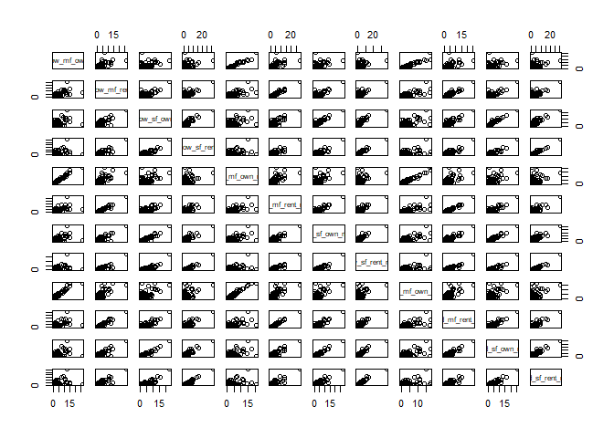<!-- -->

\#Extract numerical parts - **all counties**

``` r
num_vabs_cp_lmi <- as.data.frame(capacity_potential_lmi_clean[,4:15])
```

Correlation plot

``` r
corr_mat = round(cor(num_vabs_cp_lmi),2)
corrplot(corr_mat)
```

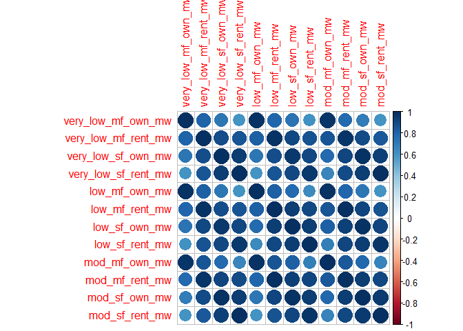<!-- -->

\#Combine names of states and counties

``` r
a <- abbreviate(capacity_potential_lmi_clean$state_name)
b <- abbreviate(capacity_potential_lmi_clean$county_name)
rownames(num_vabs_cp_lmi) <- str_c(a,b,sep='_')
```

*Outliers*

``` r
plot(num_vabs_cp_lmi$very_low_mf_rent_mw,num_vabs_cp_lmi$very_low_sf_own_mw,type='n')
text(num_vabs_cp_lmi$very_low_mf_rent_mw,num_vabs_cp_lmi$very_low_sf_own_mw,labels=rownames(num_vabs_cp_lmi))
```

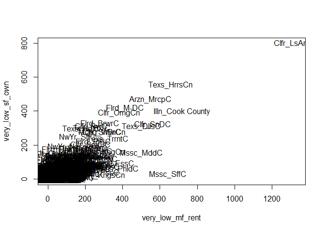<!-- -->

``` r
plot(num_vabs_cp_lmi$low_mf_rent_mw,num_vabs_cp_lmi$very_low_sf_rent_mw,type='n')
text(num_vabs_cp_lmi$low_mf_rent_mw,num_vabs_cp_lmi$very_low_sf_rent_mw,labels=rownames(num_vabs_cp_lmi))
```

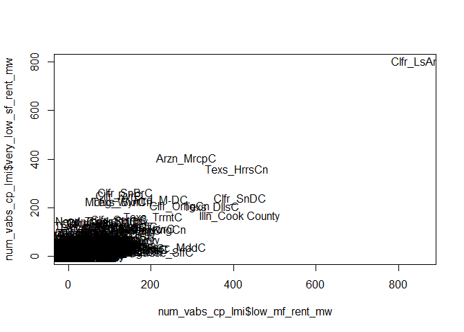<!-- -->
Based on above 2 plots, potential outliers: California\_LosAngeles.

**Standardize the
dataset**

``` r
num_vabs_cp_lmi.s <- normalize(num_vabs_cp_lmi, method = "standardize", range = c(0, 1), margin = 2, on.constant = "quiet")
```

*Sun Belt
states*

``` r
sunbelt <- c('Florida','Georgia','South Carolina','Alabama','Mississippi', 'Louisiana','Texas','New Mexico','Arizona','Nevada','California')
sunbelt %in% capacity_potential_lmi_clean$state_name
```

    ##  [1] TRUE TRUE TRUE TRUE TRUE TRUE TRUE TRUE TRUE TRUE TRUE

``` r
capacity_potential_lmi_clean$sunbelt <- 'Other'
capacity_potential_lmi_clean$sunbelt[capacity_potential_lmi_clean$state_name %in% sunbelt] <- 'SunBelt'
```

**Principle Component Analysis for County-level** Assumption: dataset is
multivariate normality.

``` r
lmi_pca <- princomp(num_vabs_cp_lmi.s, cor=T)
summary(lmi_pca,loadings=T)
```

    ## Importance of components:
    ##                           Comp.1     Comp.2    Comp.3      Comp.4
    ## Standard deviation     3.2116511 1.09404365 0.4607711 0.340102015
    ## Proportion of Variance 0.8595586 0.09974429 0.0176925 0.009639115
    ## Cumulative Proportion  0.8595586 0.95930288 0.9769954 0.986634494
    ##                             Comp.5      Comp.6      Comp.7       Comp.8
    ## Standard deviation     0.286144075 0.208451075 0.122160033 0.0919821497
    ## Proportion of Variance 0.006823203 0.003620988 0.001243589 0.0007050597
    ## Cumulative Proportion  0.993457697 0.997078684 0.998322274 0.9990273336
    ##                              Comp.9      Comp.10      Comp.11      Comp.12
    ## Standard deviation     0.0709531713 0.0559377564 0.0485392337 3.394929e-02
    ## Proportion of Variance 0.0004195294 0.0002607527 0.0001963381 9.604622e-05
    ## Cumulative Proportion  0.9994468630 0.9997076157 0.9999039538 1.000000e+00
    ## 
    ## Loadings:
    ##                     Comp.1 Comp.2 Comp.3 Comp.4 Comp.5 Comp.6 Comp.7
    ## very_low_mf_own_mw   0.256  0.491  0.243  0.329  0.128  0.161  0.465
    ## very_low_mf_rent_mw  0.299        -0.511         0.402  0.357 -0.235
    ## very_low_sf_own_mw   0.297 -0.142  0.385 -0.318  0.445  0.185  0.289
    ## very_low_sf_rent_mw  0.286 -0.323  0.159  0.390  0.233  0.213 -0.462
    ## low_mf_own_mw        0.262  0.486  0.115        -0.210  0.148 -0.115
    ## low_mf_rent_mw       0.302        -0.502 -0.118 -0.151         0.151
    ## low_sf_own_mw        0.302         0.138 -0.489 -0.381  0.250       
    ## low_sf_rent_mw       0.289 -0.285         0.284 -0.580  0.200       
    ## mod_mf_own_mw        0.274  0.417  0.119               -0.422 -0.501
    ## mod_mf_rent_mw       0.304        -0.385         0.120 -0.488  0.297
    ## mod_sf_own_mw        0.301 -0.164  0.199 -0.383        -0.291 -0.138
    ## mod_sf_rent_mw       0.286 -0.321  0.142  0.393        -0.371  0.166
    ##                     Comp.8 Comp.9 Comp.10 Comp.11 Comp.12
    ## very_low_mf_own_mw   0.370  0.205  0.192   0.167   0.151 
    ## very_low_mf_rent_mw  0.270        -0.424   0.103  -0.190 
    ## very_low_sf_own_mw  -0.504  0.146 -0.189  -0.125         
    ## very_low_sf_rent_mw -0.101 -0.111  0.537                 
    ## low_mf_own_mw       -0.165 -0.535         -0.388  -0.370 
    ## low_mf_rent_mw      -0.157         0.178  -0.372   0.630 
    ## low_sf_own_mw        0.133 -0.267          0.574   0.125 
    ## low_sf_rent_mw      -0.106  0.485 -0.125          -0.312 
    ## mod_mf_own_mw       -0.245  0.349 -0.199   0.192   0.210 
    ## mod_mf_rent_mw      -0.192         0.340   0.291  -0.419 
    ## mod_sf_own_mw        0.576  0.163  0.160  -0.436  -0.127 
    ## mod_sf_rent_mw       0.127 -0.420 -0.481           0.226

``` r
head(lmi_pca$scores)
```

    ##                     Comp.1       Comp.2       Comp.3       Comp.4
    ## Albm_AtgC       -0.6031745 -0.176262792  0.108597999 -0.007922843
    ## Albm_BldwC       0.9242353 -0.661779237  0.469501046 -0.367768454
    ## Albm_BarborCnty -0.8195113 -0.017534736 -0.038733209  0.089139667
    ## Albm_BbbC       -0.8654339 -0.004962149  0.001715614  0.016225702
    ## Albm_BlntC      -0.5324278 -0.179119569  0.149008216 -0.134531133
    ## Albm_BllckC     -0.9906950  0.062489693 -0.040073916  0.066063215
    ##                        Comp.5      Comp.6      Comp.7        Comp.8
    ## Albm_AtgC       -0.0006979332 0.009794918 -0.01336466  0.0344991939
    ## Albm_BldwC       0.0389261353 0.015384795  0.17104577  0.0156335008
    ## Albm_BarborCnty  0.0420916267 0.036066680 -0.03140990 -0.0212253993
    ## Albm_BbbC       -0.0819832364 0.016529495  0.02272799  0.0003662287
    ## Albm_BlntC      -0.0570454066 0.058019881  0.01403276  0.0146318229
    ## Albm_BllckC     -0.0235732674 0.016781142  0.01217041 -0.0210096750
    ##                        Comp.9       Comp.10      Comp.11      Comp.12
    ## Albm_AtgC        0.0002104765  0.0174180489 -0.044096769 -0.001373494
    ## Albm_BldwC      -0.0080808071 -0.0895910066 -0.008225151 -0.031950077
    ## Albm_BarborCnty -0.0001918164  0.0238040168  0.010036630 -0.008913505
    ## Albm_BbbC        0.0009992047 -0.0004983123  0.020017095  0.004093740
    ## Albm_BlntC       0.0407727122  0.0094932019 -0.020070052 -0.011147763
    ## Albm_BllckC      0.0019293549 -0.0034462828  0.016797070 -0.004834748

``` r
biplot(lmi_pca) 
```


``` r
num_vabs_cp_lmi.s$sunbelt <- capacity_potential_lmi_clean$sunbelt
```

``` r
autoplot(princomp(num_vabs_cp_lmi[,-13],cor=T),loadings=TRUE,loadings.label=TRUE,loadings.label.size=5,loadings.label.colour='black',data=num_vabs_cp_lmi.s,colour='sunbelt',loadings.colour='black',size=5)+
  theme(legend.position="bottom",legend.title=element_text(size=15),legend.text=element_text(size=14))
```


**State level** \#Extract numerical parts - *states only*

``` r
capacity_potential_lmi_state <- capacity_potential_lmi_clean %>%
  group_by(state_name) %>%
  summarise_at(vars(area_km2,very_low_mf_own_mw:mod_sf_rent_mw),sum,na.rm=TRUE)
#View(capacity_potential_lmi_state)
str(capacity_potential_lmi_state)
```

    ## Classes 'tbl_df', 'tbl' and 'data.frame':    51 obs. of  14 variables:
    ##  $ state_name         : chr  "Alabama" "Alaska" "Arizona" "Arkansas" ...
    ##  $ area_km2           : num  133736 1462040 295233 137732 409371 ...
    ##  $ very_low_mf_own_mw : num  38 19.2 121.9 18.7 623.8 ...
    ##  $ very_low_mf_rent_mw: num  783 144 872 525 5358 ...
    ##  $ very_low_sf_own_mw : num  1036 72.8 928 620 4078.6 ...
    ##  $ very_low_sf_rent_mw: num  654.6 35.6 713.2 448.5 3663.6 ...
    ##  $ low_mf_own_mw      : num  23.8 17.8 77.7 8.8 581.8 ...
    ##  $ low_mf_rent_mw     : num  290 102 404 197 3283 ...
    ##  $ low_sf_own_mw      : num  491 56 513 235 3556 ...
    ##  $ low_sf_rent_mw     : num  185.6 20.5 253.7 108.8 1995.4 ...
    ##  $ mod_mf_own_mw      : num  52.1 29.6 182.2 23.8 937.7 ...
    ##  $ mod_mf_rent_mw     : num  460 121 695 348 4040 ...
    ##  $ mod_sf_own_mw      : num  1197.8 95.6 1255.4 725.5 6055.5 ...
    ##  $ mod_sf_rent_mw     : num  335.6 26.2 500.6 251.3 2574.8 ...

\#Scatter
plot

``` r
pairs(scale(capacity_potential_lmi_state[,3:14]))
```

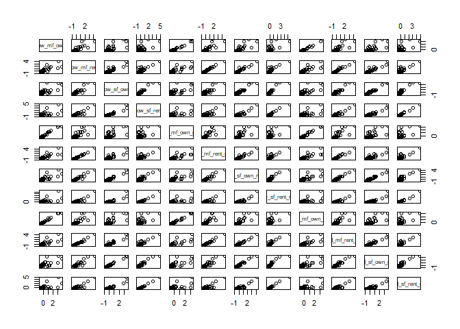<!-- -->

\#States
names

``` r
num_vabs_cp_lmi_state <- as.data.frame(capacity_potential_lmi_state[,3:14])
rownames(num_vabs_cp_lmi_state) <- abbreviate(capacity_potential_lmi_state$state_name)
head(num_vabs_cp_lmi_state)
```

    ##      very_low_mf_own_mw very_low_mf_rent_mw very_low_sf_own_mw
    ## Albm           38.00439            782.6642         1036.01008
    ## Alsk           19.20963            143.9318           72.79007
    ## Arzn          121.90779            871.5131          927.95947
    ## Arkn           18.71943            525.0153          620.04182
    ## Clfr          623.82574           5357.5609         4078.64815
    ## Clrd           85.60916            560.2952          484.12842
    ##      very_low_sf_rent_mw low_mf_own_mw low_mf_rent_mw low_sf_own_mw
    ## Albm           654.62948     23.777390       290.1103     491.12184
    ## Alsk            35.64174     17.787692       101.6557      56.01345
    ## Arzn           713.20661     77.729516       403.7399     512.51434
    ## Arkn           448.52548      8.802054       197.0092     235.15874
    ## Clfr          3663.56807    581.754537      3282.7480    3556.39976
    ## Clrd           320.25751     86.869493       376.2525     450.75822
    ##      low_sf_rent_mw mod_mf_own_mw mod_mf_rent_mw mod_sf_own_mw
    ## Albm      185.63065      52.08202       459.9434    1197.78876
    ## Alsk       20.51378      29.59811       120.5217      95.63151
    ## Arzn      253.73898     182.24484       695.3666    1255.35922
    ## Arkn      108.78401      23.78454       348.3043     725.46525
    ## Clfr     1995.36971     937.72511      4039.7733    6055.50781
    ## Clrd      194.06645     157.13076       474.6707     876.30499
    ##      mod_sf_rent_mw
    ## Albm      335.61691
    ## Alsk       26.21986
    ## Arzn      500.55971
    ## Arkn      251.28264
    ## Clfr     2574.78943
    ## Clrd      255.29557

\#Standardize

``` r
num_vabs_cp_lmi_state.s <- normalize(num_vabs_cp_lmi_state, method = "standardize", range = c(0, 1), margin = 2, on.constant = "quiet")
head(num_vabs_cp_lmi_state.s)
```

    ##      very_low_mf_own_mw very_low_mf_rent_mw very_low_sf_own_mw
    ## Albm       -0.496768531          -0.1876002         0.18797776
    ## Alsk       -0.610278215          -0.8002883        -0.85047461
    ## Arzn        0.009960268          -0.1023742         0.07148785
    ## Arkn       -0.613238708          -0.4347435        -0.26047973
    ## Clfr        3.041259250           4.2007546         3.46826124
    ## Clrd       -0.209262807          -0.4009022        -0.40700865
    ##      very_low_sf_rent_mw low_mf_own_mw low_mf_rent_mw low_sf_own_mw
    ## Albm           0.1879302    -0.5730165     -0.3960472    -0.1912705
    ## Alsk          -0.7596210    -0.6140485     -0.7110715    -0.8270526
    ## Arzn           0.2776005    -0.2034207     -0.2061018    -0.1600117
    ## Arkn          -0.1275754    -0.6756041     -0.5516767    -0.5652848
    ## Clfr           4.7940365     3.2493720      4.6065034     4.2877256
    ## Clrd          -0.3239290    -0.1408079     -0.2520501    -0.2502500
    ##      low_sf_rent_mw mod_mf_own_mw mod_mf_rent_mw mod_sf_own_mw
    ## Albm    -0.12900635   -0.55878360   -0.299635403  -0.049957673
    ## Alsk    -0.64824824   -0.65201033   -0.742210095  -0.890548297
    ## Arzn     0.08517344   -0.01907951    0.007334955  -0.006049975
    ## Arkn    -0.37066546   -0.67611558   -0.445202503  -0.410188225
    ## Clfr     5.56206748    3.11342618    4.368134311   3.654915723
    ## Clrd    -0.10247837   -0.12321196   -0.280432333  -0.295146135
    ##      mod_sf_rent_mw
    ## Albm    -0.01995366
    ## Alsk    -0.70069799
    ## Arzn     0.34295825
    ## Arkn    -0.20550837
    ## Clfr     4.90673841
    ## Clrd    -0.19667899

\#Correlation matrix

``` r
corr_mat = cor(num_vabs_cp_lmi_state.s)
corrplot(corr_mat)
```

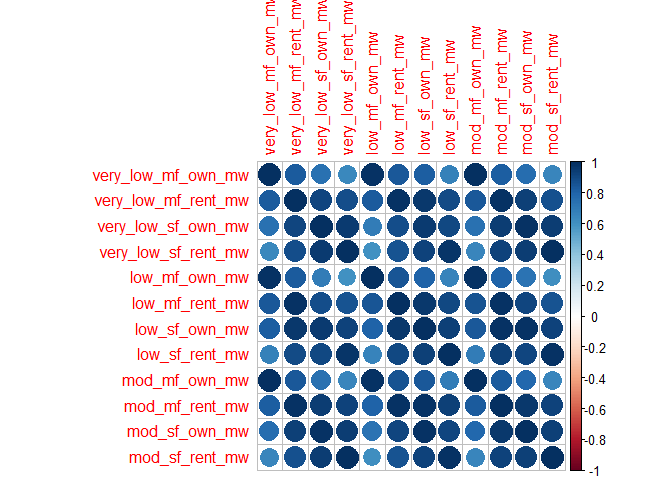<!-- -->

\#Assumption: dataset is multivariate normality.

``` r
lmi_pca_state <- princomp(num_vabs_cp_lmi_state.s, cor=T)
summary(lmi_pca_state,loadings=T)
```

    ## Importance of components:
    ##                          Comp.1     Comp.2    Comp.3     Comp.4
    ## Standard deviation     3.246556 1.05989682 0.3969565 0.34897227
    ## Proportion of Variance 0.878344 0.09361511 0.0131312 0.01014847
    ## Cumulative Proportion  0.878344 0.97195910 0.9850903 0.99523878
    ##                             Comp.5      Comp.6       Comp.7       Comp.8
    ## Standard deviation     0.185913244 0.099106247 0.0943803764 0.0420865159
    ## Proportion of Variance 0.002880311 0.000818504 0.0007423046 0.0001476062
    ## Cumulative Proportion  0.998119087 0.998937591 0.9996798955 0.9998275017
    ##                              Comp.9      Comp.10      Comp.11      Comp.12
    ## Standard deviation     3.076880e-02 2.426912e-02 1.926219e-02 1.277646e-02
    ## Proportion of Variance 7.889326e-05 4.908252e-05 3.091935e-05 1.360316e-05
    ## Cumulative Proportion  9.999064e-01 9.999555e-01 9.999864e-01 1.000000e+00
    ## 
    ## Loadings:
    ##                     Comp.1 Comp.2 Comp.3 Comp.4 Comp.5 Comp.6 Comp.7
    ## very_low_mf_own_mw   0.266  0.455  0.268  0.169  0.294         0.271
    ## very_low_mf_rent_mw  0.300        -0.414 -0.337  0.419        -0.362
    ## very_low_sf_own_mw   0.294 -0.184  0.462 -0.363  0.210  0.413  0.248
    ## very_low_sf_rent_mw  0.286 -0.334  0.145  0.223  0.253        -0.582
    ## low_mf_own_mw        0.261  0.495         0.188 -0.101  0.393 -0.105
    ## low_mf_rent_mw       0.300        -0.540 -0.117                0.165
    ## low_sf_own_mw        0.305               -0.148 -0.586  0.283       
    ## low_sf_rent_mw       0.288 -0.264 -0.202  0.546 -0.243              
    ## mod_mf_own_mw        0.270  0.444  0.189  0.102 -0.117 -0.480 -0.273
    ## mod_mf_rent_mw       0.305        -0.222 -0.158  0.161 -0.443  0.409
    ## mod_sf_own_mw        0.299 -0.147  0.289 -0.372 -0.375 -0.332 -0.183
    ## mod_sf_rent_mw       0.285 -0.326  0.142  0.365  0.181 -0.177  0.276
    ##                     Comp.8 Comp.9 Comp.10 Comp.11 Comp.12
    ## very_low_mf_own_mw   0.519  0.228  0.349   0.115         
    ## very_low_mf_rent_mw  0.255  0.205 -0.353  -0.187   0.211 
    ## very_low_sf_own_mw         -0.419 -0.145  -0.190  -0.145 
    ## very_low_sf_rent_mw -0.135 -0.126  0.379   0.388         
    ## low_mf_own_mw       -0.615  0.186         -0.217   0.118 
    ## low_mf_rent_mw                     0.234   0.128  -0.700 
    ## low_sf_own_mw        0.184        -0.214   0.537   0.285 
    ## low_sf_rent_mw       0.298 -0.273         -0.499   0.157 
    ## mod_mf_own_mw              -0.419 -0.383          -0.189 
    ## mod_mf_rent_mw      -0.325 -0.224  0.210           0.482 
    ## mod_sf_own_mw               0.384  0.301  -0.371         
    ## mod_sf_rent_mw      -0.185  0.472 -0.452   0.109  -0.214

\#PC
%Variance

``` r
fviz_screeplot(lmi_pca_state, addlabels = TRUE, ylim = c(0, 100))
```

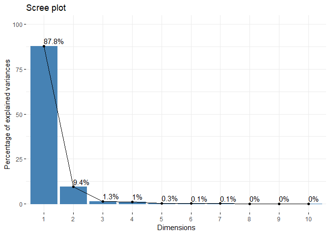<!-- -->

\#Biplot

``` r
biplot(lmi_pca_state,cex=0.9,col=c('black','red'))
```


*Sun Belt
states*

``` r
sunbelt <- c('Florida','Georgia','South Carolina','Alabama','Mississippi', 'Louisiana','Texas','New Mexico','Arizona','Nevada','California')
sunbelt %in% capacity_potential_lmi_state$state_name
```

    ##  [1] TRUE TRUE TRUE TRUE TRUE TRUE TRUE TRUE TRUE TRUE TRUE

``` r
capacity_potential_lmi_state$sunbelt <- 'Other'
capacity_potential_lmi_state$sunbelt[capacity_potential_lmi_state$state_name %in% sunbelt] <- 'SunBelt'
```

``` r
num_vabs_cp_lmi_state$sunbelt <- capacity_potential_lmi_state$sunbelt
```

``` r
autoplot(princomp(num_vabs_cp_lmi_state[,-13],cor=T),loadings=TRUE,loadings.label=TRUE,loadings.label.size=4,loadings.label.colour='black',data=num_vabs_cp_lmi_state,colour='sunbelt',loadings.colour='black',size=5)+
  theme(legend.position="bottom",legend.title=element_text(size=15),legend.text=element_text(size=14),axis.text=element_text(size=14),axis.title=element_text(size=14))
```

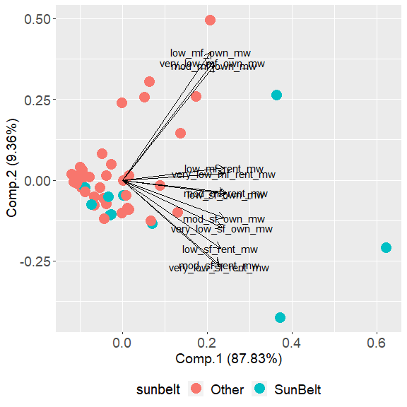

# Map PC1 scores, PC2 scores

``` r
potential_state <- data.frame(state = capacity_potential_lmi_state$state_name, scores =lmi_pca_state$scores[,1])
rownames(potential_state) <- NULL
head(potential_state)
```

    ##        state      scores
    ## 1    Alabama -0.71370281
    ## 2     Alaska -2.57631031
    ## 3    Arizona  0.02645048
    ## 4   Arkansas -1.54278844
    ## 5 California 14.40946333
    ## 6   Colorado -0.87821792

``` r
plot_usmap(data = potential_state, values = "scores", lines = "black") + 
  scale_fill_continuous(name = "PC1 Scores", label = scales::comma) + 
  theme(legend.position = "right")
```

<!-- -->

Inference PC1: PC1 shows the overall potential of solar rooftop energy
capacity in different states for LMI households. It explains nearly 88%
of the variance of original dataset. Based on PC1 scores, it would be
obeserved that as expected, California, Texas and Florida have most
extremely potential in solar rooftop energy capacity compared to other
states. It is a little suprised that some north states, eg: New York,
Pennsylvania, Massachusetts, New Jersey,… have considerable potential
capacity for solar rooftop energy, even higher compared to other sunbelt
states for LMI
households.

``` r
potential_state_PC2 <- data.frame(state = capacity_potential_lmi_state$state_name, scores =lmi_pca_state$scores[,2])
rownames(potential_state_PC2) <- NULL
head(potential_state_PC2)
```

    ##        state     scores
    ## 1    Alabama -0.8153800
    ## 2     Alaska  0.0928442
    ## 3    Arizona -0.3518186
    ## 4   Arkansas -0.5915312
    ## 5 California -1.5789026
    ## 6   Colorado  0.1024825

``` r
plot_usmap(data = potential_state_PC2, values = "scores", lines = "black") + 
  scale_fill_continuous(name = "PC2 Scores", label = scales::comma) + 
  theme(legend.position = "right")
```

<!-- -->

Inference PC2: It explains 10% of dataset variance There is a contrast
in solar rooftop potential capacity in 2 groups: multifamily-own and
single-family-rent for LMI households. *need to understand more details
what is multifamily/single family and rent/own* For Texas and
California, there is a higher focus of solar rooftop capacity potential
in single-family-rent. *WHY?* For north states, eg: New York, New
Jersey,… and Florida, there is a higher focus of solar rooftop capacity
potential in multifamily-own.
*WHY?*

\#\#———————————————————————————————————————————————————————————————————————————————————————\#

\*\* Clusters Analysis \*\*

\#States level - SUM

``` r
head(num_vabs_cp_lmi_state)
```

    ##      very_low_mf_own_mw very_low_mf_rent_mw very_low_sf_own_mw
    ## Albm           38.00439            782.6642         1036.01008
    ## Alsk           19.20963            143.9318           72.79007
    ## Arzn          121.90779            871.5131          927.95947
    ## Arkn           18.71943            525.0153          620.04182
    ## Clfr          623.82574           5357.5609         4078.64815
    ## Clrd           85.60916            560.2952          484.12842
    ##      very_low_sf_rent_mw low_mf_own_mw low_mf_rent_mw low_sf_own_mw
    ## Albm           654.62948     23.777390       290.1103     491.12184
    ## Alsk            35.64174     17.787692       101.6557      56.01345
    ## Arzn           713.20661     77.729516       403.7399     512.51434
    ## Arkn           448.52548      8.802054       197.0092     235.15874
    ## Clfr          3663.56807    581.754537      3282.7480    3556.39976
    ## Clrd           320.25751     86.869493       376.2525     450.75822
    ##      low_sf_rent_mw mod_mf_own_mw mod_mf_rent_mw mod_sf_own_mw
    ## Albm      185.63065      52.08202       459.9434    1197.78876
    ## Alsk       20.51378      29.59811       120.5217      95.63151
    ## Arzn      253.73898     182.24484       695.3666    1255.35922
    ## Arkn      108.78401      23.78454       348.3043     725.46525
    ## Clfr     1995.36971     937.72511      4039.7733    6055.50781
    ## Clrd      194.06645     157.13076       474.6707     876.30499
    ##      mod_sf_rent_mw sunbelt
    ## Albm      335.61691 SunBelt
    ## Alsk       26.21986   Other
    ## Arzn      500.55971 SunBelt
    ## Arkn      251.28264   Other
    ## Clfr     2574.78943 SunBelt
    ## Clrd      255.29557   Other

``` r
head(num_vabs_cp_lmi_state.s)
```

    ##      very_low_mf_own_mw very_low_mf_rent_mw very_low_sf_own_mw
    ## Albm       -0.496768531          -0.1876002         0.18797776
    ## Alsk       -0.610278215          -0.8002883        -0.85047461
    ## Arzn        0.009960268          -0.1023742         0.07148785
    ## Arkn       -0.613238708          -0.4347435        -0.26047973
    ## Clfr        3.041259250           4.2007546         3.46826124
    ## Clrd       -0.209262807          -0.4009022        -0.40700865
    ##      very_low_sf_rent_mw low_mf_own_mw low_mf_rent_mw low_sf_own_mw
    ## Albm           0.1879302    -0.5730165     -0.3960472    -0.1912705
    ## Alsk          -0.7596210    -0.6140485     -0.7110715    -0.8270526
    ## Arzn           0.2776005    -0.2034207     -0.2061018    -0.1600117
    ## Arkn          -0.1275754    -0.6756041     -0.5516767    -0.5652848
    ## Clfr           4.7940365     3.2493720      4.6065034     4.2877256
    ## Clrd          -0.3239290    -0.1408079     -0.2520501    -0.2502500
    ##      low_sf_rent_mw mod_mf_own_mw mod_mf_rent_mw mod_sf_own_mw
    ## Albm    -0.12900635   -0.55878360   -0.299635403  -0.049957673
    ## Alsk    -0.64824824   -0.65201033   -0.742210095  -0.890548297
    ## Arzn     0.08517344   -0.01907951    0.007334955  -0.006049975
    ## Arkn    -0.37066546   -0.67611558   -0.445202503  -0.410188225
    ## Clfr     5.56206748    3.11342618    4.368134311   3.654915723
    ## Clrd    -0.10247837   -0.12321196   -0.280432333  -0.295146135
    ##      mod_sf_rent_mw
    ## Albm    -0.01995366
    ## Alsk    -0.70069799
    ## Arzn     0.34295825
    ## Arkn    -0.20550837
    ## Clfr     4.90673841
    ## Clrd    -0.19667899

**Hierarchical Clustering** *overall sum capacity*

``` r
dist_state <- dist(num_vabs_cp_lmi_state.s)
```

\#Average linkage

``` r
hc.s <- hclust(dist_state,'average')
plot(rev(hc.s$height))
```

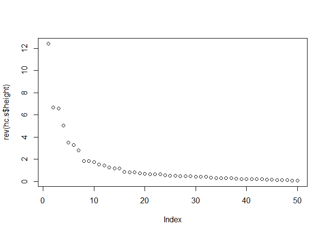<!-- -->

# 5 clusters

``` r
ct.a <- cutree(hc.s,5)
```

\#Complete linkage

``` r
hc.s <- hclust(dist_state,'complete')
plot(rev(hc.s$height))
```

<!-- -->

\#single linkage

``` r
hc.s <- hclust(dist_state,'single')
plot(rev(hc.s$height))
```

<!-- -->

**Model-based clusering**

``` r
mclust_state <- Mclust(num_vabs_cp_lmi_state[,1:12])
```

``` r
summary(mclust_state)
```

    ## ---------------------------------------------------- 
    ## Gaussian finite mixture model fitted by EM algorithm 
    ## ---------------------------------------------------- 
    ## 
    ## Mclust VEE (ellipsoidal, equal shape and orientation) model with 3
    ## components: 
    ## 
    ##  log-likelihood  n  df      BIC       ICL
    ##       -3061.697 51 118 -6587.35 -6587.366
    ## 
    ## Clustering table:
    ##  1  2  3 
    ## 21 19 11

``` r
clust.data = cbind(mclust_state$classification,mclust_state$uncertainty)
clust.data[order(mclust_state$uncertainty,decreasing=TRUE),]
```

    ##      [,1]         [,2]
    ## Orgn    2 3.149082e-03
    ## NwHm    2 1.845233e-03
    ## NwMx    2 1.403043e-03
    ## Cnnc    1 6.991182e-04
    ## DsoC    2 3.036449e-04
    ## Vrgn    1 1.449846e-04
    ## Nbrs    2 1.180198e-04
    ## Mnns    1 6.881322e-05
    ## Wscn    1 4.973451e-05
    ## Arzn    1 4.043901e-05
    ## Nevd    2 3.508898e-05
    ## Dlwr    2 2.687292e-05
    ## Utah    2 2.589880e-05
    ## Knss    2 1.995056e-05
    ## Indn    1 1.273244e-05
    ## Hawa    2 1.131367e-05
    ## Main    2 6.897640e-06
    ## Wshn    1 2.475075e-06
    ## Losn    1 2.112302e-06
    ## WstV    1 1.713083e-06
    ## Idah    2 1.560200e-06
    ## NrtC    1 1.437962e-06
    ## Gerg    1 1.190418e-06
    ## Oklh    1 5.192569e-07
    ## RhdI    2 3.186207e-07
    ## Clrd    1 2.785289e-07
    ## SthC    1 2.349616e-07
    ## Alsk    2 1.774808e-07
    ## Tnns    1 1.434517e-07
    ## NrtD    2 8.514707e-08
    ## Msss    1 7.734162e-08
    ## SthD    2 6.280816e-08
    ## Albm    1 5.894101e-08
    ## Mntn    2 5.845877e-08
    ## Wymn    2 5.840340e-08
    ## Mchg    3 4.566373e-08
    ## Iowa    1 4.321357e-08
    ## Kntc    1 3.892284e-08
    ## Vrmn    2 3.702877e-08
    ## Arkn    1 2.794158e-08
    ## Mssr    1 1.930535e-08
    ## Ohio    3 1.054485e-08
    ## Illn    3 5.639933e-14
    ## NwJr    3 3.441691e-15
    ## Clfr    3 0.000000e+00
    ## Flrd    3 0.000000e+00
    ## Mryl    3 0.000000e+00
    ## Mssc    3 0.000000e+00
    ## NwYr    3 0.000000e+00
    ## Pnns    3 0.000000e+00
    ## Texs    3 0.000000e+00

Plot of the the “uncertainty” plot for variables (SER, SPS) is:

``` r
plot(mclust_state,what='uncertainty',dimens=c(6,8))
text(mclust_state$data[,c(6,8)],labels=rownames(num_vabs_cp_lmi_state),cex=0.6)
```

<!-- -->

``` r
subset(capacity_potential_lmi_state$state_name,mclust_state$classification == 1)
```

    ##  [1] "Alabama"        "Arizona"        "Arkansas"       "Colorado"      
    ##  [5] "Connecticut"    "Georgia"        "Indiana"        "Iowa"          
    ##  [9] "Kentucky"       "Louisiana"      "Minnesota"      "Mississippi"   
    ## [13] "Missouri"       "North Carolina" "Oklahoma"       "South Carolina"
    ## [17] "Tennessee"      "Virginia"       "Washington"     "West Virginia" 
    ## [21] "Wisconsin"

``` r
subset(capacity_potential_lmi_state$state_name,mclust_state$classification == 2)
```

    ##  [1] "Alaska"               "Delaware"             "District of Columbia"
    ##  [4] "Hawaii"               "Idaho"                "Kansas"              
    ##  [7] "Maine"                "Montana"              "Nebraska"            
    ## [10] "Nevada"               "New Hampshire"        "New Mexico"          
    ## [13] "North Dakota"         "Oregon"               "Rhode Island"        
    ## [16] "South Dakota"         "Utah"                 "Vermont"             
    ## [19] "Wyoming"

``` r
subset(capacity_potential_lmi_state$state_name,mclust_state$classification == 3)
```

    ##  [1] "California"    "Florida"       "Illinois"      "Maryland"     
    ##  [5] "Massachusetts" "Michigan"      "New Jersey"    "New York"     
    ##  [9] "Ohio"          "Pennsylvania"  "Texas"

``` r
plot(mclust_state,what='BIC')
```

<!-- -->

### Clustering using Mean

Extract numerical parts - *states only* \# Average solar rooftop energy
capacity per county for each state \# Reason: reduce the effect of size
of large states eg: Cali, Texas,… to observe more the effect of other
factors eg: housing type, tenure, income,… \# Assumption: county sample
size for each state are approximately same

``` r
capacity_potential_lmi_state_mn <- capacity_potential_lmi_clean %>%
  group_by(state_name) %>%
  summarise_at(vars(very_low_mf_own_mw:mod_sf_rent_mw),mean,na.rm=TRUE)
#View(capacity_potential_lmi_state)
str(capacity_potential_lmi_state_mn)
```

    ## Classes 'tbl_df', 'tbl' and 'data.frame':    51 obs. of  13 variables:
    ##  $ state_name         : chr  "Alabama" "Alaska" "Arizona" "Arkansas" ...
    ##  $ very_low_mf_own_mw : num  0.567 0.686 8.127 0.25 10.756 ...
    ##  $ very_low_mf_rent_mw: num  11.68 5.14 58.1 7 92.37 ...
    ##  $ very_low_sf_own_mw : num  15.46 2.6 61.86 8.27 70.32 ...
    ##  $ very_low_sf_rent_mw: num  9.77 1.27 47.55 5.98 63.16 ...
    ##  $ low_mf_own_mw      : num  0.355 0.635 5.182 0.117 10.03 ...
    ##  $ low_mf_rent_mw     : num  4.33 3.63 26.92 2.63 56.6 ...
    ##  $ low_sf_own_mw      : num  7.33 2 34.17 3.14 61.32 ...
    ##  $ low_sf_rent_mw     : num  2.771 0.733 16.916 1.45 34.403 ...
    ##  $ mod_mf_own_mw      : num  0.777 1.057 12.15 0.317 16.168 ...
    ##  $ mod_mf_rent_mw     : num  6.86 4.3 46.36 4.64 69.65 ...
    ##  $ mod_sf_own_mw      : num  17.88 3.42 83.69 9.67 104.41 ...
    ##  $ mod_sf_rent_mw     : num  5.009 0.936 33.371 3.35 44.393 ...

``` r
mean_num_lmi_state <- capacity_potential_lmi_state_mn[,2:13]
```

``` r
mean_num_lmi_state_s <- scale(mean_num_lmi_state)
```

``` r
corr_mat <- round(cor(mean_num_lmi_state_s),2)
corrplot(corr_mat)
```

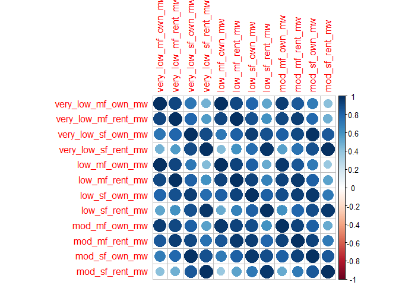<!-- -->

``` r
lmi_mn_pc <- princomp(mean_num_lmi_state_s,cor=T)
summary(lmi_mn_pc, loading=T)
```

    ## Importance of components:
    ##                           Comp.1    Comp.2     Comp.3     Comp.4
    ## Standard deviation     3.1115334 1.3366994 0.45353535 0.41246579
    ## Proportion of Variance 0.8068033 0.1488971 0.01714119 0.01417734
    ## Cumulative Proportion  0.8068033 0.9557004 0.97284162 0.98701895
    ##                             Comp.5    Comp.6       Comp.7       Comp.8
    ## Standard deviation     0.277561472 0.2546197 0.0749036851 0.0583450827
    ## Proportion of Variance 0.006420031 0.0054026 0.0004675468 0.0002836791
    ## Cumulative Proportion  0.993438985 0.9988416 0.9993091313 0.9995928104
    ##                              Comp.9      Comp.10      Comp.11      Comp.12
    ## Standard deviation     0.0514171864 0.0394179004 2.062087e-02 1.623446e-02
    ## Proportion of Variance 0.0002203106 0.0001294809 3.543501e-05 2.196313e-05
    ## Cumulative Proportion  0.9998131210 0.9999426019 9.999780e-01 1.000000e+00
    ## 
    ## Loadings:
    ##                     Comp.1 Comp.2 Comp.3 Comp.4 Comp.5 Comp.6 Comp.7
    ## very_low_mf_own_mw   0.276  0.334  0.534         0.218  0.113  0.181
    ## very_low_mf_rent_mw  0.292  0.253 -0.209 -0.478  0.389         0.204
    ## very_low_sf_own_mw   0.306 -0.153 -0.150  0.365  0.482  0.153 -0.571
    ## very_low_sf_rent_mw  0.261 -0.423  0.226 -0.132  0.288         0.117
    ## low_mf_own_mw        0.275  0.362  0.357        -0.131  0.251       
    ## low_mf_rent_mw       0.302  0.212 -0.238 -0.387 -0.108        -0.125
    ## low_sf_own_mw        0.311        -0.378  0.212 -0.296  0.510       
    ## low_sf_rent_mw       0.272 -0.366  0.192 -0.269 -0.524  0.193       
    ## mod_mf_own_mw        0.294  0.254  0.127  0.362 -0.289 -0.487 -0.156
    ## mod_mf_rent_mw       0.314        -0.241 -0.211        -0.524 -0.177
    ## mod_sf_own_mw        0.306 -0.158 -0.292  0.400        -0.125  0.710
    ## mod_sf_rent_mw       0.246 -0.468  0.273               -0.247       
    ##                     Comp.8 Comp.9 Comp.10 Comp.11 Comp.12
    ## very_low_mf_own_mw   0.441  0.191  0.136   0.423         
    ## very_low_mf_rent_mw -0.257         0.500  -0.260         
    ## very_low_sf_own_mw          0.298         -0.196         
    ## very_low_sf_rent_mw -0.555        -0.333   0.372   0.147 
    ## low_mf_own_mw       -0.143 -0.276 -0.348  -0.563   0.206 
    ## low_mf_rent_mw       0.134 -0.109 -0.420   0.191  -0.616 
    ## low_sf_own_mw              -0.331  0.296   0.318   0.258 
    ## low_sf_rent_mw              0.561  0.136  -0.192         
    ## mod_mf_own_mw       -0.455         0.236   0.151  -0.261 
    ## mod_mf_rent_mw       0.242        -0.238           0.598 
    ## mod_sf_own_mw        0.146  0.106 -0.180  -0.177  -0.134 
    ## mod_sf_rent_mw       0.312 -0.584  0.268  -0.162  -0.186

PC1: the overall average capacity per county for each states PC2: the
contrast between mf\_own and sf\_rent, the higher score, the higher from
mf\_own PC3: the contrast between Risk-free (mf\_own, sf\_rent)v
Risk-seeker(mf\_rent,sf\_own), the higher the less risk

``` r
cbind(lmi_mn_pc$scores[,1],capacity_potential_lmi_state_mn$state_name)
```

    ##       [,1]                 [,2]                  
    ##  [1,] "-1.44236853719892"  "Alabama"             
    ##  [2,] "-2.51041573752777"  "Alaska"              
    ##  [3,] "5.93548730899064"   "Arizona"             
    ##  [4,] "-2.14441605740805"  "Arkansas"            
    ##  [5,] "10.2859892312727"   "California"          
    ##  [6,] "-1.62227921548523"  "Colorado"            
    ##  [7,] "6.18353944076146"   "Connecticut"         
    ##  [8,] "5.05209688854738"   "Delaware"            
    ##  [9,] "2.48658948222514"   "District of Columbia"
    ## [10,] "4.33663459817815"   "Florida"             
    ## [11,] "-1.71135327795507"  "Georgia"             
    ## [12,] "5.80948891957511"   "Hawaii"              
    ## [13,] "-2.31700487375941"  "Idaho"               
    ## [14,] "-0.463938794909677" "Illinois"            
    ## [15,] "-1.38016602567612"  "Indiana"             
    ## [16,] "-2.2464828442879"   "Iowa"                
    ## [17,] "-2.41900555293596"  "Kansas"              
    ## [18,] "-2.24406480853774"  "Kentucky"            
    ## [19,] "-1.31391550305425"  "Louisiana"           
    ## [20,] "-1.06871886867769"  "Maine"               
    ## [21,] "1.67813390659041"   "Maryland"            
    ## [22,] "8.91109297042921"   "Massachusetts"       
    ## [23,] "-0.309714543532517" "Michigan"            
    ## [24,] "-1.87024250716297"  "Minnesota"           
    ## [25,] "-2.29450873108922"  "Mississippi"         
    ## [26,] "-1.85402841449155"  "Missouri"            
    ## [27,] "-2.58070734130819"  "Montana"             
    ## [28,] "-2.61299577424965"  "Nebraska"            
    ## [29,] "-0.794947371609282" "Nevada"              
    ## [30,] "0.0101037364199324" "New Hampshire"       
    ## [31,] "4.7633649907773"    "New Jersey"          
    ## [32,] "-1.76582824291225"  "New Mexico"          
    ## [33,] "1.60000874923813"   "New York"            
    ## [34,] "-0.967850263129034" "North Carolina"      
    ## [35,] "-2.71807150515153"  "North Dakota"        
    ## [36,] "0.0297169601564024" "Ohio"                
    ## [37,] "-1.81361651871918"  "Oklahoma"            
    ## [38,] "-0.664336428591767" "Oregon"              
    ## [39,] "1.60826913212041"   "Pennsylvania"        
    ## [40,] "0.84798673443332"   "Rhode Island"        
    ## [41,] "-0.848202655518291" "South Carolina"      
    ## [42,] "-2.73921173422567"  "South Dakota"        
    ## [43,] "-1.47620265844053"  "Tennessee"           
    ## [44,] "-0.860702271382347" "Texas"               
    ## [45,] "-1.24417944808356"  "Utah"                
    ## [46,] "-1.87853842343194"  "Vermont"             
    ## [47,] "-1.93914101285973"  "Virginia"            
    ## [48,] "0.54037398581383"   "Washington"          
    ## [49,] "-2.25894037897557"  "West Virginia"       
    ## [50,] "-1.21867523163074"  "Wisconsin"           
    ## [51,] "-2.48410548162025"  "Wyoming"

``` r
plot.wgss = function(mydata, maxc) {
  wss = numeric(maxc)
  for (i in 1:maxc) 
    wss[i] = kmeans(mydata, centers=i, nstart = 10)$tot.withinss 
  plot(1:maxc, wss, type="b", xlab="Number of Clusters",
  ylab="Within groups sum of squares", main="Scree Plot") 
}
```

``` r
plot.wgss(mean_num_lmi_state_s,20)
abline(v=3,col='red',lty=3)
```

<!-- -->

``` r
fviz_nbclust(mean_num_lmi_state_s, kmeans, method = "wss") +
    geom_vline(xintercept = 3, linetype = 2,color='red')
```

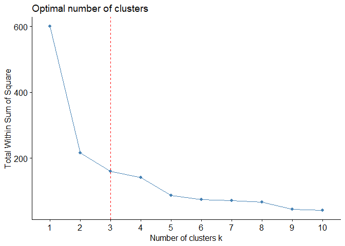<!-- -->

``` r
km <- kmeans(mean_num_lmi_state_s, centers = 3, nstart = 30) 
table(km$cluster)
```

    ## 
    ##  1  2  3 
    ## 39  9  3

``` r
rownames(mean_num_lmi_state_s) <- capacity_potential_lmi_state_mn$state_name
```

``` r
fviz_cluster(km, data = mean_num_lmi_state_s,
            ellipse.type = "norm", repel = FALSE, labelsize = 13
             )
```

    ## Too few points to calculate an ellipse

<!-- -->

``` r
km$cluster
```

    ##  [1] 1 1 3 1 3 1 2 2 2 2 1 3 1 1 1 1 1 1 1 1 2 2 1 1 1 1 1 1 1 1 2 1 2 1 1
    ## [36] 1 1 1 2 1 1 1 1 1 1 1 1 1 1 1 1

\#3D plotting

``` r
plot3d(lmi_mn_pc$scores[,1:3],type='s', size=1,col=km$cluster)
text3d(lmi_mn_pc$scores[,1:3],text=abbreviate(capacity_potential_lmi_state_mn$state_name),col=km$cluster)
```

``` r
lmi_scores <- as.tibble(lmi_mn_pc$scores)
```

    ## Warning: `as.tibble()` is deprecated, use `as_tibble()` (but mind the new semantics).
    ## This warning is displayed once per session.

``` r
lmi_scores$Cluster <- as.factor(km$cluster)
lmi_scores$States <- capacity_potential_lmi_state_mn$state_name
```

``` r
lmi_scores
```

    ## # A tibble: 51 x 14
    ##    Comp.1  Comp.2  Comp.3  Comp.4  Comp.5  Comp.6  Comp.7   Comp.8   Comp.9
    ##     <dbl>   <dbl>   <dbl>   <dbl>   <dbl>   <dbl>   <dbl>    <dbl>    <dbl>
    ##  1  -1.44 -0.529  -0.0839  0.0445  0.296   0.0938 -0.0533 -0.0824   0.0532 
    ##  2  -2.51  0.362   0.104  -0.189  -0.133  -0.0814 -0.0762  0.00667 -0.00772
    ##  3   5.94 -3.54    0.266   0.372   0.999  -0.337   0.0365 -0.0324  -0.164  
    ##  4  -2.14 -0.188   0.0504 -0.103   0.144  -0.0370 -0.0494 -0.0517  -0.0135 
    ##  5  10.3  -4.82    0.205  -0.899  -0.514   0.502   0.0622 -0.0460   0.0813 
    ##  6  -1.62 -0.0278  0.0902 -0.0512 -0.206  -0.0170  0.0155  0.0171  -0.00700
    ##  7   6.18  1.67   -1.35   -0.0109  0.0167  0.967  -0.0648 -0.0576  -0.104  
    ##  8   5.05  1.43    0.383   1.50   -0.498  -0.447   0.106  -0.116   -0.0229 
    ##  9   2.49  3.60    2.20   -0.862   0.480   0.543   0.121   0.0513   0.00641
    ## 10   4.34 -1.11    0.401   1.22    0.488   0.0145 -0.111   0.199    0.0880 
    ## # ... with 41 more rows, and 5 more variables: Comp.10 <dbl>,
    ## #   Comp.11 <dbl>, Comp.12 <dbl>, Cluster <fct>, States <chr>

``` r
#plot(lmi_mn_pc$scores[,1:2],fill=km$cluster)
ggplot(lmi_scores,aes(Comp.1,Comp.2,color=Cluster))+
  geom_point(size=2)+
  geom_text(aes(label=States))
```

<!-- -->

``` r
ggplot(lmi_scores,aes(Comp.1,Comp.3,color=Cluster))+
  geom_point(size=2)+
  geom_text(aes(label=States))
```

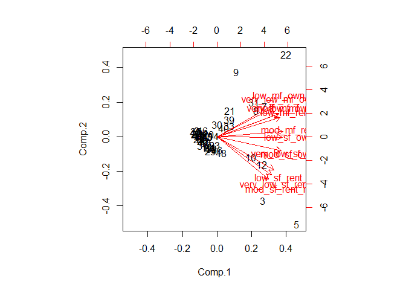<!-- -->

``` r
ggplot(lmi_scores,aes(Comp.2,Comp.3,color=Cluster))+
  geom_point(size=2)+
  geom_text(aes(label=States))
```

<!-- -->

``` r
biplot(lmi_mn_pc)
```

<!-- -->

``` r
library(knitr)
library(rgl)
knit_hooks$set(webgl = hook_webgl)
```

``` r
x <- sort(rnorm(1000))
y <- rnorm(1000)
z <- rnorm(1000) + atan2(x,y)
plot3d(x, y, z, col=rainbow(1000))
```

<script>/*
* Copyright (C) 2009 Apple Inc. All Rights Reserved.
*
* Redistribution and use in source and binary forms, with or without
* modification, are permitted provided that the following conditions
* are met:
* 1. Redistributions of source code must retain the above copyright
*    notice, this list of conditions and the following disclaimer.
* 2. Redistributions in binary form must reproduce the above copyright
*    notice, this list of conditions and the following disclaimer in the
*    documentation and/or other materials provided with the distribution.
*
* THIS SOFTWARE IS PROVIDED BY APPLE INC. ``AS IS'' AND ANY
* EXPRESS OR IMPLIED WARRANTIES, INCLUDING, BUT NOT LIMITED TO, THE
* IMPLIED WARRANTIES OF MERCHANTABILITY AND FITNESS FOR A PARTICULAR
* PURPOSE ARE DISCLAIMED.  IN NO EVENT SHALL APPLE INC. OR
* CONTRIBUTORS BE LIABLE FOR ANY DIRECT, INDIRECT, INCIDENTAL, SPECIAL,
* EXEMPLARY, OR CONSEQUENTIAL DAMAGES (INCLUDING, BUT NOT LIMITED TO,
* PROCUREMENT OF SUBSTITUTE GOODS OR SERVICES; LOSS OF USE, DATA, OR
* PROFITS; OR BUSINESS INTERRUPTION) HOWEVER CAUSED AND ON ANY THEORY
* OF LIABILITY, WHETHER IN CONTRACT, STRICT LIABILITY, OR TORT
* (INCLUDING NEGLIGENCE OR OTHERWISE) ARISING IN ANY WAY OUT OF THE USE
* OF THIS SOFTWARE, EVEN IF ADVISED OF THE POSSIBILITY OF SUCH DAMAGE.
* Copyright (2016) Duncan Murdoch - fixed CanvasMatrix4.ortho,
* cleaned up.
*/
/*
CanvasMatrix4 class
This class implements a 4x4 matrix. It has functions which
duplicate the functionality of the OpenGL matrix stack and
glut functions.
IDL:
[
Constructor(in CanvasMatrix4 matrix),           // copy passed matrix into new CanvasMatrix4
Constructor(in sequence<float> array)           // create new CanvasMatrix4 with 16 floats (row major)
Constructor()                                   // create new CanvasMatrix4 with identity matrix
]
interface CanvasMatrix4 {
attribute float m11;
attribute float m12;
attribute float m13;
attribute float m14;
attribute float m21;
attribute float m22;
attribute float m23;
attribute float m24;
attribute float m31;
attribute float m32;
attribute float m33;
attribute float m34;
attribute float m41;
attribute float m42;
attribute float m43;
attribute float m44;
void load(in CanvasMatrix4 matrix);                 // copy the values from the passed matrix
void load(in sequence<float> array);                // copy 16 floats into the matrix
sequence<float> getAsArray();                       // return the matrix as an array of 16 floats
WebGLFloatArray getAsCanvasFloatArray();           // return the matrix as a WebGLFloatArray with 16 values
void makeIdentity();                                // replace the matrix with identity
void transpose();                                   // replace the matrix with its transpose
void invert();                                      // replace the matrix with its inverse
void translate(in float x, in float y, in float z); // multiply the matrix by passed translation values on the right
void scale(in float x, in float y, in float z);     // multiply the matrix by passed scale values on the right
void rotate(in float angle,                         // multiply the matrix by passed rotation values on the right
in float x, in float y, in float z);    // (angle is in degrees)
void multRight(in CanvasMatrix matrix);             // multiply the matrix by the passed matrix on the right
void multLeft(in CanvasMatrix matrix);              // multiply the matrix by the passed matrix on the left
void ortho(in float left, in float right,           // multiply the matrix by the passed ortho values on the right
in float bottom, in float top,
in float near, in float far);
void frustum(in float left, in float right,         // multiply the matrix by the passed frustum values on the right
in float bottom, in float top,
in float near, in float far);
void perspective(in float fovy, in float aspect,    // multiply the matrix by the passed perspective values on the right
in float zNear, in float zFar);
void lookat(in float eyex, in float eyey, in float eyez,    // multiply the matrix by the passed lookat
in float ctrx, in float ctry, in float ctrz,    // values on the right
in float upx, in float upy, in float upz);
}
*/
CanvasMatrix4 = function(m)
{
if (typeof m == 'object') {
if ("length" in m && m.length >= 16) {
this.load(m[0], m[1], m[2], m[3], m[4], m[5], m[6], m[7], m[8], m[9], m[10], m[11], m[12], m[13], m[14], m[15]);
return;
}
else if (m instanceof CanvasMatrix4) {
this.load(m);
return;
}
}
this.makeIdentity();
};
CanvasMatrix4.prototype.load = function()
{
if (arguments.length == 1 && typeof arguments[0] == 'object') {
var matrix = arguments[0];
if ("length" in matrix && matrix.length == 16) {
this.m11 = matrix[0];
this.m12 = matrix[1];
this.m13 = matrix[2];
this.m14 = matrix[3];
this.m21 = matrix[4];
this.m22 = matrix[5];
this.m23 = matrix[6];
this.m24 = matrix[7];
this.m31 = matrix[8];
this.m32 = matrix[9];
this.m33 = matrix[10];
this.m34 = matrix[11];
this.m41 = matrix[12];
this.m42 = matrix[13];
this.m43 = matrix[14];
this.m44 = matrix[15];
return;
}
if (arguments[0] instanceof CanvasMatrix4) {
this.m11 = matrix.m11;
this.m12 = matrix.m12;
this.m13 = matrix.m13;
this.m14 = matrix.m14;
this.m21 = matrix.m21;
this.m22 = matrix.m22;
this.m23 = matrix.m23;
this.m24 = matrix.m24;
this.m31 = matrix.m31;
this.m32 = matrix.m32;
this.m33 = matrix.m33;
this.m34 = matrix.m34;
this.m41 = matrix.m41;
this.m42 = matrix.m42;
this.m43 = matrix.m43;
this.m44 = matrix.m44;
return;
}
}
this.makeIdentity();
};
CanvasMatrix4.prototype.getAsArray = function()
{
return [
this.m11, this.m12, this.m13, this.m14,
this.m21, this.m22, this.m23, this.m24,
this.m31, this.m32, this.m33, this.m34,
this.m41, this.m42, this.m43, this.m44
];
};
CanvasMatrix4.prototype.getAsWebGLFloatArray = function()
{
return new WebGLFloatArray(this.getAsArray());
};
CanvasMatrix4.prototype.makeIdentity = function()
{
this.m11 = 1;
this.m12 = 0;
this.m13 = 0;
this.m14 = 0;
this.m21 = 0;
this.m22 = 1;
this.m23 = 0;
this.m24 = 0;
this.m31 = 0;
this.m32 = 0;
this.m33 = 1;
this.m34 = 0;
this.m41 = 0;
this.m42 = 0;
this.m43 = 0;
this.m44 = 1;
};
CanvasMatrix4.prototype.transpose = function()
{
var tmp = this.m12;
this.m12 = this.m21;
this.m21 = tmp;
tmp = this.m13;
this.m13 = this.m31;
this.m31 = tmp;
tmp = this.m14;
this.m14 = this.m41;
this.m41 = tmp;
tmp = this.m23;
this.m23 = this.m32;
this.m32 = tmp;
tmp = this.m24;
this.m24 = this.m42;
this.m42 = tmp;
tmp = this.m34;
this.m34 = this.m43;
this.m43 = tmp;
};
CanvasMatrix4.prototype.invert = function()
{
// Calculate the 4x4 determinant
// If the determinant is zero,
// then the inverse matrix is not unique.
var det = this._determinant4x4();
if (Math.abs(det) < 1e-8)
return null;
this._makeAdjoint();
// Scale the adjoint matrix to get the inverse
this.m11 /= det;
this.m12 /= det;
this.m13 /= det;
this.m14 /= det;
this.m21 /= det;
this.m22 /= det;
this.m23 /= det;
this.m24 /= det;
this.m31 /= det;
this.m32 /= det;
this.m33 /= det;
this.m34 /= det;
this.m41 /= det;
this.m42 /= det;
this.m43 /= det;
this.m44 /= det;
};
CanvasMatrix4.prototype.translate = function(x,y,z)
{
if (x === undefined)
x = 0;
if (y === undefined)
y = 0;
if (z === undefined)
z = 0;
var matrix = new CanvasMatrix4();
matrix.m41 = x;
matrix.m42 = y;
matrix.m43 = z;
this.multRight(matrix);
};
CanvasMatrix4.prototype.scale = function(x,y,z)
{
if (x === undefined)
x = 1;
if (z === undefined) {
if (y === undefined) {
y = x;
z = x;
}
else
z = 1;
}
else if (y === undefined)
y = x;
var matrix = new CanvasMatrix4();
matrix.m11 = x;
matrix.m22 = y;
matrix.m33 = z;
this.multRight(matrix);
};
CanvasMatrix4.prototype.rotate = function(angle,x,y,z)
{
// angles are in degrees. Switch to radians
angle = angle / 180 * Math.PI;
angle /= 2;
var sinA = Math.sin(angle);
var cosA = Math.cos(angle);
var sinA2 = sinA * sinA;
// normalize
var length = Math.sqrt(x * x + y * y + z * z);
if (length === 0) {
// bad vector, just use something reasonable
x = 0;
y = 0;
z = 1;
} else if (length != 1) {
x /= length;
y /= length;
z /= length;
}
var mat = new CanvasMatrix4();
// optimize case where axis is along major axis
if (x == 1 && y === 0 && z === 0) {
mat.m11 = 1;
mat.m12 = 0;
mat.m13 = 0;
mat.m21 = 0;
mat.m22 = 1 - 2 * sinA2;
mat.m23 = 2 * sinA * cosA;
mat.m31 = 0;
mat.m32 = -2 * sinA * cosA;
mat.m33 = 1 - 2 * sinA2;
mat.m14 = mat.m24 = mat.m34 = 0;
mat.m41 = mat.m42 = mat.m43 = 0;
mat.m44 = 1;
} else if (x === 0 && y == 1 && z === 0) {
mat.m11 = 1 - 2 * sinA2;
mat.m12 = 0;
mat.m13 = -2 * sinA * cosA;
mat.m21 = 0;
mat.m22 = 1;
mat.m23 = 0;
mat.m31 = 2 * sinA * cosA;
mat.m32 = 0;
mat.m33 = 1 - 2 * sinA2;
mat.m14 = mat.m24 = mat.m34 = 0;
mat.m41 = mat.m42 = mat.m43 = 0;
mat.m44 = 1;
} else if (x === 0 && y === 0 && z == 1) {
mat.m11 = 1 - 2 * sinA2;
mat.m12 = 2 * sinA * cosA;
mat.m13 = 0;
mat.m21 = -2 * sinA * cosA;
mat.m22 = 1 - 2 * sinA2;
mat.m23 = 0;
mat.m31 = 0;
mat.m32 = 0;
mat.m33 = 1;
mat.m14 = mat.m24 = mat.m34 = 0;
mat.m41 = mat.m42 = mat.m43 = 0;
mat.m44 = 1;
} else {
var x2 = x*x;
var y2 = y*y;
var z2 = z*z;
mat.m11 = 1 - 2 * (y2 + z2) * sinA2;
mat.m12 = 2 * (x * y * sinA2 + z * sinA * cosA);
mat.m13 = 2 * (x * z * sinA2 - y * sinA * cosA);
mat.m21 = 2 * (y * x * sinA2 - z * sinA * cosA);
mat.m22 = 1 - 2 * (z2 + x2) * sinA2;
mat.m23 = 2 * (y * z * sinA2 + x * sinA * cosA);
mat.m31 = 2 * (z * x * sinA2 + y * sinA * cosA);
mat.m32 = 2 * (z * y * sinA2 - x * sinA * cosA);
mat.m33 = 1 - 2 * (x2 + y2) * sinA2;
mat.m14 = mat.m24 = mat.m34 = 0;
mat.m41 = mat.m42 = mat.m43 = 0;
mat.m44 = 1;
}
this.multRight(mat);
};
CanvasMatrix4.prototype.multRight = function(mat)
{
var m11 = (this.m11 * mat.m11 + this.m12 * mat.m21 +
this.m13 * mat.m31 + this.m14 * mat.m41);
var m12 = (this.m11 * mat.m12 + this.m12 * mat.m22 +
this.m13 * mat.m32 + this.m14 * mat.m42);
var m13 = (this.m11 * mat.m13 + this.m12 * mat.m23 +
this.m13 * mat.m33 + this.m14 * mat.m43);
var m14 = (this.m11 * mat.m14 + this.m12 * mat.m24 +
this.m13 * mat.m34 + this.m14 * mat.m44);
var m21 = (this.m21 * mat.m11 + this.m22 * mat.m21 +
this.m23 * mat.m31 + this.m24 * mat.m41);
var m22 = (this.m21 * mat.m12 + this.m22 * mat.m22 +
this.m23 * mat.m32 + this.m24 * mat.m42);
var m23 = (this.m21 * mat.m13 + this.m22 * mat.m23 +
this.m23 * mat.m33 + this.m24 * mat.m43);
var m24 = (this.m21 * mat.m14 + this.m22 * mat.m24 +
this.m23 * mat.m34 + this.m24 * mat.m44);
var m31 = (this.m31 * mat.m11 + this.m32 * mat.m21 +
this.m33 * mat.m31 + this.m34 * mat.m41);
var m32 = (this.m31 * mat.m12 + this.m32 * mat.m22 +
this.m33 * mat.m32 + this.m34 * mat.m42);
var m33 = (this.m31 * mat.m13 + this.m32 * mat.m23 +
this.m33 * mat.m33 + this.m34 * mat.m43);
var m34 = (this.m31 * mat.m14 + this.m32 * mat.m24 +
this.m33 * mat.m34 + this.m34 * mat.m44);
var m41 = (this.m41 * mat.m11 + this.m42 * mat.m21 +
this.m43 * mat.m31 + this.m44 * mat.m41);
var m42 = (this.m41 * mat.m12 + this.m42 * mat.m22 +
this.m43 * mat.m32 + this.m44 * mat.m42);
var m43 = (this.m41 * mat.m13 + this.m42 * mat.m23 +
this.m43 * mat.m33 + this.m44 * mat.m43);
var m44 = (this.m41 * mat.m14 + this.m42 * mat.m24 +
this.m43 * mat.m34 + this.m44 * mat.m44);
this.m11 = m11;
this.m12 = m12;
this.m13 = m13;
this.m14 = m14;
this.m21 = m21;
this.m22 = m22;
this.m23 = m23;
this.m24 = m24;
this.m31 = m31;
this.m32 = m32;
this.m33 = m33;
this.m34 = m34;
this.m41 = m41;
this.m42 = m42;
this.m43 = m43;
this.m44 = m44;
};
CanvasMatrix4.prototype.multLeft = function(mat)
{
var m11 = (mat.m11 * this.m11 + mat.m12 * this.m21 +
mat.m13 * this.m31 + mat.m14 * this.m41);
var m12 = (mat.m11 * this.m12 + mat.m12 * this.m22 +
mat.m13 * this.m32 + mat.m14 * this.m42);
var m13 = (mat.m11 * this.m13 + mat.m12 * this.m23 +
mat.m13 * this.m33 + mat.m14 * this.m43);
var m14 = (mat.m11 * this.m14 + mat.m12 * this.m24 +
mat.m13 * this.m34 + mat.m14 * this.m44);
var m21 = (mat.m21 * this.m11 + mat.m22 * this.m21 +
mat.m23 * this.m31 + mat.m24 * this.m41);
var m22 = (mat.m21 * this.m12 + mat.m22 * this.m22 +
mat.m23 * this.m32 + mat.m24 * this.m42);
var m23 = (mat.m21 * this.m13 + mat.m22 * this.m23 +
mat.m23 * this.m33 + mat.m24 * this.m43);
var m24 = (mat.m21 * this.m14 + mat.m22 * this.m24 +
mat.m23 * this.m34 + mat.m24 * this.m44);
var m31 = (mat.m31 * this.m11 + mat.m32 * this.m21 +
mat.m33 * this.m31 + mat.m34 * this.m41);
var m32 = (mat.m31 * this.m12 + mat.m32 * this.m22 +
mat.m33 * this.m32 + mat.m34 * this.m42);
var m33 = (mat.m31 * this.m13 + mat.m32 * this.m23 +
mat.m33 * this.m33 + mat.m34 * this.m43);
var m34 = (mat.m31 * this.m14 + mat.m32 * this.m24 +
mat.m33 * this.m34 + mat.m34 * this.m44);
var m41 = (mat.m41 * this.m11 + mat.m42 * this.m21 +
mat.m43 * this.m31 + mat.m44 * this.m41);
var m42 = (mat.m41 * this.m12 + mat.m42 * this.m22 +
mat.m43 * this.m32 + mat.m44 * this.m42);
var m43 = (mat.m41 * this.m13 + mat.m42 * this.m23 +
mat.m43 * this.m33 + mat.m44 * this.m43);
var m44 = (mat.m41 * this.m14 + mat.m42 * this.m24 +
mat.m43 * this.m34 + mat.m44 * this.m44);
this.m11 = m11;
this.m12 = m12;
this.m13 = m13;
this.m14 = m14;
this.m21 = m21;
this.m22 = m22;
this.m23 = m23;
this.m24 = m24;
this.m31 = m31;
this.m32 = m32;
this.m33 = m33;
this.m34 = m34;
this.m41 = m41;
this.m42 = m42;
this.m43 = m43;
this.m44 = m44;
};
CanvasMatrix4.prototype.ortho = function(left, right, bottom, top, near, far)
{
var tx = (left + right) / (left - right);
var ty = (top + bottom) / (bottom - top);
var tz = (far + near) / (near - far);
var matrix = new CanvasMatrix4();
matrix.m11 = 2 / (right - left);
matrix.m12 = 0;
matrix.m13 = 0;
matrix.m14 = 0;
matrix.m21 = 0;
matrix.m22 = 2 / (top - bottom);
matrix.m23 = 0;
matrix.m24 = 0;
matrix.m31 = 0;
matrix.m32 = 0;
matrix.m33 = -2 / (far - near);
matrix.m34 = 0;
matrix.m41 = tx;
matrix.m42 = ty;
matrix.m43 = tz;
matrix.m44 = 1;
this.multRight(matrix);
};
CanvasMatrix4.prototype.frustum = function(left, right, bottom, top, near, far)
{
var matrix = new CanvasMatrix4();
var A = (right + left) / (right - left);
var B = (top + bottom) / (top - bottom);
var C = -(far + near) / (far - near);
var D = -(2 * far * near) / (far - near);
matrix.m11 = (2 * near) / (right - left);
matrix.m12 = 0;
matrix.m13 = 0;
matrix.m14 = 0;
matrix.m21 = 0;
matrix.m22 = 2 * near / (top - bottom);
matrix.m23 = 0;
matrix.m24 = 0;
matrix.m31 = A;
matrix.m32 = B;
matrix.m33 = C;
matrix.m34 = -1;
matrix.m41 = 0;
matrix.m42 = 0;
matrix.m43 = D;
matrix.m44 = 0;
this.multRight(matrix);
};
CanvasMatrix4.prototype.perspective = function(fovy, aspect, zNear, zFar)
{
var top = Math.tan(fovy * Math.PI / 360) * zNear;
var bottom = -top;
var left = aspect * bottom;
var right = aspect * top;
this.frustum(left, right, bottom, top, zNear, zFar);
};
CanvasMatrix4.prototype.lookat = function(eyex, eyey, eyez, centerx, centery, centerz, upx, upy, upz)
{
var matrix = new CanvasMatrix4();
// Make rotation matrix
// Z vector
var zx = eyex - centerx;
var zy = eyey - centery;
var zz = eyez - centerz;
var mag = Math.sqrt(zx * zx + zy * zy + zz * zz);
if (mag) {
zx /= mag;
zy /= mag;
zz /= mag;
}
// Y vector
var yx = upx;
var yy = upy;
var yz = upz;
// X vector = Y cross Z
xx =  yy * zz - yz * zy;
xy = -yx * zz + yz * zx;
xz =  yx * zy - yy * zx;
// Recompute Y = Z cross X
yx = zy * xz - zz * xy;
yy = -zx * xz + zz * xx;
yx = zx * xy - zy * xx;
// cross product gives area of parallelogram, which is < 1.0 for
// non-perpendicular unit-length vectors; so normalize x, y here
mag = Math.sqrt(xx * xx + xy * xy + xz * xz);
if (mag) {
xx /= mag;
xy /= mag;
xz /= mag;
}
mag = Math.sqrt(yx * yx + yy * yy + yz * yz);
if (mag) {
yx /= mag;
yy /= mag;
yz /= mag;
}
matrix.m11 = xx;
matrix.m12 = xy;
matrix.m13 = xz;
matrix.m14 = 0;
matrix.m21 = yx;
matrix.m22 = yy;
matrix.m23 = yz;
matrix.m24 = 0;
matrix.m31 = zx;
matrix.m32 = zy;
matrix.m33 = zz;
matrix.m34 = 0;
matrix.m41 = 0;
matrix.m42 = 0;
matrix.m43 = 0;
matrix.m44 = 1;
matrix.translate(-eyex, -eyey, -eyez);
this.multRight(matrix);
};
// Support functions
CanvasMatrix4.prototype._determinant2x2 = function(a, b, c, d)
{
return a * d - b * c;
};
CanvasMatrix4.prototype._determinant3x3 = function(a1, a2, a3, b1, b2, b3, c1, c2, c3)
{
return a1 * this._determinant2x2(b2, b3, c2, c3) -
b1 * this._determinant2x2(a2, a3, c2, c3) +
c1 * this._determinant2x2(a2, a3, b2, b3);
};
CanvasMatrix4.prototype._determinant4x4 = function()
{
var a1 = this.m11;
var b1 = this.m12;
var c1 = this.m13;
var d1 = this.m14;
var a2 = this.m21;
var b2 = this.m22;
var c2 = this.m23;
var d2 = this.m24;
var a3 = this.m31;
var b3 = this.m32;
var c3 = this.m33;
var d3 = this.m34;
var a4 = this.m41;
var b4 = this.m42;
var c4 = this.m43;
var d4 = this.m44;
return a1 * this._determinant3x3(b2, b3, b4, c2, c3, c4, d2, d3, d4) -
b1 * this._determinant3x3(a2, a3, a4, c2, c3, c4, d2, d3, d4) +
c1 * this._determinant3x3(a2, a3, a4, b2, b3, b4, d2, d3, d4) -
d1 * this._determinant3x3(a2, a3, a4, b2, b3, b4, c2, c3, c4);
};
CanvasMatrix4.prototype._makeAdjoint = function()
{
var a1 = this.m11;
var b1 = this.m12;
var c1 = this.m13;
var d1 = this.m14;
var a2 = this.m21;
var b2 = this.m22;
var c2 = this.m23;
var d2 = this.m24;
var a3 = this.m31;
var b3 = this.m32;
var c3 = this.m33;
var d3 = this.m34;
var a4 = this.m41;
var b4 = this.m42;
var c4 = this.m43;
var d4 = this.m44;
// Row column labeling reversed since we transpose rows & columns
this.m11  =   this._determinant3x3(b2, b3, b4, c2, c3, c4, d2, d3, d4);
this.m21  = - this._determinant3x3(a2, a3, a4, c2, c3, c4, d2, d3, d4);
this.m31  =   this._determinant3x3(a2, a3, a4, b2, b3, b4, d2, d3, d4);
this.m41  = - this._determinant3x3(a2, a3, a4, b2, b3, b4, c2, c3, c4);
this.m12  = - this._determinant3x3(b1, b3, b4, c1, c3, c4, d1, d3, d4);
this.m22  =   this._determinant3x3(a1, a3, a4, c1, c3, c4, d1, d3, d4);
this.m32  = - this._determinant3x3(a1, a3, a4, b1, b3, b4, d1, d3, d4);
this.m42  =   this._determinant3x3(a1, a3, a4, b1, b3, b4, c1, c3, c4);
this.m13  =   this._determinant3x3(b1, b2, b4, c1, c2, c4, d1, d2, d4);
this.m23  = - this._determinant3x3(a1, a2, a4, c1, c2, c4, d1, d2, d4);
this.m33  =   this._determinant3x3(a1, a2, a4, b1, b2, b4, d1, d2, d4);
this.m43  = - this._determinant3x3(a1, a2, a4, b1, b2, b4, c1, c2, c4);
this.m14  = - this._determinant3x3(b1, b2, b3, c1, c2, c3, d1, d2, d3);
this.m24  =   this._determinant3x3(a1, a2, a3, c1, c2, c3, d1, d2, d3);
this.m34  = - this._determinant3x3(a1, a2, a3, b1, b2, b3, d1, d2, d3);
this.m44  =   this._determinant3x3(a1, a2, a3, b1, b2, b3, c1, c2, c3);
};</script>

<script>// To generate the help pages for this library, use
// jsdoc --destination ../../../doc/rglwidgetClass --template ~/node_modules/jsdoc-baseline rglClass.src.js
// To validate, use
// setwd(".../inst/htmlwidgets/lib/rglClass")
// hints <- js::jshint(readLines("rglClass.src.js"))
// hints[, c("line", "reason")]
/**
* The class of an rgl widget
* @class
*/
rglwidgetClass = function() {
this.canvas = null;
this.userMatrix = new CanvasMatrix4();
this.types = [];
this.prMatrix = new CanvasMatrix4();
this.mvMatrix = new CanvasMatrix4();
this.vp = null;
this.prmvMatrix = null;
this.origs = null;
this.gl = null;
this.scene = null;
this.select = {state: "inactive", subscene: null, region: {p1: {x:0, y:0}, p2: {x:0, y:0}}};
this.drawing = false;
};
/**
* Multiply matrix by vector
* @returns {number[]}
* @param M {number[][]} Left operand
* @param v {number[]} Right operand
*/
rglwidgetClass.prototype.multMV = function(M, v) {
return [ M.m11 * v[0] + M.m12 * v[1] + M.m13 * v[2] + M.m14 * v[3],
M.m21 * v[0] + M.m22 * v[1] + M.m23 * v[2] + M.m24 * v[3],
M.m31 * v[0] + M.m32 * v[1] + M.m33 * v[2] + M.m34 * v[3],
M.m41 * v[0] + M.m42 * v[1] + M.m43 * v[2] + M.m44 * v[3]
];
};
/**
* Multiply row vector by Matrix
* @returns {number[]}
* @param v {number[]} left operand
* @param M {number[][]} right operand
*/
rglwidgetClass.prototype.multVM = function(v, M) {
return [ M.m11 * v[0] + M.m21 * v[1] + M.m31 * v[2] + M.m41 * v[3],
M.m12 * v[0] + M.m22 * v[1] + M.m32 * v[2] + M.m42 * v[3],
M.m13 * v[0] + M.m23 * v[1] + M.m33 * v[2] + M.m43 * v[3],
M.m14 * v[0] + M.m24 * v[1] + M.m34 * v[2] + M.m44 * v[3]
];
};
/**
* Euclidean length of a vector
* @returns {number}
* @param v {number[]}
*/
rglwidgetClass.prototype.vlen = function(v) {
return Math.sqrt(this.dotprod(v, v));
};
/**
* Dot product of two vectors
* @instance rglwidgetClass
* @returns {number}
* @param a {number[]}
* @param b {number[]}
*/
rglwidgetClass.prototype.dotprod = function(a, b) {
return a[0]*b[0] + a[1]*b[1] + a[2]*b[2];
};
/**
* Cross product of two vectors
* @returns {number[]}
* @param a {number[]}
* @param b {number[]}
*/
rglwidgetClass.prototype.xprod = function(a, b) {
return [a[1]*b[2] - a[2]*b[1],
a[2]*b[0] - a[0]*b[2],
a[0]*b[1] - a[1]*b[0]];
};
/**
* Bind vectors or matrices by columns
* @returns {number[][]}
* @param a {number[]|number[][]}
* @param b {number[]|number[][]}
*/
rglwidgetClass.prototype.cbind = function(a, b) {
if (b.length < a.length)
b = this.repeatToLen(b, a.length);
else if (a.length < b.length)
a = this.repeatToLen(a, b.length);
return a.map(function(currentValue, index, array) {
return currentValue.concat(b[index]);
});
};
/**
* Swap elements
* @returns {any[]}
* @param a {any[]}
* @param i {number} Element to swap
* @param j {number} Other element to swap
*/
rglwidgetClass.prototype.swap = function(a, i, j) {
var temp = a[i];
a[i] = a[j];
a[j] = temp;
};
/**
* Flatten a matrix into a vector
* @returns {any[]}
* @param a {any[][]}
*/
rglwidgetClass.prototype.flatten = function(arr, result) {
var value;
if (typeof result === "undefined") result = [];
for (var i = 0, length = arr.length; i < length; i++) {
value = arr[i];
if (Array.isArray(value)) {
this.flatten(value, result);
} else {
result.push(value);
}
}
return result;
};
/**
* set element of 1d or 2d array as if it was flattened.
* Column major, zero based!
* @returns {any[]|any[][]}
* @param {any[]|any[][]} a - array
* @param {number} i - element
* @param {any} value
*/
rglwidgetClass.prototype.setElement = function(a, i, value) {
if (Array.isArray(a[0])) {
var dim = a.length,
col = Math.floor(i/dim),
row = i % dim;
a[row][col] = value;
} else {
a[i] = value;
}
};
/**
* Transpose an array
* @returns {any[][]}
* @param {any[][]} a
*/
rglwidgetClass.prototype.transpose = function(a) {
var newArray = [],
n = a.length,
m = a[0].length,
i;
for(i = 0; i < m; i++){
newArray.push([]);
}
for(i = 0; i < n; i++){
for(var j = 0; j < m; j++){
newArray[j].push(a[i][j]);
}
}
return newArray;
};
/**
* Calculate sum of squares of a numeric vector
* @returns {number}
* @param {number[]} x
*/
rglwidgetClass.prototype.sumsq = function(x) {
var result = 0, i;
for (i=0; i < x.length; i++)
result += x[i]*x[i];
return result;
};
/**
* Convert a matrix to a CanvasMatrix4
* @returns {CanvasMatrix4}
* @param {number[][]|number[]} mat
*/
rglwidgetClass.prototype.toCanvasMatrix4 = function(mat) {
if (mat instanceof CanvasMatrix4)
return mat;
var result = new CanvasMatrix4();
mat = this.flatten(this.transpose(mat));
result.load(mat);
return result;
};
/**
* Convert an R-style numeric colour string to an rgb vector
* @returns {number[]}
* @param {string} s
*/
rglwidgetClass.prototype.stringToRgb = function(s) {
s = s.replace("#", "");
var bigint = parseInt(s, 16);
return [((bigint >> 16) & 255)/255,
((bigint >> 8) & 255)/255,
(bigint & 255)/255];
};
/**
* Take a component-by-component product of two 3 vectors
* @returns {number[]}
* @param {number[]} x
* @param {number[]} y
*/
rglwidgetClass.prototype.componentProduct = function(x, y) {
if (typeof y === "undefined") {
this.alertOnce("Bad arg to componentProduct");
}
var result = new Float32Array(3), i;
for (i = 0; i<3; i++)
result[i] = x[i]*y[i];
return result;
};
/**
* Get next higher power of two
* @returns { number }
* @param { number } value - input value
*/
rglwidgetClass.prototype.getPowerOfTwo = function(value) {
var pow = 1;
while(pow<value) {
pow *= 2;
}
return pow;
};
/**
* Unique entries
* @returns { any[] }
* @param { any[] } arr - An array
*/
rglwidgetClass.prototype.unique = function(arr) {
arr = [].concat(arr);
return arr.filter(function(value, index, self) {
return self.indexOf(value) === index;
});
};
/**
* Shallow compare of arrays
* @returns { boolean }
* @param { any[] } a - An array
* @param { any[] } b - Another array
*/
rglwidgetClass.prototype.equalArrays = function(a, b) {
return a === b || (a && b &&
a.length === b.length &&
a.every(function(v, i) {return v === b[i];}));
};
/**
* Repeat an array to a desired length
* @returns {any[]}
* @param {any | any[]} arr The input array
* @param {number} len The desired output length
*/
rglwidgetClass.prototype.repeatToLen = function(arr, len) {
arr = [].concat(arr);
while (arr.length < len/2)
arr = arr.concat(arr);
return arr.concat(arr.slice(0, len - arr.length));
};
/**
* Give a single alert message, not to be repeated.
* @param {string} msg  The message to give.
*/
rglwidgetClass.prototype.alertOnce = function(msg) {
if (typeof this.alerted !== "undefined")
return;
this.alerted = true;
alert(msg);
};
rglwidgetClass.prototype.f_is_lit = 1;
rglwidgetClass.prototype.f_is_smooth = 2;
rglwidgetClass.prototype.f_has_texture = 4;
rglwidgetClass.prototype.f_depth_sort = 8;
rglwidgetClass.prototype.f_fixed_quads = 16;
rglwidgetClass.prototype.f_is_transparent = 32;
rglwidgetClass.prototype.f_is_lines = 64;
rglwidgetClass.prototype.f_sprites_3d = 128;
rglwidgetClass.prototype.f_sprite_3d = 256;
rglwidgetClass.prototype.f_is_subscene = 512;
rglwidgetClass.prototype.f_is_clipplanes = 1024;
rglwidgetClass.prototype.f_fixed_size = 2048;
rglwidgetClass.prototype.f_is_points = 4096;
rglwidgetClass.prototype.f_is_twosided = 8192;
rglwidgetClass.prototype.f_fat_lines = 16384;
rglwidgetClass.prototype.f_is_brush = 32768;
/**
* Which list does a particular id come from?
* @returns { string }
* @param {number} id The id to look up.
*/
rglwidgetClass.prototype.whichList = function(id) {
var obj = this.getObj(id),
flags = obj.flags;
if (obj.type === "light")
return "lights";
if (flags & this.f_is_subscene)
return "subscenes";
if (flags & this.f_is_clipplanes)
return "clipplanes";
if (flags & this.f_is_transparent)
return "transparent";
return "opaque";
};
/**
* Get an object by id number.
* @returns { Object }
* @param {number} id
*/
rglwidgetClass.prototype.getObj = function(id) {
if (typeof id !== "number") {
this.alertOnce("getObj id is "+typeof id);
}
return this.scene.objects[id];
};
/**
* Get ids of a particular type from a subscene or the whole scene
* @returns { number[] }
* @param {string} type What type of object?
* @param {number} subscene  Which subscene?  If not given, find in the whole scene
*/
rglwidgetClass.prototype.getIdsByType = function(type, subscene) {
var
result = [], i, self = this;
if (typeof subscene === "undefined") {
Object.keys(this.scene.objects).forEach(
function(key) {
key = parseInt(key, 10);
if (self.getObj(key).type === type)
result.push(key);
});
} else {
ids = this.getObj(subscene).objects;
for (i=0; i < ids.length; i++) {
if (this.getObj(ids[i]).type === type) {
result.push(ids[i]);
}
}
}
return result;
};
/**
* Get a particular material property for an id
* @returns { any }
* @param {number} id  Which object?
* @param {string} property Which material property?
*/
rglwidgetClass.prototype.getMaterial = function(id, property) {
var obj = this.getObj(id), mat;
if (typeof obj.material === "undefined")
console.error("material undefined");
mat = obj.material[property];
if (typeof mat === "undefined")
mat = this.scene.material[property];
return mat;
};
/**
* Is a particular id in a subscene?
* @returns { boolean }
* @param {number} id Which id?
* @param {number} subscene Which subscene id?
*/
rglwidgetClass.prototype.inSubscene = function(id, subscene) {
return this.getObj(subscene).objects.indexOf(id) > -1;
};
/**
* Add an id to a subscene.
* @param {number} id Which id?
* @param {number} subscene Which subscene id?
*/
rglwidgetClass.prototype.addToSubscene = function(id, subscene) {
var thelist,
thesub = this.getObj(subscene),
ids = [id],
obj = this.getObj(id), i;
if (typeof obj != "undefined" && typeof (obj.newIds) !== "undefined") {
ids = ids.concat(obj.newIds);
}
thesub.objects = [].concat(thesub.objects);
for (i = 0; i < ids.length; i++) {
id = ids[i];
if (thesub.objects.indexOf(id) == -1) {
thelist = this.whichList(id);
thesub.objects.push(id);
thesub[thelist].push(id);
}
}
};
/**
* Delete an id from a subscene
* @param { number } id - the id to add
* @param { number } subscene - the id of the subscene
*/
rglwidgetClass.prototype.delFromSubscene = function(id, subscene) {
var thelist,
thesub = this.getObj(subscene),
obj = this.getObj(id),
ids = [id], i;
if (typeof obj !== "undefined" && typeof (obj.newIds) !== "undefined")
ids = ids.concat(obj.newIds);
thesub.objects = [].concat(thesub.objects); // It might be a scalar
for (j=0; j<ids.length;j++) {
id = ids[j];
i = thesub.objects.indexOf(id);
if (i > -1) {
thesub.objects.splice(i, 1);
thelist = this.whichList(id);
i = thesub[thelist].indexOf(id);
thesub[thelist].splice(i, 1);
}
}
};
/**
* Set the ids in a subscene
* @param { number[] } ids - the ids to set
* @param { number } subsceneid - the id of the subscene
*/
rglwidgetClass.prototype.setSubsceneEntries = function(ids, subsceneid) {
var sub = this.getObj(subsceneid);
sub.objects = ids;
this.initSubscene(subsceneid);
};
/**
* Get the ids in a subscene
* @returns {number[]}
* @param { number } subscene - the id of the subscene
*/
rglwidgetClass.prototype.getSubsceneEntries = function(subscene) {
return this.getObj(subscene).objects;
};
/**
* Get the ids of the subscenes within a subscene
* @returns { number[] }
* @param { number } subscene - the id of the subscene
*/
rglwidgetClass.prototype.getChildSubscenes = function(subscene) {
return this.getObj(subscene).subscenes;
};
/**
* Start drawing
* @returns { boolean } Previous state
*/
rglwidgetClass.prototype.startDrawing = function() {
var value = this.drawing;
this.drawing = true;
return value;
};
/**
* Stop drawing and check for context loss
* @param { boolean } saved - Previous state
*/
rglwidgetClass.prototype.stopDrawing = function(saved) {
this.drawing = saved;
if (!saved && this.gl && this.gl.isContextLost())
this.restartCanvas();
};
/**
* Generate the vertex shader for an object
* @returns {string}
* @param { number } id - Id of object
*/
rglwidgetClass.prototype.getVertexShader = function(id) {
var obj = this.getObj(id),
userShader = obj.userVertexShader,
flags = obj.flags,
type = obj.type,
is_lit = flags & this.f_is_lit,
has_texture = flags & this.f_has_texture,
fixed_quads = flags & this.f_fixed_quads,
sprites_3d = flags & this.f_sprites_3d,
sprite_3d = flags & this.f_sprite_3d,
nclipplanes = this.countClipplanes(),
fixed_size = flags & this.f_fixed_size,
is_points = flags & this.f_is_points,
is_twosided = flags & this.f_is_twosided,
fat_lines = flags & this.f_fat_lines,
is_brush = flags & this.f_is_brush,
result;
if (type === "clipplanes" || sprites_3d) return;
if (typeof userShader !== "undefined") return userShader;
result = "  /* ****** "+type+" object "+id+" vertex shader ****** */\n"+
"  attribute vec3 aPos;\n"+
"  attribute vec4 aCol;\n"+
" uniform mat4 mvMatrix;\n"+
" uniform mat4 prMatrix;\n"+
" varying vec4 vCol;\n"+
" varying vec4 vPosition;\n";
if ((is_lit && !fixed_quads && !is_brush) || sprite_3d)
result = result + "  attribute vec3 aNorm;\n"+
" uniform mat4 normMatrix;\n"+
" varying vec3 vNormal;\n";
if (has_texture || type === "text")
result = result + " attribute vec2 aTexcoord;\n"+
" varying vec2 vTexcoord;\n";
if (fixed_size)
result = result + "  uniform vec2 textScale;\n";
if (fixed_quads)
result = result + "  attribute vec2 aOfs;\n";
else if (sprite_3d)
result = result + "  uniform vec3 uOrig;\n"+
"  uniform float uSize;\n"+
"  uniform mat4 usermat;\n";
if (is_twosided)
result = result + "  attribute vec3 aPos1;\n"+
"  attribute vec3 aPos2;\n"+
"  varying float normz;\n";
if (fat_lines) {
result = result +   "  attribute vec3 aNext;\n"+
"  attribute vec2 aPoint;\n"+
"  varying vec2 vPoint;\n"+
"  varying float vLength;\n"+
"  uniform float uAspect;\n"+
"  uniform float uLwd;\n";
}
result = result + "  void main(void) {\n";
if ((nclipplanes || (!fixed_quads && !sprite_3d)) && !is_brush)
result = result + "    vPosition = mvMatrix * vec4(aPos, 1.);\n";
if (!fixed_quads && !sprite_3d && !is_brush)
result = result + "    gl_Position = prMatrix * vPosition;\n";
if (is_points) {
var size = this.getMaterial(id, "size");
result = result + "    gl_PointSize = "+size.toFixed(1)+";\n";
}
result = result + "    vCol = aCol;\n";
if (is_lit && !fixed_quads && !sprite_3d && !is_brush)
result = result + "    vNormal = normalize((normMatrix * vec4(aNorm, 1.)).xyz);\n";
if (has_texture || type == "text")
result = result + "    vTexcoord = aTexcoord;\n";
if (fixed_size)
result = result + "    vec4 pos = prMatrix * mvMatrix * vec4(aPos, 1.);\n"+
"   pos = pos/pos.w;\n"+
"   gl_Position = pos + vec4(aOfs*textScale, 0.,0.);\n";
if (type == "sprites" && !fixed_size)
result = result + "    vec4 pos = mvMatrix * vec4(aPos, 1.);\n"+
"   pos = pos/pos.w + vec4(aOfs, 0., 0.);\n"+
"   gl_Position = prMatrix*pos;\n";
if (sprite_3d)
result = result + "   vNormal = normalize((normMatrix * vec4(aNorm, 1.)).xyz);\n"+
"   vec4 pos = mvMatrix * vec4(uOrig, 1.);\n"+
"   vPosition = pos/pos.w + vec4(uSize*(vec4(aPos, 1.)*usermat).xyz,0.);\n"+
"   gl_Position = prMatrix * vPosition;\n";
if (is_twosided)
result = result + "   vec4 pos1 = prMatrix*(mvMatrix*vec4(aPos1, 1.));\n"+
"   pos1 = pos1/pos1.w - gl_Position/gl_Position.w;\n"+
"   vec4 pos2 = prMatrix*(mvMatrix*vec4(aPos2, 1.));\n"+
"   pos2 = pos2/pos2.w - gl_Position/gl_Position.w;\n"+
"   normz = pos1.x*pos2.y - pos1.y*pos2.x;\n";
if (fat_lines) 
/* This code was inspired by Matt Deslauriers' code in https://mattdesl.svbtle.com/drawing-lines-is-hard */
result = result + "   vec2 aspectVec = vec2(uAspect, 1.0);\n"+
"   mat4 projViewModel = prMatrix * mvMatrix;\n"+
"   vec4 currentProjected = projViewModel * vec4(aPos, 1.0);\n"+
"   currentProjected = currentProjected/currentProjected.w;\n"+
"   vec4 nextProjected = projViewModel * vec4(aNext, 1.0);\n"+
"   vec2 currentScreen = currentProjected.xy * aspectVec;\n"+
"   vec2 nextScreen = (nextProjected.xy / nextProjected.w) * aspectVec;\n"+
"   float len = uLwd;\n"+
"   vec2 dir = vec2(1.0, 0.0);\n"+
"   vPoint = aPoint;\n"+
"   vLength = length(nextScreen - currentScreen)/2.0;\n"+
"   vLength = vLength/(vLength + len);\n"+
"   if (vLength > 0.0) {\n"+
"     dir = normalize(nextScreen - currentScreen);\n"+
"   }\n"+
"   vec2 normal = vec2(-dir.y, dir.x);\n"+
"   dir.x /= uAspect;\n"+
"   normal.x /= uAspect;\n"+
"   vec4 offset = vec4(len*(normal*aPoint.x*aPoint.y - dir), 0.0, 0.0);\n"+
"   gl_Position = currentProjected + offset;\n";
if (is_brush)
result = result + "   gl_Position = vec4(aPos, 1.);\n";
result = result + "  }\n";
// console.log(result);
return result;
};
/**
* Generate the fragment shader for an object
* @returns {string}
* @param { number } id - Id of object
*/
rglwidgetClass.prototype.getFragmentShader = function(id) {
var obj = this.getObj(id),
userShader = obj.userFragmentShader,
flags = obj.flags,
type = obj.type,
is_lit = flags & this.f_is_lit,
has_texture = flags & this.f_has_texture,
fixed_quads = flags & this.f_fixed_quads,
sprites_3d = flags & this.f_sprites_3d,
is_twosided = (flags & this.f_is_twosided) > 0,
fat_lines = flags & this.f_fat_lines,
is_transparent = flags & this.f_is_transparent,
nclipplanes = this.countClipplanes(), i,
texture_format, nlights,
result;
if (type === "clipplanes" || sprites_3d) return;
if (typeof userShader !== "undefined") return userShader;
if (has_texture)
texture_format = this.getMaterial(id, "textype");
result = "/* ****** "+type+" object "+id+" fragment shader ****** */\n"+
"#ifdef GL_ES\n"+
"#ifdef GL_FRAGMENT_PRECISION_HIGH\n"+
"  precision highp float;\n"+
"#else\n"+
"  precision mediump float;\n"+
"#endif\n"+
"#endif\n"+
"  varying vec4 vCol; // carries alpha\n"+
"  varying vec4 vPosition;\n";
if (has_texture || type === "text")
result = result + "  varying vec2 vTexcoord;\n"+
" uniform sampler2D uSampler;\n";
if (is_lit && !fixed_quads)
result = result + "  varying vec3 vNormal;\n";
for (i = 0; i < nclipplanes; i++)
result = result + "  uniform vec4 vClipplane"+i+";\n";
if (is_lit) {
nlights = this.countLights();
if (nlights)
result = result + "  uniform mat4 mvMatrix;\n";
else
is_lit = false;
}
if (is_lit) {
result = result + "   uniform vec3 emission;\n"+
"   uniform float shininess;\n";
for (i=0; i < nlights; i++) {
result = result + "   uniform vec3 ambient" + i + ";\n"+
"   uniform vec3 specular" + i +"; // light*material\n"+
"   uniform vec3 diffuse" + i + ";\n"+
"   uniform vec3 lightDir" + i + ";\n"+
"   uniform bool viewpoint" + i + ";\n"+
"   uniform bool finite" + i + ";\n";
}
}
if (is_twosided)
result = result + "   uniform bool front;\n"+
"   varying float normz;\n";
if (fat_lines)
result = result + "   varying vec2 vPoint;\n"+
"   varying float vLength;\n";
result = result + "  void main(void) {\n";
if (fat_lines) {
result = result + "    vec2 point = vPoint;\n"+
"    bool neg = point.y < 0.0;\n"+
"    point.y = neg ? "+
"      (point.y + vLength)/(1.0 - vLength) :\n"+
"     -(point.y - vLength)/(1.0 - vLength);\n";
if (is_transparent && type == "linestrip")
result = result+"    if (neg && length(point) <= 1.0) discard;\n";
result = result + "    point.y = min(point.y, 0.0);\n"+
"    if (length(point) > 1.0) discard;\n";
}
for (i=0; i < nclipplanes;i++)
result = result + "    if (dot(vPosition, vClipplane"+i+") < 0.0) discard;\n";
if (fixed_quads) {
result = result +   "    vec3 n = vec3(0., 0., 1.);\n";
} else if (is_lit) {
result = result +   "    vec3 n = normalize(vNormal);\n";
}
if (is_twosided) {
result = result +   "    if ((normz <= 0.) != front) discard;\n";
}
if (is_lit) {
result = result + "    vec3 eye = normalize(-vPosition.xyz);\n"+
"   vec3 lightdir;\n"+
"   vec4 colDiff;\n"+
"   vec3 halfVec;\n"+
"   vec4 lighteffect = vec4(emission, 0.);\n"+
"   vec3 col;\n"+
"   float nDotL;\n";
if (!fixed_quads) {
result = result +   "   n = -faceforward(n, n, eye);\n";
}
for (i=0; i < nlights; i++) {
result = result + "   colDiff = vec4(vCol.rgb * diffuse" + i + ", vCol.a);\n"+
"   lightdir = lightDir" + i + ";\n"+
"   if (!viewpoint" + i +")\n"+
"     lightdir = (mvMatrix * vec4(lightdir, 1.)).xyz;\n"+
"   if (!finite" + i + ") {\n"+
"     halfVec = normalize(lightdir + eye);\n"+
"   } else {\n"+
"     lightdir = normalize(lightdir - vPosition.xyz);\n"+
"     halfVec = normalize(lightdir + eye);\n"+
"   }\n"+
"    col = ambient" + i + ";\n"+
"   nDotL = dot(n, lightdir);\n"+
"   col = col + max(nDotL, 0.) * colDiff.rgb;\n"+
"   col = col + pow(max(dot(halfVec, n), 0.), shininess) * specular" + i + ";\n"+
"   lighteffect = lighteffect + vec4(col, colDiff.a);\n";
}
} else {
result = result +   "   vec4 colDiff = vCol;\n"+
"    vec4 lighteffect = colDiff;\n";
}
if (type === "text")
result = result +   "    vec4 textureColor = lighteffect*texture2D(uSampler, vTexcoord);\n";
if (has_texture) {
result = result + {
rgb:            "   vec4 textureColor = lighteffect*vec4(texture2D(uSampler, vTexcoord).rgb, 1.);\n",
rgba:           "   vec4 textureColor = lighteffect*texture2D(uSampler, vTexcoord);\n",
alpha:          "   vec4 textureColor = texture2D(uSampler, vTexcoord);\n"+
"   float luminance = dot(vec3(1.,1.,1.), textureColor.rgb)/3.;\n"+
"   textureColor =  vec4(lighteffect.rgb, lighteffect.a*luminance);\n",
luminance:      "   vec4 textureColor = vec4(lighteffect.rgb*dot(texture2D(uSampler, vTexcoord).rgb, vec3(1.,1.,1.))/3., lighteffect.a);\n",
"luminance.alpha":"    vec4 textureColor = texture2D(uSampler, vTexcoord);\n"+
"   float luminance = dot(vec3(1.,1.,1.),textureColor.rgb)/3.;\n"+
"   textureColor = vec4(lighteffect.rgb*luminance, lighteffect.a*textureColor.a);\n"
}[texture_format]+
"   gl_FragColor = textureColor;\n";
} else if (type === "text") {
result = result +   "    if (textureColor.a < 0.1)\n"+
"     discard;\n"+
"   else\n"+
"     gl_FragColor = textureColor;\n";
} else
result = result +   "   gl_FragColor = lighteffect;\n";
//if (fat_lines)
//  result = result +   "   gl_FragColor = vec4(0.0, abs(point.x), abs(point.y), 1.0);"
result = result + "  }\n";
// console.log(result);
return result;
};
/**
* Call gl functions to create and compile shader
* @returns {Object}
* @param { number } shaderType - gl code for shader type
* @param { string } code - code for the shader
*/
rglwidgetClass.prototype.getShader = function(shaderType, code) {
var gl = this.gl, shader;
shader = gl.createShader(shaderType);
gl.shaderSource(shader, code);
gl.compileShader(shader);
if (!gl.getShaderParameter(shader, gl.COMPILE_STATUS) && !gl.isContextLost())
alert(gl.getShaderInfoLog(shader));
return shader;
};
/**
* Handle a texture after its image has been loaded
* @param { Object } texture - the gl texture object
* @param { Object } textureCanvas - the canvas holding the image
*/
rglwidgetClass.prototype.handleLoadedTexture = function(texture, textureCanvas) {
var gl = this.gl || this.initGL();
gl.pixelStorei(gl.UNPACK_FLIP_Y_WEBGL, true);
gl.bindTexture(gl.TEXTURE_2D, texture);
gl.texImage2D(gl.TEXTURE_2D, 0, gl.RGBA, gl.RGBA, gl.UNSIGNED_BYTE, textureCanvas);
gl.texParameteri(gl.TEXTURE_2D, gl.TEXTURE_MAG_FILTER, gl.LINEAR);
gl.texParameteri(gl.TEXTURE_2D, gl.TEXTURE_MIN_FILTER, gl.LINEAR_MIPMAP_NEAREST);
gl.generateMipmap(gl.TEXTURE_2D);
gl.bindTexture(gl.TEXTURE_2D, null);
};
/**
* Get maximum dimension of texture in current browser.
* @returns {number}
*/
rglwidgetClass.prototype.getMaxTexSize = function() {
var gl = this.gl || this.initGL();  
return Math.min(4096, gl.getParameter(gl.MAX_TEXTURE_SIZE));
};
/**
* Load an image to a texture
* @param { string } uri - The image location
* @param { Object } texture - the gl texture object
*/
rglwidgetClass.prototype.loadImageToTexture = function(uri, texture) {
var canvas = this.textureCanvas,
ctx = canvas.getContext("2d"),
image = new Image(),
self = this;
image.onload = function() {
var w = image.width,
h = image.height,
canvasX = self.getPowerOfTwo(w),
canvasY = self.getPowerOfTwo(h),
gl = self.gl || self.initGL(),
maxTexSize = self.getMaxTexSize();
while (canvasX > 1 && canvasY > 1 && (canvasX > maxTexSize || canvasY > maxTexSize)) {
canvasX /= 2;
canvasY /= 2;
}
canvas.width = canvasX;
canvas.height = canvasY;
ctx.imageSmoothingEnabled = true;
ctx.drawImage(image, 0, 0, canvasX, canvasY);
self.handleLoadedTexture(texture, canvas);
self.drawScene();
};
image.src = uri;
};
/**
* Draw text to the texture canvas
* @returns { Object } object with text measurements
* @param { string } text - the text
* @param { number } cex - expansion
* @param { string } family - font family
* @param { number } font - font number
*/
rglwidgetClass.prototype.drawTextToCanvas = function(text, cex, family, font) {
var canvasX, canvasY,
textY,
scaling = 20,
textColour = "white",
backgroundColour = "rgba(0,0,0,0)",
canvas = this.textureCanvas,
ctx = canvas.getContext("2d"),
i, textHeight = 0, textHeights = [], width, widths = [], 
offsetx, offsety = 0, line, lines = [], offsetsx = [],
offsetsy = [], lineoffsetsy = [], fontStrings = [],
maxTexSize = this.getMaxTexSize(),
getFontString = function(i) {
textHeights[i] = scaling*cex[i];
var fontString = textHeights[i] + "px",
family0 = family[i],
font0 = font[i];
if (family0 === "sans")
family0 = "sans-serif";
else if (family0 === "mono")
family0 = "monospace";
fontString = fontString + " " + family0;
if (font0 === 2 || font0 === 4)
fontString = "bold " + fontString;
if (font0 === 3 || font0 === 4)
fontString = "italic " + fontString;
return fontString;
};
cex = this.repeatToLen(cex, text.length);
family = this.repeatToLen(family, text.length);
font = this.repeatToLen(font, text.length);
canvasX = 1;
line = -1;
offsetx = maxTexSize;
for (i = 0; i < text.length; i++)  {
ctx.font = fontStrings[i] = getFontString(i);
width = widths[i] = ctx.measureText(text[i]).width;
if (offsetx + width > maxTexSize) {
line += 1;
offsety = lineoffsetsy[line] = offsety + 2*textHeight;
if (offsety > maxTexSize)
console.error("Too many strings for texture.");
textHeight = 0;
offsetx = 0;
}
textHeight = Math.max(textHeight, textHeights[i]);
offsetsx[i] = offsetx;
offsetx += width;
canvasX = Math.max(canvasX, offsetx);
lines[i] = line;
}
offsety = lineoffsetsy[line] = offsety + 2*textHeight;
for (i = 0; i < text.length; i++) {
offsetsy[i] = lineoffsetsy[lines[i]];
}
canvasX = this.getPowerOfTwo(canvasX);
canvasY = this.getPowerOfTwo(offsety);
canvas.width = canvasX;
canvas.height = canvasY;
ctx.fillStyle = backgroundColour;
ctx.fillRect(0, 0, ctx.canvas.width, ctx.canvas.height);
ctx.textBaseline = "alphabetic";
for(i = 0; i < text.length; i++) {
ctx.font = fontStrings[i];
ctx.fillStyle = textColour;
ctx.textAlign = "left";
ctx.fillText(text[i], offsetsx[i],  offsetsy[i]);
}
return {canvasX:canvasX, canvasY:canvasY,
widths:widths, textHeights:textHeights,
offsetsx:offsetsx, offsetsy:offsetsy};
};
/**
* Set the gl viewport and scissor test
* @param { number } id - id of subscene
*/
rglwidgetClass.prototype.setViewport = function(id) {
var gl = this.gl || this.initGL(),
vp = this.getObj(id).par3d.viewport,
x = vp.x*this.canvas.width,
y = vp.y*this.canvas.height,
width = vp.width*this.canvas.width,
height = vp.height*this.canvas.height;
this.vp = {x:x, y:y, width:width, height:height};
gl.viewport(x, y, width, height);
gl.scissor(x, y, width, height);
gl.enable(gl.SCISSOR_TEST);
};
/**
* Set the projection matrix for a subscene
* @param { number } id - id of subscene
*/
rglwidgetClass.prototype.setprMatrix = function(id) {
var subscene = this.getObj(id),
embedding = subscene.embeddings.projection;
if (embedding === "replace")
this.prMatrix.makeIdentity();
else
this.setprMatrix(subscene.parent);
if (embedding === "inherit")
return;
// This is based on the Frustum::enclose code from geom.cpp
var bbox = subscene.par3d.bbox,
scale = subscene.par3d.scale,
ranges = [(bbox[1]-bbox[0])*scale[0]/2,
(bbox[3]-bbox[2])*scale[1]/2,
(bbox[5]-bbox[4])*scale[2]/2],
radius = Math.sqrt(this.sumsq(ranges))*1.1; // A bit bigger to handle labels
if (radius <= 0) radius = 1;
var observer = subscene.par3d.observer,
distance = observer[2],
FOV = subscene.par3d.FOV, ortho = FOV === 0,
t = ortho ? 1 : Math.tan(FOV*Math.PI/360),
near = distance - radius,
far = distance + radius,
hlen,
aspect = this.vp.width/this.vp.height,
z = subscene.par3d.zoom,
userProjection = subscene.par3d.userProjection;
if (far < 0.0)
far = 1.0;
if (near < far/100.0)
near = far/100.0;
hlen = t*near;
if (ortho) {
if (aspect > 1)
this.prMatrix.ortho(-hlen*aspect*z, hlen*aspect*z,
-hlen*z, hlen*z, near, far);
else
this.prMatrix.ortho(-hlen*z, hlen*z,
-hlen*z/aspect, hlen*z/aspect,
near, far);
} else {
if (aspect > 1)
this.prMatrix.frustum(-hlen*aspect*z, hlen*aspect*z,
-hlen*z, hlen*z, near, far);
else
this.prMatrix.frustum(-hlen*z, hlen*z,
-hlen*z/aspect, hlen*z/aspect,
near, far);
}
this.prMatrix.multRight(userProjection);
};
/**
* Set the model-view matrix for a subscene
* @param { number } id - id of the subscene
*/
rglwidgetClass.prototype.setmvMatrix = function(id) {
var observer = this.getObj(id).par3d.observer;
this.mvMatrix.makeIdentity();
this.setmodelMatrix(id);
this.mvMatrix.translate(-observer[0], -observer[1], -observer[2]);
};
/**
* Set the model matrix for a subscene
* @param { number } id - id of the subscene
*/
rglwidgetClass.prototype.setmodelMatrix = function(id) {
var subscene = this.getObj(id),
embedding = subscene.embeddings.model;
if (embedding !== "inherit") {
var scale = subscene.par3d.scale,
bbox = subscene.par3d.bbox,
center = [(bbox[0]+bbox[1])/2,
(bbox[2]+bbox[3])/2,
(bbox[4]+bbox[5])/2];
this.mvMatrix.translate(-center[0], -center[1], -center[2]);
this.mvMatrix.scale(scale[0], scale[1], scale[2]);
this.mvMatrix.multRight( subscene.par3d.userMatrix );
}
if (embedding !== "replace")
this.setmodelMatrix(subscene.parent);
};
/**
* Set the normals matrix for a subscene
* @param { number } subsceneid - id of the subscene
*/
rglwidgetClass.prototype.setnormMatrix = function(subsceneid) {
var self = this,
recurse = function(id) {
var sub = self.getObj(id),
embedding = sub.embeddings.model;
if (embedding !== "inherit") {
var scale = sub.par3d.scale;
self.normMatrix.scale(1/scale[0], 1/scale[1], 1/scale[2]);
self.normMatrix.multRight(sub.par3d.userMatrix);
}
if (embedding !== "replace")
recurse(sub.parent);
};
self.normMatrix.makeIdentity();
recurse(subsceneid);
};
/**
* Set the combined projection-model-view matrix
*/
rglwidgetClass.prototype.setprmvMatrix = function() {
this.prmvMatrix = new CanvasMatrix4( this.mvMatrix );
this.prmvMatrix.multRight( this.prMatrix );
};
/**
* Count clipping planes in a scene
* @returns {number}
*/
rglwidgetClass.prototype.countClipplanes = function() {
return this.countObjs("clipplanes");
};
/**
* Count lights in a scene
* @returns { number }
*/
rglwidgetClass.prototype.countLights = function() {
return this.countObjs("light");
};
/**
* Count objects of specific type in a scene
* @returns { number }
* @param { string } type - Type of object to count
*/
rglwidgetClass.prototype.countObjs = function(type) {
var self = this,
bound = 0;
Object.keys(this.scene.objects).forEach(
function(key) {
if (self.getObj(parseInt(key, 10)).type === type)
bound = bound + 1;
});
return bound;
};
/**
* Initialize a subscene
* @param { number } id - id of subscene.
*/
rglwidgetClass.prototype.initSubscene = function(id) {
var sub = this.getObj(id),
i, obj;
if (sub.type !== "subscene")
return;
sub.par3d.userMatrix = this.toCanvasMatrix4(sub.par3d.userMatrix);
sub.par3d.userProjection = this.toCanvasMatrix4(sub.par3d.userProjection);
sub.par3d.userProjection.transpose();
sub.par3d.listeners = [].concat(sub.par3d.listeners);
sub.backgroundId = undefined;
sub.subscenes = [];
sub.clipplanes = [];
sub.transparent = [];
sub.opaque = [];
sub.lights = [];
for (i=0; i < sub.objects.length; i++) {
obj = this.getObj(sub.objects[i]);
if (typeof obj === "undefined") {
sub.objects.splice(i, 1);
i--;
} else if (obj.type === "background")
sub.backgroundId = obj.id;
else
sub[this.whichList(obj.id)].push(obj.id);
}
};
/**
* Copy object
* @param { number } id - id of object to copy
* @param { string } reuse - Document id of scene to reuse
*/
rglwidgetClass.prototype.copyObj = function(id, reuse) {
var obj = this.getObj(id),
prev = document.getElementById(reuse);
if (prev !== null) {
prev = prev.rglinstance;
var
prevobj = prev.getObj(id),
fields = ["flags", "type",
"colors", "vertices", "centers",
"normals", "offsets",
"texts", "cex", "family", "font", "adj",
"material",
"radii",
"texcoords",
"userMatrix", "ids",
"dim",
"par3d", "userMatrix",
"viewpoint", "finite",
"pos"],
i;
for (i = 0; i < fields.length; i++) {
if (typeof prevobj[fields[i]] !== "undefined")
obj[fields[i]] = prevobj[fields[i]];
}
} else
console.warn("copyObj failed");
};
/**
* Update the triangles used to display a plane
* @param { number } id - id of the plane
* @param { Object } bbox - bounding box in which to display the plane
*/
rglwidgetClass.prototype.planeUpdateTriangles = function(id, bbox) {
var perms = [[0,0,1], [1,2,2], [2,1,0]],
x, xrow, elem, A, d, nhits, i, j, k, u, v, w, intersect, which, v0, v2, vx, reverse,
face1 = [], face2 = [], normals = [],
obj = this.getObj(id),
nPlanes = obj.normals.length;
obj.bbox = bbox;
obj.vertices = [];
obj.initialized = false;
for (elem = 0; elem < nPlanes; elem++) {
//    Vertex Av = normal.getRecycled(elem);
x = [];
A = obj.normals[elem];
d = obj.offsets[elem][0];
nhits = 0;
for (i=0; i<3; i++)
for (j=0; j<2; j++)
for (k=0; k<2; k++) {
u = perms[0][i];
v = perms[1][i];
w = perms[2][i];
if (A[w] !== 0.0) {
intersect = -(d + A[u]*bbox[j+2*u] + A[v]*bbox[k+2*v])/A[w];
if (bbox[2*w] < intersect && intersect < bbox[1+2*w]) {
xrow = [];
xrow[u] = bbox[j+2*u];
xrow[v] = bbox[k+2*v];
xrow[w] = intersect;
x.push(xrow);
face1[nhits] = j + 2*u;
face2[nhits] = k + 2*v;
nhits++;
}
}
}
if (nhits > 3) {
/* Re-order the intersections so the triangles work */
for (i=0; i<nhits-2; i++) {
which = 0; /* initialize to suppress warning */
for (j=i+1; j<nhits; j++) {
if (face1[i] == face1[j] || face1[i] == face2[j] ||
face2[i] == face1[j] || face2[i] == face2[j] ) {
which = j;
break;
}
}
if (which > i+1) {
this.swap(x, i+1, which);
this.swap(face1, i+1, which);
this.swap(face2, i+1, which);
}
}
}
if (nhits >= 3) {
/* Put in order so that the normal points out the FRONT of the faces */
v0 = [x[0][0] - x[1][0] , x[0][1] - x[1][1], x[0][2] - x[1][2]];
v2 = [x[2][0] - x[1][0] , x[2][1] - x[1][1], x[2][2] - x[1][2]];
/* cross-product */
vx = this.xprod(v0, v2);
reverse = this.dotprod(vx, A) > 0;
for (i=0; i<nhits-2; i++) {
obj.vertices.push(x[0]);
normals.push(A);
for (j=1; j<3; j++) {
obj.vertices.push(x[i + (reverse ? 3-j : j)]);
normals.push(A);
}
}
}
}
obj.pnormals = normals;
};
rglwidgetClass.prototype.getAdj = function (pos, offset, text) {
switch(pos) {
case 1: return [0.5, 1 + offset];
case 2: return [1 + offset/text.length, 0.5];
case 3: return [0.5, -offset];
case 4: return [-offset/text.length, 0.5];
}
}
/**
* Initialize object for display
* @param { number } id - id of object to initialize
*/
rglwidgetClass.prototype.initObj = function(id) {
var obj = this.getObj(id),
flags = obj.flags,
type = obj.type,
is_lit = flags & this.f_is_lit,
is_lines = flags & this.f_is_lines,
fat_lines = flags & this.f_fat_lines,
has_texture = flags & this.f_has_texture,
fixed_quads = flags & this.f_fixed_quads,
is_transparent = obj.is_transparent,
depth_sort = flags & this.f_depth_sort,
sprites_3d = flags & this.f_sprites_3d,
sprite_3d = flags & this.f_sprite_3d,
fixed_size = flags & this.f_fixed_size,
is_twosided = (flags & this.f_is_twosided) > 0,
is_brush = flags & this.f_is_brush,
gl = this.gl || this.initGL(),
polygon_offset,
texinfo, drawtype, nclipplanes, f, nrows, oldrows,
i,j,v,v1,v2, mat, uri, matobj, pass, passes, pmode,
dim, nx, nz, attr;
if (typeof id !== "number") {
this.alertOnce("initObj id is "+typeof id);
}
obj.initialized = true;
if (type === "bboxdeco" || type === "subscene")
return;
if (type === "light") {
obj.ambient = new Float32Array(obj.colors[0].slice(0,3));
obj.diffuse = new Float32Array(obj.colors[1].slice(0,3));
obj.specular = new Float32Array(obj.colors[2].slice(0,3));
obj.lightDir = new Float32Array(obj.vertices[0]);
return;
}
if (type === "clipplanes") {
obj.vClipplane = this.flatten(this.cbind(obj.normals, obj.offsets));
return;
}
if (type === "background" && typeof obj.ids !== "undefined") {
obj.quad = this.flatten([].concat(obj.ids));
return;
}
polygon_offset = this.getMaterial(id, "polygon_offset");
if (polygon_offset[0] != 0 || polygon_offset[1] != 0)
obj.polygon_offset = polygon_offset;
if (is_transparent) {
depth_sort = ["triangles", "quads", "surface",
"spheres", "sprites", "text"].indexOf(type) >= 0;
}
if (is_brush)
this.initSelection(id);
if (typeof obj.vertices === "undefined")
obj.vertices = [];
v = obj.vertices;
obj.vertexCount = v.length;
if (!obj.vertexCount) return;
if (is_twosided) {
if (typeof obj.userAttributes === "undefined")
obj.userAttributes = {};
v1 = Array(v.length);
v2 = Array(v.length);
if (obj.type == "triangles" || obj.type == "quads") {
if (obj.type == "triangles")
nrow = 3;
else
nrow = 4;
for (i=0; i<Math.floor(v.length/nrow); i++)
for (j=0; j<nrow; j++) {
v1[nrow*i + j] = v[nrow*i + ((j+1) % nrow)];
v2[nrow*i + j] = v[nrow*i + ((j+2) % nrow)];
}
} else if (obj.type == "surface") {
dim = obj.dim[0];
nx = dim[0];
nz = dim[1];
for (j=0; j<nx; j++) {
for (i=0; i<nz; i++) {
if (i+1 < nz && j+1 < nx) {
v2[j + nx*i] = v[j + nx*(i+1)];
v1[j + nx*i] = v[j+1 + nx*(i+1)];
} else if (i+1 < nz) {
v2[j + nx*i] = v[j-1 + nx*i];
v1[j + nx*i] = v[j + nx*(i+1)];
} else {
v2[j + nx*i] = v[j + nx*(i-1)];
v1[j + nx*i] = v[j-1 + nx*(i-1)];
}
}
}
}
obj.userAttributes.aPos1 = v1;
obj.userAttributes.aPos2 = v2;
}
if (!sprites_3d) {
if (gl.isContextLost()) return;
obj.prog = gl.createProgram();
gl.attachShader(obj.prog, this.getShader( gl.VERTEX_SHADER,
this.getVertexShader(id) ));
gl.attachShader(obj.prog, this.getShader( gl.FRAGMENT_SHADER,
this.getFragmentShader(id) ));
//  Force aPos to location 0, aCol to location 1
gl.bindAttribLocation(obj.prog, 0, "aPos");
gl.bindAttribLocation(obj.prog, 1, "aCol");
gl.linkProgram(obj.prog);
var linked = gl.getProgramParameter(obj.prog, gl.LINK_STATUS);
if (!linked) {
// An error occurred while linking
var lastError = gl.getProgramInfoLog(obj.prog);
console.warn("Error in program linking:" + lastError);
gl.deleteProgram(obj.prog);
return;
}
}
if (type === "text") {
texinfo = this.drawTextToCanvas(obj.texts,
this.flatten(obj.cex),
this.flatten(obj.family),
this.flatten(obj.family));
}
if (fixed_quads && !sprites_3d) {
obj.ofsLoc = gl.getAttribLocation(obj.prog, "aOfs");
}
if (sprite_3d) {
obj.origLoc = gl.getUniformLocation(obj.prog, "uOrig");
obj.sizeLoc = gl.getUniformLocation(obj.prog, "uSize");
obj.usermatLoc = gl.getUniformLocation(obj.prog, "usermat");
}
if (has_texture || type == "text") {
if (!obj.texture)
obj.texture = gl.createTexture();
obj.texLoc = gl.getAttribLocation(obj.prog, "aTexcoord");
obj.sampler = gl.getUniformLocation(obj.prog, "uSampler");
}
if (has_texture) {
mat = obj.material;
if (typeof mat.uri !== "undefined")
uri = mat.uri;
else if (typeof mat.uriElementId === "undefined") {
matobj = this.getObj(mat.uriId);
if (typeof matobj !== "undefined") {
uri = matobj.material.uri;
} else {
uri = "";
}
} else
uri = document.getElementById(mat.uriElementId).rglinstance.getObj(mat.uriId).material.uri;
this.loadImageToTexture(uri, obj.texture);
}
if (type === "text") {
this.handleLoadedTexture(obj.texture, this.textureCanvas);
}
var stride = 3, nc, cofs, nofs, radofs, oofs, tofs, vnew, fnew,
nextofs = -1, pointofs = -1, alias, colors, key, selection, filter, adj, pos, offset;
obj.alias = undefined;
colors = obj.colors;
j = this.scene.crosstalk.id.indexOf(id);
if (j >= 0) {
key = this.scene.crosstalk.key[j];
options = this.scene.crosstalk.options[j];
colors = colors.slice(0); 
for (i = 0; i < v.length; i++)
colors[i] = obj.colors[i % obj.colors.length].slice(0);
if ( (selection = this.scene.crosstalk.selection) &&
(selection.length || !options.selectedIgnoreNone) )
for (i = 0; i < v.length; i++) {
if (!selection.includes(key[i])) {
if (options.deselectedColor)
colors[i] = options.deselectedColor.slice(0);
colors[i][3] = colors[i][3]*options.deselectedFade;   /* default: mostly transparent if not selected */
} else if (options.selectedColor)
colors[i] = options.selectedColor.slice(0);
}
if ( (filter = this.scene.crosstalk.filter) )
for (i = 0; i < v.length; i++) 
if (!filter.includes(key[i])) {
if (options.filteredColor)
colors[i] = options.filteredColor.slice(0);
colors[i][3] = colors[i][3]*options.filteredFade;   /* default: completely hidden if filtered */
}
}  
nc = obj.colorCount = colors.length;
if (nc > 1) {
cofs = stride;
stride = stride + 4;
v = this.cbind(v, colors);
} else {
cofs = -1;
obj.onecolor = this.flatten(colors);
}
if (typeof obj.normals !== "undefined") {
nofs = stride;
stride = stride + 3;
v = this.cbind(v, typeof obj.pnormals !== "undefined" ? obj.pnormals : obj.normals);
} else
nofs = -1;
if (typeof obj.radii !== "undefined") {
radofs = stride;
stride = stride + 1;
// FIXME:  always concat the radii?
if (obj.radii.length === v.length) {
v = this.cbind(v, obj.radii);
} else if (obj.radii.length === 1) {
v = v.map(function(row, i, arr) { return row.concat(obj.radii[0]);});
}
} else
radofs = -1;
// Add default indices
f = Array(v.length);
for (i = 0; i < v.length; i++)
f[i] = i;
obj.f = [f,f];
if (type == "sprites" && !sprites_3d) {
tofs = stride;
stride += 2;
oofs = stride;
stride += 2;
vnew = new Array(4*v.length);
fnew = new Array(4*v.length);
alias = new Array(v.length);
var rescale = fixed_size ? 72 : 1,
size = obj.radii, s = rescale*size[0]/2;
last = v.length;
f = obj.f[0];
for (i=0; i < v.length; i++) {
if (size.length > 1)
s = rescale*size[i]/2;
vnew[i]  = v[i].concat([0,0,-s,-s]);
fnew[4*i] = f[i];
vnew[last]= v[i].concat([1,0, s,-s]);
fnew[4*i+1] = last++;
vnew[last]= v[i].concat([1,1, s, s]);
fnew[4*i+2] = last++;
vnew[last]= v[i].concat([0,1,-s, s]);
fnew[4*i+3] = last++;
alias[i] = [last-3, last-2, last-1];
}
v = vnew;
obj.vertexCount = v.length;
obj.f = [fnew, fnew];
} else if (type === "text") {
tofs = stride;
stride += 2;
oofs = stride;
stride += 2;
vnew = new Array(4*v.length);
f = obj.f[0];
fnew = new Array(4*f.length);
alias = new Array(v.length);
last = v.length;
adj = this.flatten(obj.adj);
if (typeof obj.pos !== "undefined") {
pos = this.flatten(obj.pos);
offset = adj[0];
}
for (i=0; i < v.length; i++) {
if (typeof pos !== "undefined")
adj = this.getAdj(pos[i % pos.length], offset, obj.texts[i]);
vnew[i]  = v[i].concat([0,-0.5]).concat(adj);
fnew[4*i] = f[i];
vnew[last] = v[i].concat([1,-0.5]).concat(adj);
fnew[4*i+1] = last++;
vnew[last] = v[i].concat([1, 1.5]).concat(adj);
fnew[4*i+2] = last++;
vnew[last] = v[i].concat([0, 1.5]).concat(adj);
fnew[4*i+3] = last++;
alias[i] = [last-3, last-2, last-1];
for (j=0; j < 4; j++) {
v1 = vnew[fnew[4*i+j]];
v1[tofs+2] = 2*(v1[tofs]-v1[tofs+2])*texinfo.widths[i];
v1[tofs+3] = 2*(v1[tofs+1]-v1[tofs+3])*texinfo.textHeights[i];
v1[tofs] = (texinfo.offsetsx[i] + v1[tofs]*texinfo.widths[i])/texinfo.canvasX;
v1[tofs+1] = 1.0-(texinfo.offsetsy[i] -
v1[tofs+1]*texinfo.textHeights[i])/texinfo.canvasY;
vnew[fnew[4*i+j]] = v1;
}
}
v = vnew;
obj.vertexCount = v.length;
obj.f = [fnew, fnew];
} else if (typeof obj.texcoords !== "undefined") {
tofs = stride;
stride += 2;
oofs = -1;
v = this.cbind(v, obj.texcoords);
} else {
tofs = -1;
oofs = -1;
}
obj.alias = alias;
if (typeof obj.userAttributes !== "undefined") {
obj.userAttribOffsets = {};
obj.userAttribLocations = {};
obj.userAttribSizes = {};
for (attr in obj.userAttributes) {
obj.userAttribLocations[attr] = gl.getAttribLocation(obj.prog, attr);
if (obj.userAttribLocations[attr] >= 0) { // Attribute may not have been used
obj.userAttribOffsets[attr] = stride;
v = this.cbind(v, obj.userAttributes[attr]);
stride = v[0].length;
obj.userAttribSizes[attr] = stride - obj.userAttribOffsets[attr];
}
}
}
if (typeof obj.userUniforms !== "undefined") {
obj.userUniformLocations = {};
for (attr in obj.userUniforms)
obj.userUniformLocations[attr] = gl.getUniformLocation(obj.prog, attr);
}
if (sprites_3d) {
obj.userMatrix = new CanvasMatrix4(obj.userMatrix);
obj.objects = this.flatten([].concat(obj.ids));
is_lit = false;
for (i=0; i < obj.objects.length; i++)
this.initObj(obj.objects[i]);
}
if (is_lit && !fixed_quads) {
obj.normLoc = gl.getAttribLocation(obj.prog, "aNorm");
}
nclipplanes = this.countClipplanes();
if (nclipplanes && !sprites_3d) {
obj.clipLoc = [];
for (i=0; i < nclipplanes; i++)
obj.clipLoc[i] = gl.getUniformLocation(obj.prog,"vClipplane" + i);
}
if (is_lit) {
obj.emissionLoc = gl.getUniformLocation(obj.prog, "emission");
obj.emission = new Float32Array(this.stringToRgb(this.getMaterial(id, "emission")));
obj.shininessLoc = gl.getUniformLocation(obj.prog, "shininess");
obj.shininess = this.getMaterial(id, "shininess");
obj.nlights = this.countLights();
obj.ambientLoc = [];
obj.ambient = new Float32Array(this.stringToRgb(this.getMaterial(id, "ambient")));
obj.specularLoc = [];
obj.specular = new Float32Array(this.stringToRgb(this.getMaterial(id, "specular")));
obj.diffuseLoc = [];
obj.lightDirLoc = [];
obj.viewpointLoc = [];
obj.finiteLoc = [];
for (i=0; i < obj.nlights; i++) {
obj.ambientLoc[i] = gl.getUniformLocation(obj.prog, "ambient" + i);
obj.specularLoc[i] = gl.getUniformLocation(obj.prog, "specular" + i);
obj.diffuseLoc[i] = gl.getUniformLocation(obj.prog, "diffuse" + i);
obj.lightDirLoc[i] = gl.getUniformLocation(obj.prog, "lightDir" + i);
obj.viewpointLoc[i] = gl.getUniformLocation(obj.prog, "viewpoint" + i);
obj.finiteLoc[i] = gl.getUniformLocation(obj.prog, "finite" + i);
}
}
obj.passes = is_twosided + 1;
obj.pmode = new Array(obj.passes);
for (pass = 0; pass < obj.passes; pass++) {
if (type === "triangles" || type === "quads" || type === "surface")
pmode = this.getMaterial(id, (pass === 0) ? "front" : "back");
else pmode = "filled";
obj.pmode[pass] = pmode;
}
obj.f.length = obj.passes;
for (pass = 0; pass < obj.passes; pass++) {
f = fnew = obj.f[pass];
pmode = obj.pmode[pass];
if (pmode === "culled")
f = [];
else if (pmode === "points") {
// stay with default
} else if ((type === "quads" || type === "text" ||
type === "sprites") && !sprites_3d) {
nrows = Math.floor(obj.vertexCount/4);
if (pmode === "filled") {
fnew = Array(6*nrows);
for (i=0; i < nrows; i++) {
fnew[6*i] = f[4*i];
fnew[6*i+1] = f[4*i + 1];
fnew[6*i+2] = f[4*i + 2];
fnew[6*i+3] = f[4*i];
fnew[6*i+4] = f[4*i + 2];
fnew[6*i+5] = f[4*i + 3];
}
} else {
fnew = Array(8*nrows);
for (i=0; i < nrows; i++) {
fnew[8*i] = f[4*i];
fnew[8*i+1] = f[4*i + 1];
fnew[8*i+2] = f[4*i + 1];
fnew[8*i+3] = f[4*i + 2];
fnew[8*i+4] = f[4*i + 2];
fnew[8*i+5] = f[4*i + 3];
fnew[8*i+6] = f[4*i + 3];
fnew[8*i+7] = f[4*i];
}
}
} else if (type === "triangles") {
nrows = Math.floor(obj.vertexCount/3);
if (pmode === "filled") {
fnew = Array(3*nrows);
for (i=0; i < fnew.length; i++) {
fnew[i] = f[i];
}
} else if (pmode === "lines") {
fnew = Array(6*nrows);
for (i=0; i < nrows; i++) {
fnew[6*i] = f[3*i];
fnew[6*i + 1] = f[3*i + 1];
fnew[6*i + 2] = f[3*i + 1];
fnew[6*i + 3] = f[3*i + 2];
fnew[6*i + 4] = f[3*i + 2];
fnew[6*i + 5] = f[3*i];
}
}
} else if (type === "spheres") {
// default
} else if (type === "surface") {
dim = obj.dim[0];
nx = dim[0];
nz = dim[1];
if (pmode === "filled") {
fnew = [];
for (j=0; j<nx-1; j++) {
for (i=0; i<nz-1; i++) {
fnew.push(f[j + nx*i],
f[j + nx*(i+1)],
f[j + 1 + nx*(i+1)],
f[j + nx*i],
f[j + 1 + nx*(i+1)],
f[j + 1 + nx*i]);
}
}
} else if (pmode === "lines") {
fnew = [];
for (j=0; j<nx; j++) {
for (i=0; i<nz; i++) {
if (i+1 < nz)
fnew.push(f[j + nx*i],
f[j + nx*(i+1)]);
if (j+1 < nx)
fnew.push(f[j + nx*i],
f[j+1 + nx*i]);
}
}
}
}
obj.f[pass] = fnew;
if (depth_sort) {
drawtype = "DYNAMIC_DRAW";
} else {
drawtype = "STATIC_DRAW";
}
}
if (fat_lines) {
alias = undefined;
obj.nextLoc = gl.getAttribLocation(obj.prog, "aNext");
obj.pointLoc = gl.getAttribLocation(obj.prog, "aPoint");
obj.aspectLoc = gl.getUniformLocation(obj.prog, "uAspect");
obj.lwdLoc = gl.getUniformLocation(obj.prog, "uLwd");
// Expand vertices to turn each segment into a pair of triangles
for (pass = 0; pass < obj.passes; pass++) {
f = obj.f[pass];    
oldrows = f.length;
if (obj.pmode[pass] === "lines") 
break;
}
if (type === "linestrip") 
nrows = 4*(oldrows - 1); 
else
nrows = 2*oldrows;
vnew = new Array(nrows);
fnew = new Array(1.5*nrows);
var fnext = new Array(nrows),
fpt = new Array(nrows), 
pt, start, gap = type === "linestrip" ? 3 : 1;
// We're going to turn each pair of vertices into 4 new ones, with the "next" and "pt" attributes
// added.
// We do this by copying the originals in the first pass, adding the new attributes, then in a 
// second pass add new vertices at the end.
for (i = 0; i < v.length; i++) {
vnew[i] = v[i].concat([0,0,0,0,0]); 
}
nextofs = stride;
pointofs = stride + 3;
stride = stride + 5;
// Now add the extras
last = v.length - 1;
ind = 0;
alias = new Array(f.length);
for (i = 0; i < f.length; i++)
alias[i] = [];
for (i = 0; i < f.length - 1; i++) {
if (type !== "linestrip" && i % 2 == 1)
continue;
k = ++last;
vnew[k] = vnew[f[i]].slice();
for (j=0; j<3; j++)
vnew[k][nextofs + j] = vnew[f[i+1]][j];
vnew[k][pointofs] = -1;
vnew[k][pointofs+1] = -1;
fnew[ind] = k;
last++;
vnew[last] = vnew[k].slice();
vnew[last][pointofs] = 1;
fnew[ind+1] = last;
alias[f[i]].push(last-1, last);
last++;
k = last;
vnew[k] = vnew[f[i+1]].slice();
for (j=0; j<3; j++)
vnew[k][nextofs + j] = vnew[f[i]][j];
vnew[k][pointofs] = -1;
vnew[k][pointofs+1] = 1;
fnew[ind+2] = k;
fnew[ind+3] = fnew[ind+1];
last++;
vnew[last] = vnew[k].slice();
vnew[last][pointofs] = 1;
fnew[ind+4] = last;
fnew[ind+5] = fnew[ind+2];
ind += 6;
alias[f[i+1]].push(last-1, last);
}
vnew.length = last+1;
v = vnew;
obj.vertexCount = v.length;
if (typeof alias !== "undefined" && typeof obj.alias !== "undefined") {  // Already have aliases from previous section?
var oldalias = obj.alias, newalias = Array(obj.alias.length);
for (i = 0; i < newalias.length; i++) {
newalias[i] = oldalias[i].slice();
for (j = 0; j < oldalias[i].length; j++)
Array.prototype.push.apply(newalias[i], alias[oldalias[j]]); // pushes each element 
}
obj.alias = newalias;
} else
obj.alias = alias;
for (pass = 0; pass < obj.passes; pass++)
if (type === "lines" || type === "linestrip" || obj.pmode[pass] == "lines") {
obj.f[pass] = fnew;
}
if (depth_sort) 
drawtype = "DYNAMIC_DRAW";
else
drawtype = "STATIC_DRAW";
}
for (pass = 0; pass < obj.passes; pass++) {
if (obj.vertexCount > 65535) {
if (this.index_uint) {
obj.f[pass] = new Uint32Array(obj.f[pass]);
obj.index_uint = true;
} else
this.alertOnce("Object has "+obj.vertexCount+" vertices, not supported in this browser.");
} else {
obj.f[pass] = new Uint16Array(obj.f[pass]);
obj.index_uint = false;
}
}
if (stride !== v[0].length) {
this.alertOnce("problem in stride calculation");
}
obj.vOffsets = {vofs:0, cofs:cofs, nofs:nofs, radofs:radofs, oofs:oofs, tofs:tofs,
nextofs:nextofs, pointofs:pointofs, stride:stride};
obj.values = new Float32Array(this.flatten(v));
if (type !== "spheres" && !sprites_3d) {
obj.buf = gl.createBuffer();
gl.bindBuffer(gl.ARRAY_BUFFER, obj.buf);
gl.bufferData(gl.ARRAY_BUFFER, obj.values, gl.STATIC_DRAW); //
obj.ibuf = Array(obj.passes);
obj.ibuf[0] = gl.createBuffer();
gl.bindBuffer(gl.ELEMENT_ARRAY_BUFFER, obj.ibuf[0]);
gl.bufferData(gl.ELEMENT_ARRAY_BUFFER, obj.f[0], gl[drawtype]);
if (is_twosided) {
obj.ibuf[1] = gl.createBuffer();
gl.bindBuffer(gl.ELEMENT_ARRAY_BUFFER, obj.ibuf[1]);
gl.bufferData(gl.ELEMENT_ARRAY_BUFFER, obj.f[1], gl[drawtype]);
}
}
if (!sprites_3d) {
obj.mvMatLoc = gl.getUniformLocation(obj.prog, "mvMatrix");
obj.prMatLoc = gl.getUniformLocation(obj.prog, "prMatrix");
}
if (fixed_size) {
obj.textScaleLoc = gl.getUniformLocation(obj.prog, "textScale");
}
if (is_lit && !sprites_3d) {
obj.normMatLoc = gl.getUniformLocation(obj.prog, "normMatrix");
}
if (is_twosided) {
obj.frontLoc = gl.getUniformLocation(obj.prog, "front");
}
};
/**
* Set gl depth test based on object's material
* @param { number } id - object to use
*/
rglwidgetClass.prototype.setDepthTest = function(id) {
var gl = this.gl || this.initGL(),
tests = {never: gl.NEVER,
less:  gl.LESS,
equal: gl.EQUAL,
lequal:gl.LEQUAL,
greater: gl.GREATER,
notequal: gl.NOTEQUAL,
gequal: gl.GEQUAL,
always: gl.ALWAYS},
test = tests[this.getMaterial(id, "depth_test")];
gl.depthFunc(test);
};
rglwidgetClass.prototype.mode4type = {points : "POINTS",
linestrip : "LINE_STRIP",
abclines : "LINES",
lines : "LINES",
sprites : "TRIANGLES",
planes : "TRIANGLES",
text : "TRIANGLES",
quads : "TRIANGLES",
surface : "TRIANGLES",
triangles : "TRIANGLES"};
/**
* Sort objects from back to front
* @returns { number[] }
* @param { Object } obj - object to sort
*/
rglwidgetClass.prototype.depthSort = function(obj) {
var n = obj.centers.length,
depths = new Float32Array(n),
result = new Array(n),
compare = function(i,j) { return depths[j] - depths[i]; },
z, w;
for(i=0; i<n; i++) {
z = this.prmvMatrix.m13*obj.centers[i][0] +
this.prmvMatrix.m23*obj.centers[i][1] +
this.prmvMatrix.m33*obj.centers[i][2] +
this.prmvMatrix.m43;
w = this.prmvMatrix.m14*obj.centers[i][0] +
this.prmvMatrix.m24*obj.centers[i][1] +
this.prmvMatrix.m34*obj.centers[i][2] +
this.prmvMatrix.m44;
depths[i] = z/w;
result[i] = i;
}
result.sort(compare);
return result;
};
rglwidgetClass.prototype.disableArrays = function(obj, enabled) {
var gl = this.gl || this.initGL(),
objLocs = ["normLoc", "texLoc", "ofsLoc", "pointLoc", "nextLoc"],
thisLocs = ["posLoc", "colLoc"], i, attr;
for (i = 0; i < objLocs.length; i++) 
if (enabled[objLocs[i]]) gl.disableVertexAttribArray(obj[objLocs[i]]);
for (i = 0; i < thisLocs.length; i++)
if (enabled[thisLocs[i]]) gl.disableVertexAttribArray(this[objLocs[i]]);
if (typeof obj.userAttributes !== "undefined") {
for (attr in obj.userAttribSizes) {  // Not all attributes may have been used
gl.disableVertexAttribArray( obj.userAttribLocations[attr] );
}
}
}
/**
* Draw an object in a subscene
* @param { number } id - object to draw
* @param { number } subsceneid - id of subscene
*/
rglwidgetClass.prototype.drawObj = function(id, subsceneid) {
var obj = this.getObj(id),
subscene = this.getObj(subsceneid),
flags = obj.flags,
type = obj.type,
is_lit = flags & this.f_is_lit,
has_texture = flags & this.f_has_texture,
fixed_quads = flags & this.f_fixed_quads,
is_transparent = flags & this.f_is_transparent,
depth_sort = flags & this.f_depth_sort,
sprites_3d = flags & this.f_sprites_3d,
sprite_3d = flags & this.f_sprite_3d,
is_lines = flags & this.f_is_lines,
fat_lines = flags & this.f_fat_lines,
is_points = flags & this.f_is_points,
fixed_size = flags & this.f_fixed_size,
is_twosided = (flags & this.f_is_twosided) > 0,
gl = this.gl || this.initGL(),
mat,
sphereMV, baseofs, ofs, sscale, i, count, light,
pass, mode, pmode, attr,
enabled = {};
if (typeof id !== "number") {
this.alertOnce("drawObj id is "+typeof id);
}
if (type === "planes") {
if (obj.bbox !== subscene.par3d.bbox || !obj.initialized) {
this.planeUpdateTriangles(id, subscene.par3d.bbox);
}
}
if (!obj.initialized)
this.initObj(id);
if (type === "clipplanes") {
count = obj.offsets.length;
var IMVClip = [];
for (i=0; i < count; i++) {
IMVClip[i] = this.multMV(this.invMatrix, obj.vClipplane.slice(4*i, 4*(i+1)));
}
obj.IMVClip = IMVClip;
return;
}
if (type === "light" || type === "bboxdeco" || !obj.vertexCount)
return;
if (!is_transparent &&
obj.someHidden) {
is_transparent = true;
depth_sort = ["triangles", "quads", "surface",
"spheres", "sprites", "text"].indexOf(type) >= 0;
}        
this.setDepthTest(id);
if (sprites_3d) {
var norigs = obj.vertices.length,
savenorm = new CanvasMatrix4(this.normMatrix);
this.origs = obj.vertices;
this.usermat = new Float32Array(obj.userMatrix.getAsArray());
this.radii = obj.radii;
this.normMatrix = subscene.spriteNormmat;
for (this.iOrig=0; this.iOrig < norigs; this.iOrig++) {
for (i=0; i < obj.objects.length; i++) {
this.drawObj(obj.objects[i], subsceneid);
}
}
this.normMatrix = savenorm;
return;
} else {
gl.useProgram(obj.prog);
}
if (typeof obj.polygon_offset !== "undefined") {
gl.polygonOffset(obj.polygon_offset[0],
obj.polygon_offset[1]);
gl.enable(gl.POLYGON_OFFSET_FILL);
}
if (sprite_3d) {
gl.uniform3fv(obj.origLoc, new Float32Array(this.origs[this.iOrig]));
if (this.radii.length > 1) {
gl.uniform1f(obj.sizeLoc, this.radii[this.iOrig][0]);
} else {
gl.uniform1f(obj.sizeLoc, this.radii[0][0]);
}
gl.uniformMatrix4fv(obj.usermatLoc, false, this.usermat);
}
if (type === "spheres") {
gl.bindBuffer(gl.ARRAY_BUFFER, this.sphere.buf);
} else {
gl.bindBuffer(gl.ARRAY_BUFFER, obj.buf);
}
gl.uniformMatrix4fv( obj.prMatLoc, false, new Float32Array(this.prMatrix.getAsArray()) );
gl.uniformMatrix4fv( obj.mvMatLoc, false, new Float32Array(this.mvMatrix.getAsArray()) );
var clipcheck = 0,
clipplaneids = subscene.clipplanes,
clip, j;
for (i=0; i < clipplaneids.length; i++) {
clip = this.getObj(clipplaneids[i]);
for (j=0; j < clip.offsets.length; j++) {
gl.uniform4fv(obj.clipLoc[clipcheck + j], clip.IMVClip[j]);
}
clipcheck += clip.offsets.length;
}
if (typeof obj.clipLoc !== "undefined")
for (i=clipcheck; i < obj.clipLoc.length; i++)
gl.uniform4f(obj.clipLoc[i], 0,0,0,0);
if (is_lit) {
gl.uniformMatrix4fv( obj.normMatLoc, false, new Float32Array(this.normMatrix.getAsArray()) );
gl.uniform3fv( obj.emissionLoc, obj.emission);
gl.uniform1f( obj.shininessLoc, obj.shininess);
for (i=0; i < subscene.lights.length; i++) {
light = this.getObj(subscene.lights[i]);
if (!light.initialized) this.initObj(subscene.lights[i]);
gl.uniform3fv( obj.ambientLoc[i], this.componentProduct(light.ambient, obj.ambient));
gl.uniform3fv( obj.specularLoc[i], this.componentProduct(light.specular, obj.specular));
gl.uniform3fv( obj.diffuseLoc[i], light.diffuse);
gl.uniform3fv( obj.lightDirLoc[i], light.lightDir);
gl.uniform1i( obj.viewpointLoc[i], light.viewpoint);
gl.uniform1i( obj.finiteLoc[i], light.finite);
}
for (i=subscene.lights.length; i < obj.nlights; i++) {
gl.uniform3f( obj.ambientLoc[i], 0,0,0);
gl.uniform3f( obj.specularLoc[i], 0,0,0);
gl.uniform3f( obj.diffuseLoc[i], 0,0,0);
}
}
if (fixed_size) {
gl.uniform2f( obj.textScaleLoc, 0.75/this.vp.width, 0.75/this.vp.height);
}
gl.enableVertexAttribArray( this.posLoc );
enabled.posLoc = true;
var nc = obj.colorCount;
count = obj.vertexCount;
if (type === "spheres") {
subscene = this.getObj(subsceneid);
var scale = subscene.par3d.scale,
scount = count, indices;
gl.vertexAttribPointer(this.posLoc,  3, gl.FLOAT, false, 4*this.sphere.vOffsets.stride,  0);
gl.enableVertexAttribArray(obj.normLoc );
enabled.normLoc = true;
gl.vertexAttribPointer(obj.normLoc,  3, gl.FLOAT, false, 4*this.sphere.vOffsets.stride,  0);
gl.disableVertexAttribArray( this.colLoc );
var sphereNorm = new CanvasMatrix4();
sphereNorm.scale(scale[0], scale[1], scale[2]);
sphereNorm.multRight(this.normMatrix);
gl.uniformMatrix4fv( obj.normMatLoc, false, new Float32Array(sphereNorm.getAsArray()) );
if (nc == 1) {
gl.vertexAttrib4fv( this.colLoc, new Float32Array(obj.onecolor));
}
if (has_texture) {
gl.enableVertexAttribArray( obj.texLoc );
enabled.texLoc = true;
gl.vertexAttribPointer(obj.texLoc, 2, gl.FLOAT, false, 4*this.sphere.vOffsets.stride,
4*this.sphere.vOffsets.tofs);
gl.activeTexture(gl.TEXTURE0);
gl.bindTexture(gl.TEXTURE_2D, obj.texture);
gl.uniform1i( obj.sampler, 0);
}
if (depth_sort)
indices = this.depthSort(obj);
for (i = 0; i < scount; i++) {
sphereMV = new CanvasMatrix4();
if (depth_sort) {
baseofs = indices[i]*obj.vOffsets.stride;
} else {
baseofs = i*obj.vOffsets.stride;
}
ofs = baseofs + obj.vOffsets.radofs;
sscale = obj.values[ofs];
sphereMV.scale(sscale/scale[0], sscale/scale[1], sscale/scale[2]);
sphereMV.translate(obj.values[baseofs],
obj.values[baseofs+1],
obj.values[baseofs+2]);
sphereMV.multRight(this.mvMatrix);
gl.uniformMatrix4fv( obj.mvMatLoc, false, new Float32Array(sphereMV.getAsArray()) );
if (nc > 1) {
ofs = baseofs + obj.vOffsets.cofs;
gl.vertexAttrib4f( this.colLoc, obj.values[ofs],
obj.values[ofs+1],
obj.values[ofs+2],
obj.values[ofs+3] );
}
gl.bindBuffer(gl.ELEMENT_ARRAY_BUFFER, this.sphere.ibuf);
gl.drawElements(gl.TRIANGLES, this.sphere.sphereCount, gl.UNSIGNED_SHORT, 0);
}
this.disableArrays(obj, enabled);
if (typeof obj.polygon_offset !== "undefined") 
gl.disable(gl.POLYGON_OFFSET_FILL);
return;
} else {
if (obj.colorCount === 1) {
gl.disableVertexAttribArray( this.colLoc );
gl.vertexAttrib4fv( this.colLoc, new Float32Array(obj.onecolor));
} else {
gl.enableVertexAttribArray( this.colLoc );
enabled.colLoc = true;
gl.vertexAttribPointer(this.colLoc, 4, gl.FLOAT, false, 4*obj.vOffsets.stride, 4*obj.vOffsets.cofs);
}
}
if (is_lit && obj.vOffsets.nofs > 0) {
gl.enableVertexAttribArray( obj.normLoc );
enabled.normLoc = true;
gl.vertexAttribPointer(obj.normLoc, 3, gl.FLOAT, false, 4*obj.vOffsets.stride, 4*obj.vOffsets.nofs);
}
if (has_texture || type === "text") {
gl.enableVertexAttribArray( obj.texLoc );
enabled.texLoc = true;
gl.vertexAttribPointer(obj.texLoc, 2, gl.FLOAT, false, 4*obj.vOffsets.stride, 4*obj.vOffsets.tofs);
gl.activeTexture(gl.TEXTURE0);
gl.bindTexture(gl.TEXTURE_2D, obj.texture);
gl.uniform1i( obj.sampler, 0);
}
if (fixed_quads) {
gl.enableVertexAttribArray( obj.ofsLoc );
enabled.ofsLoc = true;
gl.vertexAttribPointer(obj.ofsLoc, 2, gl.FLOAT, false, 4*obj.vOffsets.stride, 4*obj.vOffsets.oofs);
}
if (typeof obj.userAttributes !== "undefined") {
for (attr in obj.userAttribSizes) {  // Not all attributes may have been used
gl.enableVertexAttribArray( obj.userAttribLocations[attr] );
gl.vertexAttribPointer( obj.userAttribLocations[attr], obj.userAttribSizes[attr],
gl.FLOAT, false, 4*obj.vOffsets.stride, 4*obj.userAttribOffsets[attr]);
}
}
if (typeof obj.userUniforms !== "undefined") {
for (attr in obj.userUniformLocations) {
var loc = obj.userUniformLocations[attr];
if (loc !== null) {
var uniform = obj.userUniforms[attr];
if (typeof uniform.length === "undefined")
gl.uniform1f(loc, uniform);
else if (typeof uniform[0].length === "undefined") {
uniform = new Float32Array(uniform);
switch(uniform.length) {
case 2: gl.uniform2fv(loc, uniform); break;
case 3: gl.uniform3fv(loc, uniform); break;
case 4: gl.uniform4fv(loc, uniform); break;
default: console.warn("bad uniform length");
}
} else if (uniform.length == 4 && uniform[0].length == 4)
gl.uniformMatrix4fv(loc, false, new Float32Array(uniform.getAsArray()));
else
console.warn("unsupported uniform matrix");
}
}
}
for (pass = 0; pass < obj.passes; pass++) {
pmode = obj.pmode[pass];
if (pmode === "culled")
continue;
mode = fat_lines && (is_lines || pmode == "lines") ? "TRIANGLES" : this.mode4type[type];
if (depth_sort && pmode == "filled") {// Don't try depthsorting on wireframe or points
var faces = this.depthSort(obj),
nfaces = faces.length,
frowsize = Math.floor(obj.f[pass].length/nfaces);
if (type !== "spheres") {
var f = obj.index_uint ? new Uint32Array(obj.f[pass].length) : new Uint16Array(obj.f[pass].length);
for (i=0; i<nfaces; i++) {
for (j=0; j<frowsize; j++) {
f[frowsize*i + j] = obj.f[pass][frowsize*faces[i] + j];
}
}
gl.bindBuffer(gl.ELEMENT_ARRAY_BUFFER, obj.ibuf[pass]);
gl.bufferData(gl.ELEMENT_ARRAY_BUFFER, f, gl.DYNAMIC_DRAW);
}
}
if (is_twosided)
gl.uniform1i(obj.frontLoc, pass !== 0);
if (type !== "spheres") 
gl.bindBuffer(gl.ELEMENT_ARRAY_BUFFER, obj.ibuf[pass]);
if (type === "sprites" || type === "text" || type === "quads") {
count = count * 6/4;
} else if (type === "surface") {
count = obj.f[pass].length;
}
count = obj.f[pass].length;
if (!is_lines && pmode === "lines" && !fat_lines) {
mode = "LINES";
} else if (pmode === "points") {
mode = "POINTS";
}
if ((is_lines || pmode === "lines") && fat_lines) {
gl.enableVertexAttribArray(obj.pointLoc);
enabled.pointLoc = true;
gl.vertexAttribPointer(obj.pointLoc, 2, gl.FLOAT, false, 4*obj.vOffsets.stride, 4*obj.vOffsets.pointofs);
gl.enableVertexAttribArray(obj.nextLoc );
enabled.nextLoc = true;
gl.vertexAttribPointer(obj.nextLoc, 3, gl.FLOAT, false, 4*obj.vOffsets.stride, 4*obj.vOffsets.nextofs);
gl.uniform1f(obj.aspectLoc, this.vp.width/this.vp.height);
gl.uniform1f(obj.lwdLoc, this.getMaterial(id, "lwd")/this.vp.height);
}
gl.vertexAttribPointer(this.posLoc,  3, gl.FLOAT, false, 4*obj.vOffsets.stride,  4*obj.vOffsets.vofs);
gl.drawElements(gl[mode], count, obj.index_uint ? gl.UNSIGNED_INT : gl.UNSIGNED_SHORT, 0);
this.disableArrays(obj, enabled);
}
if (typeof obj.polygon_offset !== "undefined") 
gl.disable(gl.POLYGON_OFFSET_FILL);
};
/**
* Draw the background for a subscene
* @param { number } id - id of background object
* @param { number } subsceneid - id of subscene
*/
rglwidgetClass.prototype.drawBackground = function(id, subsceneid) {
var gl = this.gl || this.initGL(),
obj = this.getObj(id),
bg, i;
if (!obj.initialized)
this.initObj(id);
if (obj.colors.length) {
bg = obj.colors[0];
gl.clearColor(bg[0], bg[1], bg[2], bg[3]);
gl.depthMask(true);
gl.clear(gl.COLOR_BUFFER_BIT | gl.DEPTH_BUFFER_BIT);
}
if (typeof obj.quad !== "undefined") {
this.prMatrix.makeIdentity();
this.mvMatrix.makeIdentity();
gl.disable(gl.BLEND);
gl.disable(gl.DEPTH_TEST);
gl.depthMask(false);
for (i=0; i < obj.quad.length; i++)
this.drawObj(obj.quad[i], subsceneid);
}
};
/**
* Draw a subscene
* @param { number } subsceneid - id of subscene
* @param { boolean } opaquePass - is this the opaque drawing pass?
*/
rglwidgetClass.prototype.drawSubscene = function(subsceneid, opaquePass) {
var gl = this.gl || this.initGL(),
sub = this.getObj(subsceneid),
objects = this.scene.objects,
subids = sub.objects,
subscene_has_faces = false,
subscene_needs_sorting = false,
flags, i, obj;
if (sub.par3d.skipRedraw)
return;
for (i=0; i < subids.length; i++) {
obj = objects[subids[i]];
flags = obj.flags;
if (typeof flags !== "undefined") {
subscene_has_faces |= (flags & this.f_is_lit)
& !(flags & this.f_fixed_quads);
obj.is_transparent = (flags & this.f_is_transparent) || obj.someHidden;
subscene_needs_sorting |= (flags & this.f_depth_sort) || obj.is_transparent;
}
}
this.setViewport(subsceneid);
if (typeof sub.backgroundId !== "undefined" && opaquePass)
this.drawBackground(sub.backgroundId, subsceneid);
if (subids.length) {
this.setprMatrix(subsceneid);
this.setmvMatrix(subsceneid);
if (subscene_has_faces) {
this.setnormMatrix(subsceneid);
if ((sub.flags & this.f_sprites_3d) &&
typeof sub.spriteNormmat === "undefined") {
sub.spriteNormmat = new CanvasMatrix4(this.normMatrix);
}
}
if (subscene_needs_sorting)
this.setprmvMatrix();
var clipids = sub.clipplanes;
if (typeof clipids === "undefined") {
console.warn("bad clipids");
}
if (clipids.length > 0) {
this.invMatrix = new CanvasMatrix4(this.mvMatrix);
this.invMatrix.invert();
for (i = 0; i < clipids.length; i++)
this.drawObj(clipids[i], subsceneid);
}
subids = sub.opaque.concat(sub.transparent);
if (opaquePass) {
gl.enable(gl.DEPTH_TEST);
gl.depthMask(true);
gl.disable(gl.BLEND);
for (i = 0; i < subids.length; i++) {
if (!this.getObj(subids[i]).is_transparent) 
this.drawObj(subids[i], subsceneid);
}
} else {
gl.depthMask(false);
gl.blendFuncSeparate(gl.SRC_ALPHA, gl.ONE_MINUS_SRC_ALPHA,
gl.ONE, gl.ONE);
gl.enable(gl.BLEND);
for (i = 0; i < subids.length; i++) {
if (this.getObj(subids[i]).is_transparent)
this.drawObj(subids[i], subsceneid);
}
}
subids = sub.subscenes;
for (i = 0; i < subids.length; i++) {
this.drawSubscene(subids[i], opaquePass);
}
}
};
/**
* Respond to brush change
*/
rglwidgetClass.prototype.selectionChanged = function() {
var i, j, k, id, subid = this.select.subscene, subscene,
objids, obj,
p1 = this.select.region.p1, p2 = this.select.region.p2,
filter, selection = [], handle, keys, xmin, x, xmax, ymin, y, ymax, z, v,
someHidden;
if (!subid)
return;
subscene = this.getObj(subid);
objids = subscene.objects;
filter = this.scene.crosstalk.filter;
this.setmvMatrix(subid);
this.setprMatrix(subid);
this.setprmvMatrix();
xmin = Math.min(p1.x, p2.x);
xmax = Math.max(p1.x, p2.x);
ymin = Math.min(p1.y, p2.y);
ymax = Math.max(p1.y, p2.y);
for (i = 0; i < objids.length; i++) {
id = objids[i];
j = this.scene.crosstalk.id.indexOf(id);
if (j >= 0) {
keys = this.scene.crosstalk.key[j];
obj = this.getObj(id);
someHidden = false;
for (k = 0; k < keys.length; k++) {
if (filter && filter.indexOf(keys[k]) < 0) {
someHidden = true;
continue;
}
v = [].concat(obj.vertices[k]).concat(1.0);
v = this.multVM(v, this.prmvMatrix);
x = v[0]/v[3];
y = v[1]/v[3];
z = v[2]/v[3];
if (xmin <= x && x <= xmax && ymin <= y && y <= ymax && -1.0 <= z && z <= 1.0) {
selection.push(keys[k]);
} else
someHidden = true;
}
obj.someHidden = someHidden && (filter || selection.length);
obj.initialized = false;
/* Who should we notify?  Only shared data in the current subscene, or everyone? */
if (!this.equalArrays(selection, this.scene.crosstalk.selection)) {
handle = this.scene.crosstalk.sel_handle[j];
handle.set(selection, {rglSubsceneId: this.select.subscene});
}
}
}
};
/**
* Respond to selection or filter change from crosstalk
* @param { Object } event - crosstalk event
* @param { boolean } filter - filter or selection?
*/
rglwidgetClass.prototype.selection = function(event, filter) {
var i, j, ids, obj, keys, crosstalk = this.scene.crosstalk,
selection, someHidden;
// Record the message and find out if this event makes some objects have mixed values:
crosstalk = this.scene.crosstalk;
if (filter) {
filter = crosstalk.filter = event.value;
selection = crosstalk.selection;
} else {  
selection = crosstalk.selection = event.value;
filter = crosstalk.filter;
}
ids = crosstalk.id;
for (i = 0; i < ids.length ; i++) {
obj = this.getObj(ids[i]);
obj.initialized = false;
keys = crosstalk.key[i];
someHidden = false;
for (j = 0; j < keys.length && !someHidden; j++) {
if ((filter && filter.indexOf(keys[j]) < 0) ||
(selection.length && selection.indexOf(keys[j]) < 0))
someHidden = true;
}
obj.someHidden = someHidden;
}
this.drawScene();
};
/**
* Clear the selection brush
* @param { number } except - Subscene that should ignore this request
*/
rglwidgetClass.prototype.clearBrush = function(except) {
if (this.select.subscene != except) {
this.select.state = "inactive";
this.delFromSubscene(this.scene.brushId, this.select.subscene);
}
this.drawScene();
};
/**
* Compute mouse coordinates relative to current canvas
* @returns { Object }
* @param { Object } event - event object from mouse click
*/
rglwidgetClass.prototype.relMouseCoords = function(event) {
var totalOffsetX = 0,
totalOffsetY = 0,
currentElement = this.canvas;
do {
totalOffsetX += currentElement.offsetLeft;
totalOffsetY += currentElement.offsetTop;
currentElement = currentElement.offsetParent;
}
while(currentElement);
var canvasX = event.pageX - totalOffsetX,
canvasY = event.pageY - totalOffsetY;
return {x:canvasX, y:canvasY};
};
/**
* Set mouse handlers for the scene
*/
rglwidgetClass.prototype.setMouseHandlers = function() {
var self = this, activeSubscene, handler,
handlers = {}, drag = 0;
handlers.rotBase = 0;
this.screenToVector = function(x, y) {
var viewport = this.getObj(activeSubscene).par3d.viewport,
width = viewport.width*this.canvas.width,
height = viewport.height*this.canvas.height,
radius = Math.max(width, height)/2.0,
cx = width/2.0,
cy = height/2.0,
px = (x-cx)/radius,
py = (y-cy)/radius,
plen = Math.sqrt(px*px+py*py);
if (plen > 1.e-6) {
px = px/plen;
py = py/plen;
}
var angle = (Math.SQRT2 - plen)/Math.SQRT2*Math.PI/2,
z = Math.sin(angle),
zlen = Math.sqrt(1.0 - z*z);
px = px * zlen;
py = py * zlen;
return [px, py, z];
};
handlers.trackballdown = function(x,y) {
var activeSub = this.getObj(activeSubscene),
activeModel = this.getObj(this.useid(activeSub.id, "model")),
i, l = activeModel.par3d.listeners;
handlers.rotBase = this.screenToVector(x, y);
this.saveMat = [];
for (i = 0; i < l.length; i++) {
activeSub = this.getObj(l[i]);
activeSub.saveMat = new CanvasMatrix4(activeSub.par3d.userMatrix);
}
};
handlers.trackballmove = function(x,y) {
var rotCurrent = this.screenToVector(x,y),
rotBase = handlers.rotBase,
dot = rotBase[0]*rotCurrent[0] +
rotBase[1]*rotCurrent[1] +
rotBase[2]*rotCurrent[2],
angle = Math.acos( dot/this.vlen(rotBase)/this.vlen(rotCurrent) )*180.0/Math.PI,
axis = this.xprod(rotBase, rotCurrent),
objects = this.scene.objects,
activeSub = this.getObj(activeSubscene),
activeModel = this.getObj(this.useid(activeSub.id, "model")),
l = activeModel.par3d.listeners,
i;
for (i = 0; i < l.length; i++) {
activeSub = this.getObj(l[i]);
activeSub.par3d.userMatrix.load(objects[l[i]].saveMat);
activeSub.par3d.userMatrix.rotate(angle, axis[0], axis[1], axis[2]);
}
this.drawScene();
};
handlers.trackballend = 0;
this.clamp = function(x, lo, hi) {
return Math.max(lo, Math.min(x, hi));
};
this.screenToPolar = function(x,y) {
var viewport = this.getObj(activeSubscene).par3d.viewport,
width = viewport.width*this.canvas.width,
height = viewport.height*this.canvas.height,
r = Math.min(width, height)/2,
dx = this.clamp(x - width/2, -r, r),
dy = this.clamp(y - height/2, -r, r);
return [Math.asin(dx/r), Math.asin(-dy/r)];
};
handlers.polardown = function(x,y) {
var activeSub = this.getObj(activeSubscene),
activeModel = this.getObj(this.useid(activeSub.id, "model")),
i, l = activeModel.par3d.listeners;
handlers.dragBase = this.screenToPolar(x, y);
this.saveMat = [];
for (i = 0; i < l.length; i++) {
activeSub = this.getObj(l[i]);
activeSub.saveMat = new CanvasMatrix4(activeSub.par3d.userMatrix);
activeSub.camBase = [-Math.atan2(activeSub.saveMat.m13, activeSub.saveMat.m11),
Math.atan2(activeSub.saveMat.m32, activeSub.saveMat.m22)];
}
};
handlers.polarmove = function(x,y) {
var dragCurrent = this.screenToPolar(x,y),
activeSub = this.getObj(activeSubscene),
activeModel = this.getObj(this.useid(activeSub.id, "model")),
objects = this.scene.objects,
l = activeModel.par3d.listeners,
i, changepos = [];
for (i = 0; i < l.length; i++) {
activeSub = this.getObj(l[i]);
for (j=0; j<2; j++)
changepos[j] = -(dragCurrent[j] - handlers.dragBase[j]);
activeSub.par3d.userMatrix.makeIdentity();
activeSub.par3d.userMatrix.rotate(changepos[0]*180/Math.PI, 0,-1,0);
activeSub.par3d.userMatrix.multRight(objects[l[i]].saveMat);
activeSub.par3d.userMatrix.rotate(changepos[1]*180/Math.PI, -1,0,0);
}
this.drawScene();
};
handlers.polarend = 0;
handlers.axisdown = function(x,y) {
handlers.rotBase = this.screenToVector(x, this.canvas.height/2);
var activeSub = this.getObj(activeSubscene),
activeModel = this.getObj(this.useid(activeSub.id, "model")),
i, l = activeModel.par3d.listeners;
for (i = 0; i < l.length; i++) {
activeSub = this.getObj(l[i]);
activeSub.saveMat = new CanvasMatrix4(activeSub.par3d.userMatrix);
}
};
handlers.axismove = function(x,y) {
var rotCurrent = this.screenToVector(x, this.canvas.height/2),
rotBase = handlers.rotBase,
angle = (rotCurrent[0] - rotBase[0])*180/Math.PI,
rotMat = new CanvasMatrix4();
rotMat.rotate(angle, handlers.axis[0], handlers.axis[1], handlers.axis[2]);
var activeSub = this.getObj(activeSubscene),
activeModel = this.getObj(this.useid(activeSub.id, "model")),
i, l = activeModel.par3d.listeners;
for (i = 0; i < l.length; i++) {
activeSub = this.getObj(l[i]);
activeSub.par3d.userMatrix.load(activeSub.saveMat);
activeSub.par3d.userMatrix.multLeft(rotMat);
}
this.drawScene();
};
handlers.axisend = 0;
handlers.y0zoom = 0;
handlers.zoom0 = 0;
handlers.zoomdown = function(x, y) {
var activeSub = this.getObj(activeSubscene),
activeProjection = this.getObj(this.useid(activeSub.id, "projection")),
i, l = activeProjection.par3d.listeners;
handlers.y0zoom = y;
for (i = 0; i < l.length; i++) {
activeSub = this.getObj(l[i]);
activeSub.zoom0 = Math.log(activeSub.par3d.zoom);
}
};
handlers.zoommove = function(x, y) {
var activeSub = this.getObj(activeSubscene),
activeProjection = this.getObj(this.useid(activeSub.id, "projection")),
i, l = activeProjection.par3d.listeners;
for (i = 0; i < l.length; i++) {
activeSub = this.getObj(l[i]);
activeSub.par3d.zoom = Math.exp(activeSub.zoom0 + (y-handlers.y0zoom)/this.canvas.height);
}
this.drawScene();
};
handlers.zoomend = 0;
handlers.y0fov = 0;
handlers.fovdown = function(x, y) {
handlers.y0fov = y;
var activeSub = this.getObj(activeSubscene),
activeProjection = this.getObj(this.useid(activeSub.id, "projection")),
i, l = activeProjection.par3d.listeners;
for (i = 0; i < l.length; i++) {
activeSub = this.getObj(l[i]);
activeSub.fov0 = activeSub.par3d.FOV;
}
};
handlers.fovmove = function(x, y) {
var activeSub = this.getObj(activeSubscene),
activeProjection = this.getObj(this.useid(activeSub.id, "projection")),
i, l = activeProjection.par3d.listeners;
for (i = 0; i < l.length; i++) {
activeSub = this.getObj(l[i]);
activeSub.par3d.FOV = Math.max(1, Math.min(179, activeSub.fov0 +
180*(y-handlers.y0fov)/this.canvas.height));
}
this.drawScene();
};
handlers.fovend = 0;
handlers.selectingdown = function(x, y) {
var viewport = this.getObj(activeSubscene).par3d.viewport,
width = viewport.width*this.canvas.width,
height = viewport.height*this.canvas.height, 
p = {x: 2.0*x/width - 1.0, y: 2.0*y/height - 1.0};
this.select.region = {p1: p, p2: p};
if (this.select.subscene && this.select.subscene != activeSubscene)
this.delFromSubscene(this.scene.brushId, this.select.subscene);
this.select.subscene = activeSubscene;
this.addToSubscene(this.scene.brushId, activeSubscene);
this.select.state = "changing";
if (typeof this.scene.brushId !== "undefined")
this.getObj(this.scene.brushId).initialized = false;
this.drawScene();
};
handlers.selectingmove = function(x, y) {
var viewport = this.getObj(activeSubscene).par3d.viewport,
width = viewport.width*this.canvas.width,
height = viewport.height*this.canvas.height;
if (this.select.state === "inactive") 
return;
this.select.region.p2 = {x: 2.0*x/width - 1.0, y: 2.0*y/height - 1.0};
if (typeof this.scene.brushId !== "undefined")
this.getObj(this.scene.brushId).initialized = false;
this.drawScene();
};
handlers.selectingend = 0;
this.canvas.onmousedown = function ( ev ){
if (!ev.which) // Use w3c defns in preference to MS
switch (ev.button) {
case 0: ev.which = 1; break;
case 1:
case 4: ev.which = 2; break;
case 2: ev.which = 3;
}
drag = ["left", "middle", "right"][ev.which-1];
var coords = self.relMouseCoords(ev);
coords.y = self.canvas.height-coords.y;
activeSubscene = self.whichSubscene(coords);
var sub = self.getObj(activeSubscene), f;
handler = sub.par3d.mouseMode[drag];
switch (handler) {
case "xAxis":
handler = "axis";
handlers.axis = [1.0, 0.0, 0.0];
break;
case "yAxis":
handler = "axis";
handlers.axis = [0.0, 1.0, 0.0];
break;
case "zAxis":
handler = "axis";
handlers.axis = [0.0, 0.0, 1.0];
break;
}
f = handlers[handler + "down"];
if (f) {
coords = self.translateCoords(activeSubscene, coords);
f.call(self, coords.x, coords.y);
ev.preventDefault();
} else
console.warn("Mouse handler '" + handler + "' is not implemented.");
};
this.canvas.onmouseup = function ( ev ){
if ( drag === 0 ) return;
var f = handlers[handler + "end"];
if (f) {
f.call(self);
ev.preventDefault();
}
drag = 0;
};
this.canvas.onmouseout = this.canvas.onmouseup;
this.canvas.onmousemove = function ( ev ) {
if ( drag === 0 ) return;
var f = handlers[handler + "move"];
if (f) {
var coords = self.relMouseCoords(ev);
coords.y = self.canvas.height - coords.y;
coords = self.translateCoords(activeSubscene, coords);
f.call(self, coords.x, coords.y);
}
};
handlers.wheelHandler = function(ev) {
var del = 1.02, i;
if (ev.shiftKey) del = 1.002;
var ds = ((ev.detail || ev.wheelDelta) > 0) ? del : (1 / del);
if (typeof activeSubscene === "undefined")
activeSubscene = self.scene.rootSubscene;
var activeSub = self.getObj(activeSubscene),
activeProjection = self.getObj(self.useid(activeSub.id, "projection")),
l = activeProjection.par3d.listeners;
for (i = 0; i < l.length; i++) {
activeSub = self.getObj(l[i]);
activeSub.par3d.zoom *= ds;
}
self.drawScene();
ev.preventDefault();
};
this.canvas.addEventListener("DOMMouseScroll", handlers.wheelHandler, false);
this.canvas.addEventListener("mousewheel", handlers.wheelHandler, false);
};
/**
* Find a particular subscene by inheritance
* @returns { number } id of subscene to use
* @param { number } subsceneid - child subscene
* @param { string } type - type of inheritance:  "projection" or "model"
*/
rglwidgetClass.prototype.useid = function(subsceneid, type) {
var sub = this.getObj(subsceneid);
if (sub.embeddings[type] === "inherit")
return(this.useid(sub.parent, type));
else
return subsceneid;
};
/**
* Check whether point is in viewport of subscene
* @returns {boolean}
* @param { Object } coords - screen coordinates of point
* @param { number } subsceneid - subscene to check
*/
rglwidgetClass.prototype.inViewport = function(coords, subsceneid) {
var viewport = this.getObj(subsceneid).par3d.viewport,
x0 = coords.x - viewport.x*this.canvas.width,
y0 = coords.y - viewport.y*this.canvas.height;
return 0 <= x0 && x0 <= viewport.width*this.canvas.width &&
0 <= y0 && y0 <= viewport.height*this.canvas.height;
};
/**
* Find which subscene contains a point
* @returns { number } subscene id
* @param { Object } coords - coordinates of point
*/
rglwidgetClass.prototype.whichSubscene = function(coords) {
var self = this,
recurse = function(subsceneid) {
var subscenes = self.getChildSubscenes(subsceneid), i, id;
for (i=0; i < subscenes.length; i++) {
id = recurse(subscenes[i]);
if (typeof(id) !== "undefined")
return(id);
}
if (self.inViewport(coords, subsceneid))
return(subsceneid);
else
return undefined;
},
rootid = this.scene.rootSubscene,
result = recurse(rootid);
if (typeof(result) === "undefined")
result = rootid;
return result;
};
/**
* Translate from window coordinates to viewport coordinates
* @returns { Object } translated coordinates
* @param { number } subsceneid - which subscene to use?
* @param { Object } coords - point to translate
*/
rglwidgetClass.prototype.translateCoords = function(subsceneid, coords) {
var viewport = this.getObj(subsceneid).par3d.viewport;
return {x: coords.x - viewport.x*this.canvas.width,
y: coords.y - viewport.y*this.canvas.height};
};
/**
* Initialize the sphere object
*/
rglwidgetClass.prototype.initSphere = function() {
var verts = this.scene.sphereVerts,
reuse = verts.reuse, result;
if (typeof reuse !== "undefined") {
var prev = document.getElementById(reuse).rglinstance.sphere;
result = {values: prev.values, vOffsets: prev.vOffsets, it: prev.it};
} else
result = {values: new Float32Array(this.flatten(this.cbind(this.transpose(verts.vb),
this.transpose(verts.texcoords)))),
it: new Uint16Array(this.flatten(this.transpose(verts.it))),
vOffsets: {vofs:0, cofs:-1, nofs:-1, radofs:-1, oofs:-1,
tofs:3, nextofs:-1, pointofs:-1, stride:5}};
result.sphereCount = result.it.length;
this.sphere = result;
};
/**
* Set the vertices in the selection box object
*/
rglwidgetClass.prototype.initSelection = function(id) {
if (typeof this.select.region === "undefined")
return;
var obj = this.getObj(id),
width = this.canvas.width,
height = this.canvas.height, 
p1 = this.select.region.p1,
p2 = this.select.region.p2;
obj.vertices = [[p1.x, p1.y, 0.0],
[p2.x, p1.y, 0.0],
[p2.x, p2.y, 0.0],
[p1.x, p2.y, 0.0],
[p1.x, p1.y, 0.0]];
};
/**
* Do the gl part of initializing the sphere
*/
rglwidgetClass.prototype.initSphereGL = function() {
var gl = this.gl || this.initGL(), sphere = this.sphere;
if (gl.isContextLost()) return;
sphere.buf = gl.createBuffer();
gl.bindBuffer(gl.ARRAY_BUFFER, sphere.buf);
gl.bufferData(gl.ARRAY_BUFFER, sphere.values, gl.STATIC_DRAW);
sphere.ibuf = gl.createBuffer();
gl.bindBuffer(gl.ELEMENT_ARRAY_BUFFER, sphere.ibuf);
gl.bufferData(gl.ELEMENT_ARRAY_BUFFER, sphere.it, gl.STATIC_DRAW);
return;
};
/**
* Initialize the DOM object
* @param { Object } el - the DOM object
* @param { Object } x - the scene data sent by JSON from R
*/
rglwidgetClass.prototype.initialize = function(el, x) {
this.textureCanvas = document.createElement("canvas");
this.textureCanvas.style.display = "block";
this.scene = x;
this.normMatrix = new CanvasMatrix4();
this.saveMat = {};
this.distance = null;
this.posLoc = 0;
this.colLoc = 1;
if (el) {
el.rglinstance = this;
this.el = el;
this.webGLoptions = el.rglinstance.scene.webGLoptions;
this.initCanvas();
}
if (typeof Shiny !== "undefined") {
var self = this;
Shiny.addCustomMessageHandler("shinyGetPar3d",
function(message) {
var i, param, 
subscene = self.getObj(message.subscene),
parameters = [].concat(message.parameters),
result = {tag: message.tag, subscene: message.subscene};
if (typeof subscene !== "undefined") {
for (i = 0; i < parameters.length; i++) {
param = parameters[i];
result[param] = subscene.par3d[param];
};
} else {
console.log("subscene "+message.subscene+" undefined.")
}
Shiny.setInputValue("par3d:shinyPar3d", result, {priority: "event"});
});
Shiny.addCustomMessageHandler("shinySetPar3d",
function(message) {
var param = message.parameter, 
subscene = self.getObj(message.subscene);
if (typeof subscene !== "undefined") {
subscene.par3d[param] = message.value;
subscene.initialized = false;
self.drawScene();
} else {
console.log("subscene "+message.subscene+" undefined.")
}
})
}
};
/**
* Restart the WebGL canvas
*/
rglwidgetClass.prototype.restartCanvas = function() {
var newcanvas = document.createElement("canvas"),
self = this;
newcanvas.width = this.el.width;
newcanvas.height = this.el.height;
newcanvas.addEventListener("webglcontextrestored",
this.onContextRestored, false);
newcanvas.addEventListener("webglcontextlost",
this.onContextLost, false);
while (this.el.firstChild) {
this.el.removeChild(this.el.firstChild);
}
this.el.appendChild(newcanvas);
this.canvas = newcanvas;
this.setMouseHandlers();
if (this.gl) 
Object.keys(this.scene.objects).forEach(function(key){
self.getObj(parseInt(key, 10)).texture = undefined; 
});
this.gl = null;
};
/**
* Initialize the WebGL canvas
*/
rglwidgetClass.prototype.initCanvas = function() {
this.restartCanvas();
var objs = this.scene.objects,
self = this;
Object.keys(objs).forEach(function(key){
var id = parseInt(key, 10),
obj = self.getObj(id);
if (typeof obj.reuse !== "undefined")
self.copyObj(id, obj.reuse);
});
Object.keys(objs).forEach(function(key){
self.initSubscene(parseInt(key, 10));
});
this.setMouseHandlers();
this.initSphere();
this.onContextRestored = function(event) {
self.initGL();
self.drawScene();
};
this.onContextLost = function(event) {
if (!self.drawing)
this.gl = null;
event.preventDefault();
};
this.initGL0();
this.lazyLoadScene = function() {
if (typeof self.slide === "undefined")
self.slide = self.getSlide();
if (self.isInBrowserViewport()) {
if (!self.gl || self.gl.isContextLost())
self.initGL();
self.drawScene();
}
};
window.addEventListener("DOMContentLoaded", this.lazyLoadScene, false);
window.addEventListener("load", this.lazyLoadScene, false);
window.addEventListener("resize", this.lazyLoadScene, false);
window.addEventListener("scroll", this.lazyLoadScene, false);
this.slide = this.getSlide();
if (this.slide) {
if (typeof this.slide.rgl === "undefined")
this.slide.rgl = [this];
else
this.slide.rgl.push(this);
if (this.scene.context.rmarkdown) 
if (this.scene.context.rmarkdown === "ioslides_presentation") {
this.slide.setAttribute("slideenter", "this.rgl.forEach(function(scene) { scene.lazyLoadScene.call(window);})");
} else if (this.scene.context.rmarkdown === "slidy_presentation") {
// This method would also work in ioslides, but it gets triggered
// something like 5 times per slide for every slide change, so
// you'd need a quicker function than lazyLoadScene.
var MutationObserver = window.MutationObserver || window.WebKitMutationObserver || window.MozMutationObserver,
observer = new MutationObserver(function(mutations) {
mutations.forEach(function(mutation) {
self.slide.rgl.forEach(function(scene) { scene.lazyLoadScene.call(window); });});});
observer.observe(this.slide, { attributes: true, attributeFilter:["class"] });
}
}
};
/**
* Start the writeWebGL scene. This is only used by writeWebGL; rglwidget has
no debug element and does the drawing in rglwidget.js.
*/
rglwidgetClass.prototype.start = function() {
if (typeof this.prefix !== "undefined") {
this.debugelement = document.getElementById(this.prefix + "debug");
this.debug("");
}
this.drag = 0;
this.drawScene();
};
/**
* Display a debug message
* @param { string } msg - The message to display
* @param { Object } [img] - Image to insert before message
*/
rglwidgetClass.prototype.debug = function(msg, img) {
if (typeof this.debugelement !== "undefined" && this.debugelement !== null) {
this.debugelement.innerHTML = msg;
if (typeof img !== "undefined") {
this.debugelement.insertBefore(img, this.debugelement.firstChild);
}
} else if (msg !== "")
alert(msg);
};
/**
* Get the snapshot image of this scene
* @returns { Object } The img DOM element
*/
rglwidgetClass.prototype.getSnapshot = function() {
var img;
if (typeof this.scene.snapshot !== "undefined") {
img = document.createElement("img");
img.src = this.scene.snapshot;
img.alt = "Snapshot";
}
return img;
};
/**
* Initial test for WebGL
*/
rglwidgetClass.prototype.initGL0 = function() {
if (!window.WebGLRenderingContext){
alert("Your browser does not support WebGL. See http://get.webgl.org");
return;
}
};
/**
* If we are in an ioslides or slidy presentation, get the
* DOM element of the current slide
* @returns { Object }
*/
rglwidgetClass.prototype.getSlide = function() {
var result = this.el, done = false;
while (result && !done && this.scene.context.rmarkdown) {
switch(this.scene.context.rmarkdown) {
case "ioslides_presentation":
if (result.tagName === "SLIDE") return result;
break;
case "slidy_presentation":
if (result.tagName === "DIV" && result.classList.contains("slide"))
return result;
break;
default: return null;
}
result = result.parentElement;
}
return null;
};
/**
* Is this scene visible in the browser?
* @returns { boolean }
*/
rglwidgetClass.prototype.isInBrowserViewport = function() {
var rect = this.canvas.getBoundingClientRect(),
windHeight = (window.innerHeight || document.documentElement.clientHeight),
windWidth = (window.innerWidth || document.documentElement.clientWidth);
if (this.scene.context && this.scene.context.rmarkdown !== null) {
if (this.slide)
return (this.scene.context.rmarkdown === "ioslides_presentation" &&
this.slide.classList.contains("current")) ||
(this.scene.context.rmarkdown === "slidy_presentation" &&
!this.slide.classList.contains("hidden"));
}
return (
rect.top >= -windHeight &&
rect.left >= -windWidth &&
rect.bottom <= 2*windHeight &&
rect.right <= 2*windWidth);
};
/**
* Initialize WebGL
* @returns { Object } the WebGL context
*/
rglwidgetClass.prototype.initGL = function() {
var self = this;
if (this.gl) {
if (!this.drawing && this.gl.isContextLost())
this.restartCanvas();
else
return this.gl;
}
// if (!this.isInBrowserViewport()) return; Return what??? At this point we know this.gl is null.
this.canvas.addEventListener("webglcontextrestored",
this.onContextRestored, false);
this.canvas.addEventListener("webglcontextlost",
this.onContextLost, false);
this.gl = this.canvas.getContext("webgl", this.webGLoptions) ||
this.canvas.getContext("experimental-webgl", this.webGLoptions);
this.index_uint = this.gl.getExtension("OES_element_index_uint");
var save = this.startDrawing();
this.initSphereGL();
Object.keys(this.scene.objects).forEach(function(key){
self.initObj(parseInt(key, 10));
});
this.stopDrawing(save);
return this.gl;
};
/**
* Resize the display to match element
* @param { Object } el - DOM element to match
*/
rglwidgetClass.prototype.resize = function(el) {
this.canvas.width = el.width;
this.canvas.height = el.height;
};
/**
* Draw the whole scene
*/
rglwidgetClass.prototype.drawScene = function() {
var gl = this.gl || this.initGL(),
wasDrawing = this.startDrawing();
if (!wasDrawing) {
if (this.select.state !== "inactive")
this.selectionChanged();
gl.enable(gl.DEPTH_TEST);
gl.depthFunc(gl.LEQUAL);
gl.clearDepth(1.0);
gl.clearColor(1,1,1,1);
gl.depthMask(true); // Must be true before clearing depth buffer
gl.clear(gl.COLOR_BUFFER_BIT | gl.DEPTH_BUFFER_BIT);
this.drawSubscene(this.scene.rootSubscene, true);
this.drawSubscene(this.scene.rootSubscene, false);
}
this.stopDrawing(wasDrawing);
};
/**
* Change the displayed subset
* @param { Object } el - Element of the control; not used.
* @param { Object } control - The subset control data.
*/
rglwidgetClass.prototype.subsetSetter = function(el, control) {
if (typeof control.subscenes === "undefined" ||
control.subscenes === null)
control.subscenes = this.scene.rootSubscene;
var value = Math.round(control.value),
subscenes = [].concat(control.subscenes),
fullset = [].concat(control.fullset),
i, j, entries, subsceneid,
adds = [], deletes = [],
ismissing = function(x) {
return fullset.indexOf(x) < 0;
},
tointeger = function(x) {
return parseInt(x, 10);
};
if (isNaN(value))
value = control.value = 0;
if (control.accumulate)
for (i=0; i <= value; i++)
adds = adds.concat(control.subsets[i]);
else
adds = adds.concat(control.subsets[value]);
deletes = fullset.filter(function(x) { return adds.indexOf(x) < 0; });
for (i = 0; i < subscenes.length; i++) {
subsceneid = subscenes[i];
if (typeof this.getObj(subsceneid) === "undefined")
this.alertOnce("typeof object is undefined");
for (j = 0; j < adds.length; j++)
this.addToSubscene(adds[j], subsceneid);
for (j = 0; j < deletes.length; j++)
this.delFromSubscene(deletes[j], subsceneid);
}
};
/**
* Change the requested property
* @param { Object } el - Element of the control; not used.
* @param { Object } control - The property setter control data.
*/
rglwidgetClass.prototype.propertySetter = function(el, control)  {
var value = control.value,
values = [].concat(control.values),
svals = [].concat(control.param),
direct = values[0] === null,
entries = [].concat(control.entries),
ncol = entries.length,
nrow = values.length/ncol,
properties = this.repeatToLen(control.properties, ncol),
objids = this.repeatToLen(control.objids, ncol),
property, objid = objids[0],
obj = this.getObj(objid),
propvals, i, v1, v2, p, entry, gl, needsBinding,
newprop, newid,
getPropvals = function() {
if (property === "userMatrix")
return obj.par3d.userMatrix.getAsArray();
else if (property === "scale" || property === "FOV" || property === "zoom")
return [].concat(obj.par3d[property]);
else
return [].concat(obj[property]);
};
putPropvals = function(newvals) {
if (newvals.length == 1)
newvals = newvals[0];
if (property === "userMatrix")
obj.par3d.userMatrix.load(newvals);
else if (property === "scale" || property === "FOV" || property === "zoom")
obj.par3d[property] = newvals;
else
obj[property] = newvals;
};
if (direct && typeof value === "undefined")
return;
if (control.interp) {
values = values.slice(0, ncol).concat(values).
concat(values.slice(ncol*(nrow-1), ncol*nrow));
svals = [-Infinity].concat(svals).concat(Infinity);
for (i = 1; i < svals.length; i++) {
if (value <= svals[i]) {
if (svals[i] === Infinity)
p = 1;
else
p = (svals[i] - value)/(svals[i] - svals[i-1]);
break;
}
}
} else if (!direct) {
value = Math.round(value);
}
for (j=0; j<entries.length; j++) {
entry = entries[j];
newprop = properties[j];
newid = objids[j];
if (newprop !== property || newid != objid) {
if (typeof property !== "undefined")
putPropvals(propvals);
property = newprop;
objid = newid;
obj = this.getObj(objid);
propvals = getPropvals();
}
if (control.interp) {
v1 = values[ncol*(i-1) + j];
v2 = values[ncol*i + j];
this.setElement(propvals, entry, p*v1 + (1-p)*v2);
} else if (!direct) {
this.setElement(propvals, entry, values[ncol*value + j]);
} else {
this.setElement(propvals, entry, value[j]);
}
}
putPropvals(propvals);
needsBinding = [];
for (j=0; j < entries.length; j++) {
if (properties[j] === "values" &&
needsBinding.indexOf(objids[j]) === -1) {
needsBinding.push(objids[j]);
}
}
for (j=0; j < needsBinding.length; j++) {
gl = this.gl || this.initGL();
obj = this.getObj(needsBinding[j]);
gl.bindBuffer(gl.ARRAY_BUFFER, obj.buf);
gl.bufferData(gl.ARRAY_BUFFER, obj.values, gl.STATIC_DRAW);
}
};
/**
* Change the requested vertices
* @param { Object } el - Element of the control; not used.
* @param { Object } control - The vertext setter control data.
*/
rglwidgetClass.prototype.vertexSetter = function(el, control)  {
var svals = [].concat(control.param),
j, k, p, a, propvals, stride, ofs, obj, entry,
attrib,
ofss    = {x:"vofs", y:"vofs", z:"vofs",
red:"cofs", green:"cofs", blue:"cofs",
alpha:"cofs", radii:"radofs",
nx:"nofs", ny:"nofs", nz:"nofs",
ox:"oofs", oy:"oofs", oz:"oofs",
ts:"tofs", tt:"tofs"},
pos     = {x:0, y:1, z:2,
red:0, green:1, blue:2,
alpha:3,radii:0,
nx:0, ny:1, nz:2,
ox:0, oy:1, oz:2,
ts:0, tt:1},
values = control.values,
direct = values === null,
ncol,
interp = control.interp,
vertices = [].concat(control.vertices),
attributes = [].concat(control.attributes),
value = control.value, newval, aliases, alias;
ncol = Math.max(vertices.length, attributes.length);
if (!ncol)
return;
vertices = this.repeatToLen(vertices, ncol);
attributes = this.repeatToLen(attributes, ncol);
if (direct)
interp = false;
/* JSON doesn't pass Infinity */
svals[0] = -Infinity;
svals[svals.length - 1] = Infinity;
for (j = 1; j < svals.length; j++) {
if (value <= svals[j]) {
if (interp) {
if (svals[j] === Infinity)
p = 1;
else
p = (svals[j] - value)/(svals[j] - svals[j-1]);
} else {
if (svals[j] - value > value - svals[j-1])
j = j - 1;
}
break;
}
}
obj = this.getObj(control.objid);
// First, make sure color attributes vary in original
if (typeof obj.vOffsets !== "undefined") {
varies = true;
for (k = 0; k < ncol; k++) {
attrib = attributes[k];
if (typeof attrib !== "undefined") {
ofs = obj.vOffsets[ofss[attrib]];
if (ofs < 0) {
switch(attrib) {
case "alpha":
case "red":
case "green":
case "blue":
obj.colors = [obj.colors[0], obj.colors[0]];
break;
}
varies = false;
}
}
}
if (!varies)
this.initObj(control.objid);
}
propvals = obj.values;
aliases = obj.alias;
if (typeof aliases === "undefined")
aliases = [];
for (k=0; k<ncol; k++) {
if (direct) {
newval = value;
} else if (interp) {
newval = p*values[j-1][k] + (1-p)*values[j][k];
} else {
newval = values[j][k];
}       
attrib = attributes[k];
vertex = vertices[k];
alias = aliases[vertex];
if (obj.type === "planes" || obj.type === "clipplanes") {
ofs = ["nx", "ny", "nz", "offset"].indexOf(attrib);
if (ofs >= 0) {
if (ofs < 3) {
if (obj.normals[vertex][ofs] != newval) {  // Assume no aliases here...
obj.normals[vertex][ofs] = newval;
obj.initialized = false;
}
} else {
if (obj.offsets[vertex][0] != newval) {
obj.offsets[vertex][0] = newval;
obj.initialized = false;
}
}
continue;
}
}
// Not a plane setting...
ofs = obj.vOffsets[ofss[attrib]];
if (ofs < 0)
this.alertOnce("Attribute '"+attrib+"' not found in object "+control.objid);
else {
stride = obj.vOffsets.stride;
ofs = ofs + pos[attrib];
entry = vertex*stride + ofs;
propvals[entry] = newval;
if (typeof alias !== "undefined")
for (a = 0; a < alias.length; a++)
propvals[alias[a]*stride + ofs] = newval;
}
}
if (typeof obj.buf !== "undefined") {
var gl = this.gl || this.initGL();
gl.bindBuffer(gl.ARRAY_BUFFER, obj.buf);
gl.bufferData(gl.ARRAY_BUFFER, propvals, gl.STATIC_DRAW);
}
};
/**
* Change the requested vertex properties by age
* @param { Object } el - Element of the control; not used.
* @param { Object } control - The age setter control data.
*/
rglwidgetClass.prototype.ageSetter = function(el, control) {
var objids = [].concat(control.objids),
nobjs = objids.length,
time = control.value,
births = [].concat(control.births),
ages = [].concat(control.ages),
steps = births.length,
j = Array(steps),
p = Array(steps),
i, k, age, j0, propvals, stride, ofs, objid, obj,
attrib, dim, varies, alias, aliases, a, d,
attribs = ["colors", "alpha", "radii", "vertices",
"normals", "origins", "texcoords",
"x", "y", "z",
"red", "green", "blue"],
ofss    = ["cofs", "cofs", "radofs", "vofs",
"nofs", "oofs", "tofs",
"vofs", "vofs", "vofs",
"cofs", "cofs", "cofs"],
dims    = [3,1,1,3,
3,2,2,
1,1,1,
1,1,1],
pos     = [0,3,0,0,
0,0,0,
0,1,2,
0,1,2];
/* Infinity doesn't make it through JSON */
ages[0] = -Infinity;
ages[ages.length-1] = Infinity;
for (i = 0; i < steps; i++) {
if (births[i] !== null) {  // NA in R becomes null
age = time - births[i];
for (j0 = 1; age > ages[j0]; j0++);
if (ages[j0] == Infinity)
p[i] = 1;
else if (ages[j0] > ages[j0-1])
p[i] = (ages[j0] - age)/(ages[j0] - ages[j0-1]);
else
p[i] = 0;
j[i] = j0;
}
}
// First, make sure color attributes vary in original
for (l = 0; l < nobjs; l++) {
objid = objids[l];
obj = this.getObj(objid);
varies = true;
if (typeof obj.vOffsets === "undefined")
continue;
for (k = 0; k < attribs.length; k++) {
attrib = control[attribs[k]];
if (typeof attrib !== "undefined") {
ofs = obj.vOffsets[ofss[k]];
if (ofs < 0) {
switch(attribs[k]) {
case "colors":
case "alpha":
case "red":
case "green":
case "blue":
obj.colors = [obj.colors[0], obj.colors[0]];
break;
}
varies = false;
}
}
}
if (!varies)
this.initObj(objid);
}
for (l = 0; l < nobjs; l++) {
objid = objids[l];
obj = this.getObj(objid);
if (typeof obj.vOffsets === "undefined")
continue;
aliases = obj.alias;
if (typeof aliases === "undefined")
aliases = [];
propvals = obj.values;
stride = obj.vOffsets.stride;
for (k = 0; k < attribs.length; k++) {
attrib = control[attribs[k]];
if (typeof attrib !== "undefined") {
ofs = obj.vOffsets[ofss[k]];
if (ofs >= 0) {
dim = dims[k];
ofs = ofs + pos[k];
for (i = 0; i < steps; i++) {
alias = aliases[i];
if (births[i] !== null) {
for (d=0; d < dim; d++) {
propvals[i*stride + ofs + d] = p[i]*attrib[dim*(j[i]-1) + d] + (1-p[i])*attrib[dim*j[i] + d];
if (typeof alias !== "undefined")
for (a=0; a < alias.length; a++)
propvals[alias[a]*stride + ofs + d] = propvals[i*stride + ofs + d];
}
}
}
} else
this.alertOnce("\'"+attribs[k]+"\' property not found in object "+objid);
}
}
obj.values = propvals;
if (typeof obj.buf !== "undefined") {
gl = this.gl || this.initGL();
gl.bindBuffer(gl.ARRAY_BUFFER, obj.buf);
gl.bufferData(gl.ARRAY_BUFFER, obj.values, gl.STATIC_DRAW);
}
}
};
/**
* Bridge to old style control
* @param { Object } el - Element of the control; not used.
* @param { Object } control - The bridge control data.
*/
rglwidgetClass.prototype.oldBridge = function(el, control) {
var attrname, global = window[control.prefix + "rgl"];
if (global)
for (attrname in global)
this[attrname] = global[attrname];
window[control.prefix + "rgl"] = this;
};
/**
* Set up a player control
* @param { Object } el - The player control element
* @param { Object } control - The player data.
*/
rglwidgetClass.prototype.Player = function(el, control) {
var
self = this,
components = [].concat(control.components),
buttonLabels = [].concat(control.buttonLabels),
Tick = function() { /* "this" will be a timer */
var i,
nominal = this.value,
slider = this.Slider,
labels = this.outputLabels,
output = this.Output,
step;
if (typeof slider !== "undefined" && nominal != slider.value)
slider.value = nominal;
if (typeof output !== "undefined") {
step = Math.round((nominal - output.sliderMin)/output.sliderStep);
if (labels !== null) {
output.innerHTML = labels[step];
} else {
step = step*output.sliderStep + output.sliderMin;
output.innerHTML = step.toPrecision(output.outputPrecision);
}
}
for (i=0; i < this.actions.length; i++) {
this.actions[i].value = nominal;
}
self.applyControls(el, this.actions, false);
self.drawScene();
},
OnSliderInput = function() { /* "this" will be the slider */
this.rgltimer.value = Number(this.value);
this.rgltimer.Tick();
},
addSlider = function(min, max, step, value) {
var slider = document.createElement("input");
slider.type = "range";
slider.min = min;
slider.max = max;
slider.step = step;
slider.value = value;
slider.oninput = OnSliderInput;
slider.sliderActions = control.actions;
slider.sliderScene = this;
slider.className = "rgl-slider";
slider.id = el.id + "-slider";
el.rgltimer.Slider = slider;
slider.rgltimer = el.rgltimer;
el.appendChild(slider);
},
addLabel = function(labels, min, step, precision) {
var output = document.createElement("output");
output.sliderMin = min;
output.sliderStep = step;
output.outputPrecision = precision;
output.className = "rgl-label";
output.id = el.id + "-label";
el.rgltimer.Output = output;
el.rgltimer.outputLabels = labels;
el.appendChild(output);
},
addButton = function(which, label, active) {
var button = document.createElement("input"),
onclicks = {Reverse: function() { this.rgltimer.reverse();},
Play: function() { this.rgltimer.play();
this.value = this.rgltimer.enabled ? this.inactiveValue : this.activeValue; },
Slower: function() { this.rgltimer.slower(); },
Faster: function() { this.rgltimer.faster(); },
Reset: function() { this.rgltimer.reset(); },
Step:  function() { this.rgltimer.step(); }
};
button.rgltimer = el.rgltimer;
button.type = "button";
button.value = label;
button.activeValue = label;
button.inactiveValue = active;
if (which === "Play")
button.rgltimer.PlayButton = button;
button.onclick = onclicks[which];
button.className = "rgl-button";
button.id = el.id + "-" + which;
el.appendChild(button);
};
if (typeof control.reinit !== "undefined" && control.reinit !== null) {
control.actions.reinit = control.reinit;
}
el.rgltimer = new rgltimerClass(Tick, control.start, control.interval, control.stop,
control.step, control.value, control.rate, control.loop, control.actions);
for (var i=0; i < components.length; i++) {
switch(components[i]) {
case "Slider": addSlider(control.start, control.stop,
control.step, control.value);
break;
case "Label": addLabel(control.labels, control.start,
control.step, control.precision);
break;
default:
addButton(components[i], buttonLabels[i], control.pause);
}
}
el.rgltimer.Tick();
};
/**
* Apply all registered controls
* @param { Object } el - DOM element of the control
* @param { Object } x - List of actions to apply
* @param { boolean } [draw=true] - Whether to redraw after applying
*/
rglwidgetClass.prototype.applyControls = function(el, x, draw) {
var self = this, reinit = x.reinit, i, control, type;
for (i = 0; i < x.length; i++) {
control = x[i];
type = control.type;
self[type](el, control);
}
if (typeof reinit !== "undefined" && reinit !== null) {
reinit = [].concat(reinit);
for (i = 0; i < reinit.length; i++)
self.getObj(reinit[i]).initialized = false;
}
if (typeof draw === "undefined" || draw)
self.drawScene();
};
/**
* Handler for scene change
* @param { Object } message - What sort of scene change to do?
*/
rglwidgetClass.prototype.sceneChangeHandler = function(message) {
var self = document.getElementById(message.elementId).rglinstance,
objs = message.objects, mat = message.material,
root = message.rootSubscene,
initSubs = message.initSubscenes,
redraw = message.redrawScene,
skipRedraw = message.skipRedraw,
deletes, subs, allsubs = [], i,j;
if (typeof message.delete !== "undefined") {
deletes = [].concat(message.delete);
if (typeof message.delfromSubscenes !== "undefined")
subs = [].concat(message.delfromSubscenes);
else
subs = [];
for (i = 0; i < deletes.length; i++) {
for (j = 0; j < subs.length; j++) {
self.delFromSubscene(deletes[i], subs[j]);
}
delete self.scene.objects[deletes[i]];
}
}
if (typeof objs !== "undefined") {
Object.keys(objs).forEach(function(key){
key = parseInt(key, 10);
self.scene.objects[key] = objs[key];
self.initObj(key);
var obj = self.getObj(key),
subs = [].concat(obj.inSubscenes), k;
allsubs = allsubs.concat(subs);
for (k = 0; k < subs.length; k++)
self.addToSubscene(key, subs[k]);
});
}
if (typeof mat !== "undefined") {
self.scene.material = mat;
}
if (typeof root !== "undefined") {
self.scene.rootSubscene = root;
}
if (typeof initSubs !== "undefined")
allsubs = allsubs.concat(initSubs);
allsubs = self.unique(allsubs);
for (i = 0; i < allsubs.length; i++) {
self.initSubscene(allsubs[i]);
}
if (typeof skipRedraw !== "undefined") {
root = self.getObj(self.scene.rootSubscene);
root.par3d.skipRedraw = skipRedraw;
}
if (redraw)
self.drawScene();
};
/**
* Set mouse mode for a subscene
* @param { string } mode - name of mode
* @param { number } button - button number (1 to 3)
* @param { number } subscene - subscene id number
* @param { number } stayActive - if truthy, don't clear brush
*/
rglwidgetClass.prototype.setMouseMode = function(mode, button, subscene, stayActive) {
var sub = this.getObj(subscene),
which = ["left", "right", "middle"][button - 1];
if (!stayActive && sub.par3d.mouseMode[which] === "selecting")
this.clearBrush(null);
sub.par3d.mouseMode[which] = mode;
};
/**
* The class of an rgl timer object
* @class
*/
/**
* Construct an rgltimerClass object
* @constructor
* @param { function } Tick - action when timer fires
* @param { number } startTime - nominal start time in seconds
* @param { number } interval - seconds between updates
* @param { number } stopTime - nominal stop time in seconds
* @param { number } stepSize - nominal step size
* @param { number } value - current nominal time
* @param { number } rate - nominal units per second
* @param { string } loop - "none", "cycle" or "oscillate"
* @param { Object } actions - list of actions
*/
rgltimerClass = function(Tick, startTime, interval, stopTime, stepSize, value, rate, loop, actions) {
this.enabled = false;
this.timerId = 0;
/** nominal start time in seconds */
this.startTime = startTime;   
/** current nominal time */      
this.value = value;
/** seconds between updates */                 
this.interval = interval;
/** nominal stop time */           
this.stopTime = stopTime;
/** nominal step size */           
this.stepSize = stepSize;
/** nominal units per second */           
this.rate = rate;
/** "none", "cycle", or "oscillate" */                   
this.loop = loop;
/** real world start time */                   
this.realStart = undefined;
/** multiplier for fast-forward or reverse */         
this.multiplier = 1;                
this.actions = actions;
this.Tick = Tick;
};
/**
* Start playing timer object
*/
rgltimerClass.prototype.play = function() {
if (this.enabled) {
this.enabled = false;
window.clearInterval(this.timerId);
this.timerId = 0;
return;
}
var tick = function(self) {
var now = new Date();
self.value = self.multiplier*self.rate*(now - self.realStart)/1000 + self.startTime;
self.forceToRange();
if (typeof self.Tick !== "undefined") {
self.Tick(self.value);
}
};
this.realStart = new Date() - 1000*(this.value - this.startTime)/this.rate/this.multiplier;
this.timerId = window.setInterval(tick, 1000*this.interval, this);
this.enabled = true;
};
/**
* Force value into legal range
*/
rgltimerClass.prototype.forceToRange = function() {
if (this.value > this.stopTime + this.stepSize/2 || this.value < this.startTime - this.stepSize/2) {
if (!this.loop) {
this.reset();
} else {
var cycle = this.stopTime - this.startTime + this.stepSize,
newval = (this.value - this.startTime) % cycle + this.startTime;
if (newval < this.startTime) {
newval += cycle;
}
this.realStart += (this.value - newval)*1000/this.multiplier/this.rate;
this.value = newval;
}
}
};
/**
* Reset to start values
*/
rgltimerClass.prototype.reset = function() {
this.value = this.startTime;
this.newmultiplier(1);
if (typeof this.Tick !== "undefined") {
this.Tick(this.value);
}
if (this.enabled)
this.play();  /* really pause... */
if (typeof this.PlayButton !== "undefined")
this.PlayButton.value = "Play";
};
/**
* Increase the multiplier to play faster
*/
rgltimerClass.prototype.faster = function() {
this.newmultiplier(Math.SQRT2*this.multiplier);
};
/**
* Decrease the multiplier to play slower
*/
rgltimerClass.prototype.slower = function() {
this.newmultiplier(this.multiplier/Math.SQRT2);
};
/**
* Change sign of multiplier to reverse direction
*/
rgltimerClass.prototype.reverse = function() {
this.newmultiplier(-this.multiplier);
};
/**
* Set multiplier for play speed
* @param { number } newmult - new value
*/
rgltimerClass.prototype.newmultiplier = function(newmult) {
if (newmult != this.multiplier) {
this.realStart += 1000*(this.value - this.startTime)/this.rate*(1/this.multiplier - 1/newmult);
this.multiplier = newmult;
}
};
/**
* Take one step
*/
rgltimerClass.prototype.step = function() {
this.value += this.rate*this.multiplier;
this.forceToRange();
if (typeof this.Tick !== "undefined")
this.Tick(this.value);
};</script>

<div id="testgldiv" class="rglWebGL">

</div>

<script type="text/javascript">
var testgldiv = document.getElementById("testgldiv"),
testglrgl = new rglwidgetClass();
testgldiv.width = 673;
testgldiv.height = 481;
testglrgl.initialize(testgldiv,
{"material":{"color":"#000000","alpha":1,"lit":true,"ambient":"#000000","specular":"#FFFFFF","emission":"#000000","shininess":50,"smooth":true,"front":"filled","back":"filled","size":3,"lwd":1,"fog":false,"point_antialias":false,"line_antialias":false,"texture":null,"textype":"rgb","texmipmap":false,"texminfilter":"linear","texmagfilter":"linear","texenvmap":false,"depth_mask":true,"depth_test":"less","isTransparent":false,"polygon_offset":[0,0]},"rootSubscene":13,"objects":{"19":{"id":19,"type":"points","material":{"lit":false},"vertices":[[-3.310679,-0.5208038,-2.243699],[-3.046967,-1.928838,-3.794902],[-3.037782,0.6508827,-1.135717],[-2.693482,-0.2126431,0.1576685],[-2.679716,-1.494521,-1.889819],[-2.603863,-0.3761202,-2.877177],[-2.586932,1.796202,2.05374],[-2.551407,0.5782843,-1.73363],[-2.52124,-0.8287989,-1.325645],[-2.494835,0.9843266,-0.3087998],[-2.457343,-0.5796854,-2.158926],[-2.399198,-0.01466349,-1.32781],[-2.358279,-0.7727613,-2.256623],[-2.34829,-1.96825,-2.226747],[-2.315923,0.9981126,0.05350395],[-2.272712,0.4181784,-0.4299084],[-2.222991,-0.7781731,-2.343579],[-2.210926,-1.967348,-0.8581561],[-2.198927,0.06002736,-0.7269453],[-2.162259,1.485503,-2.726816],[-2.140419,-0.3086645,-1.762058],[-2.102247,-1.03763,-0.5348544],[-2.093256,0.1563366,-4.641769],[-2.088773,0.8819578,-1.70439],[-2.079881,0.03863646,-0.600144],[-1.998067,-0.9120184,-1.529747],[-1.982912,-1.645797,-3.159008],[-1.979553,-1.285712,-1.611768],[-1.963103,-0.2859709,-2.466377],[-1.951031,0.5448266,-2.34626],[-1.922305,1.814288,-3.014817],[-1.911151,-0.9900362,-1.197948],[-1.890634,-0.5180326,-1.597046],[-1.881679,0.9279481,-0.8434477],[-1.852575,-0.2473408,-0.07898663],[-1.828627,-1.153168,-3.310962],[-1.826313,0.5355552,-1.830611],[-1.813533,2.698395,-1.401516],[-1.80996,2.329078,-0.7791456],[-1.80774,-0.1592154,0.5850269],[-1.784415,-0.128529,-0.5373927],[-1.782057,-0.1851681,-2.581751],[-1.777607,-1.641191,-1.70625],[-1.746284,1.00442,-2.132248],[-1.728833,0.8129372,-2.090456],[-1.726508,0.4149766,-0.6915213],[-1.723925,-0.08585907,-0.5609618],[-1.715604,-1.908209,-2.721461],[-1.706402,0.663252,-3.081877],[-1.704466,0.6616857,-0.6487507],[-1.701765,-0.9460846,-1.698533],[-1.686657,1.478433,-0.1043416],[-1.684666,0.775823,-2.690901],[-1.674729,0.2310683,-0.2735113],[-1.66142,-1.134234,-1.891096],[-1.65477,0.5731265,-2.896808],[-1.649346,-2.089842,-2.468703],[-1.644856,0.2498517,-1.301897],[-1.6239,0.5455604,-0.2612406],[-1.611486,-0.5745202,-3.542213],[-1.595485,0.447459,-0.357442],[-1.592139,-1.234535,-2.217623],[-1.585889,-1.263532,-1.927961],[-1.571522,0.3582587,-2.11128],[-1.570135,-0.5085424,-2.251192],[-1.567675,0.3384841,-1.609703],[-1.54824,-1.631849,-3.063672],[-1.544261,-2.012432,-2.657577],[-1.524381,-0.4435276,-2.083913],[-1.509694,-0.8988724,-2.687555],[-1.509583,1.075176,-0.8201285],[-1.483788,0.380473,0.2187944],[-1.475737,-0.08498298,-1.786951],[-1.472159,-0.6888326,-3.799235],[-1.465823,1.8394,-1.139503],[-1.46521,0.3964331,-0.4312139],[-1.463758,1.869827,-2.008789],[-1.457645,1.1177,-1.853531],[-1.44461,0.7756832,-2.865356],[-1.439837,-0.554984,-1.017066],[-1.434678,2.227325,-0.8927292],[-1.433883,0.7136399,0.2891448],[-1.433503,-0.7184535,-0.5936157],[-1.433477,-0.4112373,-1.645301],[-1.427686,2.095705,-0.8522054],[-1.411791,1.090176,-1.086533],[-1.405254,-1.145374,-1.73575],[-1.389963,-2.054808,-1.495321],[-1.388432,1.258065,-0.9232386],[-1.388245,-0.647539,-0.4456237],[-1.383294,-0.4905711,-0.9447055],[-1.380887,-1.872817,-2.556307],[-1.371754,1.743736,-2.238818],[-1.369776,-0.1173281,-1.978698],[-1.350146,-1.643245,-3.894508],[-1.334354,1.262659,-0.1871449],[-1.330695,0.008234391,-0.9666198],[-1.318938,-0.9530985,-1.914734],[-1.30292,-1.223908,-2.018164],[-1.301053,0.1129791,-1.465452],[-1.300974,1.290196,-1.150938],[-1.297443,-0.1972598,-2.599527],[-1.285285,-0.7121019,-4.375068],[-1.283709,1.157154,-0.8137155],[-1.283268,1.068262,-0.823802],[-1.277451,1.249347,3.055238],[-1.275543,0.3082926,0.3354325],[-1.261304,-0.8771,-1.546911],[-1.256527,0.4441456,-2.046997],[-1.239345,-0.4522077,-3.215539],[-1.237844,-2.57644,-1.993663],[-1.235193,0.3521082,-2.288065],[-1.232806,0.9088758,-0.08316036],[-1.227584,0.4216443,-0.906401],[-1.227584,0.2194739,-2.07272],[-1.215402,0.07096738,-1.926368],[-1.20421,0.520012,-0.9825466],[-1.196352,-0.736189,-2.656473],[-1.192703,-1.410528,-2.383992],[-1.190996,0.1359776,-1.955588],[-1.180813,-0.8026032,-0.6971097],[-1.177968,0.5738749,-0.8924233],[-1.175342,-1.452304,-2.743743],[-1.17408,1.610866,-0.974245],[-1.173802,1.414903,-1.619319],[-1.151603,-1.009571,-0.802905],[-1.151213,1.419078,-0.9786863],[-1.145105,-1.451162,-2.277659],[-1.136972,-0.3440475,-1.478331],[-1.135853,-0.08850686,-2.19884],[-1.129155,0.9294282,-1.028795],[-1.12618,0.6127474,1.344675],[-1.12503,-1.504174,-2.981135],[-1.103079,-0.7140923,-2.564075],[-1.099085,-0.1957925,-0.4682949],[-1.096169,0.564337,-2.438584],[-1.09359,1.257325,-0.6384097],[-1.093414,-0.6345928,-1.080387],[-1.091851,0.4242328,-0.7287596],[-1.091038,0.1800312,-0.5622447],[-1.089212,-0.2295949,-2.416418],[-1.085232,-0.07320771,-0.7373707],[-1.083904,-0.6821724,-1.167215],[-1.080418,-0.0848893,-3.713521],[-1.079854,1.582434,0.06957541],[-1.070068,-2.407025,-3.069382],[-1.068555,-0.3119479,-2.214354],[-1.061848,-1.082044,-2.268583],[-1.060248,0.8216439,-1.15604],[-1.054138,0.5554265,-0.5735773],[-1.051896,-2.322027,-1.090861],[-1.049021,-0.07280289,-1.29069],[-1.048975,2.596567,-1.786883],[-1.043526,0.1135101,-0.5584956],[-1.042484,1.287891,-0.4994572],[-1.030711,0.2785651,1.281038],[-1.022573,1.379768,-1.584014],[-1.01423,-0.4890346,-1.922295],[-1.01156,0.4059088,-0.6685745],[-1.008731,-0.08760765,-1.064879],[-1.006166,0.4537638,-1.646744],[-1.00411,-2.254247,-3.545573],[-0.999863,-1.277501,-1.202364],[-0.999747,-0.1649414,-2.798606],[-0.990524,-0.4145817,-1.859609],[-0.9904934,0.952881,-0.2712629],[-0.989678,-0.3001825,-1.155099],[-0.9870494,-0.01068874,0.5650647],[-0.9832462,1.019125,-2.677115],[-0.9819171,0.6756732,-1.308493],[-0.9772964,-0.2774981,-3.913831],[-0.9729138,0.6539091,-1.983326],[-0.9720645,0.08035019,-0.9237638],[-0.9720175,0.4559026,-3.07304],[-0.966199,0.8345321,-0.06943357],[-0.9550783,-0.692724,-3.328778],[-0.9527081,-1.571788,-2.023296],[-0.9514095,0.9675074,-1.711941],[-0.9472983,-1.594475,-3.015514],[-0.9465392,0.2024523,-1.203173],[-0.9456179,-0.411738,-2.55909],[-0.9422082,0.7507981,-0.3619744],[-0.940355,2.256107,0.1736778],[-0.935462,-0.6618699,-2.4187],[-0.9229608,-0.1241143,-3.673704],[-0.9217221,0.2693959,-1.06768],[-0.918955,-0.844574,-4.015893],[-0.9008709,-0.4137223,-0.8742442],[-0.9007918,-1.286132,-2.252145],[-0.9005947,-1.671228,-1.816784],[-0.8894216,-0.9403772,-1.858657],[-0.8864367,0.2232327,-1.330009],[-0.8861933,-0.01366584,-1.790262],[-0.8845544,-0.9578781,-2.918778],[-0.8844679,-0.4668521,-2.652563],[-0.8781995,-0.4958686,-2.839575],[-0.8735196,-0.6603714,-0.8088439],[-0.8726532,-1.043521,-3.083857],[-0.8704644,0.32152,-1.057026],[-0.8676038,0.5451469,-0.5676718],[-0.8675661,-0.6360976,-4.448327],[-0.8589957,1.376384,-1.37986],[-0.8533986,1.012519,-1.696827],[-0.8518512,-0.5398951,-1.843969],[-0.842504,-1.072418,-2.712875],[-0.8419364,0.4289127,-1.346495],[-0.8389111,-0.4824579,-1.775002],[-0.8377676,-0.09064657,-2.085635],[-0.8345158,0.7918475,-1.219955],[-0.8283229,0.06875465,-0.8409005],[-0.8270799,-0.6139665,-3.80252],[-0.8241094,-0.7141812,-1.891135],[-0.8232143,0.3242495,-2.096652],[-0.8155964,0.3432823,-2.304029],[-0.8131199,-0.4396194,-2.061419],[-0.8103263,0.3450967,-0.02838003],[-0.806428,-0.9197598,-1.716406],[-0.8047323,1.783111,-1.432253],[-0.804607,-1.421712,-1.419221],[-0.7971529,1.642183,-0.5604161],[-0.7827303,0.1242369,-0.8682897],[-0.7789972,0.001123313,-0.1908686],[-0.7729782,-1.328976,-2.778464],[-0.7728899,0.7797266,-1.786125],[-0.77225,1.290447,0.1043186],[-0.7691243,-1.020568,-2.878577],[-0.7684736,0.7047045,-2.813013],[-0.7661688,1.328752,-0.1305662],[-0.7660133,1.716649,-0.3006746],[-0.7628763,-0.8595862,-3.156208],[-0.7624984,-1.01355,-1.737262],[-0.7623407,-0.2202462,-3.281646],[-0.7612419,0.1588231,-2.208718],[-0.7594891,-0.8692741,-2.113548],[-0.755464,-0.7306377,-3.381571],[-0.7551705,1.111633,-0.7849199],[-0.7524627,-0.1663814,-3.366671],[-0.751873,0.9676953,0.5295712],[-0.7417086,-0.4983194,-0.3821971],[-0.7368232,0.9268858,0.3833937],[-0.7366961,0.0811431,-0.01733473],[-0.7350262,-0.1144585,-2.316922],[-0.7326278,-1.864998,-1.35309],[-0.7230324,-1.421957,-2.224343],[-0.7228058,0.7108414,-2.002615],[-0.7181257,-1.294814,-2.958811],[-0.7163987,-1.066033,-0.9013006],[-0.7153451,0.1634324,-0.9753538],[-0.7135608,0.9154595,-0.5808691],[-0.7076072,-0.2937644,-0.8964857],[-0.7014784,0.8299906,-2.015858],[-0.6986438,-1.259322,-1.660082],[-0.6952949,1.003169,-1.466687],[-0.692511,0.7629741,-2.521831],[-0.6920708,-0.5332394,-1.997782],[-0.6916751,0.3064209,0.1111203],[-0.6887031,1.205384,-1.233192],[-0.6857069,-1.002726,-4.044103],[-0.6774922,-0.8922459,-1.865318],[-0.6763583,0.03014891,-2.404823],[-0.6744426,-0.4219986,-2.677838],[-0.672174,-0.2474251,-1.313269],[-0.6720418,0.6441512,-0.1265471],[-0.670799,0.2185134,-1.573451],[-0.6651886,1.524905,0.8412822],[-0.6625144,-1.024047,-2.96675],[-0.6590821,0.5195007,-0.09051405],[-0.6585086,0.02474207,-1.452845],[-0.6510645,-0.9706495,-1.333023],[-0.6506135,-1.69602,-1.822018],[-0.6456752,0.6628203,-0.6282427],[-0.644437,-0.08293096,-1.982124],[-0.6429371,-1.291496,-1.634185],[-0.634871,0.2927634,-1.348336],[-0.6279517,-0.09790939,-1.128186],[-0.6259109,1.597746,-1.954939],[-0.620859,-0.9256547,-2.159282],[-0.6203265,0.8406849,-1.531802],[-0.6189653,-0.641055,-1.564527],[-0.614603,-1.458916,-1.043963],[-0.6137728,1.177818,-2.026384],[-0.612078,-2.27922,-1.856678],[-0.6104617,0.2722079,-1.401392],[-0.6103486,0.5510744,-2.132992],[-0.6071063,0.4047545,-0.8476725],[-0.6065333,-0.6038329,-1.732106],[-0.6008883,-0.922031,-3.577146],[-0.5991232,0.4799107,-1.058615],[-0.595068,0.1058816,-0.4280702],[-0.5934504,-1.140378,-2.314275],[-0.5922098,-0.9714858,-2.427772],[-0.5907786,-1.069652,-3.884789],[-0.5901051,-1.902177,-3.825594],[-0.5851489,1.053867,-0.0656307],[-0.5849704,-0.1397304,-2.427559],[-0.5811633,-0.380598,-4.451713],[-0.5762639,1.476197,0.1632006],[-0.5739455,0.6107273,1.199542],[-0.5691862,1.556857,0.8813741],[-0.5683592,2.279082,-0.6475779],[-0.5642695,-0.4718066,-3.500974],[-0.5638688,0.2126865,-1.529077],[-0.5622947,2.666264,0.2208761],[-0.5592068,0.9020947,-0.644286],[-0.5585358,2.186408,-0.1173],[-0.556463,0.59532,0.1078762],[-0.542096,0.3327613,-1.856805],[-0.5376769,1.399227,-0.07984835],[-0.5370765,1.06303,0.04882349],[-0.5362426,-0.2093137,-0.2942399],[-0.5350658,-0.001595076,-4.500406],[-0.5309605,-0.4030051,-2.621064],[-0.5276936,1.324704,-3.112594],[-0.5233821,-0.5311313,-2.819013],[-0.5208693,0.1677751,-0.3233345],[-0.5161133,-1.253938,-3.091957],[-0.5148607,1.374599,-0.6595516],[-0.5127804,1.307856,0.3711843],[-0.5115649,-0.9654047,-3.357527],[-0.5011876,-1.183558,-1.524286],[-0.4925395,0.763398,0.7463838],[-0.4922514,-0.185378,-1.792133],[-0.4890443,-0.07935506,-1.295342],[-0.4889228,0.7022099,1.404641],[-0.4888262,1.026108,0.1815215],[-0.4859032,-0.9048712,-2.75771],[-0.4849069,-2.175546,-2.419786],[-0.482596,0.8276051,-0.03263877],[-0.4808306,-1.271682,-4.415844],[-0.4794955,0.07194716,-0.7578682],[-0.4794401,-1.183939,-1.609026],[-0.4719126,0.1313821,-0.1114085],[-0.4718989,-0.1498524,-1.756179],[-0.4717207,1.416043,-0.1209897],[-0.4689485,-0.09657875,-1.852208],[-0.4682005,-0.5577885,-2.301765],[-0.4667144,-0.3184583,-1.536853],[-0.4635565,-0.2205419,-3.372344],[-0.463125,-0.5796481,-0.5217209],[-0.462879,0.188918,-0.8195018],[-0.4628273,-0.3512651,-1.934733],[-0.4622881,-0.2445513,-1.280118],[-0.4429069,1.094794,-1.991556],[-0.4338779,-1.510783,-3.048454],[-0.4321298,-0.4964508,-1.767441],[-0.4253949,0.6198958,-0.6946754],[-0.4225873,2.006026,-0.3244987],[-0.4193094,0.2119417,-1.751576],[-0.4186039,-2.351675,-2.197539],[-0.4099144,1.327338,-0.7994674],[-0.4088598,-0.08577912,-1.828026],[-0.4075162,-0.08670636,-1.736],[-0.4048094,-0.2505383,-4.309614],[-0.3975425,0.3953447,-0.5872751],[-0.3968057,1.236937,-0.4777465],[-0.3925536,0.1438591,-1.450091],[-0.3916961,-1.449449,-4.05192],[-0.389011,0.2698672,-1.560379],[-0.3858556,1.338686,-2.369915],[-0.3838501,1.611143,-0.3667138],[-0.3748001,-0.2872302,-3.478835],[-0.3725824,0.9437334,-1.273883],[-0.3706888,-1.123471,-1.277959],[-0.3698112,2.264681,0.6886559],[-0.366204,0.5564648,-1.809314],[-0.3620421,-0.2874046,-2.412266],[-0.3594716,1.175891,0.5676261],[-0.3466927,-0.3396708,-2.248839],[-0.3460009,-0.7871391,-4.158779],[-0.3428771,-0.3114682,-2.162771],[-0.3425191,0.1624348,-1.761827],[-0.3412932,0.89327,-1.388678],[-0.3374312,-0.3319468,-3.915071],[-0.336438,0.03164965,-0.8459367],[-0.3353252,1.0336,0.2257715],[-0.3327906,-0.2380831,-1.980276],[-0.3320989,0.6038389,-1.418101],[-0.3312845,0.5244036,-0.3001344],[-0.3266171,-0.6376596,-2.3202],[-0.3208306,-0.8435381,-2.713346],[-0.3193938,-0.6093517,-2.00605],[-0.3148323,-1.790486,-4.064462],[-0.3138528,-0.2398467,-3.407036],[-0.3125535,1.484427,0.1798981],[-0.3124689,0.6613821,-0.5741028],[-0.3100617,-0.8152792,-1.781564],[-0.3043045,-0.4357368,-4.597106],[-0.3031082,0.7315366,0.435973],[-0.3013083,1.504736,-0.8828542],[-0.2983661,-0.3097143,-2.921893],[-0.2940011,-1.286854,-2.395183],[-0.2937967,-1.042607,-5.074644],[-0.2919208,1.048287,-0.3874906],[-0.2918737,-0.6229171,-3.35541],[-0.2918554,1.708738,-0.3787993],[-0.2840014,0.5085084,-0.4524355],[-0.2837027,0.2765099,-0.7565297],[-0.2793335,1.397915,-0.7353606],[-0.2779719,-1.707888,-4.595045],[-0.2770005,1.048224,1.471318],[-0.2761178,1.664943,-0.712165],[-0.2754149,-0.951797,-3.362113],[-0.2744999,-0.2795539,-2.073951],[-0.2735988,0.4009066,-1.835675],[-0.2707681,-1.400224,-4.619472],[-0.2675899,0.1516611,0.6359528],[-0.2669366,-0.5726975,-1.362435],[-0.2657389,0.3297865,-1.012167],[-0.2645952,-0.2633895,-0.792577],[-0.2645207,0.6179449,-0.6141298],[-0.2639929,-0.162896,-1.458309],[-0.2638919,-0.5083241,-2.735051],[-0.2607259,0.3314015,-0.9145707],[-0.260482,0.5743777,0.07220312],[-0.2531848,0.5333143,-0.5431621],[-0.2529092,0.2483759,-1.8006],[-0.252609,-0.7180088,-3.644153],[-0.2506477,-1.327092,-1.912837],[-0.2486549,1.595333,-1.694618],[-0.2419765,0.4327879,0.2084043],[-0.2416898,-1.089499,-2.91716],[-0.2394873,-1.317986,-1.756204],[-0.2388131,-0.3415948,-2.52925],[-0.2366544,-0.2975553,-3.337059],[-0.234575,0.08851264,-1.444743],[-0.2336441,1.090645,-3.087658],[-0.2302622,-1.526453,-3.992314],[-0.2288958,1.51929,0.07924218],[-0.2216759,0.4520854,-0.3738192],[-0.2184094,-0.07923944,-1.233568],[-0.2166507,0.3055693,-1.752953],[-0.2081525,-0.8564692,-2.518691],[-0.2075835,1.103925,0.3068729],[-0.2059516,0.7801726,-0.850749],[-0.2046677,-1.404252,-4.681393],[-0.2043353,-0.8815628,-2.007998],[-0.20365,-0.1723935,-2.481383],[-0.2019371,-0.8873278,-2.786883],[-0.1930404,-1.655936,-3.495401],[-0.187183,-0.6378045,-4.151464],[-0.1868092,-0.2898578,-2.975423],[-0.1803943,-1.421295,-2.137051],[-0.179072,-0.1219951,-1.335965],[-0.169443,-1.070779,-2.217811],[-0.1682708,-1.887754,-3.852272],[-0.1671367,-0.743221,-4.614159],[-0.166543,-0.8756472,-2.503275],[-0.1626455,1.507599,-0.1251259],[-0.1609975,-0.4957797,-2.86574],[-0.1607885,0.4151551,-0.845149],[-0.159604,-0.4013932,-4.456664],[-0.158175,-0.5734088,-2.396558],[-0.1571819,-1.093798,-4.10039],[-0.1558909,-1.497585,-3.771442],[-0.1524106,0.4680762,-2.719001],[-0.1503561,1.576451,2.211574],[-0.1496177,0.3219115,-0.04508517],[-0.1446796,0.4103015,-1.699778],[-0.1395003,-0.01083026,-1.54263],[-0.1338948,0.9614537,-0.7456259],[-0.1313983,0.4312322,1.326759],[-0.1303542,-1.693867,-1.138606],[-0.1293051,-1.844059,-1.024587],[-0.1275046,-0.1905036,-3.036363],[-0.1266722,-1.02934,-2.656555],[-0.1261604,0.5903111,1.700672],[-0.1225113,-0.438949,-3.143936],[-0.112766,0.9963475,-0.7646014],[-0.1118051,1.675092,0.9296886],[-0.1092094,1.651012,0.689138],[-0.1058432,-0.1968272,-2.285566],[-0.102554,-0.8044563,-3.765036],[-0.09698557,-0.1381072,-1.365507],[-0.09297553,-1.383532,-5.023267],[-0.08868545,1.253307,1.198],[-0.08550645,-1.868775,-4.273681],[-0.08531958,-1.208668,-1.730043],[-0.08414047,0.5814157,1.077318],[-0.08398871,0.3436891,-0.3924584],[-0.07874138,0.8686711,1.017994],[-0.07635868,-0.9462411,-3.79304],[-0.07026051,-1.608975,-0.7087893],[-0.06492499,1.000882,-1.412869],[-0.06130483,0.5753895,0.9588065],[-0.05932971,2.240494,-0.01275062],[-0.05562058,-1.072295,-2.157133],[-0.05545795,-1.836333,-3.843963],[-0.05424634,0.8111228,0.8600548],[-0.05279274,1.628583,-0.2704438],[-0.04983625,-0.1693388,-2.783272],[-0.04786774,0.8585252,-0.03611281],[-0.04691673,-0.4415968,-2.036179],[-0.04602223,1.085858,-1.842132],[-0.04448748,0.3721788,0.6484274],[-0.04220493,0.503965,-1.592003],[-0.03478089,-1.312371,-2.883226],[-0.03397114,-0.7034914,-3.228376],[-0.03251025,-0.5712293,-3.311539],[-0.02805877,-0.2540096,-3.090302],[-0.02650367,-1.399197,-3.174171],[-0.02547748,0.6303849,-0.06563082],[-0.02490979,-0.9083629,-3.111677],[-0.02450675,0.2913993,-1.656466],[-0.02312263,-1.613708,-2.289939],[-0.01931896,-0.9117045,-4.909317],[-0.01863398,2.094032,0.7976473],[-0.01044156,0.5607871,-0.6358588],[-0.007222639,0.06452987,-0.3007529],[-0.006198262,-1.141358,-2.872324],[-0.005141289,-0.6871204,-2.358702],[-0.00497512,-0.9793584,-4.606679],[-0.004113407,0.460519,-1.347886],[-0.002243538,2.044015,-0.1540863],[-0.000204297,1.570209,1.042361],[0.001860188,0.1711902,-0.273563],[0.007051324,-0.4100857,4.30779],[0.00989813,1.41538,-0.4092291],[0.01025939,1.21655,-0.006769233],[0.0175416,-0.1922766,4.445103],[0.01974265,1.791388,0.9397308],[0.02577103,0.4686513,-0.5232406],[0.02687699,-0.7848361,2.56919],[0.0283653,-0.9875117,3.676126],[0.02884391,-0.7098935,5.852088],[0.03174213,0.4425512,-0.642833],[0.03618922,-0.4322023,2.656355],[0.03752209,-0.4958823,2.612385],[0.03768285,-1.160105,1.631699],[0.04093482,1.430085,-2.609302],[0.04630708,0.003647526,0.9096079],[0.05226783,0.9859751,-1.135457],[0.05332687,-0.7003638,2.912683],[0.05345133,-1.09155,2.618314],[0.05378127,-1.318396,1.981632],[0.05529995,0.4585055,0.183265],[0.06590323,-0.2665223,2.545223],[0.06872299,-0.7443886,2.89876],[0.0700649,0.766212,-1.542273],[0.07377617,0.02785142,1.631794],[0.07485683,-0.8864286,3.057103],[0.07499953,-1.765481,2.775715],[0.07762225,0.9304769,-0.5757263],[0.07881304,-2.142123,3.028562],[0.08454376,-1.354762,2.272803],[0.08723854,0.9781834,-0.6049413],[0.08980247,1.048785,0.6196142],[0.0979635,-0.4133164,1.804682],[0.0989493,0.356375,2.262074],[0.1059482,-0.4926751,1.049852],[0.1063554,0.7037194,0.8571706],[0.1068137,0.4895881,-0.550809],[0.106982,1.320985,0.3529819],[0.1085818,0.7260442,0.8450391],[0.1168809,0.05669013,2.34908],[0.1205955,-0.8152816,4.183323],[0.1206071,0.1064385,0.3911931],[0.1206914,-0.4307298,1.83132],[0.1238419,-0.192327,2.497451],[0.1272196,0.3215156,1.487907],[0.1274042,0.2702987,1.059204],[0.1329321,-1.71015,2.571331],[0.1371988,0.3227588,0.6428867],[0.137499,-0.2609005,2.528723],[0.1385019,-0.3096915,3.565084],[0.1385922,-2.4458,4.26912],[0.1387527,-1.447032,2.91231],[0.1424364,0.2173778,1.397876],[0.1460176,0.5655723,0.4816202],[0.1479598,0.449636,1.185828],[0.1498179,0.1790372,0.09102848],[0.1516114,-0.3917854,3.038433],[0.1552189,0.07951622,0.1766914],[0.1559484,0.0258875,1.079103],[0.1602164,0.238344,0.7761711],[0.1626181,0.3240249,-0.8793454],[0.1631364,0.1693495,-0.2887902],[0.1640593,1.408132,-0.01918706],[0.1666631,1.009918,0.4478262],[0.1690452,0.2553928,0.626842],[0.1706446,0.6650899,0.2133103],[0.1721444,-2.589138,3.022856],[0.1727315,-0.2439169,1.905503],[0.1731088,-1.105962,3.826583],[0.1739531,1.280737,0.2326478],[0.174957,0.01611165,1.676485],[0.1816562,-0.6736305,1.877531],[0.1836782,0.4171729,-1.378415],[0.1922969,1.815683,-0.8410608],[0.1924416,-0.5684564,2.439477],[0.1929962,-0.4098744,2.333529],[0.1948742,-0.5124352,2.734118],[0.1957096,-0.5722425,2.337704],[0.1958473,0.9028276,-0.7750923],[0.2008174,-0.7480119,1.97686],[0.2032457,-0.08009901,1.090827],[0.2063727,-1.055282,2.509285],[0.2084266,0.2720364,1.15078],[0.2089074,-0.1952818,2.10786],[0.2096526,-1.283599,2.164765],[0.2110167,-0.6418409,2.777887],[0.2118099,-0.9706632,3.755585],[0.2161565,-1.292346,2.021504],[0.2197284,-0.862704,4.753504],[0.2205488,-2.161866,3.096439],[0.2242183,1.368077,0.9622265],[0.2349166,-0.4968399,3.872066],[0.2375036,0.1563745,0.3612751],[0.2385506,0.04243094,1.019983],[0.2399809,0.2998288,0.2271141],[0.2439442,0.02178191,1.535266],[0.2450908,0.753756,0.3114004],[0.2452134,1.067264,-0.07141262],[0.2465028,-0.6693963,2.155186],[0.2465653,-1.498493,3.407559],[0.246757,0.2436688,0.2907692],[0.2510596,-0.1196021,3.03924],[0.2562611,-0.8076029,2.686514],[0.2565743,0.09131803,0.9983536],[0.2588018,0.9257609,0.2819012],[0.2756712,0.05379044,1.11252],[0.2760235,-1.224569,3.063081],[0.2855144,0.3176902,1.206189],[0.2862899,-1.145448,3.32567],[0.2865353,0.2739359,0.3149361],[0.2865712,0.2034912,-0.1728639],[0.2880706,1.512362,0.215608],[0.2886088,-0.1902073,1.498196],[0.2909368,0.733982,-0.2072528],[0.2912297,0.8854387,0.1386093],[0.2922544,-0.2087107,0.772266],[0.2934437,-1.4693,2.15246],[0.2958895,-0.0353396,1.212311],[0.2985136,0.2999015,1.519391],[0.3002791,0.3916371,-0.3316687],[0.3054632,0.1740299,2.47137],[0.3129109,-0.2119578,2.845181],[0.3137095,1.090603,1.231266],[0.3141529,-0.03023812,2.394477],[0.3174607,-0.09080731,2.86316],[0.3206011,0.4572555,1.664755],[0.3219559,0.3926044,-1.088428],[0.3242106,1.75971,-0.2668725],[0.3252457,1.293996,0.7940395],[0.3276314,0.9825876,1.252795],[0.3280606,0.2622015,1.624562],[0.3290148,-0.6342016,2.768405],[0.3365949,-1.088046,2.365314],[0.3367576,-0.9330161,4.652719],[0.3399565,-0.8631458,3.607066],[0.3409691,0.5023822,1.111468],[0.3445949,-0.564795,1.992193],[0.3448499,-0.1764915,1.847309],[0.3560549,1.321403,0.1177247],[0.3623703,0.2725681,0.9676393],[0.3623711,0.01105622,0.9852151],[0.3623994,-0.7805462,2.778084],[0.3639972,-0.7011006,4.619238],[0.3641461,-0.7593648,3.048902],[0.3670833,-0.1702599,-0.5916148],[0.369816,-0.6562858,2.971578],[0.379577,0.1575442,2.41289],[0.3821316,1.093415,0.3707337],[0.385831,0.3010424,0.6481078],[0.3925705,-0.5584894,2.22293],[0.3937086,-1.075376,4.391439],[0.3945915,0.2007874,1.730336],[0.3955099,0.08402029,1.031761],[0.3971764,-0.9263987,3.906477],[0.3972292,0.3867007,0.3340228],[0.4004446,0.6604179,-0.4643052],[0.4012395,-0.276088,2.910344],[0.4029186,0.3128221,1.190329],[0.4036314,-0.6857495,3.027702],[0.4048907,2.268204,2.596956],[0.4103634,-1.69216,2.352754],[0.4120223,0.5878375,0.288231],[0.4139163,0.06640786,2.406058],[0.4187967,-1.404656,3.865151],[0.4308332,-0.3427975,-0.111339],[0.4334064,-0.713257,2.41198],[0.4353603,-0.4962106,1.996008],[0.4395632,-0.6716213,3.883202],[0.4406921,-0.3315495,2.386196],[0.4470217,0.1712761,0.09845067],[0.4475298,-0.9793923,2.788534],[0.4491339,0.3209941,0.7483009],[0.449751,-0.9118711,1.276286],[0.4520302,1.320865,-0.2950115],[0.462665,-0.1446985,0.1792656],[0.4627379,-0.9710045,4.040885],[0.4649417,-0.2640708,0.7908885],[0.4699022,0.7383105,-0.3541938],[0.4802818,0.3323746,1.40885],[0.4856014,-0.3440861,2.872826],[0.4859265,1.705593,0.5154764],[0.4876319,0.306699,1.385195],[0.4890803,-0.2338062,3.151893],[0.489462,-0.5723758,2.323176],[0.4938276,1.188079,0.7848764],[0.4958705,0.5482109,1.135682],[0.4992769,-1.52223,4.643717],[0.5007073,1.028677,0.8891267],[0.5049382,0.7891937,-0.2486539],[0.5094093,0.3409376,1.152353],[0.510374,-1.494367,3.013852],[0.5153309,-0.2255436,1.978253],[0.5268556,-0.307737,1.39474],[0.5289649,0.1776671,1.710422],[0.5352278,-2.225663,1.818251],[0.535917,0.974741,0.476546],[0.5384658,-1.567914,2.701109],[0.549224,-0.2901348,2.624379],[0.5505763,-1.085662,2.119715],[0.5583362,-0.4871927,3.760813],[0.5612503,-0.8827728,2.576485],[0.5626113,0.1868519,1.155091],[0.5673295,-0.1636391,2.826983],[0.5684448,-0.08830558,2.849089],[0.5703533,0.6359175,1.036605],[0.5715504,0.9961376,1.704306],[0.5765686,1.08673,0.5178561],[0.5771822,0.4768876,2.687239],[0.5816159,-0.2468154,3.607349],[0.5853397,-0.8793509,2.443191],[0.5894553,-1.174765,3.114863],[0.5964251,1.313531,0.03201112],[0.5973281,0.101635,1.27986],[0.5984434,1.917756,-1.250373],[0.5986575,0.7720553,-0.3635232],[0.6019578,0.6081794,0.4766235],[0.6028703,-0.1498086,2.165189],[0.6040249,0.9029538,0.3694122],[0.6060605,1.006862,-0.3095462],[0.6062115,-2.104459,4.141506],[0.6103386,-0.05536293,1.152975],[0.6108813,-0.1427426,3.009498],[0.6109712,0.4481824,0.7813318],[0.6116994,1.937839,-0.3941056],[0.6133683,1.930483,-0.866016],[0.6140014,0.6375764,1.255553],[0.6192836,0.3785423,1.984908],[0.6232764,2.644171,0.293801],[0.6248101,0.7251573,2.811344],[0.6285688,-1.309462,4.550252],[0.6288303,-0.8688632,3.171082],[0.6305654,-0.01356886,1.595888],[0.6320841,0.9994721,1.101918],[0.6326106,-0.5888902,1.778954],[0.6343621,0.5436925,1.087818],[0.640363,-1.337667,4.403374],[0.6564681,0.2930553,0.5221398],[0.6583272,-0.2702318,1.796739],[0.659716,1.310052,0.1907567],[0.6622472,1.693189,0.04898663],[0.6637287,0.1503142,0.842521],[0.6666944,0.3145543,0.1543917],[0.6674718,-0.05199443,0.2569292],[0.6675406,0.956109,1.105463],[0.6809156,0.1939072,2.108599],[0.6810709,-0.548031,2.744612],[0.6822014,0.3059637,1.518513],[0.6868132,-0.72277,1.227902],[0.6896219,-0.9504185,3.631265],[0.6898809,0.2130637,1.653872],[0.693134,0.6094972,2.098017],[0.6938059,0.442388,0.7407259],[0.6941418,-0.3569396,0.7476767],[0.6955675,1.751917,1.603151],[0.6969998,-0.8488229,1.335143],[0.697737,-0.03684905,1.36118],[0.7004779,-0.4447635,3.415795],[0.7036249,0.4785181,0.806033],[0.7089545,-0.07786244,1.196088],[0.7142322,-0.003609624,2.3839],[0.7175689,0.489831,0.1048227],[0.7210988,-1.214862,1.940157],[0.7247251,-0.1970968,2.572073],[0.7262803,1.708651,0.4146514],[0.7309635,-0.7596014,2.31831],[0.7361948,0.9723696,-1.547323],[0.7382222,-1.03184,3.32356],[0.7395213,0.7685866,1.411088],[0.74515,0.3012851,-0.6194741],[0.7505261,0.4245606,0.8033332],[0.7510411,0.006571057,1.417636],[0.7565823,0.7412977,-1.156839],[0.7598702,1.559008,-0.7000556],[0.7687212,-0.4171688,1.947514],[0.7719823,-0.420323,1.460615],[0.778365,0.6971859,0.9820536],[0.7795211,-0.2109616,0.1647194],[0.7855912,1.541085,-0.5239896],[0.785917,0.284832,2.765574],[0.7865521,0.3219614,1.413496],[0.7876453,-1.068526,1.151612],[0.7889575,1.425716,-0.6190867],[0.7901903,1.19957,0.1569032],[0.7915479,-1.678036,1.846225],[0.7935853,1.828806,-0.9897577],[0.7958052,-0.5352089,3.231652],[0.8011304,-0.8356606,2.641818],[0.8159595,-0.7584699,2.984502],[0.8315162,-1.32413,1.76478],[0.8341542,0.7884675,0.6467959],[0.8349674,-1.376719,0.7597896],[0.8374265,-1.070395,2.572371],[0.8374552,-0.9867409,2.854431],[0.843324,0.5365862,2.077833],[0.8434469,-0.4452066,1.757118],[0.8467386,-0.003501437,0.7810095],[0.8482545,-0.6238141,2.081549],[0.8494434,0.4608469,2.15051],[0.8517093,-0.5775201,2.309938],[0.8538955,1.687609,0.5296155],[0.8629735,0.02566052,1.540703],[0.8648344,-0.5903072,2.178663],[0.8687173,1.382022,0.5449658],[0.872793,0.03190134,1.564646],[0.8754898,-1.002507,0.99126],[0.8793641,-0.9556651,3.504954],[0.885334,0.4905657,1.305552],[0.8864217,-1.179417,3.202334],[0.8884577,1.556754,2.380617],[0.8894268,-0.904261,2.55357],[0.8914958,-1.502703,1.94194],[0.8921754,-1.564837,2.390145],[0.8924859,-0.9941726,2.019979],[0.8952525,0.5575281,-0.8620132],[0.8967787,-1.93278,2.282272],[0.9020247,-0.4880793,0.06614152],[0.9025058,-0.07069736,2.424343],[0.9042113,-1.419587,0.9399329],[0.9133362,0.1895485,2.081088],[0.9141558,-2.622434,2.563119],[0.9175574,-1.676944,2.621446],[0.9231293,1.542756,1.377834],[0.9257706,1.68123,2.028858],[0.9288848,1.043102,0.5637898],[0.9297267,2.540971,0.009098138],[0.9333845,-0.5617795,2.562323],[0.9397675,1.744046,1.055249],[0.9412651,-1.14146,2.87919],[0.9471048,0.9093335,2.107999],[0.9505032,-1.693295,4.393686],[0.9512089,0.5383084,0.8831164],[0.95268,-2.14714,1.727825],[0.9570701,-1.654298,4.119489],[0.9603823,-1.172141,2.857828],[0.9618104,-0.7391005,1.547041],[0.9703112,0.1925011,0.08855669],[0.9717036,-0.1897376,2.069835],[0.975143,1.333685,-0.2144289],[0.9789236,1.487797,0.3536617],[0.9797143,0.8605733,-0.8615984],[0.9798161,-0.4099882,2.550122],[0.9808236,0.009603735,3.640938],[1.006468,-0.1442654,1.736261],[1.014528,1.001066,0.2723146],[1.0188,-0.07434028,1.807894],[1.019224,-0.7523893,3.783511],[1.028351,0.5517418,0.6794724],[1.031787,-2.178217,1.373748],[1.03844,0.09251114,0.9528338],[1.040008,-0.6870996,0.9381542],[1.042032,-0.3501725,1.162235],[1.045283,0.5999333,0.8304623],[1.048433,0.2324404,2.827604],[1.050797,0.624939,1.673139],[1.051259,0.02779428,1.032779],[1.055339,-0.8387826,1.942506],[1.055361,-1.017811,2.420127],[1.065154,-0.04780211,1.068041],[1.06643,2.022245,0.1786915],[1.068921,-1.697631,1.65741],[1.087842,0.1683828,1.348611],[1.091164,-0.5222329,3.01901],[1.091856,-0.7317901,2.757806],[1.097471,0.5564545,1.316769],[1.103332,-0.2405627,3.229418],[1.105372,1.365588,2.251722],[1.107528,-0.7787439,-0.757273],[1.108556,-1.743157,3.228915],[1.109809,-1.211622,2.414154],[1.117486,-1.220466,0.8542932],[1.124183,0.7313058,3.513934],[1.124215,0.1179692,1.522253],[1.135123,0.6056592,0.4684047],[1.135891,0.2552603,1.940704],[1.141415,0.9393432,2.087063],[1.143147,1.189994,0.5832603],[1.148447,0.9520828,0.7519685],[1.149605,-0.4283014,2.799526],[1.149778,-0.8730201,2.352213],[1.164855,0.5398339,1.745673],[1.17622,0.9250326,0.7775174],[1.177192,-0.9682586,1.573292],[1.178815,0.8269954,0.2132496],[1.182186,-0.6945044,3.403544],[1.183011,-0.25813,2.003032],[1.184931,-0.5095114,3.559243],[1.195907,-0.4091173,3.54778],[1.201043,-2.655332,2.068557],[1.201308,0.2518631,1.339029],[1.205396,-0.9315512,3.737728],[1.207116,-0.6267865,1.898972],[1.208467,-1.101936,2.853389],[1.210394,-0.1247744,1.587768],[1.212737,-0.2894165,2.745298],[1.21625,0.9445854,1.200356],[1.217914,0.7101774,0.8741741],[1.221341,0.4997888,1.205687],[1.226943,-2.065752,2.378954],[1.228393,0.3133896,1.330007],[1.233976,-1.938406,0.562355],[1.237323,2.37708,-0.1780855],[1.244497,0.09525757,1.916033],[1.244911,-1.22826,2.647666],[1.26805,-0.0004527973,2.030123],[1.292306,0.1816233,2.415738],[1.30095,1.05913,0.9582702],[1.316806,1.165794,0.6740908],[1.32069,-3.825193,1.558673],[1.332943,0.9734126,2.62524],[1.361598,-1.874709,2.178],[1.365777,0.6963008,0.9324942],[1.372614,-1.551709,3.064823],[1.373958,-0.2172028,1.705011],[1.37661,0.200334,1.59621],[1.380644,2.24446,-1.009192],[1.385545,-0.5981348,2.909782],[1.397427,2.376399,-0.2613928],[1.398075,-1.422855,1.290793],[1.412273,-0.417663,2.608386],[1.418685,-0.6719002,2.954532],[1.435861,-0.9393079,1.835369],[1.470972,0.5003425,0.6882839],[1.49523,0.4957794,1.121813],[1.503631,-2.292266,3.106992],[1.520099,-0.9625058,3.465814],[1.520275,-1.68584,3.305435],[1.521297,1.220926,2.623514],[1.530201,0.858956,-0.06662314],[1.532718,0.4951251,0.1872386],[1.535197,1.896316,1.086202],[1.536321,0.04584284,1.553477],[1.542764,0.3232208,0.614209],[1.553563,-1.097253,1.596836],[1.576971,2.11922,1.923811],[1.586521,-0.2086253,0.5983027],[1.603811,-0.5872694,0.5468839],[1.610905,-0.4842071,0.296881],[1.623203,2.22915,0.6298768],[1.624661,-1.054892,3.307076],[1.626392,0.4654079,2.580005],[1.631727,-0.1934184,2.978826],[1.646475,0.9653642,0.780392],[1.656724,0.8676121,1.160651],[1.673008,-1.075456,2.715622],[1.673047,-2.396112,3.545178],[1.682444,1.845949,-0.5144157],[1.685887,2.143414,1.144542],[1.689873,-0.6495966,2.662115],[1.698823,1.627537,2.328635],[1.712619,0.6261291,0.8004948],[1.734837,-0.2302233,3.521182],[1.74452,0.7276509,0.4304427],[1.763133,-0.003856744,1.178698],[1.763653,0.6822602,2.996149],[1.778742,0.2667503,1.874932],[1.781877,0.4428353,0.7026964],[1.79714,-0.1600956,1.318703],[1.801051,0.3027331,1.457048],[1.844839,1.431755,0.9151568],[1.861188,0.7603643,0.4603132],[1.864616,0.4578849,2.575365],[1.871418,0.2478132,2.264596],[1.9009,-0.01167935,0.2514896],[1.917803,-1.480464,2.102594],[1.923694,-0.8802072,1.04953],[1.978184,0.9985933,0.303514],[2.011306,0.2088545,1.675847],[2.14651,-0.5084432,1.128437],[2.149919,0.6533948,0.4983801],[2.196004,-1.009932,1.561564],[2.257235,0.2033245,3.182265],[2.277107,-0.8345114,3.915331],[2.280428,-0.6252578,2.471443],[2.289106,0.5114771,0.7575784],[2.332719,-0.5993493,1.076986],[2.342803,-0.0938764,1.210897],[2.358428,0.3126263,0.6084985],[2.367033,-1.12719,2.618609],[2.375464,2.378905,0.3455105],[2.411346,1.046135,-1.375928],[2.438003,0.2978115,0.2661201],[2.4544,-1.787489,4.175042],[2.459568,1.004489,2.37904],[2.708168,1.244212,1.153353],[3.057125,0.5116851,1.393451],[3.30433,0.4747711,1.44505]],"colors":[[1,0,0,1],[1,0.007843138,0,1],[1,0.01176471,0,1],[1,0.01960784,0,1],[1,0.02352941,0,1],[1,0.03137255,0,1],[1,0.03529412,0,1],[1,0.04313726,0,1],[1,0.04705882,0,1],[1,0.05490196,0,1],[1,0.05882353,0,1],[1,0.06666667,0,1],[1,0.07058824,0,1],[1,0.07843138,0,1],[1,0.08235294,0,1],[1,0.09019608,0,1],[1,0.09411765,0,1],[1,0.1019608,0,1],[1,0.1098039,0,1],[1,0.1137255,0,1],[1,0.1215686,0,1],[1,0.1254902,0,1],[1,0.1333333,0,1],[1,0.1372549,0,1],[1,0.145098,0,1],[1,0.1490196,0,1],[1,0.1568628,0,1],[1,0.1607843,0,1],[1,0.1686275,0,1],[1,0.172549,0,1],[1,0.1803922,0,1],[1,0.1843137,0,1],[1,0.1921569,0,1],[1,0.1960784,0,1],[1,0.2039216,0,1],[1,0.2117647,0,1],[1,0.2156863,0,1],[1,0.2235294,0,1],[1,0.227451,0,1],[1,0.2352941,0,1],[1,0.2392157,0,1],[1,0.2470588,0,1],[1,0.2509804,0,1],[1,0.2588235,0,1],[1,0.2627451,0,1],[1,0.2705882,0,1],[1,0.2745098,0,1],[1,0.282353,0,1],[1,0.2862745,0,1],[1,0.2941177,0,1],[1,0.3019608,0,1],[1,0.3058824,0,1],[1,0.3137255,0,1],[1,0.3176471,0,1],[1,0.3254902,0,1],[1,0.3294118,0,1],[1,0.3372549,0,1],[1,0.3411765,0,1],[1,0.3490196,0,1],[1,0.3529412,0,1],[1,0.3607843,0,1],[1,0.3647059,0,1],[1,0.372549,0,1],[1,0.3764706,0,1],[1,0.3843137,0,1],[1,0.3882353,0,1],[1,0.3960784,0,1],[1,0.4039216,0,1],[1,0.4078431,0,1],[1,0.4156863,0,1],[1,0.4196078,0,1],[1,0.427451,0,1],[1,0.4313726,0,1],[1,0.4392157,0,1],[1,0.4431373,0,1],[1,0.4509804,0,1],[1,0.454902,0,1],[1,0.4627451,0,1],[1,0.4666667,0,1],[1,0.4745098,0,1],[1,0.4784314,0,1],[1,0.4862745,0,1],[1,0.4901961,0,1],[1,0.4980392,0,1],[1,0.5058824,0,1],[1,0.509804,0,1],[1,0.5176471,0,1],[1,0.5215687,0,1],[1,0.5294118,0,1],[1,0.5333334,0,1],[1,0.5411765,0,1],[1,0.5450981,0,1],[1,0.5529412,0,1],[1,0.5568628,0,1],[1,0.5647059,0,1],[1,0.5686275,0,1],[1,0.5764706,0,1],[1,0.5803922,0,1],[1,0.5882353,0,1],[1,0.5921569,0,1],[1,0.6,0,1],[1,0.6078432,0,1],[1,0.6117647,0,1],[1,0.6196079,0,1],[1,0.6235294,0,1],[1,0.6313726,0,1],[1,0.6352941,0,1],[1,0.6431373,0,1],[1,0.6470588,0,1],[1,0.654902,0,1],[1,0.6588235,0,1],[1,0.6666667,0,1],[1,0.6705883,0,1],[1,0.6784314,0,1],[1,0.682353,0,1],[1,0.6901961,0,1],[1,0.6941177,0,1],[1,0.7019608,0,1],[1,0.7098039,0,1],[1,0.7137255,0,1],[1,0.7215686,0,1],[1,0.7254902,0,1],[1,0.7333333,0,1],[1,0.7372549,0,1],[1,0.7450981,0,1],[1,0.7490196,0,1],[1,0.7568628,0,1],[1,0.7607843,0,1],[1,0.7686275,0,1],[1,0.772549,0,1],[1,0.7803922,0,1],[1,0.7843137,0,1],[1,0.7921569,0,1],[1,0.7960784,0,1],[1,0.8039216,0,1],[1,0.8117647,0,1],[1,0.8156863,0,1],[1,0.8235294,0,1],[1,0.827451,0,1],[1,0.8352941,0,1],[1,0.8392157,0,1],[1,0.8470588,0,1],[1,0.8509804,0,1],[1,0.8588235,0,1],[1,0.8627451,0,1],[1,0.8705882,0,1],[1,0.8745098,0,1],[1,0.8823529,0,1],[1,0.8862745,0,1],[1,0.8941177,0,1],[1,0.8980392,0,1],[1,0.9058824,0,1],[1,0.9137255,0,1],[1,0.9176471,0,1],[1,0.9254902,0,1],[1,0.9294118,0,1],[1,0.9372549,0,1],[1,0.9411765,0,1],[1,0.9490196,0,1],[1,0.9529412,0,1],[1,0.9607843,0,1],[1,0.9647059,0,1],[1,0.972549,0,1],[1,0.9764706,0,1],[1,0.9843137,0,1],[1,0.9882353,0,1],[1,0.9960784,0,1],[0.9960784,1,0,1],[0.9921569,1,0,1],[0.9843137,1,0,1],[0.9803922,1,0,1],[0.972549,1,0,1],[0.9686275,1,0,1],[0.9607843,1,0,1],[0.9568627,1,0,1],[0.9490196,1,0,1],[0.945098,1,0,1],[0.9372549,1,0,1],[0.9333333,1,0,1],[0.9254902,1,0,1],[0.9215686,1,0,1],[0.9137255,1,0,1],[0.9098039,1,0,1],[0.9019608,1,0,1],[0.8941177,1,0,1],[0.8901961,1,0,1],[0.8823529,1,0,1],[0.8784314,1,0,1],[0.8705882,1,0,1],[0.8666667,1,0,1],[0.8588235,1,0,1],[0.854902,1,0,1],[0.8470588,1,0,1],[0.8431373,1,0,1],[0.8352941,1,0,1],[0.8313726,1,0,1],[0.8235294,1,0,1],[0.8196079,1,0,1],[0.8117647,1,0,1],[0.8078431,1,0,1],[0.8,1,0,1],[0.7921569,1,0,1],[0.7882353,1,0,1],[0.7803922,1,0,1],[0.7764706,1,0,1],[0.7686275,1,0,1],[0.7647059,1,0,1],[0.7568628,1,0,1],[0.7529412,1,0,1],[0.7450981,1,0,1],[0.7411765,1,0,1],[0.7333333,1,0,1],[0.7294118,1,0,1],[0.7215686,1,0,1],[0.7176471,1,0,1],[0.7098039,1,0,1],[0.7058824,1,0,1],[0.6980392,1,0,1],[0.6901961,1,0,1],[0.6862745,1,0,1],[0.6784314,1,0,1],[0.6745098,1,0,1],[0.6666667,1,0,1],[0.6627451,1,0,1],[0.654902,1,0,1],[0.6509804,1,0,1],[0.6431373,1,0,1],[0.6392157,1,0,1],[0.6313726,1,0,1],[0.627451,1,0,1],[0.6196079,1,0,1],[0.6156863,1,0,1],[0.6078432,1,0,1],[0.6039216,1,0,1],[0.5960785,1,0,1],[0.5882353,1,0,1],[0.5843138,1,0,1],[0.5764706,1,0,1],[0.572549,1,0,1],[0.5647059,1,0,1],[0.5607843,1,0,1],[0.5529412,1,0,1],[0.5490196,1,0,1],[0.5411765,1,0,1],[0.5372549,1,0,1],[0.5294118,1,0,1],[0.5254902,1,0,1],[0.5176471,1,0,1],[0.5137255,1,0,1],[0.5058824,1,0,1],[0.5019608,1,0,1],[0.4941176,1,0,1],[0.4862745,1,0,1],[0.4823529,1,0,1],[0.4745098,1,0,1],[0.4705882,1,0,1],[0.4627451,1,0,1],[0.4588235,1,0,1],[0.4509804,1,0,1],[0.4470588,1,0,1],[0.4392157,1,0,1],[0.4352941,1,0,1],[0.427451,1,0,1],[0.4235294,1,0,1],[0.4156863,1,0,1],[0.4117647,1,0,1],[0.4039216,1,0,1],[0.3960784,1,0,1],[0.3921569,1,0,1],[0.3843137,1,0,1],[0.3803922,1,0,1],[0.372549,1,0,1],[0.3686275,1,0,1],[0.3607843,1,0,1],[0.3568628,1,0,1],[0.3490196,1,0,1],[0.345098,1,0,1],[0.3372549,1,0,1],[0.3333333,1,0,1],[0.3254902,1,0,1],[0.3215686,1,0,1],[0.3137255,1,0,1],[0.3098039,1,0,1],[0.3019608,1,0,1],[0.2941177,1,0,1],[0.2901961,1,0,1],[0.282353,1,0,1],[0.2784314,1,0,1],[0.2705882,1,0,1],[0.2666667,1,0,1],[0.2588235,1,0,1],[0.254902,1,0,1],[0.2470588,1,0,1],[0.2431373,1,0,1],[0.2352941,1,0,1],[0.2313726,1,0,1],[0.2235294,1,0,1],[0.2196078,1,0,1],[0.2117647,1,0,1],[0.2078431,1,0,1],[0.2,1,0,1],[0.1921569,1,0,1],[0.1882353,1,0,1],[0.1803922,1,0,1],[0.1764706,1,0,1],[0.1686275,1,0,1],[0.1647059,1,0,1],[0.1568628,1,0,1],[0.1529412,1,0,1],[0.145098,1,0,1],[0.1411765,1,0,1],[0.1333333,1,0,1],[0.1294118,1,0,1],[0.1215686,1,0,1],[0.1176471,1,0,1],[0.1098039,1,0,1],[0.1058824,1,0,1],[0.09803922,1,0,1],[0.09019608,1,0,1],[0.08627451,1,0,1],[0.07843138,1,0,1],[0.07450981,1,0,1],[0.06666667,1,0,1],[0.0627451,1,0,1],[0.05490196,1,0,1],[0.05098039,1,0,1],[0.04313726,1,0,1],[0.03921569,1,0,1],[0.03137255,1,0,1],[0.02745098,1,0,1],[0.01960784,1,0,1],[0.01568628,1,0,1],[0.007843138,1,0,1],[0.003921569,1,0,1],[0,1,0.003921569,1],[0,1,0.01176471,1],[0,1,0.01568628,1],[0,1,0.02352941,1],[0,1,0.02745098,1],[0,1,0.03529412,1],[0,1,0.03921569,1],[0,1,0.04705882,1],[0,1,0.05098039,1],[0,1,0.05882353,1],[0,1,0.0627451,1],[0,1,0.07058824,1],[0,1,0.07450981,1],[0,1,0.08235294,1],[0,1,0.08627451,1],[0,1,0.09411765,1],[0,1,0.09803922,1],[0,1,0.1058824,1],[0,1,0.1137255,1],[0,1,0.1176471,1],[0,1,0.1254902,1],[0,1,0.1294118,1],[0,1,0.1372549,1],[0,1,0.1411765,1],[0,1,0.1490196,1],[0,1,0.1529412,1],[0,1,0.1607843,1],[0,1,0.1647059,1],[0,1,0.172549,1],[0,1,0.1764706,1],[0,1,0.1843137,1],[0,1,0.1882353,1],[0,1,0.1960784,1],[0,1,0.2039216,1],[0,1,0.2078431,1],[0,1,0.2156863,1],[0,1,0.2196078,1],[0,1,0.227451,1],[0,1,0.2313726,1],[0,1,0.2392157,1],[0,1,0.2431373,1],[0,1,0.2509804,1],[0,1,0.254902,1],[0,1,0.2627451,1],[0,1,0.2666667,1],[0,1,0.2745098,1],[0,1,0.2784314,1],[0,1,0.2862745,1],[0,1,0.2901961,1],[0,1,0.2980392,1],[0,1,0.3058824,1],[0,1,0.3098039,1],[0,1,0.3176471,1],[0,1,0.3215686,1],[0,1,0.3294118,1],[0,1,0.3333333,1],[0,1,0.3411765,1],[0,1,0.345098,1],[0,1,0.3529412,1],[0,1,0.3568628,1],[0,1,0.3647059,1],[0,1,0.3686275,1],[0,1,0.3764706,1],[0,1,0.3803922,1],[0,1,0.3882353,1],[0,1,0.3921569,1],[0,1,0.4,1],[0,1,0.4078431,1],[0,1,0.4117647,1],[0,1,0.4196078,1],[0,1,0.4235294,1],[0,1,0.4313726,1],[0,1,0.4352941,1],[0,1,0.4431373,1],[0,1,0.4470588,1],[0,1,0.454902,1],[0,1,0.4588235,1],[0,1,0.4666667,1],[0,1,0.4705882,1],[0,1,0.4784314,1],[0,1,0.4823529,1],[0,1,0.4901961,1],[0,1,0.4941176,1],[0,1,0.5019608,1],[0,1,0.509804,1],[0,1,0.5137255,1],[0,1,0.5215687,1],[0,1,0.5254902,1],[0,1,0.5333334,1],[0,1,0.5372549,1],[0,1,0.5450981,1],[0,1,0.5490196,1],[0,1,0.5568628,1],[0,1,0.5607843,1],[0,1,0.5686275,1],[0,1,0.572549,1],[0,1,0.5803922,1],[0,1,0.5843138,1],[0,1,0.5921569,1],[0,1,0.5960785,1],[0,1,0.6039216,1],[0,1,0.6117647,1],[0,1,0.6156863,1],[0,1,0.6235294,1],[0,1,0.627451,1],[0,1,0.6352941,1],[0,1,0.6392157,1],[0,1,0.6470588,1],[0,1,0.6509804,1],[0,1,0.6588235,1],[0,1,0.6627451,1],[0,1,0.6705883,1],[0,1,0.6745098,1],[0,1,0.682353,1],[0,1,0.6862745,1],[0,1,0.6941177,1],[0,1,0.7019608,1],[0,1,0.7058824,1],[0,1,0.7137255,1],[0,1,0.7176471,1],[0,1,0.7254902,1],[0,1,0.7294118,1],[0,1,0.7372549,1],[0,1,0.7411765,1],[0,1,0.7490196,1],[0,1,0.7529412,1],[0,1,0.7607843,1],[0,1,0.7647059,1],[0,1,0.772549,1],[0,1,0.7764706,1],[0,1,0.7843137,1],[0,1,0.7882353,1],[0,1,0.7960784,1],[0,1,0.8039216,1],[0,1,0.8078431,1],[0,1,0.8156863,1],[0,1,0.8196079,1],[0,1,0.827451,1],[0,1,0.8313726,1],[0,1,0.8392157,1],[0,1,0.8431373,1],[0,1,0.8509804,1],[0,1,0.854902,1],[0,1,0.8627451,1],[0,1,0.8666667,1],[0,1,0.8745098,1],[0,1,0.8784314,1],[0,1,0.8862745,1],[0,1,0.8901961,1],[0,1,0.8980392,1],[0,1,0.9058824,1],[0,1,0.9098039,1],[0,1,0.9176471,1],[0,1,0.9215686,1],[0,1,0.9294118,1],[0,1,0.9333333,1],[0,1,0.9411765,1],[0,1,0.945098,1],[0,1,0.9529412,1],[0,1,0.9568627,1],[0,1,0.9647059,1],[0,1,0.9686275,1],[0,1,0.9764706,1],[0,1,0.9803922,1],[0,1,0.9882353,1],[0,1,0.9921569,1],[0,1,1,1],[0,0.9921569,1,1],[0,0.9882353,1,1],[0,0.9803922,1,1],[0,0.9764706,1,1],[0,0.9686275,1,1],[0,0.9647059,1,1],[0,0.9568627,1,1],[0,0.9529412,1,1],[0,0.945098,1,1],[0,0.9411765,1,1],[0,0.9333333,1,1],[0,0.9294118,1,1],[0,0.9215686,1,1],[0,0.9176471,1,1],[0,0.9098039,1,1],[0,0.9058824,1,1],[0,0.8980392,1,1],[0,0.8901961,1,1],[0,0.8862745,1,1],[0,0.8784314,1,1],[0,0.8745098,1,1],[0,0.8666667,1,1],[0,0.8627451,1,1],[0,0.854902,1,1],[0,0.8509804,1,1],[0,0.8431373,1,1],[0,0.8392157,1,1],[0,0.8313726,1,1],[0,0.827451,1,1],[0,0.8196079,1,1],[0,0.8156863,1,1],[0,0.8078431,1,1],[0,0.8039216,1,1],[0,0.7960784,1,1],[0,0.7882353,1,1],[0,0.7843137,1,1],[0,0.7764706,1,1],[0,0.772549,1,1],[0,0.7647059,1,1],[0,0.7607843,1,1],[0,0.7529412,1,1],[0,0.7490196,1,1],[0,0.7411765,1,1],[0,0.7372549,1,1],[0,0.7294118,1,1],[0,0.7254902,1,1],[0,0.7176471,1,1],[0,0.7137255,1,1],[0,0.7058824,1,1],[0,0.6980392,1,1],[0,0.6941177,1,1],[0,0.6862745,1,1],[0,0.682353,1,1],[0,0.6745098,1,1],[0,0.6705883,1,1],[0,0.6627451,1,1],[0,0.6588235,1,1],[0,0.6509804,1,1],[0,0.6470588,1,1],[0,0.6392157,1,1],[0,0.6352941,1,1],[0,0.627451,1,1],[0,0.6235294,1,1],[0,0.6156863,1,1],[0,0.6117647,1,1],[0,0.6039216,1,1],[0,0.5960785,1,1],[0,0.5921569,1,1],[0,0.5843138,1,1],[0,0.5803922,1,1],[0,0.572549,1,1],[0,0.5686275,1,1],[0,0.5607843,1,1],[0,0.5568628,1,1],[0,0.5490196,1,1],[0,0.5450981,1,1],[0,0.5372549,1,1],[0,0.5333334,1,1],[0,0.5254902,1,1],[0,0.5215687,1,1],[0,0.5137255,1,1],[0,0.509804,1,1],[0,0.5019608,1,1],[0,0.4941176,1,1],[0,0.4901961,1,1],[0,0.4823529,1,1],[0,0.4784314,1,1],[0,0.4705882,1,1],[0,0.4666667,1,1],[0,0.4588235,1,1],[0,0.454902,1,1],[0,0.4470588,1,1],[0,0.4431373,1,1],[0,0.4352941,1,1],[0,0.4313726,1,1],[0,0.4235294,1,1],[0,0.4196078,1,1],[0,0.4117647,1,1],[0,0.4078431,1,1],[0,0.4,1,1],[0,0.3921569,1,1],[0,0.3882353,1,1],[0,0.3803922,1,1],[0,0.3764706,1,1],[0,0.3686275,1,1],[0,0.3647059,1,1],[0,0.3568628,1,1],[0,0.3529412,1,1],[0,0.345098,1,1],[0,0.3411765,1,1],[0,0.3333333,1,1],[0,0.3294118,1,1],[0,0.3215686,1,1],[0,0.3176471,1,1],[0,0.3098039,1,1],[0,0.3058824,1,1],[0,0.2980392,1,1],[0,0.2901961,1,1],[0,0.2862745,1,1],[0,0.2784314,1,1],[0,0.2745098,1,1],[0,0.2666667,1,1],[0,0.2627451,1,1],[0,0.254902,1,1],[0,0.2509804,1,1],[0,0.2431373,1,1],[0,0.2392157,1,1],[0,0.2313726,1,1],[0,0.227451,1,1],[0,0.2196078,1,1],[0,0.2156863,1,1],[0,0.2078431,1,1],[0,0.2039216,1,1],[0,0.1960784,1,1],[0,0.1882353,1,1],[0,0.1843137,1,1],[0,0.1764706,1,1],[0,0.172549,1,1],[0,0.1647059,1,1],[0,0.1607843,1,1],[0,0.1529412,1,1],[0,0.1490196,1,1],[0,0.1411765,1,1],[0,0.1372549,1,1],[0,0.1294118,1,1],[0,0.1254902,1,1],[0,0.1176471,1,1],[0,0.1137255,1,1],[0,0.1058824,1,1],[0,0.09803922,1,1],[0,0.09411765,1,1],[0,0.08627451,1,1],[0,0.08235294,1,1],[0,0.07450981,1,1],[0,0.07058824,1,1],[0,0.0627451,1,1],[0,0.05882353,1,1],[0,0.05098039,1,1],[0,0.04705882,1,1],[0,0.03921569,1,1],[0,0.03529412,1,1],[0,0.02745098,1,1],[0,0.02352941,1,1],[0,0.01568628,1,1],[0,0.01176471,1,1],[0,0.003921569,1,1],[0.003921569,0,1,1],[0.007843138,0,1,1],[0.01568628,0,1,1],[0.01960784,0,1,1],[0.02745098,0,1,1],[0.03137255,0,1,1],[0.03921569,0,1,1],[0.04313726,0,1,1],[0.05098039,0,1,1],[0.05490196,0,1,1],[0.0627451,0,1,1],[0.06666667,0,1,1],[0.07450981,0,1,1],[0.07843138,0,1,1],[0.08627451,0,1,1],[0.09019608,0,1,1],[0.09803922,0,1,1],[0.1058824,0,1,1],[0.1098039,0,1,1],[0.1176471,0,1,1],[0.1215686,0,1,1],[0.1294118,0,1,1],[0.1333333,0,1,1],[0.1411765,0,1,1],[0.145098,0,1,1],[0.1529412,0,1,1],[0.1568628,0,1,1],[0.1647059,0,1,1],[0.1686275,0,1,1],[0.1764706,0,1,1],[0.1803922,0,1,1],[0.1882353,0,1,1],[0.1921569,0,1,1],[0.2,0,1,1],[0.2078431,0,1,1],[0.2117647,0,1,1],[0.2196078,0,1,1],[0.2235294,0,1,1],[0.2313726,0,1,1],[0.2352941,0,1,1],[0.2431373,0,1,1],[0.2470588,0,1,1],[0.254902,0,1,1],[0.2588235,0,1,1],[0.2666667,0,1,1],[0.2705882,0,1,1],[0.2784314,0,1,1],[0.282353,0,1,1],[0.2901961,0,1,1],[0.2941177,0,1,1],[0.3019608,0,1,1],[0.3098039,0,1,1],[0.3137255,0,1,1],[0.3215686,0,1,1],[0.3254902,0,1,1],[0.3333333,0,1,1],[0.3372549,0,1,1],[0.345098,0,1,1],[0.3490196,0,1,1],[0.3568628,0,1,1],[0.3607843,0,1,1],[0.3686275,0,1,1],[0.372549,0,1,1],[0.3803922,0,1,1],[0.3843137,0,1,1],[0.3921569,0,1,1],[0.3960784,0,1,1],[0.4039216,0,1,1],[0.4117647,0,1,1],[0.4156863,0,1,1],[0.4235294,0,1,1],[0.427451,0,1,1],[0.4352941,0,1,1],[0.4392157,0,1,1],[0.4470588,0,1,1],[0.4509804,0,1,1],[0.4588235,0,1,1],[0.4627451,0,1,1],[0.4705882,0,1,1],[0.4745098,0,1,1],[0.4823529,0,1,1],[0.4862745,0,1,1],[0.4941176,0,1,1],[0.5019608,0,1,1],[0.5058824,0,1,1],[0.5137255,0,1,1],[0.5176471,0,1,1],[0.5254902,0,1,1],[0.5294118,0,1,1],[0.5372549,0,1,1],[0.5411765,0,1,1],[0.5490196,0,1,1],[0.5529412,0,1,1],[0.5607843,0,1,1],[0.5647059,0,1,1],[0.572549,0,1,1],[0.5764706,0,1,1],[0.5843138,0,1,1],[0.5882353,0,1,1],[0.5960785,0,1,1],[0.6039216,0,1,1],[0.6078432,0,1,1],[0.6156863,0,1,1],[0.6196079,0,1,1],[0.627451,0,1,1],[0.6313726,0,1,1],[0.6392157,0,1,1],[0.6431373,0,1,1],[0.6509804,0,1,1],[0.654902,0,1,1],[0.6627451,0,1,1],[0.6666667,0,1,1],[0.6745098,0,1,1],[0.6784314,0,1,1],[0.6862745,0,1,1],[0.6901961,0,1,1],[0.6980392,0,1,1],[0.7058824,0,1,1],[0.7098039,0,1,1],[0.7176471,0,1,1],[0.7215686,0,1,1],[0.7294118,0,1,1],[0.7333333,0,1,1],[0.7411765,0,1,1],[0.7450981,0,1,1],[0.7529412,0,1,1],[0.7568628,0,1,1],[0.7647059,0,1,1],[0.7686275,0,1,1],[0.7764706,0,1,1],[0.7803922,0,1,1],[0.7882353,0,1,1],[0.7921569,0,1,1],[0.8,0,1,1],[0.8078431,0,1,1],[0.8117647,0,1,1],[0.8196079,0,1,1],[0.8235294,0,1,1],[0.8313726,0,1,1],[0.8352941,0,1,1],[0.8431373,0,1,1],[0.8470588,0,1,1],[0.854902,0,1,1],[0.8588235,0,1,1],[0.8666667,0,1,1],[0.8705882,0,1,1],[0.8784314,0,1,1],[0.8823529,0,1,1],[0.8901961,0,1,1],[0.8941177,0,1,1],[0.9019608,0,1,1],[0.9098039,0,1,1],[0.9137255,0,1,1],[0.9215686,0,1,1],[0.9254902,0,1,1],[0.9333333,0,1,1],[0.9372549,0,1,1],[0.945098,0,1,1],[0.9490196,0,1,1],[0.9568627,0,1,1],[0.9607843,0,1,1],[0.9686275,0,1,1],[0.972549,0,1,1],[0.9803922,0,1,1],[0.9843137,0,1,1],[0.9921569,0,1,1],[0.9960784,0,1,1],[1,0,0.9960784,1],[1,0,0.9882353,1],[1,0,0.9843137,1],[1,0,0.9764706,1],[1,0,0.972549,1],[1,0,0.9647059,1],[1,0,0.9607843,1],[1,0,0.9529412,1],[1,0,0.9490196,1],[1,0,0.9411765,1],[1,0,0.9372549,1],[1,0,0.9294118,1],[1,0,0.9254902,1],[1,0,0.9176471,1],[1,0,0.9137255,1],[1,0,0.9058824,1],[1,0,0.9019608,1],[1,0,0.8941177,1],[1,0,0.8862745,1],[1,0,0.8823529,1],[1,0,0.8745098,1],[1,0,0.8705882,1],[1,0,0.8627451,1],[1,0,0.8588235,1],[1,0,0.8509804,1],[1,0,0.8470588,1],[1,0,0.8392157,1],[1,0,0.8352941,1],[1,0,0.827451,1],[1,0,0.8235294,1],[1,0,0.8156863,1],[1,0,0.8117647,1],[1,0,0.8039216,1],[1,0,0.7960784,1],[1,0,0.7921569,1],[1,0,0.7843137,1],[1,0,0.7803922,1],[1,0,0.772549,1],[1,0,0.7686275,1],[1,0,0.7607843,1],[1,0,0.7568628,1],[1,0,0.7490196,1],[1,0,0.7450981,1],[1,0,0.7372549,1],[1,0,0.7333333,1],[1,0,0.7254902,1],[1,0,0.7215686,1],[1,0,0.7137255,1],[1,0,0.7098039,1],[1,0,0.7019608,1],[1,0,0.6941177,1],[1,0,0.6901961,1],[1,0,0.682353,1],[1,0,0.6784314,1],[1,0,0.6705883,1],[1,0,0.6666667,1],[1,0,0.6588235,1],[1,0,0.654902,1],[1,0,0.6470588,1],[1,0,0.6431373,1],[1,0,0.6352941,1],[1,0,0.6313726,1],[1,0,0.6235294,1],[1,0,0.6196079,1],[1,0,0.6117647,1],[1,0,0.6078432,1],[1,0,0.6,1],[1,0,0.5921569,1],[1,0,0.5882353,1],[1,0,0.5803922,1],[1,0,0.5764706,1],[1,0,0.5686275,1],[1,0,0.5647059,1],[1,0,0.5568628,1],[1,0,0.5529412,1],[1,0,0.5450981,1],[1,0,0.5411765,1],[1,0,0.5333334,1],[1,0,0.5294118,1],[1,0,0.5215687,1],[1,0,0.5176471,1],[1,0,0.509804,1],[1,0,0.5058824,1],[1,0,0.4980392,1],[1,0,0.4901961,1],[1,0,0.4862745,1],[1,0,0.4784314,1],[1,0,0.4745098,1],[1,0,0.4666667,1],[1,0,0.4627451,1],[1,0,0.454902,1],[1,0,0.4509804,1],[1,0,0.4431373,1],[1,0,0.4392157,1],[1,0,0.4313726,1],[1,0,0.427451,1],[1,0,0.4196078,1],[1,0,0.4156863,1],[1,0,0.4078431,1],[1,0,0.4039216,1],[1,0,0.3960784,1],[1,0,0.3882353,1],[1,0,0.3843137,1],[1,0,0.3764706,1],[1,0,0.372549,1],[1,0,0.3647059,1],[1,0,0.3607843,1],[1,0,0.3529412,1],[1,0,0.3490196,1],[1,0,0.3411765,1],[1,0,0.3372549,1],[1,0,0.3294118,1],[1,0,0.3254902,1],[1,0,0.3176471,1],[1,0,0.3137255,1],[1,0,0.3058824,1],[1,0,0.3019608,1],[1,0,0.2941177,1],[1,0,0.2862745,1],[1,0,0.282353,1],[1,0,0.2745098,1],[1,0,0.2705882,1],[1,0,0.2627451,1],[1,0,0.2588235,1],[1,0,0.2509804,1],[1,0,0.2470588,1],[1,0,0.2392157,1],[1,0,0.2352941,1],[1,0,0.227451,1],[1,0,0.2235294,1],[1,0,0.2156863,1],[1,0,0.2117647,1],[1,0,0.2039216,1],[1,0,0.1960784,1],[1,0,0.1921569,1],[1,0,0.1843137,1],[1,0,0.1803922,1],[1,0,0.172549,1],[1,0,0.1686275,1],[1,0,0.1607843,1],[1,0,0.1568628,1],[1,0,0.1490196,1],[1,0,0.145098,1],[1,0,0.1372549,1],[1,0,0.1333333,1],[1,0,0.1254902,1],[1,0,0.1215686,1],[1,0,0.1137255,1],[1,0,0.1098039,1],[1,0,0.1019608,1],[1,0,0.09411765,1],[1,0,0.09019608,1],[1,0,0.08235294,1],[1,0,0.07843138,1],[1,0,0.07058824,1],[1,0,0.06666667,1],[1,0,0.05882353,1],[1,0,0.05490196,1],[1,0,0.04705882,1],[1,0,0.04313726,1],[1,0,0.03529412,1],[1,0,0.03137255,1],[1,0,0.02352941,1],[1,0,0.01960784,1],[1,0,0.01176471,1],[1,0,0.007843138,1]],"centers":[[-3.310679,-0.5208038,-2.243699],[-3.046967,-1.928838,-3.794902],[-3.037782,0.6508827,-1.135717],[-2.693482,-0.2126431,0.1576685],[-2.679716,-1.494521,-1.889819],[-2.603863,-0.3761202,-2.877177],[-2.586932,1.796202,2.05374],[-2.551407,0.5782843,-1.73363],[-2.52124,-0.8287989,-1.325645],[-2.494835,0.9843266,-0.3087998],[-2.457343,-0.5796854,-2.158926],[-2.399198,-0.01466349,-1.32781],[-2.358279,-0.7727613,-2.256623],[-2.34829,-1.96825,-2.226747],[-2.315923,0.9981126,0.05350395],[-2.272712,0.4181784,-0.4299084],[-2.222991,-0.7781731,-2.343579],[-2.210926,-1.967348,-0.8581561],[-2.198927,0.06002736,-0.7269453],[-2.162259,1.485503,-2.726816],[-2.140419,-0.3086645,-1.762058],[-2.102247,-1.03763,-0.5348544],[-2.093256,0.1563366,-4.641769],[-2.088773,0.8819578,-1.70439],[-2.079881,0.03863646,-0.600144],[-1.998067,-0.9120184,-1.529747],[-1.982912,-1.645797,-3.159008],[-1.979553,-1.285712,-1.611768],[-1.963103,-0.2859709,-2.466377],[-1.951031,0.5448266,-2.34626],[-1.922305,1.814288,-3.014817],[-1.911151,-0.9900362,-1.197948],[-1.890634,-0.5180326,-1.597046],[-1.881679,0.9279481,-0.8434477],[-1.852575,-0.2473408,-0.07898663],[-1.828627,-1.153168,-3.310962],[-1.826313,0.5355552,-1.830611],[-1.813533,2.698395,-1.401516],[-1.80996,2.329078,-0.7791456],[-1.80774,-0.1592154,0.5850269],[-1.784415,-0.128529,-0.5373927],[-1.782057,-0.1851681,-2.581751],[-1.777607,-1.641191,-1.70625],[-1.746284,1.00442,-2.132248],[-1.728833,0.8129372,-2.090456],[-1.726508,0.4149766,-0.6915213],[-1.723925,-0.08585907,-0.5609618],[-1.715604,-1.908209,-2.721461],[-1.706402,0.663252,-3.081877],[-1.704466,0.6616857,-0.6487507],[-1.701765,-0.9460846,-1.698533],[-1.686657,1.478433,-0.1043416],[-1.684666,0.775823,-2.690901],[-1.674729,0.2310683,-0.2735113],[-1.66142,-1.134234,-1.891096],[-1.65477,0.5731265,-2.896808],[-1.649346,-2.089842,-2.468703],[-1.644856,0.2498517,-1.301897],[-1.6239,0.5455604,-0.2612406],[-1.611486,-0.5745202,-3.542213],[-1.595485,0.447459,-0.357442],[-1.592139,-1.234535,-2.217623],[-1.585889,-1.263532,-1.927961],[-1.571522,0.3582587,-2.11128],[-1.570135,-0.5085424,-2.251192],[-1.567675,0.3384841,-1.609703],[-1.54824,-1.631849,-3.063672],[-1.544261,-2.012432,-2.657577],[-1.524381,-0.4435276,-2.083913],[-1.509694,-0.8988724,-2.687555],[-1.509583,1.075176,-0.8201285],[-1.483788,0.380473,0.2187944],[-1.475737,-0.08498298,-1.786951],[-1.472159,-0.6888326,-3.799235],[-1.465823,1.8394,-1.139503],[-1.46521,0.3964331,-0.4312139],[-1.463758,1.869827,-2.008789],[-1.457645,1.1177,-1.853531],[-1.44461,0.7756832,-2.865356],[-1.439837,-0.554984,-1.017066],[-1.434678,2.227325,-0.8927292],[-1.433883,0.7136399,0.2891448],[-1.433503,-0.7184535,-0.5936157],[-1.433477,-0.4112373,-1.645301],[-1.427686,2.095705,-0.8522054],[-1.411791,1.090176,-1.086533],[-1.405254,-1.145374,-1.73575],[-1.389963,-2.054808,-1.495321],[-1.388432,1.258065,-0.9232386],[-1.388245,-0.647539,-0.4456237],[-1.383294,-0.4905711,-0.9447055],[-1.380887,-1.872817,-2.556307],[-1.371754,1.743736,-2.238818],[-1.369776,-0.1173281,-1.978698],[-1.350146,-1.643245,-3.894508],[-1.334354,1.262659,-0.1871449],[-1.330695,0.008234391,-0.9666198],[-1.318938,-0.9530985,-1.914734],[-1.30292,-1.223908,-2.018164],[-1.301053,0.1129791,-1.465452],[-1.300974,1.290196,-1.150938],[-1.297443,-0.1972598,-2.599527],[-1.285285,-0.7121019,-4.375068],[-1.283709,1.157154,-0.8137155],[-1.283268,1.068262,-0.823802],[-1.277451,1.249347,3.055238],[-1.275543,0.3082926,0.3354325],[-1.261304,-0.8771,-1.546911],[-1.256527,0.4441456,-2.046997],[-1.239345,-0.4522077,-3.215539],[-1.237844,-2.57644,-1.993663],[-1.235193,0.3521082,-2.288065],[-1.232806,0.9088758,-0.08316036],[-1.227584,0.4216443,-0.906401],[-1.227584,0.2194739,-2.07272],[-1.215402,0.07096738,-1.926368],[-1.20421,0.520012,-0.9825466],[-1.196352,-0.736189,-2.656473],[-1.192703,-1.410528,-2.383992],[-1.190996,0.1359776,-1.955588],[-1.180813,-0.8026032,-0.6971097],[-1.177968,0.5738749,-0.8924233],[-1.175342,-1.452304,-2.743743],[-1.17408,1.610866,-0.974245],[-1.173802,1.414903,-1.619319],[-1.151603,-1.009571,-0.802905],[-1.151213,1.419078,-0.9786863],[-1.145105,-1.451162,-2.277659],[-1.136972,-0.3440475,-1.478331],[-1.135853,-0.08850686,-2.19884],[-1.129155,0.9294282,-1.028795],[-1.12618,0.6127474,1.344675],[-1.12503,-1.504174,-2.981135],[-1.103079,-0.7140923,-2.564075],[-1.099085,-0.1957925,-0.4682949],[-1.096169,0.564337,-2.438584],[-1.09359,1.257325,-0.6384097],[-1.093414,-0.6345928,-1.080387],[-1.091851,0.4242328,-0.7287596],[-1.091038,0.1800312,-0.5622447],[-1.089212,-0.2295949,-2.416418],[-1.085232,-0.07320771,-0.7373707],[-1.083904,-0.6821724,-1.167215],[-1.080418,-0.0848893,-3.713521],[-1.079854,1.582434,0.06957541],[-1.070068,-2.407025,-3.069382],[-1.068555,-0.3119479,-2.214354],[-1.061848,-1.082044,-2.268583],[-1.060248,0.8216439,-1.15604],[-1.054138,0.5554265,-0.5735773],[-1.051896,-2.322027,-1.090861],[-1.049021,-0.07280289,-1.29069],[-1.048975,2.596567,-1.786883],[-1.043526,0.1135101,-0.5584956],[-1.042484,1.287891,-0.4994572],[-1.030711,0.2785651,1.281038],[-1.022573,1.379768,-1.584014],[-1.01423,-0.4890346,-1.922295],[-1.01156,0.4059088,-0.6685745],[-1.008731,-0.08760765,-1.064879],[-1.006166,0.4537638,-1.646744],[-1.00411,-2.254247,-3.545573],[-0.999863,-1.277501,-1.202364],[-0.999747,-0.1649414,-2.798606],[-0.990524,-0.4145817,-1.859609],[-0.9904934,0.952881,-0.2712629],[-0.989678,-0.3001825,-1.155099],[-0.9870494,-0.01068874,0.5650647],[-0.9832462,1.019125,-2.677115],[-0.9819171,0.6756732,-1.308493],[-0.9772964,-0.2774981,-3.913831],[-0.9729138,0.6539091,-1.983326],[-0.9720645,0.08035019,-0.9237638],[-0.9720175,0.4559026,-3.07304],[-0.966199,0.8345321,-0.06943357],[-0.9550783,-0.692724,-3.328778],[-0.9527081,-1.571788,-2.023296],[-0.9514095,0.9675074,-1.711941],[-0.9472983,-1.594475,-3.015514],[-0.9465392,0.2024523,-1.203173],[-0.9456179,-0.411738,-2.55909],[-0.9422082,0.7507981,-0.3619744],[-0.940355,2.256107,0.1736778],[-0.935462,-0.6618699,-2.4187],[-0.9229608,-0.1241143,-3.673704],[-0.9217221,0.2693959,-1.06768],[-0.918955,-0.844574,-4.015893],[-0.9008709,-0.4137223,-0.8742442],[-0.9007918,-1.286132,-2.252145],[-0.9005947,-1.671228,-1.816784],[-0.8894216,-0.9403772,-1.858657],[-0.8864367,0.2232327,-1.330009],[-0.8861933,-0.01366584,-1.790262],[-0.8845544,-0.9578781,-2.918778],[-0.8844679,-0.4668521,-2.652563],[-0.8781995,-0.4958686,-2.839575],[-0.8735196,-0.6603714,-0.8088439],[-0.8726532,-1.043521,-3.083857],[-0.8704644,0.32152,-1.057026],[-0.8676038,0.5451469,-0.5676718],[-0.8675661,-0.6360976,-4.448327],[-0.8589957,1.376384,-1.37986],[-0.8533986,1.012519,-1.696827],[-0.8518512,-0.5398951,-1.843969],[-0.842504,-1.072418,-2.712875],[-0.8419364,0.4289127,-1.346495],[-0.8389111,-0.4824579,-1.775002],[-0.8377676,-0.09064657,-2.085635],[-0.8345158,0.7918475,-1.219955],[-0.8283229,0.06875465,-0.8409005],[-0.8270799,-0.6139665,-3.80252],[-0.8241094,-0.7141812,-1.891135],[-0.8232143,0.3242495,-2.096652],[-0.8155964,0.3432823,-2.304029],[-0.8131199,-0.4396194,-2.061419],[-0.8103263,0.3450967,-0.02838003],[-0.806428,-0.9197598,-1.716406],[-0.8047323,1.783111,-1.432253],[-0.804607,-1.421712,-1.419221],[-0.7971529,1.642183,-0.5604161],[-0.7827303,0.1242369,-0.8682897],[-0.7789972,0.001123313,-0.1908686],[-0.7729782,-1.328976,-2.778464],[-0.7728899,0.7797266,-1.786125],[-0.77225,1.290447,0.1043186],[-0.7691243,-1.020568,-2.878577],[-0.7684736,0.7047045,-2.813013],[-0.7661688,1.328752,-0.1305662],[-0.7660133,1.716649,-0.3006746],[-0.7628763,-0.8595862,-3.156208],[-0.7624984,-1.01355,-1.737262],[-0.7623407,-0.2202462,-3.281646],[-0.7612419,0.1588231,-2.208718],[-0.7594891,-0.8692741,-2.113548],[-0.755464,-0.7306377,-3.381571],[-0.7551705,1.111633,-0.7849199],[-0.7524627,-0.1663814,-3.366671],[-0.751873,0.9676953,0.5295712],[-0.7417086,-0.4983194,-0.3821971],[-0.7368232,0.9268858,0.3833937],[-0.7366961,0.0811431,-0.01733473],[-0.7350262,-0.1144585,-2.316922],[-0.7326278,-1.864998,-1.35309],[-0.7230324,-1.421957,-2.224343],[-0.7228058,0.7108414,-2.002615],[-0.7181257,-1.294814,-2.958811],[-0.7163987,-1.066033,-0.9013006],[-0.7153451,0.1634324,-0.9753538],[-0.7135608,0.9154595,-0.5808691],[-0.7076072,-0.2937644,-0.8964857],[-0.7014784,0.8299906,-2.015858],[-0.6986438,-1.259322,-1.660082],[-0.6952949,1.003169,-1.466687],[-0.692511,0.7629741,-2.521831],[-0.6920708,-0.5332394,-1.997782],[-0.6916751,0.3064209,0.1111203],[-0.6887031,1.205384,-1.233192],[-0.6857069,-1.002726,-4.044103],[-0.6774922,-0.8922459,-1.865318],[-0.6763583,0.03014891,-2.404823],[-0.6744426,-0.4219986,-2.677838],[-0.672174,-0.2474251,-1.313269],[-0.6720418,0.6441512,-0.1265471],[-0.670799,0.2185134,-1.573451],[-0.6651886,1.524905,0.8412822],[-0.6625144,-1.024047,-2.96675],[-0.6590821,0.5195007,-0.09051405],[-0.6585086,0.02474207,-1.452845],[-0.6510645,-0.9706495,-1.333023],[-0.6506135,-1.69602,-1.822018],[-0.6456752,0.6628203,-0.6282427],[-0.644437,-0.08293096,-1.982124],[-0.6429371,-1.291496,-1.634185],[-0.634871,0.2927634,-1.348336],[-0.6279517,-0.09790939,-1.128186],[-0.6259109,1.597746,-1.954939],[-0.620859,-0.9256547,-2.159282],[-0.6203265,0.8406849,-1.531802],[-0.6189653,-0.641055,-1.564527],[-0.614603,-1.458916,-1.043963],[-0.6137728,1.177818,-2.026384],[-0.612078,-2.27922,-1.856678],[-0.6104617,0.2722079,-1.401392],[-0.6103486,0.5510744,-2.132992],[-0.6071063,0.4047545,-0.8476725],[-0.6065333,-0.6038329,-1.732106],[-0.6008883,-0.922031,-3.577146],[-0.5991232,0.4799107,-1.058615],[-0.595068,0.1058816,-0.4280702],[-0.5934504,-1.140378,-2.314275],[-0.5922098,-0.9714858,-2.427772],[-0.5907786,-1.069652,-3.884789],[-0.5901051,-1.902177,-3.825594],[-0.5851489,1.053867,-0.0656307],[-0.5849704,-0.1397304,-2.427559],[-0.5811633,-0.380598,-4.451713],[-0.5762639,1.476197,0.1632006],[-0.5739455,0.6107273,1.199542],[-0.5691862,1.556857,0.8813741],[-0.5683592,2.279082,-0.6475779],[-0.5642695,-0.4718066,-3.500974],[-0.5638688,0.2126865,-1.529077],[-0.5622947,2.666264,0.2208761],[-0.5592068,0.9020947,-0.644286],[-0.5585358,2.186408,-0.1173],[-0.556463,0.59532,0.1078762],[-0.542096,0.3327613,-1.856805],[-0.5376769,1.399227,-0.07984835],[-0.5370765,1.06303,0.04882349],[-0.5362426,-0.2093137,-0.2942399],[-0.5350658,-0.001595076,-4.500406],[-0.5309605,-0.4030051,-2.621064],[-0.5276936,1.324704,-3.112594],[-0.5233821,-0.5311313,-2.819013],[-0.5208693,0.1677751,-0.3233345],[-0.5161133,-1.253938,-3.091957],[-0.5148607,1.374599,-0.6595516],[-0.5127804,1.307856,0.3711843],[-0.5115649,-0.9654047,-3.357527],[-0.5011876,-1.183558,-1.524286],[-0.4925395,0.763398,0.7463838],[-0.4922514,-0.185378,-1.792133],[-0.4890443,-0.07935506,-1.295342],[-0.4889228,0.7022099,1.404641],[-0.4888262,1.026108,0.1815215],[-0.4859032,-0.9048712,-2.75771],[-0.4849069,-2.175546,-2.419786],[-0.482596,0.8276051,-0.03263877],[-0.4808306,-1.271682,-4.415844],[-0.4794955,0.07194716,-0.7578682],[-0.4794401,-1.183939,-1.609026],[-0.4719126,0.1313821,-0.1114085],[-0.4718989,-0.1498524,-1.756179],[-0.4717207,1.416043,-0.1209897],[-0.4689485,-0.09657875,-1.852208],[-0.4682005,-0.5577885,-2.301765],[-0.4667144,-0.3184583,-1.536853],[-0.4635565,-0.2205419,-3.372344],[-0.463125,-0.5796481,-0.5217209],[-0.462879,0.188918,-0.8195018],[-0.4628273,-0.3512651,-1.934733],[-0.4622881,-0.2445513,-1.280118],[-0.4429069,1.094794,-1.991556],[-0.4338779,-1.510783,-3.048454],[-0.4321298,-0.4964508,-1.767441],[-0.4253949,0.6198958,-0.6946754],[-0.4225873,2.006026,-0.3244987],[-0.4193094,0.2119417,-1.751576],[-0.4186039,-2.351675,-2.197539],[-0.4099144,1.327338,-0.7994674],[-0.4088598,-0.08577912,-1.828026],[-0.4075162,-0.08670636,-1.736],[-0.4048094,-0.2505383,-4.309614],[-0.3975425,0.3953447,-0.5872751],[-0.3968057,1.236937,-0.4777465],[-0.3925536,0.1438591,-1.450091],[-0.3916961,-1.449449,-4.05192],[-0.389011,0.2698672,-1.560379],[-0.3858556,1.338686,-2.369915],[-0.3838501,1.611143,-0.3667138],[-0.3748001,-0.2872302,-3.478835],[-0.3725824,0.9437334,-1.273883],[-0.3706888,-1.123471,-1.277959],[-0.3698112,2.264681,0.6886559],[-0.366204,0.5564648,-1.809314],[-0.3620421,-0.2874046,-2.412266],[-0.3594716,1.175891,0.5676261],[-0.3466927,-0.3396708,-2.248839],[-0.3460009,-0.7871391,-4.158779],[-0.3428771,-0.3114682,-2.162771],[-0.3425191,0.1624348,-1.761827],[-0.3412932,0.89327,-1.388678],[-0.3374312,-0.3319468,-3.915071],[-0.336438,0.03164965,-0.8459367],[-0.3353252,1.0336,0.2257715],[-0.3327906,-0.2380831,-1.980276],[-0.3320989,0.6038389,-1.418101],[-0.3312845,0.5244036,-0.3001344],[-0.3266171,-0.6376596,-2.3202],[-0.3208306,-0.8435381,-2.713346],[-0.3193938,-0.6093517,-2.00605],[-0.3148323,-1.790486,-4.064462],[-0.3138528,-0.2398467,-3.407036],[-0.3125535,1.484427,0.1798981],[-0.3124689,0.6613821,-0.5741028],[-0.3100617,-0.8152792,-1.781564],[-0.3043045,-0.4357368,-4.597106],[-0.3031082,0.7315366,0.435973],[-0.3013083,1.504736,-0.8828542],[-0.2983661,-0.3097143,-2.921893],[-0.2940011,-1.286854,-2.395183],[-0.2937967,-1.042607,-5.074644],[-0.2919208,1.048287,-0.3874906],[-0.2918737,-0.6229171,-3.35541],[-0.2918554,1.708738,-0.3787993],[-0.2840014,0.5085084,-0.4524355],[-0.2837027,0.2765099,-0.7565297],[-0.2793335,1.397915,-0.7353606],[-0.2779719,-1.707888,-4.595045],[-0.2770005,1.048224,1.471318],[-0.2761178,1.664943,-0.712165],[-0.2754149,-0.951797,-3.362113],[-0.2744999,-0.2795539,-2.073951],[-0.2735988,0.4009066,-1.835675],[-0.2707681,-1.400224,-4.619472],[-0.2675899,0.1516611,0.6359528],[-0.2669366,-0.5726975,-1.362435],[-0.2657389,0.3297865,-1.012167],[-0.2645952,-0.2633895,-0.792577],[-0.2645207,0.6179449,-0.6141298],[-0.2639929,-0.162896,-1.458309],[-0.2638919,-0.5083241,-2.735051],[-0.2607259,0.3314015,-0.9145707],[-0.260482,0.5743777,0.07220312],[-0.2531848,0.5333143,-0.5431621],[-0.2529092,0.2483759,-1.8006],[-0.252609,-0.7180088,-3.644153],[-0.2506477,-1.327092,-1.912837],[-0.2486549,1.595333,-1.694618],[-0.2419765,0.4327879,0.2084043],[-0.2416898,-1.089499,-2.91716],[-0.2394873,-1.317986,-1.756204],[-0.2388131,-0.3415948,-2.52925],[-0.2366544,-0.2975553,-3.337059],[-0.234575,0.08851264,-1.444743],[-0.2336441,1.090645,-3.087658],[-0.2302622,-1.526453,-3.992314],[-0.2288958,1.51929,0.07924218],[-0.2216759,0.4520854,-0.3738192],[-0.2184094,-0.07923944,-1.233568],[-0.2166507,0.3055693,-1.752953],[-0.2081525,-0.8564692,-2.518691],[-0.2075835,1.103925,0.3068729],[-0.2059516,0.7801726,-0.850749],[-0.2046677,-1.404252,-4.681393],[-0.2043353,-0.8815628,-2.007998],[-0.20365,-0.1723935,-2.481383],[-0.2019371,-0.8873278,-2.786883],[-0.1930404,-1.655936,-3.495401],[-0.187183,-0.6378045,-4.151464],[-0.1868092,-0.2898578,-2.975423],[-0.1803943,-1.421295,-2.137051],[-0.179072,-0.1219951,-1.335965],[-0.169443,-1.070779,-2.217811],[-0.1682708,-1.887754,-3.852272],[-0.1671367,-0.743221,-4.614159],[-0.166543,-0.8756472,-2.503275],[-0.1626455,1.507599,-0.1251259],[-0.1609975,-0.4957797,-2.86574],[-0.1607885,0.4151551,-0.845149],[-0.159604,-0.4013932,-4.456664],[-0.158175,-0.5734088,-2.396558],[-0.1571819,-1.093798,-4.10039],[-0.1558909,-1.497585,-3.771442],[-0.1524106,0.4680762,-2.719001],[-0.1503561,1.576451,2.211574],[-0.1496177,0.3219115,-0.04508517],[-0.1446796,0.4103015,-1.699778],[-0.1395003,-0.01083026,-1.54263],[-0.1338948,0.9614537,-0.7456259],[-0.1313983,0.4312322,1.326759],[-0.1303542,-1.693867,-1.138606],[-0.1293051,-1.844059,-1.024587],[-0.1275046,-0.1905036,-3.036363],[-0.1266722,-1.02934,-2.656555],[-0.1261604,0.5903111,1.700672],[-0.1225113,-0.438949,-3.143936],[-0.112766,0.9963475,-0.7646014],[-0.1118051,1.675092,0.9296886],[-0.1092094,1.651012,0.689138],[-0.1058432,-0.1968272,-2.285566],[-0.102554,-0.8044563,-3.765036],[-0.09698557,-0.1381072,-1.365507],[-0.09297553,-1.383532,-5.023267],[-0.08868545,1.253307,1.198],[-0.08550645,-1.868775,-4.273681],[-0.08531958,-1.208668,-1.730043],[-0.08414047,0.5814157,1.077318],[-0.08398871,0.3436891,-0.3924584],[-0.07874138,0.8686711,1.017994],[-0.07635868,-0.9462411,-3.79304],[-0.07026051,-1.608975,-0.7087893],[-0.06492499,1.000882,-1.412869],[-0.06130483,0.5753895,0.9588065],[-0.05932971,2.240494,-0.01275062],[-0.05562058,-1.072295,-2.157133],[-0.05545795,-1.836333,-3.843963],[-0.05424634,0.8111228,0.8600548],[-0.05279274,1.628583,-0.2704438],[-0.04983625,-0.1693388,-2.783272],[-0.04786774,0.8585252,-0.03611281],[-0.04691673,-0.4415968,-2.036179],[-0.04602223,1.085858,-1.842132],[-0.04448748,0.3721788,0.6484274],[-0.04220493,0.503965,-1.592003],[-0.03478089,-1.312371,-2.883226],[-0.03397114,-0.7034914,-3.228376],[-0.03251025,-0.5712293,-3.311539],[-0.02805877,-0.2540096,-3.090302],[-0.02650367,-1.399197,-3.174171],[-0.02547748,0.6303849,-0.06563082],[-0.02490979,-0.9083629,-3.111677],[-0.02450675,0.2913993,-1.656466],[-0.02312263,-1.613708,-2.289939],[-0.01931896,-0.9117045,-4.909317],[-0.01863398,2.094032,0.7976473],[-0.01044156,0.5607871,-0.6358588],[-0.007222639,0.06452987,-0.3007529],[-0.006198262,-1.141358,-2.872324],[-0.005141289,-0.6871204,-2.358702],[-0.00497512,-0.9793584,-4.606679],[-0.004113407,0.460519,-1.347886],[-0.002243538,2.044015,-0.1540863],[-0.000204297,1.570209,1.042361],[0.001860188,0.1711902,-0.273563],[0.007051324,-0.4100857,4.30779],[0.00989813,1.41538,-0.4092291],[0.01025939,1.21655,-0.006769233],[0.0175416,-0.1922766,4.445103],[0.01974265,1.791388,0.9397308],[0.02577103,0.4686513,-0.5232406],[0.02687699,-0.7848361,2.56919],[0.0283653,-0.9875117,3.676126],[0.02884391,-0.7098935,5.852088],[0.03174213,0.4425512,-0.642833],[0.03618922,-0.4322023,2.656355],[0.03752209,-0.4958823,2.612385],[0.03768285,-1.160105,1.631699],[0.04093482,1.430085,-2.609302],[0.04630708,0.003647526,0.9096079],[0.05226783,0.9859751,-1.135457],[0.05332687,-0.7003638,2.912683],[0.05345133,-1.09155,2.618314],[0.05378127,-1.318396,1.981632],[0.05529995,0.4585055,0.183265],[0.06590323,-0.2665223,2.545223],[0.06872299,-0.7443886,2.89876],[0.0700649,0.766212,-1.542273],[0.07377617,0.02785142,1.631794],[0.07485683,-0.8864286,3.057103],[0.07499953,-1.765481,2.775715],[0.07762225,0.9304769,-0.5757263],[0.07881304,-2.142123,3.028562],[0.08454376,-1.354762,2.272803],[0.08723854,0.9781834,-0.6049413],[0.08980247,1.048785,0.6196142],[0.0979635,-0.4133164,1.804682],[0.0989493,0.356375,2.262074],[0.1059482,-0.4926751,1.049852],[0.1063554,0.7037194,0.8571706],[0.1068137,0.4895881,-0.550809],[0.106982,1.320985,0.3529819],[0.1085818,0.7260442,0.8450391],[0.1168809,0.05669013,2.34908],[0.1205955,-0.8152816,4.183323],[0.1206071,0.1064385,0.3911931],[0.1206914,-0.4307298,1.83132],[0.1238419,-0.192327,2.497451],[0.1272196,0.3215156,1.487907],[0.1274042,0.2702987,1.059204],[0.1329321,-1.71015,2.571331],[0.1371988,0.3227588,0.6428867],[0.137499,-0.2609005,2.528723],[0.1385019,-0.3096915,3.565084],[0.1385922,-2.4458,4.26912],[0.1387527,-1.447032,2.91231],[0.1424364,0.2173778,1.397876],[0.1460176,0.5655723,0.4816202],[0.1479598,0.449636,1.185828],[0.1498179,0.1790372,0.09102848],[0.1516114,-0.3917854,3.038433],[0.1552189,0.07951622,0.1766914],[0.1559484,0.0258875,1.079103],[0.1602164,0.238344,0.7761711],[0.1626181,0.3240249,-0.8793454],[0.1631364,0.1693495,-0.2887902],[0.1640593,1.408132,-0.01918706],[0.1666631,1.009918,0.4478262],[0.1690452,0.2553928,0.626842],[0.1706446,0.6650899,0.2133103],[0.1721444,-2.589138,3.022856],[0.1727315,-0.2439169,1.905503],[0.1731088,-1.105962,3.826583],[0.1739531,1.280737,0.2326478],[0.174957,0.01611165,1.676485],[0.1816562,-0.6736305,1.877531],[0.1836782,0.4171729,-1.378415],[0.1922969,1.815683,-0.8410608],[0.1924416,-0.5684564,2.439477],[0.1929962,-0.4098744,2.333529],[0.1948742,-0.5124352,2.734118],[0.1957096,-0.5722425,2.337704],[0.1958473,0.9028276,-0.7750923],[0.2008174,-0.7480119,1.97686],[0.2032457,-0.08009901,1.090827],[0.2063727,-1.055282,2.509285],[0.2084266,0.2720364,1.15078],[0.2089074,-0.1952818,2.10786],[0.2096526,-1.283599,2.164765],[0.2110167,-0.6418409,2.777887],[0.2118099,-0.9706632,3.755585],[0.2161565,-1.292346,2.021504],[0.2197284,-0.862704,4.753504],[0.2205488,-2.161866,3.096439],[0.2242183,1.368077,0.9622265],[0.2349166,-0.4968399,3.872066],[0.2375036,0.1563745,0.3612751],[0.2385506,0.04243094,1.019983],[0.2399809,0.2998288,0.2271141],[0.2439442,0.02178191,1.535266],[0.2450908,0.753756,0.3114004],[0.2452134,1.067264,-0.07141262],[0.2465028,-0.6693963,2.155186],[0.2465653,-1.498493,3.407559],[0.246757,0.2436688,0.2907692],[0.2510596,-0.1196021,3.03924],[0.2562611,-0.8076029,2.686514],[0.2565743,0.09131803,0.9983536],[0.2588018,0.9257609,0.2819012],[0.2756712,0.05379044,1.11252],[0.2760235,-1.224569,3.063081],[0.2855144,0.3176902,1.206189],[0.2862899,-1.145448,3.32567],[0.2865353,0.2739359,0.3149361],[0.2865712,0.2034912,-0.1728639],[0.2880706,1.512362,0.215608],[0.2886088,-0.1902073,1.498196],[0.2909368,0.733982,-0.2072528],[0.2912297,0.8854387,0.1386093],[0.2922544,-0.2087107,0.772266],[0.2934437,-1.4693,2.15246],[0.2958895,-0.0353396,1.212311],[0.2985136,0.2999015,1.519391],[0.3002791,0.3916371,-0.3316687],[0.3054632,0.1740299,2.47137],[0.3129109,-0.2119578,2.845181],[0.3137095,1.090603,1.231266],[0.3141529,-0.03023812,2.394477],[0.3174607,-0.09080731,2.86316],[0.3206011,0.4572555,1.664755],[0.3219559,0.3926044,-1.088428],[0.3242106,1.75971,-0.2668725],[0.3252457,1.293996,0.7940395],[0.3276314,0.9825876,1.252795],[0.3280606,0.2622015,1.624562],[0.3290148,-0.6342016,2.768405],[0.3365949,-1.088046,2.365314],[0.3367576,-0.9330161,4.652719],[0.3399565,-0.8631458,3.607066],[0.3409691,0.5023822,1.111468],[0.3445949,-0.564795,1.992193],[0.3448499,-0.1764915,1.847309],[0.3560549,1.321403,0.1177247],[0.3623703,0.2725681,0.9676393],[0.3623711,0.01105622,0.9852151],[0.3623994,-0.7805462,2.778084],[0.3639972,-0.7011006,4.619238],[0.3641461,-0.7593648,3.048902],[0.3670833,-0.1702599,-0.5916148],[0.369816,-0.6562858,2.971578],[0.379577,0.1575442,2.41289],[0.3821316,1.093415,0.3707337],[0.385831,0.3010424,0.6481078],[0.3925705,-0.5584894,2.22293],[0.3937086,-1.075376,4.391439],[0.3945915,0.2007874,1.730336],[0.3955099,0.08402029,1.031761],[0.3971764,-0.9263987,3.906477],[0.3972292,0.3867007,0.3340228],[0.4004446,0.6604179,-0.4643052],[0.4012395,-0.276088,2.910344],[0.4029186,0.3128221,1.190329],[0.4036314,-0.6857495,3.027702],[0.4048907,2.268204,2.596956],[0.4103634,-1.69216,2.352754],[0.4120223,0.5878375,0.288231],[0.4139163,0.06640786,2.406058],[0.4187967,-1.404656,3.865151],[0.4308332,-0.3427975,-0.111339],[0.4334064,-0.713257,2.41198],[0.4353603,-0.4962106,1.996008],[0.4395632,-0.6716213,3.883202],[0.4406921,-0.3315495,2.386196],[0.4470217,0.1712761,0.09845067],[0.4475298,-0.9793923,2.788534],[0.4491339,0.3209941,0.7483009],[0.449751,-0.9118711,1.276286],[0.4520302,1.320865,-0.2950115],[0.462665,-0.1446985,0.1792656],[0.4627379,-0.9710045,4.040885],[0.4649417,-0.2640708,0.7908885],[0.4699022,0.7383105,-0.3541938],[0.4802818,0.3323746,1.40885],[0.4856014,-0.3440861,2.872826],[0.4859265,1.705593,0.5154764],[0.4876319,0.306699,1.385195],[0.4890803,-0.2338062,3.151893],[0.489462,-0.5723758,2.323176],[0.4938276,1.188079,0.7848764],[0.4958705,0.5482109,1.135682],[0.4992769,-1.52223,4.643717],[0.5007073,1.028677,0.8891267],[0.5049382,0.7891937,-0.2486539],[0.5094093,0.3409376,1.152353],[0.510374,-1.494367,3.013852],[0.5153309,-0.2255436,1.978253],[0.5268556,-0.307737,1.39474],[0.5289649,0.1776671,1.710422],[0.5352278,-2.225663,1.818251],[0.535917,0.974741,0.476546],[0.5384658,-1.567914,2.701109],[0.549224,-0.2901348,2.624379],[0.5505763,-1.085662,2.119715],[0.5583362,-0.4871927,3.760813],[0.5612503,-0.8827728,2.576485],[0.5626113,0.1868519,1.155091],[0.5673295,-0.1636391,2.826983],[0.5684448,-0.08830558,2.849089],[0.5703533,0.6359175,1.036605],[0.5715504,0.9961376,1.704306],[0.5765686,1.08673,0.5178561],[0.5771822,0.4768876,2.687239],[0.5816159,-0.2468154,3.607349],[0.5853397,-0.8793509,2.443191],[0.5894553,-1.174765,3.114863],[0.5964251,1.313531,0.03201112],[0.5973281,0.101635,1.27986],[0.5984434,1.917756,-1.250373],[0.5986575,0.7720553,-0.3635232],[0.6019578,0.6081794,0.4766235],[0.6028703,-0.1498086,2.165189],[0.6040249,0.9029538,0.3694122],[0.6060605,1.006862,-0.3095462],[0.6062115,-2.104459,4.141506],[0.6103386,-0.05536293,1.152975],[0.6108813,-0.1427426,3.009498],[0.6109712,0.4481824,0.7813318],[0.6116994,1.937839,-0.3941056],[0.6133683,1.930483,-0.866016],[0.6140014,0.6375764,1.255553],[0.6192836,0.3785423,1.984908],[0.6232764,2.644171,0.293801],[0.6248101,0.7251573,2.811344],[0.6285688,-1.309462,4.550252],[0.6288303,-0.8688632,3.171082],[0.6305654,-0.01356886,1.595888],[0.6320841,0.9994721,1.101918],[0.6326106,-0.5888902,1.778954],[0.6343621,0.5436925,1.087818],[0.640363,-1.337667,4.403374],[0.6564681,0.2930553,0.5221398],[0.6583272,-0.2702318,1.796739],[0.659716,1.310052,0.1907567],[0.6622472,1.693189,0.04898663],[0.6637287,0.1503142,0.842521],[0.6666944,0.3145543,0.1543917],[0.6674718,-0.05199443,0.2569292],[0.6675406,0.956109,1.105463],[0.6809156,0.1939072,2.108599],[0.6810709,-0.548031,2.744612],[0.6822014,0.3059637,1.518513],[0.6868132,-0.72277,1.227902],[0.6896219,-0.9504185,3.631265],[0.6898809,0.2130637,1.653872],[0.693134,0.6094972,2.098017],[0.6938059,0.442388,0.7407259],[0.6941418,-0.3569396,0.7476767],[0.6955675,1.751917,1.603151],[0.6969998,-0.8488229,1.335143],[0.697737,-0.03684905,1.36118],[0.7004779,-0.4447635,3.415795],[0.7036249,0.4785181,0.806033],[0.7089545,-0.07786244,1.196088],[0.7142322,-0.003609624,2.3839],[0.7175689,0.489831,0.1048227],[0.7210988,-1.214862,1.940157],[0.7247251,-0.1970968,2.572073],[0.7262803,1.708651,0.4146514],[0.7309635,-0.7596014,2.31831],[0.7361948,0.9723696,-1.547323],[0.7382222,-1.03184,3.32356],[0.7395213,0.7685866,1.411088],[0.74515,0.3012851,-0.6194741],[0.7505261,0.4245606,0.8033332],[0.7510411,0.006571057,1.417636],[0.7565823,0.7412977,-1.156839],[0.7598702,1.559008,-0.7000556],[0.7687212,-0.4171688,1.947514],[0.7719823,-0.420323,1.460615],[0.778365,0.6971859,0.9820536],[0.7795211,-0.2109616,0.1647194],[0.7855912,1.541085,-0.5239896],[0.785917,0.284832,2.765574],[0.7865521,0.3219614,1.413496],[0.7876453,-1.068526,1.151612],[0.7889575,1.425716,-0.6190867],[0.7901903,1.19957,0.1569032],[0.7915479,-1.678036,1.846225],[0.7935853,1.828806,-0.9897577],[0.7958052,-0.5352089,3.231652],[0.8011304,-0.8356606,2.641818],[0.8159595,-0.7584699,2.984502],[0.8315162,-1.32413,1.76478],[0.8341542,0.7884675,0.6467959],[0.8349674,-1.376719,0.7597896],[0.8374265,-1.070395,2.572371],[0.8374552,-0.9867409,2.854431],[0.843324,0.5365862,2.077833],[0.8434469,-0.4452066,1.757118],[0.8467386,-0.003501437,0.7810095],[0.8482545,-0.6238141,2.081549],[0.8494434,0.4608469,2.15051],[0.8517093,-0.5775201,2.309938],[0.8538955,1.687609,0.5296155],[0.8629735,0.02566052,1.540703],[0.8648344,-0.5903072,2.178663],[0.8687173,1.382022,0.5449658],[0.872793,0.03190134,1.564646],[0.8754898,-1.002507,0.99126],[0.8793641,-0.9556651,3.504954],[0.885334,0.4905657,1.305552],[0.8864217,-1.179417,3.202334],[0.8884577,1.556754,2.380617],[0.8894268,-0.904261,2.55357],[0.8914958,-1.502703,1.94194],[0.8921754,-1.564837,2.390145],[0.8924859,-0.9941726,2.019979],[0.8952525,0.5575281,-0.8620132],[0.8967787,-1.93278,2.282272],[0.9020247,-0.4880793,0.06614152],[0.9025058,-0.07069736,2.424343],[0.9042113,-1.419587,0.9399329],[0.9133362,0.1895485,2.081088],[0.9141558,-2.622434,2.563119],[0.9175574,-1.676944,2.621446],[0.9231293,1.542756,1.377834],[0.9257706,1.68123,2.028858],[0.9288848,1.043102,0.5637898],[0.9297267,2.540971,0.009098138],[0.9333845,-0.5617795,2.562323],[0.9397675,1.744046,1.055249],[0.9412651,-1.14146,2.87919],[0.9471048,0.9093335,2.107999],[0.9505032,-1.693295,4.393686],[0.9512089,0.5383084,0.8831164],[0.95268,-2.14714,1.727825],[0.9570701,-1.654298,4.119489],[0.9603823,-1.172141,2.857828],[0.9618104,-0.7391005,1.547041],[0.9703112,0.1925011,0.08855669],[0.9717036,-0.1897376,2.069835],[0.975143,1.333685,-0.2144289],[0.9789236,1.487797,0.3536617],[0.9797143,0.8605733,-0.8615984],[0.9798161,-0.4099882,2.550122],[0.9808236,0.009603735,3.640938],[1.006468,-0.1442654,1.736261],[1.014528,1.001066,0.2723146],[1.0188,-0.07434028,1.807894],[1.019224,-0.7523893,3.783511],[1.028351,0.5517418,0.6794724],[1.031787,-2.178217,1.373748],[1.03844,0.09251114,0.9528338],[1.040008,-0.6870996,0.9381542],[1.042032,-0.3501725,1.162235],[1.045283,0.5999333,0.8304623],[1.048433,0.2324404,2.827604],[1.050797,0.624939,1.673139],[1.051259,0.02779428,1.032779],[1.055339,-0.8387826,1.942506],[1.055361,-1.017811,2.420127],[1.065154,-0.04780211,1.068041],[1.06643,2.022245,0.1786915],[1.068921,-1.697631,1.65741],[1.087842,0.1683828,1.348611],[1.091164,-0.5222329,3.01901],[1.091856,-0.7317901,2.757806],[1.097471,0.5564545,1.316769],[1.103332,-0.2405627,3.229418],[1.105372,1.365588,2.251722],[1.107528,-0.7787439,-0.757273],[1.108556,-1.743157,3.228915],[1.109809,-1.211622,2.414154],[1.117486,-1.220466,0.8542932],[1.124183,0.7313058,3.513934],[1.124215,0.1179692,1.522253],[1.135123,0.6056592,0.4684047],[1.135891,0.2552603,1.940704],[1.141415,0.9393432,2.087063],[1.143147,1.189994,0.5832603],[1.148447,0.9520828,0.7519685],[1.149605,-0.4283014,2.799526],[1.149778,-0.8730201,2.352213],[1.164855,0.5398339,1.745673],[1.17622,0.9250326,0.7775174],[1.177192,-0.9682586,1.573292],[1.178815,0.8269954,0.2132496],[1.182186,-0.6945044,3.403544],[1.183011,-0.25813,2.003032],[1.184931,-0.5095114,3.559243],[1.195907,-0.4091173,3.54778],[1.201043,-2.655332,2.068557],[1.201308,0.2518631,1.339029],[1.205396,-0.9315512,3.737728],[1.207116,-0.6267865,1.898972],[1.208467,-1.101936,2.853389],[1.210394,-0.1247744,1.587768],[1.212737,-0.2894165,2.745298],[1.21625,0.9445854,1.200356],[1.217914,0.7101774,0.8741741],[1.221341,0.4997888,1.205687],[1.226943,-2.065752,2.378954],[1.228393,0.3133896,1.330007],[1.233976,-1.938406,0.562355],[1.237323,2.37708,-0.1780855],[1.244497,0.09525757,1.916033],[1.244911,-1.22826,2.647666],[1.26805,-0.0004527973,2.030123],[1.292306,0.1816233,2.415738],[1.30095,1.05913,0.9582702],[1.316806,1.165794,0.6740908],[1.32069,-3.825193,1.558673],[1.332943,0.9734126,2.62524],[1.361598,-1.874709,2.178],[1.365777,0.6963008,0.9324942],[1.372614,-1.551709,3.064823],[1.373958,-0.2172028,1.705011],[1.37661,0.200334,1.59621],[1.380644,2.24446,-1.009192],[1.385545,-0.5981348,2.909782],[1.397427,2.376399,-0.2613928],[1.398075,-1.422855,1.290793],[1.412273,-0.417663,2.608386],[1.418685,-0.6719002,2.954532],[1.435861,-0.9393079,1.835369],[1.470972,0.5003425,0.6882839],[1.49523,0.4957794,1.121813],[1.503631,-2.292266,3.106992],[1.520099,-0.9625058,3.465814],[1.520275,-1.68584,3.305435],[1.521297,1.220926,2.623514],[1.530201,0.858956,-0.06662314],[1.532718,0.4951251,0.1872386],[1.535197,1.896316,1.086202],[1.536321,0.04584284,1.553477],[1.542764,0.3232208,0.614209],[1.553563,-1.097253,1.596836],[1.576971,2.11922,1.923811],[1.586521,-0.2086253,0.5983027],[1.603811,-0.5872694,0.5468839],[1.610905,-0.4842071,0.296881],[1.623203,2.22915,0.6298768],[1.624661,-1.054892,3.307076],[1.626392,0.4654079,2.580005],[1.631727,-0.1934184,2.978826],[1.646475,0.9653642,0.780392],[1.656724,0.8676121,1.160651],[1.673008,-1.075456,2.715622],[1.673047,-2.396112,3.545178],[1.682444,1.845949,-0.5144157],[1.685887,2.143414,1.144542],[1.689873,-0.6495966,2.662115],[1.698823,1.627537,2.328635],[1.712619,0.6261291,0.8004948],[1.734837,-0.2302233,3.521182],[1.74452,0.7276509,0.4304427],[1.763133,-0.003856744,1.178698],[1.763653,0.6822602,2.996149],[1.778742,0.2667503,1.874932],[1.781877,0.4428353,0.7026964],[1.79714,-0.1600956,1.318703],[1.801051,0.3027331,1.457048],[1.844839,1.431755,0.9151568],[1.861188,0.7603643,0.4603132],[1.864616,0.4578849,2.575365],[1.871418,0.2478132,2.264596],[1.9009,-0.01167935,0.2514896],[1.917803,-1.480464,2.102594],[1.923694,-0.8802072,1.04953],[1.978184,0.9985933,0.303514],[2.011306,0.2088545,1.675847],[2.14651,-0.5084432,1.128437],[2.149919,0.6533948,0.4983801],[2.196004,-1.009932,1.561564],[2.257235,0.2033245,3.182265],[2.277107,-0.8345114,3.915331],[2.280428,-0.6252578,2.471443],[2.289106,0.5114771,0.7575784],[2.332719,-0.5993493,1.076986],[2.342803,-0.0938764,1.210897],[2.358428,0.3126263,0.6084985],[2.367033,-1.12719,2.618609],[2.375464,2.378905,0.3455105],[2.411346,1.046135,-1.375928],[2.438003,0.2978115,0.2661201],[2.4544,-1.787489,4.175042],[2.459568,1.004489,2.37904],[2.708168,1.244212,1.153353],[3.057125,0.5116851,1.393451],[3.30433,0.4747711,1.44505]],"ignoreExtent":false,"flags":4096},"21":{"id":21,"type":"text","material":{"lit":false},"vertices":[[-0.003174424,-4.930941,-6.926724]],"colors":[[0,0,0,1]],"texts":[["x"]],"cex":[[1]],"adj":[[0.5,0.5]],"centers":[[-0.003174424,-4.930941,-6.926724]],"family":[["sans"]],"font":[[1]],"ignoreExtent":true,"flags":2064},"22":{"id":22,"type":"text","material":{"lit":false},"vertices":[[-4.431923,-0.5633988,-6.926724]],"colors":[[0,0,0,1]],"texts":[["y"]],"cex":[[1]],"adj":[[0.5,0.5]],"centers":[[-4.431923,-0.5633988,-6.926724]],"family":[["sans"]],"font":[[1]],"ignoreExtent":true,"flags":2064},"23":{"id":23,"type":"text","material":{"lit":false},"vertices":[[-4.431923,-4.930941,0.3887222]],"colors":[[0,0,0,1]],"texts":[["z"]],"cex":[[1]],"adj":[[0.5,0.5]],"centers":[[-4.431923,-4.930941,0.3887222]],"family":[["sans"]],"font":[[1]],"ignoreExtent":true,"flags":2064},"17":{"id":17,"type":"light","vertices":[[0,0,1]],"colors":[[1,1,1,1],[1,1,1,1],[1,1,1,1]],"viewpoint":true,"finite":false},"16":{"id":16,"type":"background","material":{"fog":true},"colors":[[0.2980392,0.2980392,0.2980392,1]],"centers":[[0,0,0]],"sphere":false,"fogtype":"none","flags":0},"18":{"id":18,"type":"background","material":{"lit":false,"back":"lines"},"colors":[[1,1,1,1]],"centers":[[0,0,0]],"sphere":false,"fogtype":"none","flags":0},"20":{"id":20,"type":"bboxdeco","material":{"front":"lines","back":"lines"},"vertices":[[-3,"NA","NA"],[-2,"NA","NA"],[-1,"NA","NA"],[0,"NA","NA"],[1,"NA","NA"],[2,"NA","NA"],[3,"NA","NA"],["NA",-3,"NA"],["NA",-2,"NA"],["NA",-1,"NA"],["NA",0,"NA"],["NA",1,"NA"],["NA",2,"NA"],["NA","NA",-4],["NA","NA",-2],["NA","NA",0],["NA","NA",2],["NA","NA",4]],"colors":[[0,0,0,1]],"draw_front":true,"newIds":[31,32,33,34,35,36,37]},"13":{"id":13,"type":"subscene","par3d":{"antialias":8,"FOV":30,"ignoreExtent":false,"listeners":13,"mouseMode":{"left":"trackball","right":"zoom","middle":"fov","wheel":"pull"},"observer":[0,0,35.09642],"modelMatrix":[[1.251802,0,0,0.003973899],[0,0.4341414,0.7121337,-0.03222739],[0,-1.192794,0.2591955,-35.86919],[0,0,0,1]],"projMatrix":[[2.665751,0,0,0],[0,3.732051,0,0],[0,0,-3.863703,-126.5185],[0,0,-1,0]],"skipRedraw":false,"userMatrix":[[1,0,0,0],[0,0.3420201,0.9396926,0],[0,-0.9396926,0.3420201,0],[0,0,0,1]],"userProjection":[[1,0,0,0],[0,1,0,0],[0,0,1,0],[0,0,0,1]],"scale":[1.251802,1.269345,0.7578369],"viewport":{"x":0,"y":0,"width":1,"height":1},"zoom":1,"bbox":[-3.310679,3.30433,-3.825193,2.698395,-5.074644,5.852088],"windowRect":[100,100,772,580],"family":"sans","font":1,"cex":1,"useFreeType":false,"fontname":"TT Arial","maxClipPlanes":8,"glVersion":4.4,"activeSubscene":0},"embeddings":{"viewport":"replace","projection":"replace","model":"replace","mouse":"replace"},"objects":[18,20,19,21,22,23,17,31,32,33,34,35,36,37],"subscenes":[],"flags":6736},"31":{"id":31,"type":"lines","material":{"lit":false},"vertices":[[-3,-3.923047,-5.238544],[3,-3.923047,-5.238544],[-3,-3.923047,-5.238544],[-3,-4.091029,-5.519908],[-2,-3.923047,-5.238544],[-2,-4.091029,-5.519908],[-1,-3.923047,-5.238544],[-1,-4.091029,-5.519908],[0,-3.923047,-5.238544],[0,-4.091029,-5.519908],[1,-3.923047,-5.238544],[1,-4.091029,-5.519908],[2,-3.923047,-5.238544],[2,-4.091029,-5.519908],[3,-3.923047,-5.238544],[3,-4.091029,-5.519908]],"colors":[[0,0,0,1]],"centers":[[0,-3.923047,-5.238544],[-3,-4.007038,-5.379226],[-2,-4.007038,-5.379226],[-1,-4.007038,-5.379226],[0,-4.007038,-5.379226],[1,-4.007038,-5.379226],[2,-4.007038,-5.379226],[3,-4.007038,-5.379226]],"ignoreExtent":true,"origId":20,"flags":64},"32":{"id":32,"type":"text","material":{"lit":false},"vertices":[[-3,-4.426994,-6.082634],[-2,-4.426994,-6.082634],[-1,-4.426994,-6.082634],[0,-4.426994,-6.082634],[1,-4.426994,-6.082634],[2,-4.426994,-6.082634],[3,-4.426994,-6.082634]],"colors":[[0,0,0,1]],"texts":[["-3"],["-2"],["-1"],["0"],["1"],["2"],["3"]],"cex":[[1]],"adj":[[0.5,0.5]],"centers":[[-3,-4.426994,-6.082634],[-2,-4.426994,-6.082634],[-1,-4.426994,-6.082634],[0,-4.426994,-6.082634],[1,-4.426994,-6.082634],[2,-4.426994,-6.082634],[3,-4.426994,-6.082634]],"family":[["sans"]],"font":[[1]],"ignoreExtent":true,"origId":20,"flags":2064},"33":{"id":33,"type":"lines","material":{"lit":false},"vertices":[[-3.409904,-3,-5.238544],[-3.409904,2,-5.238544],[-3.409904,-3,-5.238544],[-3.58024,-3,-5.519908],[-3.409904,-2,-5.238544],[-3.58024,-2,-5.519908],[-3.409904,-1,-5.238544],[-3.58024,-1,-5.519908],[-3.409904,0,-5.238544],[-3.58024,0,-5.519908],[-3.409904,1,-5.238544],[-3.58024,1,-5.519908],[-3.409904,2,-5.238544],[-3.58024,2,-5.519908]],"colors":[[0,0,0,1]],"centers":[[-3.409904,-0.5,-5.238544],[-3.495072,-3,-5.379226],[-3.495072,-2,-5.379226],[-3.495072,-1,-5.379226],[-3.495072,0,-5.379226],[-3.495072,1,-5.379226],[-3.495072,2,-5.379226]],"ignoreExtent":true,"origId":20,"flags":64},"34":{"id":34,"type":"text","material":{"lit":false},"vertices":[[-3.920913,-3,-6.082634],[-3.920913,-2,-6.082634],[-3.920913,-1,-6.082634],[-3.920913,0,-6.082634],[-3.920913,1,-6.082634],[-3.920913,2,-6.082634]],"colors":[[0,0,0,1]],"texts":[["-3"],["-2"],["-1"],["0"],["1"],["2"]],"cex":[[1]],"adj":[[0.5,0.5]],"centers":[[-3.920913,-3,-6.082634],[-3.920913,-2,-6.082634],[-3.920913,-1,-6.082634],[-3.920913,0,-6.082634],[-3.920913,1,-6.082634],[-3.920913,2,-6.082634]],"family":[["sans"]],"font":[[1]],"ignoreExtent":true,"origId":20,"flags":2064},"35":{"id":35,"type":"lines","material":{"lit":false},"vertices":[[-3.409904,-3.923047,-4],[-3.409904,-3.923047,4],[-3.409904,-3.923047,-4],[-3.58024,-4.091029,-4],[-3.409904,-3.923047,-2],[-3.58024,-4.091029,-2],[-3.409904,-3.923047,0],[-3.58024,-4.091029,0],[-3.409904,-3.923047,2],[-3.58024,-4.091029,2],[-3.409904,-3.923047,4],[-3.58024,-4.091029,4]],"colors":[[0,0,0,1]],"centers":[[-3.409904,-3.923047,0],[-3.495072,-4.007038,-4],[-3.495072,-4.007038,-2],[-3.495072,-4.007038,0],[-3.495072,-4.007038,2],[-3.495072,-4.007038,4]],"ignoreExtent":true,"origId":20,"flags":64},"36":{"id":36,"type":"text","material":{"lit":false},"vertices":[[-3.920913,-4.426994,-4],[-3.920913,-4.426994,-2],[-3.920913,-4.426994,0],[-3.920913,-4.426994,2],[-3.920913,-4.426994,4]],"colors":[[0,0,0,1]],"texts":[["-4"],["-2"],["0"],["2"],["4"]],"cex":[[1]],"adj":[[0.5,0.5]],"centers":[[-3.920913,-4.426994,-4],[-3.920913,-4.426994,-2],[-3.920913,-4.426994,0],[-3.920913,-4.426994,2],[-3.920913,-4.426994,4]],"family":[["sans"]],"font":[[1]],"ignoreExtent":true,"origId":20,"flags":2064},"37":{"id":37,"type":"lines","material":{"lit":false},"vertices":[[-3.409904,-3.923047,-5.238544],[-3.409904,2.796249,-5.238544],[-3.409904,-3.923047,6.015989],[-3.409904,2.796249,6.015989],[-3.409904,-3.923047,-5.238544],[-3.409904,-3.923047,6.015989],[-3.409904,2.796249,-5.238544],[-3.409904,2.796249,6.015989],[-3.409904,-3.923047,-5.238544],[3.403555,-3.923047,-5.238544],[-3.409904,-3.923047,6.015989],[3.403555,-3.923047,6.015989],[-3.409904,2.796249,-5.238544],[3.403555,2.796249,-5.238544],[-3.409904,2.796249,6.015989],[3.403555,2.796249,6.015989],[3.403555,-3.923047,-5.238544],[3.403555,2.796249,-5.238544],[3.403555,-3.923047,6.015989],[3.403555,2.796249,6.015989],[3.403555,-3.923047,-5.238544],[3.403555,-3.923047,6.015989],[3.403555,2.796249,-5.238544],[3.403555,2.796249,6.015989]],"colors":[[0,0,0,1]],"centers":[[-3.409904,-0.5633988,-5.238544],[-3.409904,-0.5633988,6.015989],[-3.409904,-3.923047,0.3887222],[-3.409904,2.796249,0.3887222],[-0.003174424,-3.923047,-5.238544],[-0.003174424,-3.923047,6.015989],[-0.003174424,2.796249,-5.238544],[-0.003174424,2.796249,6.015989],[3.403555,-0.5633988,-5.238544],[3.403555,-0.5633988,6.015989],[3.403555,-3.923047,0.3887222],[3.403555,2.796249,0.3887222]],"ignoreExtent":true,"origId":20,"flags":64}},"snapshot":"data:image/png;base64,iVBORw0KGgoAAAANSUhEUgAAAqAAAAHgCAIAAAD17khjAAAAHXRFWHRTb2Z0d2FyZQBSL1JHTCBwYWNrYWdlL2xpYnBuZ7GveO8AACAASURBVHic7J0HnGRVlf+PedVV19VdXXf37xXTYl511TU+A6IiCytiQGWfkiSKAiJBfeQkUSTDI+cch/gmMAOTYBhmYGZgeJNDT86hu+f3P+e+qu7q7uru6u56VdU1v+/nfIrqqlevXtVc3rfOffeeKyCEEEJI0yH1PgBCCCGEVB8KnhBCCGlCKHhCCCGkCaHgCSGEkCaEgieEEEKaEAqeEEIIaUIoeEIIIaQJoeAJIYSQJoSCJ4QQQpoQCp4QQghpQih4QgghpAmh4AkhhJAmhIInhBBCmhAKnhBCCGlCKHhCCCGkCaHgCSGEkCaEgieEEEKaEAqeEEIIaUIoeEIIIaQJoeAJIYSQJoSCJ4QQQpoQCp4QQghpQih4QgghpAmh4AkhhJAmhIInhBBCmhAKnhBCCGlCKHhCCCGkCaHgCSGEkCaEgieEEEKaEAqeEEIIaUIoeEIIIaQJoeAJIYSQJoSCJ4QQQpoQCp4QQghpQih4QgghpAmh4AkhhJAmhIInhBBCmhAKnhBCCGlCKHhCCCGkCaHgCSGEkCaEgieEEEKaEAqeEEIIaUIoeEIIIaQJoeAJIYSQJoSCJ4QQQpoQCp4QQghpQih4QgghpAmh4AkhhJAmhIInhBBCmhAKnhBCCGlCKHhCCCGkCaHgCSGEkCaEgieEEEKaEAqeEEIIaUIoeEIIIaQJoeAJIYSQJoSCJ4QQQpoQCp4QQghpQih4QgghpAmh4AkhhJAmhIInhBBCmhAKnhBCCGlCKHhCCCGkCaHgCSGEkCaEgieEEEKaEAqeEEIIaUIoeEIIIaQJoeAJIYSQJoSCJ4QQQpoQCp4QQghpQih4QgghpAmh4AkhhJAmhIInhBBCmhAKnhBCCGlCKHhCCCGkCaHgCSGEkCaEgieEEEKaEAqeEEIIaUIoeNLkSJH89pzHzjveooq7Gi6HWrrPnA4772+DkEaA7Zs0M6Vn8OqezfPbc+luq7XnvI82JweXvd/IeyakoWDjJk1Lt3N3dbPhfh+pyltUZbd5H20VD7XbPvt+pCp7puBJE8PGTbYXcj2V56S3xhd8dQ+1kjcaFrslpBFg4ybbBXlfcG1k/dSgvyGnfea9f16GJ80NGzdpcmownKrBR641geA5yI6QQcD2TbYXGlzD+e2Zgq/LngmpO2zcZDti+xTbcBf8cOz8J6QRYMsmTUIlc6YHdyrvY89Dd0Pfh03B18C+FDxpVtiySdNSm+lhubKdC742+6TgSbPClk2alm5p8bCzexXfJb/vIb/d5necNfg2CGkE2LhJk5PHeGkpRxX3X/pGVdxVruPGh9c3nPe3QUgjwPZNCCGENCEUPCGEENKEUPCEEEJIE0LBE0IIIU0IBU8IIYQ0IRQ8aWbSNI3jeHjtOfFwz3nvWf/59B8xjz0T0iBQ8KSZUTc453LacxAEeexZxROG4fDac+QZXnvWryKnn2iENAgUPGlmNEWj4Guw5+GoYQqeND0UPGlmhqPgh+NPBwqekAaEgifNTK6CH3Y/HSj4UvRLzunqPiENAgVPmhkVfE7lSIdj3wAFXwoFT5oeCp40ORR8BxR8KRQ8aXooeNLkUPAdUPCl6D8fp8mR5oaCJ00OBd/BcBR8fnk2BU+aHgqeNDk5nccp+FKGY0c6BU+aHgqeNDn5CT6nvgEKvpT8BK//fHUUPBekJzWAzYs0OfklahR8B8NU8HnsdqBvTceT/GDbIk3OsDMEBV+K/j4bXv98g3hfOp7kBBsWGcaoVKL+UEOofvrdbBDoeTmP3erR6jEPrz0Hnjz2XN9/Pm1gSWVU3mipc1Iz2NTIcEVPvjkplpAMbWD6CyOogMrbbSZ4XoMnNYDNiwxX9Kxa33FSpLnJxlFWfa5EN6/T8SQ/2LbIsETTdxU8ZzqR/MhmQmozq+7wAl6DJzWDDYsMS7KxV/mNwCIkE3zVVxWi4EnNYMMiw48sfQfLiZM86ZjOUN0knoInNYMNiww/OhJ3Cp7kR4fgq5vEU/CkZrBhkWFG6WRuCp7kR0dHEfJM4ml3kh9sW2SYUXrdPb/6KoSU/pSs+tIDnCZHagCbFxlOdKvFRsGT/OjW2Ko+nJ6QvKHgyXBCM57SPnkKnuRHN8Hnt34gITlBwZNhQ+SLrXZ7JMpnGXJCera30FOv4yFkoFDwZNjQs24dBU/yo2frYhJPhhcUPBke9EynQMGTPCnbupjEk2EEBU+GB2XLzpe1PiFVoewIjyyJZ4FkMiyg4MkwoLe0Kb8FzgnpbQgnk3gyXKDgyTCgt1XjKHiSH70Jnkk8GS5Q8KTR0fNsbxfaO4qJElJ1+piEyWtDZFhAwZOGJluTu7dnKXiSH30UQu5YaK6mB0TIAKHgSUPTR/oOCp7kSd8rHfDyEGl8KHjSuPSdvoOCJ3nSd47OJJ40PhQ8aVz6rf7NwiMkP/odSVe63BwhDQgFTxoUzY36XWuLgif50a/gmcSTBoeCJw1KJYt3UfAkPyqZC8cknjQyFDxpRDQrqsTc/V6kJ2TQVNK0mMSTRoYnR9KIVL72NgVPcqLCpsUknjQsPDmShqPC9D2Dgic5UWHT0iS+7wl1hNQLnhxJw1F5+o7KLpSSDsKlCBYiba33cTQ8A7r6wySeNCYUPGksBnqupOArJ14LedkiWlHvQ2l4Bjp+k0k8aUAoeNJYDPREScFXjibumeCTjfU+lIZnoIIf0HUlQmoDBU8aiEF0dTJzGhDsnK+QQRRJZFMkjQYFTxqIQZwieVYleTAIwTOJJ40GBU8ahcGNVKLgSR4MbpmDAY0P5QQQkjdsYaRRGFzBEAqe5MHgFourPIkXz8CPi5ABwBZGGoJBTzTSs3DlORMhFTLo1WArSeIztVPwJG/YwkhDMOh6nxQ8yYPsF2daAd1e2O/w+w6vU/Akb9jCSP0ZdLYEL/goiqp7PIRom3SV0fP3Zd9JPAVPagZbGKk/Q1muI/JU9XAIGVK76iOJL5U6BU/yhi2M1Bk9jQ46fQcFT/JhiO2qbMdSN6NT8CRv2MJIndHT3FBK0VHwJA+G2K56JvE9dU7Bk7xhCyP1ZIjpO4Z2/Z6Q3hj64M3Q0/Gn9MJQD5SQ3mHzIvVkiOk7KHiSD0MXfJbE99G8aXeSN2xhpG50S3EGBwVP8qAq0y/7buEUPMkbtjBSN4aevmOwJUUJ6ZsBFZ3tjb6TeAqe5A1bGKkPVUnfQcGTfKhWCeRqtXNCBgEFT+qA5jRVSd9BwZN8qJbgsySeyyWQukDBkzpQxfJz/VYGJWQQ9D0+bkBwmAipFxQ8qTVZ+l7FvVHwpOpUUfBM4km9oOBJrQmCoIqlaSh4kgdVFDyYxJM6QcGTmqJ5THUHD1PwJA+qNUYkg0k8qQsUPKkpVZl91A1ON6qQtBVBC6I1XR6M7oH7vd2SUqreqLL1Z6u7T0L6hmdGUjuqnr5nUPAV4hZB5luo6TuQfSzU8RnRaQgPQjq3LgfYQFS9UTGJJ7WHZ0ZSO/JI30HBV4zm7mp31Xwp4ZUmeL1V4psg74D8gzl+OyePRsUkntQYnhlJjcgGz0c5oIlRNu+O9E14fBT8oa8N3EcjeVskb47ch2p1TA2JNidtVDnttoqX9gnpGwqe1Igsfan6SVPJ6XdDUxL+sa9nze5vM82T/H6M5tGJRUhZKHhSI/Lrn+SlzQoJVkKWIFzT6wbROQh+hOSpGh5TQ5Lf1IyqrGFDSIVQ8KRG5FdTtlpVRZubtM3srqGaJ33DtkqaAwqe1AieNOtOtM7snmyp93E0PGyrpDmg4EmNyK/bkyfN/Lg0wv4BFqZ2/5EIpzq7bXryEzwH2ZFaQsGTGpGr4Hlds4pEJ8C9H/E1uDfGZ8Qi8lVWjxKLUyv5N0w3WAxb8qssS8GTWkLBkxrBgUsNRW8KTkZCXmsRfNMS90zwanrl4sAEf0sl4nOPQu5BNKOqh1w7KHjSHFDwpHbkVJGGgh8oqna5He5BxHN6PDXH0ncVvObxijo+659XXknwRGTRD8kys7tG+Ex1D7tm5Cd4FmUitYStjdSOnM5u2QzjPPbcrCQtJniNcGKZZ9Me1s+4M8SfxCJN+nsDzd2DJ830w5PIF6XJY88UPKklbG2kduTUPzksBb8uxeKkXm+uGXw0HcEoM739WSLikyPsH2JOWuZVz8YFwa8q96yRbKr2kdaH/FoUBU9qCVsbqR0UfAFV+zWCO1wdHd9B8iJkb7jf2f3rYrxJLE7u5evU3L1XuweLIK/ALcjnMGtKTi2KSxuTGkPBk9qRU8m54Sf4KZEJXuPluN6HgvAyE7yGmn50UhD8aRH2DPBVh/Mq/17dPMhiyGq4tTkebk3IaVQHBU9qDAVPakdOE9bzGxKVF+tSc/yUhvhRki5DcKpFxpzU4jMOO0ghjgqwt8N1/Y+t2wS32gSvkbbnfNS9EN+M4H8RnTXE3eQk+Pym1xNSFgqe1A4KflgQRXi94F3e7nsH2FksviuYlvT3yqQVwXpE9bsSL++ycJ8d4m7yE7yUUPX9E9INNjJSO3KqSMPEaBDEL8HdhujZMk+9SizeX+xLPic0u+8uSOIK9ptsgMyAmz2kgwtPhNsd6aL+t+z+wsNM8JrED42cBK9S7/glSsGTGsBGRmoHez4bB7W7xBbpui6Ppyne50zwHaMaWlLcGllURDDPBK+Rbi08Ek1CmAzgyOL7IJ+3UM0PlHSexZDJo6tJjd6tq4mOJ3nDFkZqh57d8hgNR8EPAs3dTfDnIZ6CeFyXp9Txg5zrkGyFLIcsNc1nxDMhl0MuQfh4pTuRz0A+Z4JPJlf6kugsJGP72+YkuA/bbQVoc3KVUekReih4UmPYwkjtyGm4OwU/OMJ7ICf6OBTRvVXZ4zov+OVm+sIjIyGXQi60iMZ32Th5ocsE/MKDkyCfNseHf674TX8DebdF346Xv7NQx1eAmltlnPZHpUdYpFv7p+BJ3rCFkdrB6cV1J1qJsAVpq93X3L1D8GFsjyTjEP4O6XzMTXFD3OWFE2KsSG34/wMBburty1avB2ssOrAMvpzgg1MgP4c7vNwhXmIxgI90VkHwfXfOh/uZ4PW2AmpQsIF2JzWAjYzUjpyGu1PwFRKvhcy2UM0r6SrfPz++M32Xf7cI9sQ/iMVBxX+riwIcITjZIQlxgeCvghkxWhOsdhbtabk3SzdaFN74RYQjkJSMvMsEr5El8fEDCE8ezKg6+Ovu8c1DnxpXSk6CLx2DQsGTGsBGRmoHBV9fko0FwSfevOm6LiPsNHHPBP+NH5QX/AGCgwUniDn+hRgbI6wUiy1xj3cKp0EehRtTeJtkMeRoi3hS8c2WIbwU8ejCn/JFi+DgnD74QMlb8LQ7qQ1sZ6R25HSxXM/FPGP2RoqNXf5sLfTPJ4sgV8LdYnc6n52P+Fa7c0OMPQL80oeyIsX1IfYTi5McnvbdzJq4q901g18bYmWAtrTkbYJJJniNaCrkKt9Lf4IJPry13CEuKghek/jGINdlD9lWSc1gUyO1I7/RcEM9aY5Kyq+vMswJMFHwiMOYnk9Fz5jgNeJZCM+H2w/p0i4bHB/i42IxIbE/l6c4K8AfHGYkhQ0WRFgWY0uCpWKxsuMfNt1infPq+Gi2f5urLIKb4U7v7KVPnkdwPKKb7X48BrKXHUHDkJODtfHT7qSWsLWR2tGggt8vxBsF/9GEnfyqdhW8Rs+n0nUIR1uoamU3C9V8KXfHZvedHY4J8FuHAwXHl3xDL4WYIBbzQix3Jvj12eixYCZkMtykzrdRx0c9FoYPL4D8r4W9/f9ZuCOq9rGHTE4a1t3mUcmRkN6g4EntyO9i+ZAumn47MMFrNF0SH2OhJvF6W/bZdC2SBZa4Z4JX1XZjYWrlafcQ7CMmeA3N45XFMUZLQfDLXHubtGoe7/e4xexuMbZzhF35I3vC7O4OsPvRXV7wh0K+jejaIX3gZBTk9XAfHNJO8hG8lKPq70JIKWxhpHY0qODV65rEXxdX8XgaH1V7Nnktc7wS/Q3u20gmdNlsaYoDHH7q7X5OsfNldoQHBYlggWuHtFrExdVlokWQCQjKlcDtRuklgfBss3sW6ZLiBgsQ/RXxnQP4VMG3TPAaavrB0qCtlJCBQ8GT2sFTZ+MQv9hldrrVh/0C5JMIfoYPOIuO7oxdBd8X66hfWXxkVIA7BHfpySPZZnZ3rUi3ddl7uglRalHRoTwC+Q5kZy/478KFSJ6zx903If9htwP4VNea3VXzQyC/VqopO1spqSUUPKkp+Q1f4tXNAZGuNbV31J4JjoBo9vt1vPpdeJ3YanIHhPhrhD+G2EUsDnH4veA0Z5rPBH9H9i/ZTe0Z7ilIYrcVHcoSL/jv+Dz+uxbR9f6Y9h6w4KuBNqT8BJ/HbgnpDTY4UlMo+AYkXQr3K58/fwuvejde9Ra84dV4p+A/fHzDC35/McFrTIqxIcUcf9srwbMDEDy847PQ9L0jg08XDKx/vko06FBQQgYOGxypKTn1pVPwlRMvQTAV0dzOR+QHPnZH8HPI2yxe+wZ80hUE/1CMGyJL3C8J8EhJoeEtKRZFFlsTrAmwobQGcbIc4VSk6xG/gmiclbFLS+rXRg/CHQ93LKL7cv+0A4fVGkjTwAZHagoFX1+SdTbCXcZYdOB+7QWvGfyOBcF/4IO4McadMRakhW1aUqxNu+xqTohnxGKJYLmPzpq1cpuPm3xcAznH5sEXjmCW1b6XAyzU8Y0H6y2SpoGCJzUlJxPntNJ88xHOg4wzu7uJ9me6EvFE66IPfutXcdP4B8ibkc7pfMk1EW6J8BNBKLjBYV6CV2J7fEVcEPwq2ap2X9khr6TF2/3WouCvMsHLSXBnI3kF6Qq4P0MOMsE3ZAafk+C55iGpPRQ8qSkUfH0JXoE8DXkK7lnEC+BOgRwMdxzCsyBfg3zQVmV742vxMYcxiW1/ZohviU2F/4mPUwVnCy4TPO5VtS6xjvr2aOvWqA1pe+fbRNMRjET0vEWyCOHdkD9axL7ijTq+G+kyRHdaNAAUPGkaKHhSUyj4OpJuhcyETIFMgjwIuRxyGOTXPnb28RXIv+ANb8RbBd/zMsoEv4vgxMDG2Z3t42LB0yHWxpjrsCZEa4DWbn3PNk3uFYvCn6sQXGkZfEYy035TBOd0bh9eBvmFRfJCyU70B8jXLZKuC8nnTE6C191S8KTGUPCkpuRk4pxWmm8yTPAv+pgGeQRytZ8K/2u4o4uC/wzkHy3e+IbCevBLUjwcY0pi9+8KcKFfSu4qwWxv95cE0wWzBFsF7eEmuPkIFtum4QuQJyzCqdZR0A1Ve/azQk2fobl7JnhL5a9EeArSxTaEXj5kEV1Qoy8oO5Z82lJOvxsI6QMKntQUCr6OdAjezYDcZYIPn0S63K7Bh+dCvgR5f0HwJ52Kw0OLUtamGB3iOrFYmZjXX/SC11gr7ZDlkFWQpUg2IV7sBf+w7yh4EOEYBLd3DqSPx0EOtGsDSvIMgkMRnmlLx6rdY93+yxbq+OgKSAD5XI0zeAqeNA0UPKkpOZ09KfgKiZYhmItkA5JlSDcUHnT7Qv4H8j2kCxHfaKFq/1exOCDAlwVxZCvGrkkxNiqsFau0RJhazOAhGyFrIC1e8Fvt6WQVopcKgpeLIOcjLFnzxp0MOQLBRXB7+gsDX7GUXdHbTPCax7ufeMHXuls7vyZKwZMaQ8GTmsL0qL5Eqywy4lk2AC6ZjeBYE7xqPmNeind7u+8g+G8fOwsOF5wu+IvgsuLl9kliMUPQLtsgm3z63mIRrS9skW60/vlkidldIy65vq5211DNR1eZ3VXzHSTPIjzNTB/FZvfw9Eo/WzoPyZOD/WI6YScTaRooeFJTKPg6Eq+DpBZ6JxwFuQJyMeQEBBcifrxz8RcV/LvEYs8AP3AFwf9ccEqJ4LekBcG/YoI3x28LtyJYZZHR0T9g99d0KXSTtsD9Hu4EJC/bn0nXxWTdXpBv2O1AkX+yCA8d8Au7kpPgdbcUPKkxFDypKfkNUabgO4gxNsXyMo9ngp/pO+of8ILXOB7ujO5bPpng0OLX+X8O3/ED6Y91mBZ3bqOOXxhhc7htrU2Fx6Yulew0lb8D7qGC5tNVSNLOZ90hkB/bbVnU7lkMCM3dG17wnOhBagwFT2oKJxnnTYCzBPs6HJ396TBFI8aywrOvQJ6xiBchmgw5GXI03Kndd/IOsfh3wXccvi4m+F0FV/T4d9uQ4BWHuV7w6/TrTzbAPYdoIcJJJniN4HHbTv5sEVxtpreDOMEEr1GW+H7If8PthmTiwD55dKbZPZ1n98NfQ96KqMcHqwBtSBQ8aQ4oeFJTcjIxBZ+hSXUmeA1N4hOsEYzXCDE73Ya4DeHCguCTdba9HAn5jZWVi+6xaecZJ5/QKfhPCKIQPxD8SPC3ouDXp4U7cwJME4sWaWu1UfSLINMhE5Gs9MXsbkY4DsE1XvAnWLjz/VG2IB5pt2WJLoH8p0V87+C/CLV7FgMnp1INOf1uIKQPKHhSUyj4/AjwS8HHQ5wU4qoYY2G+36xqF0wMMDvYutXGuS+yLnr3jA1yV8LrIftDfgl3lK0H73ZCsKutqP7G1+DAEP8X4FNik+B/VCL4lgS3Ch5wdmdZVBD81nCj37XGywhmIG5B+KzZPXwKci4k6iL4stgcOV8fP12IYF+4XYb0XWju7j6G+IZBvDQ/wXO5BFJjKHhSU/Jbqms7X8lDc3e1uxf88aWPJ1jn56u/KG0vyzJYTCss5aqOj8dD9jXBW2ja/BHIO0zwGukcHBLgS4JArJjdvg7TE1sidmRggtdIY7Sm1j8/X7A+akO0Fm4pki1md3nKl8N9GHKDhbsM8RSLdFXnkcWPIvgDoqKDJbQIr6j+VxOdaFExOa2HpLul4EmNoeBJTcnJxNut4A9C+Am4uep3FRkuctg5wYTSDUJTsAk+aFtUEPxEE7xGnCIahehxuMNsrVj5rK9F/0+Qv4O81l67h8NX/HrwGmeENg/+gQDXC27zGbyyOTG7a6zIeu/TrYiWI3ylKPjELzZzA+KXyhy67GLhfmn3kxf7F3x4BNyXEN82sC8ovgbyOouKHZ+f4PPYLSF9QMGTmkLBV4sTEL7fr/2mcRp6nX8VY4XgWYeZKbambdAInoOM9HGWrfEmv4X80EcAcT7+BW96FXYLsLsXfOAH2T0R49EQfxWLWwRPBXgpwsrIqtXOFjO9/caQxb7Y/YuI5iOYAnkAch/CpzuPJl1hnQYZ4TkmeE3iM6K7LFI/GDDp8hvFP6K/GN5rEfQyNK83kpEFwavpK6O7ieOrbSdDhoIntYeCJzVFz3Ei1W91w1vws0NTcEtcybbXIvwj3DkIP+f71DPBj0HSx0tSbCn9M1lta8UGYyB/8YL/I2RPn8F/vCD4N7wT7xSLHwb4hbNF5I5QqYe40tk8eBX8ow4jxOJFMcFrbNVjt3I328zxzq8xE83ygn8AwYjO95bDLYIL/WEtsSgc4uLObQJN5T9qwwG6fIb5pnYVfGkGn85FfH3/X1k6pyJDh79E8A34htRp4iiCvBpuh6E7XooMcT+EVA5bG6k1OZ3jhuupc02Cp8Xihf6HJsxCcpBfSv0MBJ+zKu0m5Xs0S++TCIs1j+/4002CjIXcD7muUOjGLsP/F+QTkPdA/g3f2K0g+L/4CrUnOxwpOE5wgo9LHBbEBcEvCM3uC2yCXIfg18BNg3sS8TzIjZBrEBYFr+l7Jvjwxs6DS1uQaK7/Tatsk2le7W7xMUR/6+tTJaMhf29RieP7JdJv4TUW0QldGlImeI2hCb5U7cO1oZJhCJsaqTUUfBc2p5a+q+DV9P2xHKmm7yr4UYhPQPgpqx/vFvoL8L0R4HnBWMEzCdZlj5jdH4Rc75eLPcXHkXA/sw6B4AfWP5+Mxe0xPiTYUXBnjPExfis4tij4u0PMCPGE/iZxWBPZBfglzvfPR2r3FTaK3hajvQ9yN9wDiKchGo/w0UIlO1W7/BbuJCT+qnw8EvIjf3ngmxax/ymQTDC7a7hv9/VdVFfw1pPvBZ+M7NKQNJVXxw+tAl22w9LdDte2SoYbbGek1uR0MXI7OWku9zr/X7gvWCrfT9IfYY5gtI/JIQqlaKNXII+bfzsF/0fIzxAciODnhReOT/BRsQgDHBFYGbv9BMcLrvJvOCXAKLF4WTBTbBTfWsF6h7ZwLaIVlr5ngtdQu8tfLdzl/r1H+Gv+v0Xsr7K7g73gf4TgSIQl5fTC40zwetsHWf98dMogvsNedphm/9WGFFVA5W1Yd9jtEtJ20lZJ3WE7I7WGo5R7ZWOEzXHnX1aZJu251SKkX7BZ63IS+qkJmGB1UfAzxAzWig7Ba1zq++ePhhwC2cunzR+yRdiVv0UFwX9GsJOPH/gk/nGfyq5MMFlsKbkZPpZ7wWtszhLd4AXI09ZR4O6AnFcQvJxpc+TSFXYBvqOLXjN4dXx061C/t+qRjRGpRPCVz3mj4Em9YDsjtSanih/DXvDrQxvwrrE10b/WIFxik9rKjxy8HJHafXKfY+syUmwKsMgn27MzwaebEEyGjPDaPcqvzH4g3IH+Mvz7EZ2N0QneLHib4CNe8Dt7wR/qL8Of5TAjwv2Ch33uPtMLfn1R8G2J37vZ3Udwt3+P8xDcgeSVLocVP4ngDER3D/VLqzZ5jNZUnXcr/0DBk9rAdkZqDQVfns1xqeBXIlDBa5RN4geEt/vLDnNKHwzu8SPszioIXr4L+RLkM3jtm/BGMcFrfEjwRcH/CEI/kF4Ff5LgGsE9Yo5/TrDARtVt3hK0b3BojTbbAH0T/JOQcQhfQrrWHB9NQPQY4slIVyIulpeXX1m439v9dAnih4f4GasFBU+aCbYzUmtYCrQ87ak5fmNhPJd6fR2ijf2NkK+EEEu94+cE6CwklyxFPAPhnZADfI2Z7/lO/y/gdW/FGwRvErxd8GnBFwS7C34m+D9/Df5KH9cLHhI8a4LHmqC9sEc30dQeZZUZwgAAIABJREFUPG+Od49CroW7DdFYRAnkWMgffOH7IxF5lwdnQvaD+wOSGZCdLMKz+v8k6XzEtw/9C+mDPCotqs67rbFEwZPawHZGak1Oy2oNe8EPmQiXBNgvxcJujyfYLFbIdqHD0kST6pmQCZB7EYyEO97PkdPYoyD4E87GTgFOijA5Mbt/VfBdL3iNCbHZPRbc6GvdTPCCX5lpK1nvE3cv+OAJX6H2Wsg5vovgjKLgfw85DuHNfvsZJniN4LTygo8uQni81aXvQO0u7/dXEXovaD9kKHjSTLCdkVpDwVeRQxDuhmAe0gSTfMr9aXV8t21StHUIPpwDmezjfrNwcIP3rAr+O5DPw+3e5YWnhPiyWOwimJbYI4sT3OVM8Br3+nnwSLchWN0m6zYJWmU+glm+BP1Nfpb9+SZ4d6n1z4d3QU63iKf6Y1qO4CzL4PVO/DCia+3B+AEkk5FMspVmbFb+J0zzHSRPFwQfHlX+u7Bx9TeWf6piKHjSTLCdkVqTDUKu+m63t+U4JyD5Etw7Ie+0HDlKzd/fV8FrHt9z4wjrLH3HFs3gze4TIbdajh2OtmfjR83umeCD3Wxd9YwH44Lg9xScHWBcjBEBrhXcILhD8Eg2dV+2QFZtlnYVvMY2eQluCtzdkAtsBl74ANLV/ggeKwg+8kvGxZMQ3mJX5TsP8QpbBt7iv2wsQCb4+J4uHyO+vdf0Xe0ub7cIDxrKt9rNxNUiG5nfcb/q+yekLGxqpNbkJPicOgYahDsRXA33Qskl+eMRvtfb/Z2WL9vj6ngfS/veVbrFp+83+gT7bESPwu3rC9GrW//DrzTzqs7KLjsJdhMc4ONYZyPsrvHX4J9xeMZK1W5TwbfKpvXe7q0m+I0IUhtYJydbJH5kX3CeX3b+mILdFeuu/z2Ckt8iHYIPT7B1b9yuXfrn+yA6A/FNSMY0suC1wbNULak9bG2k1lDwvdKaWvRgAZJsLvmjxYnvi5AeiGBHyLut9Fzn/8WJzU7/vsOveu4kbUewBm4VknVW3taukqvgj/DmPQiyK2RnuM97wb/GHK8cHuDrfgb8r73gjxNcLrhJcKdP35/z8ZK0t8i2NYKNZvcs5lk5XFW75u7xy342/KmQgy0Kh7KyIHhN4juPb5E5PrqicL9CwkP8L5x/Qnyz9c9Hp1f6wl7ISfDN0DjJMISCJ7UmvyQpj98NtWNj4oe6O7vTlTVIxyNSwS8oTnw/CWHWl31h13XkAhwj1lH//RA3B7grxoyOp6KNvpJsCvcSwrkIx1r6Lr/zgv+Nr2R3DNyn/Hrwb7dBdhdEZvev+1H0BwkOFPxJ8Dd/6V1jfIB5oQ2k13hesD5QwW/IBA+ZBRmPdLO9q9n9GovgYiSzikfph9BLSartfm2RTPMHejHcd5FMRCVo+m4L3L7Hfpsk4yr/snvdXxRR8KRpoOBJrdEzXdXHMaEJBL8i8vPVxe70YDri8yBXFevePIA4u17drdZNiqXq+MBqxl8ouFgjKQ6qT9q3SQvkBQt1fDIPcq4fA3cGwisR+Vza7O7j38RiF2dJ/EUh9hccLThVcLrgUrFaNxtS236q76ifnh1U1OLVrm8wxS4mZERTvN1HlB4kZJ9CZMRP+EH8eyD8q3ldPmnhvoNgb6QL/NS4rmvA2yPF4nfpPIS/8YvkvAfxLRgy7F4izQQFT2pNHgOV0QSCb1U7hxY9WI/0Il/09TxbrC3NHlxUUgAnxdwIZ/i4zvep7+VwdSb4FGthq8K3WsW5rRtkulfwNMTTveDPRfiwVZpJpiI8FPLPZvcPf7gg+LP91/krX+jmSC/4swQ3OIxwmOzwcoin/DJ4RrLR230G3Ism+HA2kmW9flIrY3em3RaOfmkhgw/P8L0Sn/KO/xhkR7jiGvUdjtc0Xf7NQh0fnWOhjo/+YlEN8hsBuh1O8SB1h4IntWa7EPzS1KJKPI/oKog6/rEexedvQKxi/Lp1y79D8H7B97zgfxDjqRgz1O4pNsC67jf5krLrw6Xb5Hm46X4i23k2U90GwH3fF7p5P+QfIW/Aa16PT+xQsHtLaiVuNPYVjI6sW+ByH4+K2T2LzfpBra7uSxZq+ngu5E6LPhyvJNNsHTl3YKFnXpFsCdz/QjLe7K4RXdCr4C3+3SLrmY9Og/s44huG+FVzDidpJih4UmvyqAaK3C7tD4bnE6vvuq+zOx2sSvFK0tsr+mYpkpv8sPf1XcvWHoPwrRCNN+F1RcEHgj005Y7wIOx/7zs1IryQoE0dH7ZtSfyV8eBpv2Ls3X7m2omQH0P2hHwa8q8meI0PfwD/T/BFh9sj/EIKjp+bFAR/tVgG/0pg/fPPix8zEK8xuzt/eB2C1zt9EN3iF4r9YeHygD1ymQk+PMHupwsKD6rao3M7X5XOt3L5GprBlwpe3mbhPoHwYJsyN1hyEvywr6NMhicUPKk1w0bw89JBvvC80ASv8Xjc+eDxvtbrHYM8wocRXAO5o2Ttmb8h+oC3u8Ybrdrsvokt3f6Qs970wzQijMsEH2JSjM0Oq2RJuyxEsMzbPYvT/Xj2H/uL4J+FfNgy4egk/CgwwWscF2Avwd7+Gnzkr8HHDi/7j7UkxCyx2Nrte0o3IJxgq9m4EUgW9/qR0hYEf+6SwQ8Udbz6Hn4SfLAL5B98F8Q/DmUsPQVPmgkKntSanARf5Z7/JxP8k+DTzu4MiEUppiQ4NsCNJdcLNHcfmuCv85Xhri35H3YnuA9DPuBT11dBIqt1Y1lvgPMywac2Wu8FhxEJltkiNm2r1O4abgmSFQifQ/SsVbKL7vF2/yrki7Yk/OgEbxH8s7f7ewXPJTaE/hBv9yw6UK+viXvYPSN6GTLaQu/UBnV88mRB8EOoZ0fBk2aCgid1II9yH1UW/JmRCV7jzIFc138gtvXX9nB4Jun+1OOR2X1VavefjvBIiDVpzx1sQ7TNLrR3eUqNnAl+bPEa/LNIfL5tcZB1yEexJesfdviG703fx+GI0j1ENk19hVu7WdP3rJdesdnpp8KdCxea3TXCk60Q/esE7xF8wMcdMVb4Y0kinOfsMvzCHp8M4Uq4xYg3FP5MtyBeUhC83ukbPXD3Y7vtlyxZ72ebuUPpn0duF8tZ34bUBTY7UgeGgeDnpdgtsAy+3456dfmDceH+yaEJXuOBuNftX4htePvVgjE9s/l4G8RH918Vmm9rrCuK/6s+5f6CzYwvPBLYtfIPawT4s+AXIS7rtocU7V3+XF0QvK3x9gNb7cX9EMkzeLVYvF7wNWehPJsgjrDYv88lYjEjxuoEYwQTdAP9vaBHoRH4IXXBbMhUG0ivao+6LFCLaKItYNd5BC1IpkO+ZuF+2uvXVfh4P4XsYLc5Q8GTZoLNjtQBPd9Vvccyp8H5/dBRrj1z/KLUHH9FVz0/GOH6sJAIr0wtF75WCjEywPTSjZNM8O2Wx6el+9jQ9c8f+po0O9kk9mhHuJN9Bq+O14Dl648JTgrRWcg9tAx+tcPaaDmCGQhn2VXy4FFEoxGcaFVuZHe4vXD13djBmeDfIvhS8SrK18Tix85y90zwSYiZoQleY0nUZum71eDZjGQrZJEV01HHax5fiqrd1p+/uOD4ZJZf4kbfeDd7b43opr6+Z7V7Fn2TzkF0MuLr+tmsdyh40kyw2ZE6kMclyZwu7feDpu+lgu+Jev1QsTjf//i40ifY53u7Xy+4zUdLUvICFWOwHrKhZDzdGAR3QR7uOsLuo5CP+govb/ITxjtfj5WCE1XwGmlxAfjA5sittpjRbivNPAS5zSJpgfzCx16QbyO6Rr9G7B7Y1ff3Fs8NqnYV/Gm+u+EWZ6Pon3CYERYy+LUxVgZYl/1Kcat8tbwVNqi+G90Eb9VxNX4Nd3BB8OEFfX3P0XlwX+1/MfhwPz/i8I1IRvWzZS80T8skhIIndUHPd1XPk+pzGl2cmtqv7P06fYfgr/eGPN9ZlTmNVanl7mr3B7of8yYv+PWWyqfZI2r3LDq2WYBU03eN3RCo4PcvmR+f4BWxHxEnBbi248EYW5w6fssmedmWknNjC4JP9W1+XhB8x4Ls81McEeKppPMjPhTbHLnLnJWqvd4PzR9XPOplDkvEbtvSYjlct6r7lxA9aGXnVe1RsQCt+6MJ3v3Beuk1d3f7I3m+72+6IoJvFwSfzul/43JQ8KSZoOBJHcijI3Sop9G5KX4d4tQcSuWo45+OC/dHRmb384vHuT7tvvGGaFu727xNWksuw89FrEl8YpXe3G0IV3jxL+jaaZ9ifgyrBpPgJcFRgqPV9KUbiA+3BYkfDKdqh1/2JboD8hMEJ/R67H8JcLTD2Q6nicWVgnsELxR/UWj6ngne767deum7EY+HHGYRPVhyuMsRP1X+LYeCej2+btB2Rz6Cr8/FI0IoeFIXchL8kK50qt3fKhZjkiEdx+QEBwXdL8OXkg2kL8vm2PrR23y0dx+CdxmCP0A0/oTuv2PU7gInNhz+yMA653/ma93cW7JBQfClOw1H+FH0ZyFdjOBQuD3tTsa8FH+N8OvAqvXs68vY/dZPgj/dryM3Rqw0boYm7lsSfYM2xBvLf6gOwScv9frB4QvWlnmt/vr4oBWsrRXDYPgnIRVDwZM6oOe7PGYbD+nsrLl7JnhN5YfCDxz+W+x2EKjgVwo2q+AdtiXZY88hfAJuI9JJiP/gx7wfAJnp15iZh/RwhGcjSqxirAneWanavXz8IsHMFJtiFJZejexKfOfSNOGjkAt8RLYL+YpFdJU9NTbBv4jFJwVf8QvFquBPcThDLG4UPOmjC7LYIlxd/nOlKyz6IDgW8j8Iz+vx+M9M8Bodhe1yJg/BN1CNRbKdQcGTOpBTOZGhnp2HmLtnaPo+OMEv9mVp5ji0azqcbkKsj81H/ADkAVvIxVLmcYgPKBG82v1ffXnZcUhi3Bbh3BQtAU7WDD6bJudMxI/pbc93C+4sCD4abbPj1O6awesd5ZbY7P6vgo8JTgjxZGzVbifHBcHf7e3+fGlGmmwpI3irZ/csopkVfXa1u4bbt/vjWQavmq8VFDxpJih4Ugf0fJfHwjD9z76bk2JkUvX37cKi1HrpLw5xmK/kXjlTxOIF+2WwHG4pZLlP3DV9V8G/gni+l7qqfXnx6vstiDPBzyu5Hh/iCsEvNRK8KDZfzqLnu6VrbWh+NKH4Z0lJ2XkpvuzwPl/oRtnbl6o9NcDq1GK8WKjgNxXfc1tia9W1Stu2uK3wULIewfN+sP59drz9Et1odo8fr/S7yg0KnjQTFDypAzmt/Nb/CKnXicU1cdXfugstKX4qFod1zeNXpJhQ7q0XxXjS2cKrKvh5ZgK1u8ZK61PHRivhlviVXWVsjwI482xEWZpgbGCdBoHgm4KdxYre/DLFsgQrQ0zX29KXpJusqm28qNfDX5BiBzHBazybFAR/mTfU5hRTHEYJHheMLX649igTvN0pYKvSakwywacbyr5LF+LHEBxT/jJ8DclpuHtjrXNIticoeFIH6iN4zd0zwe+TczqlgtcMXgV/Sdc3+q0fq3Zjj3fP0uwnO9WyBckahFuKV8w7BH+m9al3MdA3EbwW8mq8UfBuwce94DV2C3FRb0cnI30kSIre1/Q9PB3B4XZHf/z8KrRe+iND3B5jWWr983eW/Fup4ycHJngNTeK3pNiW2lp1rc7u+N1tLQg+6HNUXZdj2tXC7VPp9vlAwZMmg4IndSCnTst+BufPSXFihG8G+fbSL03xRGwLtP5cLEbHhcc1fc8Ef7G/fL04wa0Oz/jzvgozETzdq1rWIL0DwTmQk3xkD34HTkPtrvEavEYF7/DFAL9z2CvAnwPc7vRrxgs99+ae9oJ/wlL5jOhqyNctwtPwWrH4ZvES+ymBfYjDux6aev2F0Pod5oeYKpjR88DV8VFLpd+YJu6qdhV8z0F2tUUbTx6C7zbiREqo+nsRUgpbGKkD9RH8QDkrwmHhgBeN/V+xONAVBH9piFkJ/uQQOeufP8tPJ7/I4cEAseAqwboUcyLr9daY433f5ge/l9CC5FLIhT6Dn+PT+olIPgHR+Azc++GuQZxiHmyQ/PMOhwsO9tXyzveaf9r3ps9K0RqtR7jWro/Hi83u6RrEfqXW5NmC4OU/C4L/VfEfJxP8z3s5T6jaVfAaWwb4JXVHHZ9MHdouqkBO89lKBV8qdQqe5A1bGKkDOZ1Jqyl49fq7xOJ/ez/ORSkujXBf3PnI80lB8H8KcEdkelSuD3GEWKjgbwgK9WKuEBN87P8HXJUUBD8vwJoIS8ViZbAF6SJEYxHcDrkFcjnkcYRPIj4K7iKExyL8gC9RU3pEDvv7K+b76hGo4ENMEowUzBTMlk0t0gKNYKVdFo9nQv5i4c63KWzR5XC7Iplk3RylQxSWpfYT5YVevtSVMWYHvoxdXH6D4UXegu9pdDqe5AqbF6kDw0nwh/Xe0xCF+KxYfN/hEp98L0nxP2Jxbsmr1Osdgp8aW/qumh8Tmt0fKn4Jm1IbD7dALJZ4wa8Jp8E9A7kfcruPbL2ZX0I01PHnIPp/EI1zbMzc3MTPhQtwrK9ys5/gSIezUmzyGfwLJvitLVb/dp1fDuZxyM0FwcuJiEYM/ntqDW3evkZ7MvidNAi171ii4EmusHmROlCDvtAqoI6/uc+9dQj+097xytQEu4jFOSWeWJHi4ciilJkx7g+wNu18ZENcEPy6COtt41kInrGFV90IuLsgM/wQ+tMRqOBPQPAUkkzwN9nCNe8QvDvCOSmWxlb05g+C40LcnWItrIxda4y1weZWyWrcL/aCvxfuDsifIb9D8nKXQxuT4JMOB1Vmug7Bb4vWV/SCBkYbj1TGgHZLwZN6weZF6kBOw5Vzqp/TK4tS65//c2iCv7f4vo/GuKH3IdMjI0zxW14qFjd2/RLU8VsTtCXZX1us79w2fgzuXjOyJfHLkB6BYCdbI8Y97a/HJ1Z45l8E/08jgRV4jzExtILxlzjckGBhtrdwC2SNhUsRPGtFaGxCfbn6ct8P8HaxqKSm3zYbQr++XZZA5iJt7f8FDUxOGXxvkztod5I3bGGkDjSJ4Hvyc2cxJSn/7D2hreOq8Xxsar/Ur6yeMT9EGpjg14rF1rj0dZq732uT4K3PYzaSTPC+gqtVokutMPzZpYKHlbtJ/NLtl8SYkT2SbkO0zkriaYRL+voQN8Zm90+W+/fZkFolu0ecTbHvJF5vdncL+/lyGh4KnjQZbGGkDjTnhGP1+k5icVYvktD0PRP8qtQ652fG9uDGFGmE6YJZghbBMi/4zYVPsdmKsEcLivVtLkHwe8jhkIMRZII/urh8jKo9xfyOt9I3UMdHmFj6/ulWhIutrz/uUvlmAMyNTfAaL2bj/RNsCbEtHeTeGo1almeg3UkNYCMj9SGPE1y+gl+Q4oLIbntjSYojgr4yePX6lLj7anIP+yo3UwQLveA1NnV+hBcRTIA8B7fZj7DLBK8xFYnm7kGxl76UFMtijCne3xD76XMdBC/73b2IdEsln7k7msE/GXRm8BvEYmP1f6rVh+q2nz6u2dPupDawnZH6MPwE/0GxCMrZ7KoIhwa4JrLFWp9LKt2h2vLZEA8KxgomC57zg+eXd9l/JvgJxf9PZyNRx/8IsoutG1t+lKIg1AhwemK9AfdoRMVeehQFrzE4wZeyLTW1q+C3NEud9ZzaT7emTruTmsGmRupD/3XjB04u11DPjnBrbHdU7b0J/it+XdWvCb4t5vgKecjhDrEY5wWvkQrmic2Xa0+zTTbbqLrYd9Qna4oryuziBb9L8X/eBKNSm76+IMSxgc2DN8E7HBfYrk3wIZ7peE/1eryyYPdwBIJbrdxNKclopHP7OupZkUXGNj9AvyLi5xBcZ0vX5UQ6Z+j7yGMMhzZyFrch9YKtjdSHfAU/MrHirTs4DPEtfhvi38RiXNJrF/3iFHs6E3zgBX9txSlgh+BH+AXaJnu7z/O99GscWhPdZBWSkZAr/cquVxer0N+A6HuQs/3V950QvB6v2gEfcPiy4CMavtbNIYKjfLWdh0vT91Li6TaD3ibRj+t8MPgu5C1wH+31kOfHeEAs9M7AkFMs3IUDfFmFO3+zRXTKEHeTk+A7hpsMfcYdIQOCzYvUhyqXlfV0Cv6XoQle4+p4SHvU3L1D8H2gjn8msWvwGn2wMsXE2G4zNqSYFNoF7UcFEwWzHVpCtDisEostduQvIkyKgr/A/9+6CulfEO4M2Rvur4jeAHmDlaN/TYTzvOA/FuJcPw9e4/hUN/c4LNJIsLnjWDRxzwSfdI7MKwheozcGL/jwPhO8JvFVJxldEHy4/xD3lIfgc6pvT0glUPCkPuQh+M76OdXK4Oen5vi+7V4hYyJcFeBIwSk9TvcLNc0Wi3kB2tNt61z7JvsUKxA/YYvCyAjIFZDHEJ4Ddzzkh5CdfYxHchKiD8GdgBN1+8hK239F8C2xtzkqxqRs94nVoZkvNhWvy7T30s75dAGCvW1cfrAr4uv7+hyq9uXJwD9+utoiJzR3dzua6YeGNp48BJ9HTSdCKoGCJ/UhX8E3GlNjnC4Wx3j5dmNraum7Cn5Z1I5kE0RjGdxLhVXfTPB3+Hz7ZMifIBch2A/uGD/ILsJJDh/SW1id2kOlMBzgIMFvExRWa03RGljPQJcMvhvRhZAdLaI+O9E3pJgTD+mb6Pquj1k0DDn1KjVomyTbARQ8qQ85dYc26Mm0Q/BXB7jUYXyP6/TqeE8b4kzwLZD5Nh3OllXfgPQ5xCd7wZ8L93u4n0AOg5tu1WzeoKGOhxWwe9BhzxB/cWb9kwZ0gJrBq93dt5CM73WblgS3i8X0qow0jydDjrFoGMfne9mIkJpDwZP6sH1d71ydmuPHRHg0xF/FYkFSdsNtVu412oRgvi0K45YjzkbRr0Y6CtEoX/HmYLgfQX5sPwLSwArrvCHEvtnLI1ztcLTgdxoJXu6287Td3262Efk9Ucf3TYfgJ1ZFWMnsguDV9I3BsJnZQUhlUPCkPuQx5zinAnlD5c4QZzs84T/sC3FB8NPj3jZvR7oO4WoEW2y59mAsZLIfPz8S0RRfml7t/iMrZtf9k8Y2HP/rgj0ywaddr7gnrZCVcKtt+RoZh7jFHkwHWNJuTlyl9L1wxJNN8w1DHoLXRk7Bk3pBwZP6MFwFf3uMvQKc3+eRt6S4LcLIuPDnH8VCHX+awy2h5e7niBWPnxZ3f2FbgvVu6ybX4td0XQb3JORJq0KvUo5PsEXkJEVyIoJDfP98t1cneNYL/usRbu9m9xTtbuNWFbzFdBN8+BKixyHHwZ01hG+juchJ8PUsn0y2byh4Uh+GjeDnp3gq6fzz/WLx1T7f5RCHH4vdZmgGr4I/0+H3YjHSLw2jMSK0QvSlbAywTjSWtskcyDzI817wsxB2CH4/yM+sHH35A9AkXjXf8/EQm6R9vay1hd+ieQimWS99cIUJXmOgeXyzQsGTJoOCJ/Uhp2uT1a8c4sTiyOKhavqugj+qzyM/Iegi+IzHI9P8af7BcZHZ/VFnfeovlZz9t8Ym+PVuCYKZPtN+EbLRZ+oLkIxFNBLRb+BU8D+FnI/OY0gxN0Ffk8QibNH9apQ+qF5Xx2seX33SjYj7u6TfeORRdqb+KxyS7RgKntSHBhV8tyXQNX3vJnh9ZH7a/VXdaEk7++c7uNThTLHbDM3dR/gadqNKfge0pVmR2lakU/0Qes3gtyKdhugWyP1wS5GcjCAT/G6Qad79Ma4XvEWj1PEB7nC4OsLT2Z+hCX6jRoL2Sr+KoWAV9EfY7bCCgidNBgVP6kNOU9oGc44enWBHZzEmKbMQ+rkRfhJ06aWvnGUpZvgXzk7M7lkoa/1ysZq7q90XxIWNVwRYLNjssM1taQ1nwE21mXL2w2I8QhX8LXYBPm5BehsitfuuNic+fDvkbXj1q/Fmwb84fDFbMTbFGsEFGqr5bN8RtmaCT7FtMB9koNjU/RFwo2rxXtWDgidNBgVP6kNOgh/MZdT9Q/OjxtvEBK+hpq8K+4jFEb6+zXGCB0PMS7AwwcWC653dKUXtvlqwzUeb24J0fXEY3Xqk6njN41cgvQ/RDBtnF/4n5N8hb7fCsq/5AD4teJ9GiN/DcvrnxQbyXexwV4gJMRap12MbwleT9F1JVlj6nqzof8uGIacRmnnMrSekQih4Uh8aSPDXxWZ3zeDnpvh+gIMGfuFgcoIDA1weWVH6vZzFlMRy91LBH1P8f21iZILX0DtphBdDbEqxPsG6CCtcUfBlhmWtQnqYzY6TY+C+CvlPX3ru9Vbo5u/9b5P3+fhwbOvDjhWcJbhOcKPgLsE0h5lB+3rXhqhWih925CR43ScFT+oFBU/qQ37n08EMhJ4z8JeUcmKIz4vFqSG+IRZXe0OrajVeSnBbiMlxYeO1KZ4ILRbHVolO42nBVMHs7OdOmtW6aUPc7U1uQ/gbiMZBdnk+2RfBJYgCfNcL/u/9anI7Cj6pgk+sAM4tehBe8A+p4C22LZA2qONJWRqrQRJSDSh4Uh+aqkdUc3e1++4+cf+mWPyugs6JVUlB8JPF+tSnFv5nbEW4GbIFrr1kpvtqpKd4u2s8iM78PsXcEAdENjq/sFxsZCn7Ub7H4BzBnYLRgmezDF4FH9fkEvxwpIG6lAipEhQ8qQ9NJXhlUWq3i9OC4M+orJ9/U2oxJ8BMwSuFb2MrAhW8hqby2SNzkZwKOdWvqT6qaPe7EH8EcqH/U/BPGg5fCXGSYF8veA29f7//BZHo22SvipYiSJFurd4HbxYaaNQnIVWCjY/UjTzOfbkL/pzIFpDtA03irxlIYZPVifWgz/Thl5xRr2umXZq+T0WcCX50Se6uds8ixbxM8ILPCr4gCMTK0WtECVpiuxKwOHuJel2mWQTpAA5wO4GCJ80HGx+pGzkJPsdZSWr3fxeLbivEL0xxT2y3lbMkwQ2Cux0mOkzyV8kXd0/6txYz+NVIVe0ddp8IDyuzAAAgAElEQVSK5BgEX/J2fw9e5fB+h4+EODSwVWJV8N8W/EbwuxjPdOwqRSu84N1ME3w4/IrQ5E6DFmYgZAiw8ZG6kcflyXynHfcm+F8F+ITgO71ccViRYnyPQ5oameA1HhM8Kab5rqxGPAMyu1xJ2n3gdvXz4JciFby2GP/q8KUY9we2lI0K/jcd5egTbBbMc1gE7/hkfc9dklwE36CrH5HtBgqe1I36C/6UCNdXvDF8GbtbY6tqt0+AP5bIIBP8J3r833RFiCMdDhEc5qvOlLI+xX0OdwgeUMGXccA8BCp4jWcRTESwsZjNKzciUrvv493/Puzg7f56FbwGbBL8eLW7ar5j+xArxLrx56npB/BhtzMoeNJ8UPCkbuRxvXwAa3scEPr5ZWKV7PqltDytqv2TYvGnEBP9axemOL54v4MXE4RicZgf0n6uQ9p1g2dC3C0W95f531AzeHX8FMgjPl5Glw+11Pv+SSTv8LVuXo3XCN7j8Lmyx56iNcBSjf4/5nZMHoLv47o+u+5JDWAjI3WjzoLX3L1Cwf84wHvFatZm3BMXBP+fgl0c7o7Lv2pZahm8Cv6GEH8Wi7u6+uNhZ3a/R/Bcl8e3IWmHtFuCnq5Ekgl+pR9zdw+iqxDejqjFC/5ghCp4jdepL/DPIX5T0Qcn5chj2bfeBC+e6r4XIT1hIyN1o86Cn5ua4/u1u+buaneNL5X0tWrKvm9ggtc4vr+0b1Vq6bsK/rnY1pEbVzy8UYFNUx9R3O3c0ObLbUm3IfSCl22+1s0KJAsQb0S6HOm+fpmZPa3Wjb1KM/j/QfApuAiRw9cC/DLFwoo+O+lBHoIv2yuQqZ2CJzWAjYzUjTwGxOWy/Lbm7mr3buvNqOMvjmxg3YSk7IvKMCK02jMa8/1LHnC4VexWWRFjvthguC2WuLdblRu3CclUBI9D7oHcBHchZG/IHj4OLBl8l2CMw38JPqYRYJ8qfN7tktAT98eAfpL2FHyH1yl4UgPYyEjdyEPwOU12KnBBhK87u+2b5xPsLti/x+iqTPB/FVvf9S6H8aEJPvFduOsSrPSC12h1aI/1sZkIx0A07oBc7mMK4kzw+9hac4luMwYjnY3ue0cmeMHnHH5S9c+9PaDNJgiCsD8G1GIpeFJf2MhI3ahZp+gAGJdgjwB/6eWoPiQWX+9vXPTxgQleY2na5fE1KabHGBOa4DVmxzaWXtnsb7el2Bp4wQva7CNMQzAO8iQkgbvcJ/HwQ+i/B9G4HtFPEPydLTbzVsE/BNgtwKG+yk2Q4NnBfwPbKzXoTyqVOgVPagAbGakbOQl+SPXIPu/wHrGYl5Z59ueBCf7o/n5APB6b3Y/v5TBU6pq+a2R2X53Y2m+TnN1ZH9iKsRsE2xJ95imIhjp+lc1dLxzPEqRHI/glnN4pCt4Wu01twZzFAQ53OEBwYIT7s+1T+/nA2XH9k7fguxmdgic1gI2M1I1ajluuFM3d1e6f7yVHX5D29drHYovemJ1Y9djTnd0pZZ5f3FVjTmh211hvx78Z6XQEYyHPIGhBcj3kVuuW77L/3yB8F151Mk5Su2ePxHjcWZWb/dXxDhcFftcOkyKsCLA+oul7J48hn/qjIWvhPXVOwZMawEZG6kaNZx5XSrcqdRVyY4RdxWJqycvHxTjO4T7/I+bRqFAhflLc5YWaYD8fWAa/PsGmCGsdWgt7UMc/Bncv5F5/Af4EWwlezoAb4efE34z4nyEaNxetH1hJnd187Cn4neAvfpZ94eeDYI3DuhRcEL481RW8lNDtz25PEZIfbGGkbgy1O70cOS0Z0j89Bd+S4tdicZzvD1iZ4tLAMviybEqs7Ox8Z3eKzEV8N+RuU7j8zdv9Dz5O9hfjOwT/0eKIesFXM8EHOCnALQ6XCR7xdn9KsDQTfG6ff9iTUwbfW7c/7U5qABsZqRt5yDjf4qAXRjgmLN9RvzQ1x99YvOLw5wA/9GXsVPDXhFidYk7S156XhSZ4jXUx/DIzKxA9C5cJ/gbIVZAIcgTkMMgExFciutJG2wVv9lVu5vgr9M7e8juC70W4LttrhJcFTwueExvdt7FaX0NTkkfh5D5+NFDwpAawkZG6MSTB93IuHqTgDwzxcWelb/pAvb6jWOzd3zE/n5hqf+RjuVf7yWKhd16MLXqyPMJswaLCnpcgfAnygtWiDycivMqvFfsnyP5+KvxBcF+GaARwavdvwl6VYpHgc4JvOOyd6g7skXU+tuhPEhV8Ci4C3xcUPGk+2MhI3dBz3yCzbf1ZoOfHctfvByP40yK8TSxO63PEX4fgjwkLf5bluQTfFewh+JXg9w4zEitglwn+pgAXisX4Hm/0gli8VDjyNYhV8BrZirHrkJ4Dd6y3u8Ze3u4aD5aMuUswUfBpwWdi3AvL3Z8RXOFwS2Lin6URYP7AvpbtjDwEn8c+CakcCp7UjcF3p6vds6jKPsckBcHrnb5RqY/323xULO6KO59anOKhGLdE2M+Z4Pf0gte4O7L++VGRxYKkIPjHuv402Zqa2lXwCwuPq9fV8Znd1yC9BcGZkPPgrkJ4KoIXkajaM7snGBlahdo0xJ8En9KIrVb+VF8w71J1fGzryJngQ5/Wk97II6Wm4El9oeBJ3Ri84KNIz52o4vClvjvnuzEhKQj+2KKnn03wNcEuPnG33N1hH4czAsvgl3Xd84sxHg9t0fabHNb6p9pSrAqxIsSGJNukDckmBFuLy8eNRfQXiMa0rnPkMsTWkXuNww4pFgbYV5P4FEsEp/o4w+FmWF/91lh/J5A+oeBJ80HBk7qh5748zqqD3+eTCXYNcHp/U/M1j/9bhJ1KqtBngv92UfAjY1srtjcmR7hcLCb7N1K7LxSLzYWXbEG4AaLR5ovRjveCPwcy0Su/BeltxdXkYAPrdlDBaxIP65a/RvAtwffFsnkTfISZAZ5KObyuAhqrKRJSDdj+SD3J6aw6yLTpUw7/KBZZQl+2mF03sp55vY0jiydijIrxf2IxJi6zvWbtM2JL3zUWJfbIhrgg+LbC221CtByywlaTs0fWIr0HwU1wi7zvfwLROLQ4NS5FGuPq7H6IM73gNY4QnCi42C81f3+IKfps0gpZA7fOlrIhPaHgSfPB9kfqyeBl3DuD7xfV3F3t/invzrEJ3i34L2d3ekMT98BXf1fHd6C5eyb4y8vV8LlILJ7o+lQxdzdawxXtsgiy2DL47p+ixcrTmuAvtlXh4x3swnxnf0OKJer4AGcIIo0AN2WCjzHfSuC2rpR1beKv7ZNu5DS7koIn9YXtj9ST2g1d/laADzpcG/f1Sk3cn0wK98+KTPAaZ/XeY98h+NNLhL0sxV2RRQf3hbgusKF2C5OC4B/vpX5fe4ItstwL3js+bEGXd38I0Z/hLrPH06/CqeA15nf9HeAr5pjgY0wLMUED9v/5EovWlczgy5KH4PMtyUBIBVDwpJ7oGbDq5cPKTD4eleD1YrFPxZVx56X4QWAZfB909Mz3wegIp4jFaL/ZhAh3B2b6bqyPsTrC1gRbg3WtMhvyCmQ6ZFbJuu/jER8IORhyI+xTaO6udv8pykzKT7HKj9wbL7hZI8Yih2Vi+T2H2pVn8DM2e4eCJ3WHgif1JI/6oGX2OSctZPCjqvxe5bkzwui4+NZJQfB9VLJ7KcBcsVhitl6IQAU/2xe6KRX8lQh/BfmVrS8XL+7Re99BipWRFb5/tEPwqa1b15ZgS1U+XFOSR1HFulVNJqQIBU/qSY0EX5aTInzY2W11UbX/Qiw6HL867XXjDf6pZ6Qg+OXhZkQrvODnwq3qOi/uScSZ4HeBfAtyDcoceYJpgoP8mjZnCq5Quzs8oBl8dT5a80LBk6aEgif1JCfBx3Gc9Af+Tiw+7PrdcmBcHGWCT6+N+jmAcQHuE71NbgjS+yW5I5iVRmtsqLuNsHvF6tTKTHQe3u1JfHIS/jEJv+UF/wO490K+hC7HH6RH+fI6Kvi/CW7wcZMgCdMxVf6YzUUURVVf2DCPxRIJGRAU/HZHQy1b2cdyW4NGBe+cC/oj3SlQwccf6H/LgRLvEySH9b+Z2d1HxyPHR0Em+BYv+FlW3Eb2DN03QndMKhq6zXfC4AgEP4P7lhe8xn+EJR8h2lOwp8MRQXpxUfA3Cx5xyRUS/UmSx13wtSp/2iaiuu2Qgid1h4Lf3qnvTB49A2ryVN195jH1bpAsT3F/ZLdlmRnZaq6Tu3ilHelWxCsRLULwAiT1Y+geRHgmRGOenwqfcRviLIMvfXmIswP8MdInre7N84JbBXeFtvrNNkGbRsD14MuRx4A4Cp7UHQp+u6bu83QjTxV3mMca84PnIH9B/I+9mGNJjNFiMaefb+B5xGr3S1FmP3NLRttFuNYX0vuxRooW2CX5ZRFmxbY0vb7YBB9R8L0QVPtqUdXbNiEDhYLfrmk+wedxMXWQaOKeCf7acsfzXIgRUqHgZyG+Be6ZHqPqTkX0FshHi+JPbN33guATLHa4LcAovx7805njk21V+FjNSh5NkYIn9YWC336pu92Rg48DP8KuijscEur4p+LyTz0V4AHBQ4K0VwfMQzQZrsXb/UqIxkIkS0tS9u8iUMG/xUbUX5M9ool7jJF6G9iuY8EtmeADvBC02uqzYVsVP15TkVR70Hse40sIGRD1P8WTulAXu/cc1lf165QNdAG+b6ZHuEdwZ1//CuNsyruo40chVLtfDrkIwe6Q/Ysp+1ykH8H7Xm8Lyr0+wSj4arURro9tbfjzVfAOd4vNhh8fbHtF7a7hWmvx4YYjVb8MT8GTukPBb6fUXvCl79hxv7ppk55PG6FboiIe96XiNdanZZ9fgHCCF/wUBGO94O9CcLwXvEZHHh/ZojKv7xC84Hs+fitWkf6MxKrvbo6w0LZsgybx7KXvg+pehqfgSd0ZJmdDUlXqa/fSR6ou+EH2B5wR4aa4WodREa/E5vjny/fPr0b8oi9VuwjhUwhvtPK0KvXkccSavh9fUp42tQv4J2okmqZjb8F/q+AdDveLwV/SbbesQt831b1qXvVRe4QMFAp+u6NB5sHnIfhB5kyHhHinWHSsNFMXtqbYWDiArUhV8Bpq+qcR3uQFvx7p8WZ3N7NkslwHzlaJ3VHw8RiPBrjO4cIIo0s3CNvaZR3ceiS8DN8L1W2NFDypOxQ8qQ+Z4Cu88KknyrK/S3oymAvwmrvXRfAbU6wsvqOq/SWxWBPrXysRzrNZ77IZyQNwt0LutVH0ttjMgTakrkwvhU/fd1TNR7jD174/RR3f8WyMdtlkgtfgcrG9Ud3L8HmslEjIgKDgSR3o6DOo4il18Bfg56XmeL2tMY+KxTRv6w7BLwk3IFgNWVBYbCZQu9/qM/h7EJxjl+Etg78X8WdsZnzpYvALEoyPbV7cz8S66E+J8VzHs1bopr1VtrTK+lp/yuFFFdNuCp7UHQqe1IGcBN8oM+D7YH1qV9/h0/dSwW9NsSLSaEOyFqLxnI8X4aYhusnGz8sjJYn79+FU8J+xiXNp6e6Lgv9Z7MfclTzeJtikEYLD6PuiipfhKXhSdyh4Umu65dnVGgHQWIOWTwrwG+ery/jV5G4OcKmzO/c5qw1/n/9NMzvCpKCzl97TjnQzovVwL8Gp4F/24+n+BjnNx5hiyq65+2dsvpw9G+HMALunmJc9pWqPcEe3w+kQfMJKdn1Sxcvww2ZCB2le2ARJTeltOH1V9lznhOnWCNMTuzMqxl5icbv38dgIZ4mF3rlZCtEfW5CuKw6muwNBJvj7S5L4cUj2QPA9fEfwzxohDu17hym2aQzmc21PVLFLiYIndYdNkNSOsqe8qvRkZqPwhriTIfG3ED8SHOzM8Zq4a/qu8UJiT81LzO6aweudpQnGh3bbweYUa5PSPW2z6Wxx6SNrkU5DPKZrqdrPwr0Z8iarcmOCj3Fz9niAcwS/jnBf9T/j9kFVLsNrk6bgSd1hEyQ1orfzXVUEX7cL8ItSTE6wJMWBzgSvkXXLd1tBbnXa86XGshgTBM+5DsdvQ+Irzklbj8rz3TgEoQpeY2d8I+ufT7EowCFqdw2H44bysbZnVPBDvwyfx/J0hAwUCp7Ugj4m31clYarPBXhV++cEXxHrJv+e4Lig0EV/doADBFdX8INjQWSC11DTe9oQr7fZcSr4fl4+B+lH4XaEey3e7PDxBGPC/9/e3f06ct4FHB9xxR1/AZJVEOIf4AIhtY64AXHVi0q83JiXClVUcJVVQQgNtAIBUkRRJaSorUsWUV5CxVvVUqAuEqFBhEKoqJoWZRqSZkNIt0l2kzTZLD8en9k98Z5zbI/HY/vxcz4fjVa7J85ZJ7Lne575jWfiA1X8QBXvrOLnqrgyiU8sPr6ZT+Idol9vkDF8+iYCz8EJPAc2SOAPc8byYuDT9pnpna+nuqftlzrs37/VzBv/zFvrxRdjdD2qb959Yz4Z9SMxevLe1fzVqK/E+LmT8+dT16v4jrRN4j11fCQFfhQ/U8WvpO1M4Ku4nbaJxq8zyOJ78FvXQA8Cz54sO0S/feAPNoB/tokH6/jAJK7W8+1UWrunwP/iKL48m//xQ+P4tVF8qtNR35djnAJ//e4b8++jStsjC3eCfzxmPxRV2q6cnELfxFPj+JF2BR/z3n8h5ufVf3YcH50tfIJu/jl4ge9s+9fkdDoVeA5O4NmHFRfE3f7o+v4G8M808c+z9Q9LXX93Nd+mk/jqbH7VmbR9qNPu/nY0r0Z96+7581+KSQr84go+LdzbwF9dN6RvzeJmFV9MP2tM4lup7k2Xf+fS234MfxxXZaB0As/OtWnfXeD3NIBPaf/eKn5wFJ9Y93e90MRvj+N9Jyv4bzTxh5P5Cj6VfiCp8Y+f/ATwzMIavYmnL3zwJJ5OgU/bNK4P9QSKt/0BdoEnBwLPbp12fVngV1w7LH191MGePgHfBj5t943i6d3/des8GrPvjuodMUq/mcafVPGdo/j+8w9r4vVRfKWKJ+r45v6f5JHafgwv8ORA4NmTHoFvOtjfAP6ZJt43ie+p4m1V3H/4ffcHo06BT9ufxXQc70qBT9uF6/hJvFDF19I2i9f2/zyP1JZj+GHvPAv9CDx70iPwXex1qZQW7m8fzQP/6GzXf9Wtey8yf94z0fxEjK+cfJoureBT4+t4YPEBdfz7JB5p4sZp4BsXou9syzG8wJMDgWdPlgV+y0Lv+xPwezk4/1yMn4rqhSUfhb8Wzadjem3dTwBVPJS2cfxN6vo0bqj7RrY8DT6vOyNwWQk8e7KjwJd3z660dk91f2p+p7iLx8A/FqP7okq/fvLeK9rO4rE6Hmzi2ZiP3m+0gR/FXzbxyh6edmG2HMMLPDkQePZkWeC3PGO5yCt+vxh1WsS/dvfDcq3r0Xwm6v+KWap7u7037vn/VsX3pW0cPxvz2F+r4mMn21+M45/2+eSLkQLfewwv8OSgwJ0jedpF4C/Vucq/HqP7o0q/XovmF2L8rhh9YeEngLRwbwM/iV+N+Yl1/3g38A/X8cTBnvQx22YMP8j1GWFLAs+e7CLwx7pO+tc6/mgUz85WP+rrUTcxef3urP33YpwCf//y9+zJzWZ+fhy/nL57EzfG8ekqrk7i8eGe9+WyzRh+m9U/DEXg2ZNlgd9m2HmUA/jU9Q9X8+2TJ/G4MY0nq3j+7HGI1PXHokrbE3ePw1+P5l9ien3luXWT+N2Tm828cxZfnMU3qvhUNb9G7ld38h9Sukv3yqQ4As+BbbMbPcoB/I1mvnxPgf/KdP7H/x7NA5+2W83io04D36y7rdyiaXw21X10Zwx/J/CT+I8Bn/6l0nshLvDk4Aj3jxyDM/eEXaF34I94AJ8af+p6Pa/7sxccCk6Nf+He8+S7aOJ/Tn+f1u6W79sYj8f9ZkB7uroirCTwDG+x610a328hfnwD+Jea3X3vM9ewa+Klk19vzuL53f2lxavrut8Y/iiPLVEcr0IGdn7XtnZn129veGRHQT9fx+9U8dFtbzR+oUncX8V3jeLt7R+n8Z9VPFDN5/F/mjaN76334SWBJwdehQysR+AXU91eW76jXTz/XXl4PA982nawjh/Hj6fAp61dx4/n95554GT7eAr8NHUq3py6EH0v6WW26Rh++3vVwCCOahfJMdgy8B3dM4D/yUm8bRSfm230HfYtdT01/vPLP1f9Rj3fOphG/Rv3nnk3i0dT46fxcPvHJl5KjZ/E343ir8cnn5Wv4vmTM/Vfbm73/g+4pHp8ol3gyYTAM7Aege+xD31rAJ+6/m3VfLtvqxt4H9ib03i1mm/rGp/q/o75XWKr9Jv0x4di+tCSE/HG8zPq/zg1Pi3f28BXr788ejlmrkm/iR5j+O1vJw+DEHgGtp/Av7XoT7+m5XsKfOYr+NVuz+4E/s3p6gf+W8zawKffpLR/e1Rp+4e7l7Rr4rnTR7aBT1sTN6fx2vjWzerlN6sXY/r6Tv4LStVjOS7wZELgGdh+An/P9zyiU+1W+L8mbs+6PPBaNO2t5N4fdRv4dhE/i8er+OFRTGYnV6876Xozu/upueZ2jG/G5NXhn3jxNh3DH/EHOCmLwDOwHoHf9ANvdqCtr0WTGv/+uHNUv44/SIFP2zT+9rBPrDCb/gDq9UkmBJ6B7SHwx/cJ+L1o4rlxXBktufLd5FZUr0f95p6fVAnqut4o2AJPJgSe4W16oZv6RPfvf2SfgM9DqnvaRm8c+nkcobR832gMv+nrGXZE4NmJjT6qvukO8cg+Ab9f4/hgFe+dxNXTrzTxxixeSWv3FPipj8ltLv00udGlZwWeTNhRcngb7RAd/1wt1b3dRvHxOh47+coTaZvEtUM/tSO20Rg+vT4FnhwIPEPqt7beqNkG8KtN4vereE8Vv1nFg2mbxXWB395GY3gvUTIh8Aym9+VjNwq8AfwK0/hcFT+atnFcTXUfx1/F/Oz6F1LdZ/HKoZ/dEdtoDC/wZELgGUab9n6B3+jCIAbwK9Tzu8tMqvipOv780M+lKBuN4XvfZBaGZV/JAE6ju03gmw4M4FebxZer+Om0TeIjh34upek+hu9x4SbYBYFnSL0Dn/7FUQfpYU5fWqGJ/x3Hb43iSir9whffcHx+e91PBTVFIhMCz5D6Bb775b7Tw6yNNpLqXsWX0jaNFw/9XI5b9zG8wJMJgWdIuw68Afym0tq9Dfwkvn7o53Lc2jF8l0cKPJmwu2RIvQPf5V80gO+njufTduhnUYKOw3U/hpIJL0Q2Uy248J/2/rZrH+P6IRxWxzG8wJMJL0SGtE3g1x7VNIDnsDqO4QWeTHghMqTeu7YuY0v7TQ6ryyyp+wklsGv2mAxpd4E3gCcHa8fwAk8+BJ4srN1vGsCTg7Vj+I0uywg7JfBkYW3g06rI5T85uLX9FnjyIfBkYW3gDeDJwdoj8GZJ5MNOk/5Wf2RuI6tvwGWnST5W/zDqtUo+BJ6eFqO+68BPTmz5V8AgVo/hBZ58CDx9nC/6lo1fvdM0gCcfq6fs3e9JA7sm8Axj08A3TVMvGJ+olzCAJx+rx/ACTz7sNxnG7gKfvu6YJ1lZMYZfPWyCfRJ4BrD9CnvF5NIAntysWKYLPPkQeAawfeBXzDUN4MnNiperwJMPgWdbgwzIV+wxu9yHBvZpxRi+4y1lYQ8EnvVWfN59qNPflgU+LYZcF4wMLQu5wJMPgae/AU9uX7YkquvaAJ4MLRvDd7kvIuyHwNPTsrr3W+UvC3xaD5lokqFlx5wEnnwIPH1UFzn9R+cfvPYbLgu8ATx5WvaKFXjyIfAM7EzOux/GP/9IA3hyduG43UWZyIfXIsPrd5n68480gCdnF47hBZ58eC0yvH6BP39s0wCenJ0fw6cXsMCTD69FdqLdzW20szsfeAN4cnZ+DL/2bvGwTwLPBrrf/b1H4M9MNNPa3WKIzJ150abfCzz5sAOlq40OvA8SeAN4MndmDL/6TrKwZwJPJz3Ojd90/X0m8K7pTf7OFF3gyYrA00e/wLeL8mXS49s7w57+0QCezJ0ZujvsRFYEno1tNIZflNY30+Xaure/bwO/m6cPQ1o88iTwZMU+lA10PMmu408AZ6Q94+k4046SY7E4hve6JSsCTx+7WF4v7igN4DkWi3P3ZXeggYMQeHoavPGLO0cDeI7F4hhe4MmKwHOBFTeAX3zMsH/p6eHNtCQygOeInI7hHXkiK3ajdNLvHnEbOQ28QSbHJQW+XbgLPFkReDo5s5rfxQr7dJZpL8lx8dIlTwLPBrpfqraH072kO2pzXE7H8BfeQBYOReDJRRt4A3iOUfvSFXiyYk9KLtplkAE8x6gdwzv4RFYEnly0gTfF5Bi1y3eBJysCTy7awNtFcozaV6/rN5AVgScjuzuDD3atDfyhnwW8xcuRjKT9owE8R2o8Hgs8WfFyJCNpDVTXdQNHqD3J7tDvIXiLwJORdhcJR8qF6MmKwANAgQQeAAok8ABQIIEHgAIJPAAUSOABoEACDwAFEngAKJDAA0CBBB4ACiTwAFAggQeAAgk8ABRI4AGgQAIPAAUSeAAokMADQIEEHgAKJPAAUCCBB4ACCTwAFEjgAaBAAg8ABRJ4ACiQwANAgQQeAAok8ABQIIEHgAIJPAAUSOABoEACDwAFEngAKJDAA0CBBB4ACiTwAFAggQeAAgk8ABRI4AGgQAIPAAUSeAAokMADQIEEHgAKJPAAUCCBB4ACCTwAFEjgAaBAAg8ABRJ4ACiQwEPhqurs2/z8V4DyeJ9D+RaLru5wSXirw6XQdl3d4fLwbodLQeDhsvFuh8tC3eFS8YaHS8EKHi4b73a4FAQeLhvvdiifs+jhEvJWh8L5HDxcTt7nAFAggQeAAgk8ABRI4AGgQAIPAAUSeAAokMADQIEEHgAKJPAAUCCBB4ACCTwAFEjgAaBAAg8ABRJ4ACiQwANAgQQeAAok8ABQIIEHgAIJPAAUSOABoEACDwAFEngAKJDAA0CBBB4ACrRoxNIAAAApSURBVCTwAFAggQeAAgk8ABRI4AGgQAIPAAUSeAAokMADQIEEHgAK9P9Cj0H59y+n6gAAAABJRU5ErkJggg==","width":673,"height":481,"sphereVerts":{"vb":[[0,0,0,0,0,0,0,0,0,0,0,0,0,0,0,0,0,0,0.07465783,0.1464466,0.2126075,0.2705981,0.3181896,0.3535534,0.3753303,0.3826834,0.3753303,0.3535534,0.3181896,0.2705981,0.2126075,0.1464466,0.07465783,0,0,0.1379497,0.2705981,0.3928475,0.5,0.5879378,0.6532815,0.6935199,0.7071068,0.6935199,0.6532815,0.5879378,0.5,0.3928475,0.2705981,0.1379497,0,0,0.18024,0.3535534,0.51328,0.6532815,0.7681778,0.8535534,0.9061274,0.9238795,0.9061274,0.8535534,0.7681778,0.6532815,0.51328,0.3535534,0.18024,0,0,0.1950903,0.3826834,0.5555702,0.7071068,0.8314696,0.9238795,0.9807853,1,0.9807853,0.9238795,0.8314696,0.7071068,0.5555702,0.3826834,0.1950903,0,0,0.18024,0.3535534,0.51328,0.6532815,0.7681778,0.8535534,0.9061274,0.9238795,0.9061274,0.8535534,0.7681778,0.6532815,0.51328,0.3535534,0.18024,0,0,0.1379497,0.2705981,0.3928475,0.5,0.5879378,0.6532815,0.6935199,0.7071068,0.6935199,0.6532815,0.5879378,0.5,0.3928475,0.2705981,0.1379497,0,0,0.07465783,0.1464466,0.2126075,0.2705981,0.3181896,0.3535534,0.3753303,0.3826834,0.3753303,0.3535534,0.3181896,0.2705981,0.2126075,0.1464466,0.07465783,0,0,0,0,0,0,0,0,0,0,0,0,0,0,0,0,0,0,-0,-0.07465783,-0.1464466,-0.2126075,-0.2705981,-0.3181896,-0.3535534,-0.3753303,-0.3826834,-0.3753303,-0.3535534,-0.3181896,-0.2705981,-0.2126075,-0.1464466,-0.07465783,-0,-0,-0.1379497,-0.2705981,-0.3928475,-0.5,-0.5879378,-0.6532815,-0.6935199,-0.7071068,-0.6935199,-0.6532815,-0.5879378,-0.5,-0.3928475,-0.2705981,-0.1379497,-0,-0,-0.18024,-0.3535534,-0.51328,-0.6532815,-0.7681778,-0.8535534,-0.9061274,-0.9238795,-0.9061274,-0.8535534,-0.7681778,-0.6532815,-0.51328,-0.3535534,-0.18024,-0,-0,-0.1950903,-0.3826834,-0.5555702,-0.7071068,-0.8314696,-0.9238795,-0.9807853,-1,-0.9807853,-0.9238795,-0.8314696,-0.7071068,-0.5555702,-0.3826834,-0.1950903,-0,-0,-0.18024,-0.3535534,-0.51328,-0.6532815,-0.7681778,-0.8535534,-0.9061274,-0.9238795,-0.9061274,-0.8535534,-0.7681778,-0.6532815,-0.51328,-0.3535534,-0.18024,-0,-0,-0.1379497,-0.2705981,-0.3928475,-0.5,-0.5879378,-0.6532815,-0.6935199,-0.7071068,-0.6935199,-0.6532815,-0.5879378,-0.5,-0.3928475,-0.2705981,-0.1379497,-0,-0,-0.07465783,-0.1464466,-0.2126075,-0.2705981,-0.3181896,-0.3535534,-0.3753303,-0.3826834,-0.3753303,-0.3535534,-0.3181896,-0.2705981,-0.2126075,-0.1464466,-0.07465783,-0,0,0,0,0,0,0,0,0,0,0,0,0,0,0,0,0,0],[-1,-0.9807853,-0.9238795,-0.8314696,-0.7071068,-0.5555702,-0.3826834,-0.1950903,0,0.1950903,0.3826834,0.5555702,0.7071068,0.8314696,0.9238795,0.9807853,1,-1,-0.9807853,-0.9238795,-0.8314696,-0.7071068,-0.5555702,-0.3826834,-0.1950903,0,0.1950903,0.3826834,0.5555702,0.7071068,0.8314696,0.9238795,0.9807853,1,-1,-0.9807853,-0.9238795,-0.8314696,-0.7071068,-0.5555702,-0.3826834,-0.1950903,0,0.1950903,0.3826834,0.5555702,0.7071068,0.8314696,0.9238795,0.9807853,1,-1,-0.9807853,-0.9238795,-0.8314696,-0.7071068,-0.5555702,-0.3826834,-0.1950903,0,0.1950903,0.3826834,0.5555702,0.7071068,0.8314696,0.9238795,0.9807853,1,-1,-0.9807853,-0.9238795,-0.8314696,-0.7071068,-0.5555702,-0.3826834,-0.1950903,0,0.1950903,0.3826834,0.5555702,0.7071068,0.8314696,0.9238795,0.9807853,1,-1,-0.9807853,-0.9238795,-0.8314696,-0.7071068,-0.5555702,-0.3826834,-0.1950903,0,0.1950903,0.3826834,0.5555702,0.7071068,0.8314696,0.9238795,0.9807853,1,-1,-0.9807853,-0.9238795,-0.8314696,-0.7071068,-0.5555702,-0.3826834,-0.1950903,0,0.1950903,0.3826834,0.5555702,0.7071068,0.8314696,0.9238795,0.9807853,1,-1,-0.9807853,-0.9238795,-0.8314696,-0.7071068,-0.5555702,-0.3826834,-0.1950903,0,0.1950903,0.3826834,0.5555702,0.7071068,0.8314696,0.9238795,0.9807853,1,-1,-0.9807853,-0.9238795,-0.8314696,-0.7071068,-0.5555702,-0.3826834,-0.1950903,0,0.1950903,0.3826834,0.5555702,0.7071068,0.8314696,0.9238795,0.9807853,1,-1,-0.9807853,-0.9238795,-0.8314696,-0.7071068,-0.5555702,-0.3826834,-0.1950903,0,0.1950903,0.3826834,0.5555702,0.7071068,0.8314696,0.9238795,0.9807853,1,-1,-0.9807853,-0.9238795,-0.8314696,-0.7071068,-0.5555702,-0.3826834,-0.1950903,0,0.1950903,0.3826834,0.5555702,0.7071068,0.8314696,0.9238795,0.9807853,1,-1,-0.9807853,-0.9238795,-0.8314696,-0.7071068,-0.5555702,-0.3826834,-0.1950903,0,0.1950903,0.3826834,0.5555702,0.7071068,0.8314696,0.9238795,0.9807853,1,-1,-0.9807853,-0.9238795,-0.8314696,-0.7071068,-0.5555702,-0.3826834,-0.1950903,0,0.1950903,0.3826834,0.5555702,0.7071068,0.8314696,0.9238795,0.9807853,1,-1,-0.9807853,-0.9238795,-0.8314696,-0.7071068,-0.5555702,-0.3826834,-0.1950903,0,0.1950903,0.3826834,0.5555702,0.7071068,0.8314696,0.9238795,0.9807853,1,-1,-0.9807853,-0.9238795,-0.8314696,-0.7071068,-0.5555702,-0.3826834,-0.1950903,0,0.1950903,0.3826834,0.5555702,0.7071068,0.8314696,0.9238795,0.9807853,1,-1,-0.9807853,-0.9238795,-0.8314696,-0.7071068,-0.5555702,-0.3826834,-0.1950903,0,0.1950903,0.3826834,0.5555702,0.7071068,0.8314696,0.9238795,0.9807853,1,-1,-0.9807853,-0.9238795,-0.8314696,-0.7071068,-0.5555702,-0.3826834,-0.1950903,0,0.1950903,0.3826834,0.5555702,0.7071068,0.8314696,0.9238795,0.9807853,1],[0,0.1950903,0.3826834,0.5555702,0.7071068,0.8314696,0.9238795,0.9807853,1,0.9807853,0.9238795,0.8314696,0.7071068,0.5555702,0.3826834,0.1950903,0,0,0.18024,0.3535534,0.51328,0.6532815,0.7681778,0.8535534,0.9061274,0.9238795,0.9061274,0.8535534,0.7681778,0.6532815,0.51328,0.3535534,0.18024,0,0,0.1379497,0.2705981,0.3928475,0.5,0.5879378,0.6532815,0.6935199,0.7071068,0.6935199,0.6532815,0.5879378,0.5,0.3928475,0.2705981,0.1379497,0,0,0.07465783,0.1464466,0.2126075,0.2705981,0.3181896,0.3535534,0.3753303,0.3826834,0.3753303,0.3535534,0.3181896,0.2705981,0.2126075,0.1464466,0.07465783,0,0,0,0,0,0,0,0,0,0,0,0,0,0,0,0,0,0,-0,-0.07465783,-0.1464466,-0.2126075,-0.2705981,-0.3181896,-0.3535534,-0.3753303,-0.3826834,-0.3753303,-0.3535534,-0.3181896,-0.2705981,-0.2126075,-0.1464466,-0.07465783,-0,-0,-0.1379497,-0.2705981,-0.3928475,-0.5,-0.5879378,-0.6532815,-0.6935199,-0.7071068,-0.6935199,-0.6532815,-0.5879378,-0.5,-0.3928475,-0.2705981,-0.1379497,-0,-0,-0.18024,-0.3535534,-0.51328,-0.6532815,-0.7681778,-0.8535534,-0.9061274,-0.9238795,-0.9061274,-0.8535534,-0.7681778,-0.6532815,-0.51328,-0.3535534,-0.18024,-0,-0,-0.1950903,-0.3826834,-0.5555702,-0.7071068,-0.8314696,-0.9238795,-0.9807853,-1,-0.9807853,-0.9238795,-0.8314696,-0.7071068,-0.5555702,-0.3826834,-0.1950903,-0,-0,-0.18024,-0.3535534,-0.51328,-0.6532815,-0.7681778,-0.8535534,-0.9061274,-0.9238795,-0.9061274,-0.8535534,-0.7681778,-0.6532815,-0.51328,-0.3535534,-0.18024,-0,-0,-0.1379497,-0.2705981,-0.3928475,-0.5,-0.5879378,-0.6532815,-0.6935199,-0.7071068,-0.6935199,-0.6532815,-0.5879378,-0.5,-0.3928475,-0.2705981,-0.1379497,-0,-0,-0.07465783,-0.1464466,-0.2126075,-0.2705981,-0.3181896,-0.3535534,-0.3753303,-0.3826834,-0.3753303,-0.3535534,-0.3181896,-0.2705981,-0.2126075,-0.1464466,-0.07465783,-0,0,0,0,0,0,0,0,0,0,0,0,0,0,0,0,0,0,0,0.07465783,0.1464466,0.2126075,0.2705981,0.3181896,0.3535534,0.3753303,0.3826834,0.3753303,0.3535534,0.3181896,0.2705981,0.2126075,0.1464466,0.07465783,0,0,0.1379497,0.2705981,0.3928475,0.5,0.5879378,0.6532815,0.6935199,0.7071068,0.6935199,0.6532815,0.5879378,0.5,0.3928475,0.2705981,0.1379497,0,0,0.18024,0.3535534,0.51328,0.6532815,0.7681778,0.8535534,0.9061274,0.9238795,0.9061274,0.8535534,0.7681778,0.6532815,0.51328,0.3535534,0.18024,0,0,0.1950903,0.3826834,0.5555702,0.7071068,0.8314696,0.9238795,0.9807853,1,0.9807853,0.9238795,0.8314696,0.7071068,0.5555702,0.3826834,0.1950903,0]],"it":[[0,1,2,3,4,5,6,7,8,9,10,11,12,13,14,15,17,18,19,20,21,22,23,24,25,26,27,28,29,30,31,32,34,35,36,37,38,39,40,41,42,43,44,45,46,47,48,49,51,52,53,54,55,56,57,58,59,60,61,62,63,64,65,66,68,69,70,71,72,73,74,75,76,77,78,79,80,81,82,83,85,86,87,88,89,90,91,92,93,94,95,96,97,98,99,100,102,103,104,105,106,107,108,109,110,111,112,113,114,115,116,117,119,120,121,122,123,124,125,126,127,128,129,130,131,132,133,134,136,137,138,139,140,141,142,143,144,145,146,147,148,149,150,151,153,154,155,156,157,158,159,160,161,162,163,164,165,166,167,168,170,171,172,173,174,175,176,177,178,179,180,181,182,183,184,185,187,188,189,190,191,192,193,194,195,196,197,198,199,200,201,202,204,205,206,207,208,209,210,211,212,213,214,215,216,217,218,219,221,222,223,224,225,226,227,228,229,230,231,232,233,234,235,236,238,239,240,241,242,243,244,245,246,247,248,249,250,251,252,253,255,256,257,258,259,260,261,262,263,264,265,266,267,268,269,270,0,1,2,3,4,5,6,7,8,9,10,11,12,13,14,15,17,18,19,20,21,22,23,24,25,26,27,28,29,30,31,32,34,35,36,37,38,39,40,41,42,43,44,45,46,47,48,49,51,52,53,54,55,56,57,58,59,60,61,62,63,64,65,66,68,69,70,71,72,73,74,75,76,77,78,79,80,81,82,83,85,86,87,88,89,90,91,92,93,94,95,96,97,98,99,100,102,103,104,105,106,107,108,109,110,111,112,113,114,115,116,117,119,120,121,122,123,124,125,126,127,128,129,130,131,132,133,134,136,137,138,139,140,141,142,143,144,145,146,147,148,149,150,151,153,154,155,156,157,158,159,160,161,162,163,164,165,166,167,168,170,171,172,173,174,175,176,177,178,179,180,181,182,183,184,185,187,188,189,190,191,192,193,194,195,196,197,198,199,200,201,202,204,205,206,207,208,209,210,211,212,213,214,215,216,217,218,219,221,222,223,224,225,226,227,228,229,230,231,232,233,234,235,236,238,239,240,241,242,243,244,245,246,247,248,249,250,251,252,253,255,256,257,258,259,260,261,262,263,264,265,266,267,268,269,270],[17,18,19,20,21,22,23,24,25,26,27,28,29,30,31,32,34,35,36,37,38,39,40,41,42,43,44,45,46,47,48,49,51,52,53,54,55,56,57,58,59,60,61,62,63,64,65,66,68,69,70,71,72,73,74,75,76,77,78,79,80,81,82,83,85,86,87,88,89,90,91,92,93,94,95,96,97,98,99,100,102,103,104,105,106,107,108,109,110,111,112,113,114,115,116,117,119,120,121,122,123,124,125,126,127,128,129,130,131,132,133,134,136,137,138,139,140,141,142,143,144,145,146,147,148,149,150,151,153,154,155,156,157,158,159,160,161,162,163,164,165,166,167,168,170,171,172,173,174,175,176,177,178,179,180,181,182,183,184,185,187,188,189,190,191,192,193,194,195,196,197,198,199,200,201,202,204,205,206,207,208,209,210,211,212,213,214,215,216,217,218,219,221,222,223,224,225,226,227,228,229,230,231,232,233,234,235,236,238,239,240,241,242,243,244,245,246,247,248,249,250,251,252,253,255,256,257,258,259,260,261,262,263,264,265,266,267,268,269,270,272,273,274,275,276,277,278,279,280,281,282,283,284,285,286,287,18,19,20,21,22,23,24,25,26,27,28,29,30,31,32,33,35,36,37,38,39,40,41,42,43,44,45,46,47,48,49,50,52,53,54,55,56,57,58,59,60,61,62,63,64,65,66,67,69,70,71,72,73,74,75,76,77,78,79,80,81,82,83,84,86,87,88,89,90,91,92,93,94,95,96,97,98,99,100,101,103,104,105,106,107,108,109,110,111,112,113,114,115,116,117,118,120,121,122,123,124,125,126,127,128,129,130,131,132,133,134,135,137,138,139,140,141,142,143,144,145,146,147,148,149,150,151,152,154,155,156,157,158,159,160,161,162,163,164,165,166,167,168,169,171,172,173,174,175,176,177,178,179,180,181,182,183,184,185,186,188,189,190,191,192,193,194,195,196,197,198,199,200,201,202,203,205,206,207,208,209,210,211,212,213,214,215,216,217,218,219,220,222,223,224,225,226,227,228,229,230,231,232,233,234,235,236,237,239,240,241,242,243,244,245,246,247,248,249,250,251,252,253,254,256,257,258,259,260,261,262,263,264,265,266,267,268,269,270,271,273,274,275,276,277,278,279,280,281,282,283,284,285,286,287,288],[18,19,20,21,22,23,24,25,26,27,28,29,30,31,32,33,35,36,37,38,39,40,41,42,43,44,45,46,47,48,49,50,52,53,54,55,56,57,58,59,60,61,62,63,64,65,66,67,69,70,71,72,73,74,75,76,77,78,79,80,81,82,83,84,86,87,88,89,90,91,92,93,94,95,96,97,98,99,100,101,103,104,105,106,107,108,109,110,111,112,113,114,115,116,117,118,120,121,122,123,124,125,126,127,128,129,130,131,132,133,134,135,137,138,139,140,141,142,143,144,145,146,147,148,149,150,151,152,154,155,156,157,158,159,160,161,162,163,164,165,166,167,168,169,171,172,173,174,175,176,177,178,179,180,181,182,183,184,185,186,188,189,190,191,192,193,194,195,196,197,198,199,200,201,202,203,205,206,207,208,209,210,211,212,213,214,215,216,217,218,219,220,222,223,224,225,226,227,228,229,230,231,232,233,234,235,236,237,239,240,241,242,243,244,245,246,247,248,249,250,251,252,253,254,256,257,258,259,260,261,262,263,264,265,266,267,268,269,270,271,273,274,275,276,277,278,279,280,281,282,283,284,285,286,287,288,1,2,3,4,5,6,7,8,9,10,11,12,13,14,15,16,18,19,20,21,22,23,24,25,26,27,28,29,30,31,32,33,35,36,37,38,39,40,41,42,43,44,45,46,47,48,49,50,52,53,54,55,56,57,58,59,60,61,62,63,64,65,66,67,69,70,71,72,73,74,75,76,77,78,79,80,81,82,83,84,86,87,88,89,90,91,92,93,94,95,96,97,98,99,100,101,103,104,105,106,107,108,109,110,111,112,113,114,115,116,117,118,120,121,122,123,124,125,126,127,128,129,130,131,132,133,134,135,137,138,139,140,141,142,143,144,145,146,147,148,149,150,151,152,154,155,156,157,158,159,160,161,162,163,164,165,166,167,168,169,171,172,173,174,175,176,177,178,179,180,181,182,183,184,185,186,188,189,190,191,192,193,194,195,196,197,198,199,200,201,202,203,205,206,207,208,209,210,211,212,213,214,215,216,217,218,219,220,222,223,224,225,226,227,228,229,230,231,232,233,234,235,236,237,239,240,241,242,243,244,245,246,247,248,249,250,251,252,253,254,256,257,258,259,260,261,262,263,264,265,266,267,268,269,270,271]],"material":[],"normals":null,"texcoords":[[0,0,0,0,0,0,0,0,0,0,0,0,0,0,0,0,0,0.0625,0.0625,0.0625,0.0625,0.0625,0.0625,0.0625,0.0625,0.0625,0.0625,0.0625,0.0625,0.0625,0.0625,0.0625,0.0625,0.0625,0.125,0.125,0.125,0.125,0.125,0.125,0.125,0.125,0.125,0.125,0.125,0.125,0.125,0.125,0.125,0.125,0.125,0.1875,0.1875,0.1875,0.1875,0.1875,0.1875,0.1875,0.1875,0.1875,0.1875,0.1875,0.1875,0.1875,0.1875,0.1875,0.1875,0.1875,0.25,0.25,0.25,0.25,0.25,0.25,0.25,0.25,0.25,0.25,0.25,0.25,0.25,0.25,0.25,0.25,0.25,0.3125,0.3125,0.3125,0.3125,0.3125,0.3125,0.3125,0.3125,0.3125,0.3125,0.3125,0.3125,0.3125,0.3125,0.3125,0.3125,0.3125,0.375,0.375,0.375,0.375,0.375,0.375,0.375,0.375,0.375,0.375,0.375,0.375,0.375,0.375,0.375,0.375,0.375,0.4375,0.4375,0.4375,0.4375,0.4375,0.4375,0.4375,0.4375,0.4375,0.4375,0.4375,0.4375,0.4375,0.4375,0.4375,0.4375,0.4375,0.5,0.5,0.5,0.5,0.5,0.5,0.5,0.5,0.5,0.5,0.5,0.5,0.5,0.5,0.5,0.5,0.5,0.5625,0.5625,0.5625,0.5625,0.5625,0.5625,0.5625,0.5625,0.5625,0.5625,0.5625,0.5625,0.5625,0.5625,0.5625,0.5625,0.5625,0.625,0.625,0.625,0.625,0.625,0.625,0.625,0.625,0.625,0.625,0.625,0.625,0.625,0.625,0.625,0.625,0.625,0.6875,0.6875,0.6875,0.6875,0.6875,0.6875,0.6875,0.6875,0.6875,0.6875,0.6875,0.6875,0.6875,0.6875,0.6875,0.6875,0.6875,0.75,0.75,0.75,0.75,0.75,0.75,0.75,0.75,0.75,0.75,0.75,0.75,0.75,0.75,0.75,0.75,0.75,0.8125,0.8125,0.8125,0.8125,0.8125,0.8125,0.8125,0.8125,0.8125,0.8125,0.8125,0.8125,0.8125,0.8125,0.8125,0.8125,0.8125,0.875,0.875,0.875,0.875,0.875,0.875,0.875,0.875,0.875,0.875,0.875,0.875,0.875,0.875,0.875,0.875,0.875,0.9375,0.9375,0.9375,0.9375,0.9375,0.9375,0.9375,0.9375,0.9375,0.9375,0.9375,0.9375,0.9375,0.9375,0.9375,0.9375,0.9375,1,1,1,1,1,1,1,1,1,1,1,1,1,1,1,1,1],[0,0.0625,0.125,0.1875,0.25,0.3125,0.375,0.4375,0.5,0.5625,0.625,0.6875,0.75,0.8125,0.875,0.9375,1,0,0.0625,0.125,0.1875,0.25,0.3125,0.375,0.4375,0.5,0.5625,0.625,0.6875,0.75,0.8125,0.875,0.9375,1,0,0.0625,0.125,0.1875,0.25,0.3125,0.375,0.4375,0.5,0.5625,0.625,0.6875,0.75,0.8125,0.875,0.9375,1,0,0.0625,0.125,0.1875,0.25,0.3125,0.375,0.4375,0.5,0.5625,0.625,0.6875,0.75,0.8125,0.875,0.9375,1,0,0.0625,0.125,0.1875,0.25,0.3125,0.375,0.4375,0.5,0.5625,0.625,0.6875,0.75,0.8125,0.875,0.9375,1,0,0.0625,0.125,0.1875,0.25,0.3125,0.375,0.4375,0.5,0.5625,0.625,0.6875,0.75,0.8125,0.875,0.9375,1,0,0.0625,0.125,0.1875,0.25,0.3125,0.375,0.4375,0.5,0.5625,0.625,0.6875,0.75,0.8125,0.875,0.9375,1,0,0.0625,0.125,0.1875,0.25,0.3125,0.375,0.4375,0.5,0.5625,0.625,0.6875,0.75,0.8125,0.875,0.9375,1,0,0.0625,0.125,0.1875,0.25,0.3125,0.375,0.4375,0.5,0.5625,0.625,0.6875,0.75,0.8125,0.875,0.9375,1,0,0.0625,0.125,0.1875,0.25,0.3125,0.375,0.4375,0.5,0.5625,0.625,0.6875,0.75,0.8125,0.875,0.9375,1,0,0.0625,0.125,0.1875,0.25,0.3125,0.375,0.4375,0.5,0.5625,0.625,0.6875,0.75,0.8125,0.875,0.9375,1,0,0.0625,0.125,0.1875,0.25,0.3125,0.375,0.4375,0.5,0.5625,0.625,0.6875,0.75,0.8125,0.875,0.9375,1,0,0.0625,0.125,0.1875,0.25,0.3125,0.375,0.4375,0.5,0.5625,0.625,0.6875,0.75,0.8125,0.875,0.9375,1,0,0.0625,0.125,0.1875,0.25,0.3125,0.375,0.4375,0.5,0.5625,0.625,0.6875,0.75,0.8125,0.875,0.9375,1,0,0.0625,0.125,0.1875,0.25,0.3125,0.375,0.4375,0.5,0.5625,0.625,0.6875,0.75,0.8125,0.875,0.9375,1,0,0.0625,0.125,0.1875,0.25,0.3125,0.375,0.4375,0.5,0.5625,0.625,0.6875,0.75,0.8125,0.875,0.9375,1,0,0.0625,0.125,0.1875,0.25,0.3125,0.375,0.4375,0.5,0.5625,0.625,0.6875,0.75,0.8125,0.875,0.9375,1]]},"context":{"shiny":false,"rmarkdown":"rmarkdown::github_document"},"crosstalk":{"key":[],"group":[],"id":[],"options":[]}});
testglrgl.prefix = "testgl";
</script>

<p id="testgldebug">

You must enable Javascript to view this page properly.

</p>

<script>testglrgl.start();</script>

\#Model-based clustering

``` r
mc <- Mclust(mean_num_lmi_state_s)
```

``` r
summary(mc)
```

    ## ---------------------------------------------------- 
    ## Gaussian finite mixture model fitted by EM algorithm 
    ## ---------------------------------------------------- 
    ## 
    ## Mclust VEV (ellipsoidal, equal shape) model with 5 components: 
    ## 
    ##  log-likelihood  n  df      BIC      ICL
    ##        1415.768 51 410 1219.488 1219.488
    ## 
    ## Clustering table:
    ##  1  2  3  4  5 
    ## 14 10 11  7  9

\#\#——————————————————————————————————————————————————————————————————————————————————————————————————————————————————–\#\#

**——EFA &
CCA——-**

## Type of buildings and its tenure which has high potential rooftop solar energy potential.

``` r
str(num_vabs_cp_lmi)
```

    ## 'data.frame':    3129 obs. of  12 variables:
    ##  $ very_low_mf_own_mw : num  0.109 1.721 0.182 0.127 0.11 ...
    ##  $ very_low_mf_rent_mw: num  3.9 17.17 5.91 1.45 3.47 ...
    ##  $ very_low_sf_own_mw : num  9.71 39.38 5.1 4.17 12.55 ...
    ##  $ very_low_sf_rent_mw: num  6.4 15.91 4.85 2.08 5.33 ...
    ##  $ low_mf_own_mw      : num  0.0793 1.3615 0.0487 0.0466 0.1411 ...
    ##  $ low_mf_rent_mw     : num  1.8 10.15 1.19 1.11 2.33 ...
    ##  $ low_sf_own_mw      : num  5.22 26.92 1.24 3.53 8.83 ...
    ##  $ low_sf_rent_mw     : num  1.926 8.583 0.597 1.026 2.654 ...
    ##  $ mod_mf_own_mw      : num  0.1106 2.3403 0.1754 0.0771 0.3049 ...
    ##  $ mod_mf_rent_mw     : num  2.55 16.86 2.63 1.51 2.5 ...
    ##  $ mod_sf_own_mw      : num  16.12 51.21 5.1 5.86 18.29 ...
    ##  $ mod_sf_rent_mw     : num  3.61 13.76 1.5 1.39 2.67 ...

``` r
lmi_fa <- factanal(num_vabs_cp_lmi,factors=2)
lmi_fa
```

    ## 
    ## Call:
    ## factanal(x = num_vabs_cp_lmi, factors = 2)
    ## 
    ## Uniquenesses:
    ##  very_low_mf_own_mw very_low_mf_rent_mw  very_low_sf_own_mw 
    ##               0.033               0.104               0.069 
    ## very_low_sf_rent_mw       low_mf_own_mw      low_mf_rent_mw 
    ##               0.031               0.005               0.083 
    ##       low_sf_own_mw      low_sf_rent_mw       mod_mf_own_mw 
    ##               0.058               0.045               0.018 
    ##      mod_mf_rent_mw       mod_sf_own_mw      mod_sf_rent_mw 
    ##               0.065               0.041               0.025 
    ## 
    ## Loadings:
    ##                     Factor1 Factor2
    ## very_low_mf_own_mw  0.333   0.925  
    ## very_low_mf_rent_mw 0.721   0.614  
    ## very_low_sf_own_mw  0.847   0.462  
    ## very_low_sf_rent_mw 0.943   0.283  
    ## low_mf_own_mw       0.342   0.937  
    ## low_mf_rent_mw      0.741   0.607  
    ## low_sf_own_mw       0.818   0.522  
    ## low_sf_rent_mw      0.920   0.329  
    ## mod_mf_own_mw       0.423   0.896  
    ## mod_mf_rent_mw      0.787   0.561  
    ## mod_sf_own_mw       0.870   0.449  
    ## mod_sf_rent_mw      0.946   0.285  
    ## 
    ##                Factor1 Factor2
    ## SS loadings      6.869   4.555
    ## Proportion Var   0.572   0.380
    ## Cumulative Var   0.572   0.952
    ## 
    ## Test of the hypothesis that 2 factors are sufficient.
    ## The chi square statistic is 33012.56 on 43 degrees of freedom.
    ## The p-value is 0

``` r
print(lmi_fa, cut=0.5)
```

    ## 
    ## Call:
    ## factanal(x = num_vabs_cp_lmi, factors = 2)
    ## 
    ## Uniquenesses:
    ##  very_low_mf_own_mw very_low_mf_rent_mw  very_low_sf_own_mw 
    ##               0.033               0.104               0.069 
    ## very_low_sf_rent_mw       low_mf_own_mw      low_mf_rent_mw 
    ##               0.031               0.005               0.083 
    ##       low_sf_own_mw      low_sf_rent_mw       mod_mf_own_mw 
    ##               0.058               0.045               0.018 
    ##      mod_mf_rent_mw       mod_sf_own_mw      mod_sf_rent_mw 
    ##               0.065               0.041               0.025 
    ## 
    ## Loadings:
    ##                     Factor1 Factor2
    ## very_low_mf_own_mw          0.925  
    ## very_low_mf_rent_mw 0.721   0.614  
    ## very_low_sf_own_mw  0.847          
    ## very_low_sf_rent_mw 0.943          
    ## low_mf_own_mw               0.937  
    ## low_mf_rent_mw      0.741   0.607  
    ## low_sf_own_mw       0.818   0.522  
    ## low_sf_rent_mw      0.920          
    ## mod_mf_own_mw               0.896  
    ## mod_mf_rent_mw      0.787   0.561  
    ## mod_sf_own_mw       0.870          
    ## mod_sf_rent_mw      0.946          
    ## 
    ##                Factor1 Factor2
    ## SS loadings      6.869   4.555
    ## Proportion Var   0.572   0.380
    ## Cumulative Var   0.572   0.952
    ## 
    ## Test of the hypothesis that 2 factors are sufficient.
    ## The chi square statistic is 33012.56 on 43 degrees of freedom.
    ## The p-value is 0

``` r
loadings_lmifa <- lmi_fa$loadings
loadings_lmifa
```

    ## 
    ## Loadings:
    ##                     Factor1 Factor2
    ## very_low_mf_own_mw  0.333   0.925  
    ## very_low_mf_rent_mw 0.721   0.614  
    ## very_low_sf_own_mw  0.847   0.462  
    ## very_low_sf_rent_mw 0.943   0.283  
    ## low_mf_own_mw       0.342   0.937  
    ## low_mf_rent_mw      0.741   0.607  
    ## low_sf_own_mw       0.818   0.522  
    ## low_sf_rent_mw      0.920   0.329  
    ## mod_mf_own_mw       0.423   0.896  
    ## mod_mf_rent_mw      0.787   0.561  
    ## mod_sf_own_mw       0.870   0.449  
    ## mod_sf_rent_mw      0.946   0.285  
    ## 
    ##                Factor1 Factor2
    ## SS loadings      6.869   4.555
    ## Proportion Var   0.572   0.380
    ## Cumulative Var   0.572   0.952

``` r
(loadings_lmifa_df <- as.data.frame(as.table(loadings_lmifa)))
```

    ##                   Var1    Var2      Freq
    ## 1   very_low_mf_own_mw Factor1 0.3327671
    ## 2  very_low_mf_rent_mw Factor1 0.7208316
    ## 3   very_low_sf_own_mw Factor1 0.8470824
    ## 4  very_low_sf_rent_mw Factor1 0.9430247
    ## 5        low_mf_own_mw Factor1 0.3422904
    ## 6       low_mf_rent_mw Factor1 0.7405885
    ## 7        low_sf_own_mw Factor1 0.8182544
    ## 8       low_sf_rent_mw Factor1 0.9202742
    ## 9        mod_mf_own_mw Factor1 0.4227405
    ## 10      mod_mf_rent_mw Factor1 0.7872023
    ## 11       mod_sf_own_mw Factor1 0.8702789
    ## 12      mod_sf_rent_mw Factor1 0.9455396
    ## 13  very_low_mf_own_mw Factor2 0.9251654
    ## 14 very_low_mf_rent_mw Factor2 0.6135988
    ## 15  very_low_sf_own_mw Factor2 0.4618372
    ## 16 very_low_sf_rent_mw Factor2 0.2828848
    ## 17       low_mf_own_mw Factor2 0.9370559
    ## 18      low_mf_rent_mw Factor2 0.6072693
    ## 19       low_sf_own_mw Factor2 0.5221562
    ## 20      low_sf_rent_mw Factor2 0.3286888
    ## 21       mod_mf_own_mw Factor2 0.8964144
    ## 22      mod_mf_rent_mw Factor2 0.5614270
    ## 23       mod_sf_own_mw Factor2 0.4492507
    ## 24      mod_sf_rent_mw Factor2 0.2851870

``` r
ggplot(loadings_lmifa_df,aes(Var1,Freq,fill=Freq))+
  geom_bar(stat='identity')+
  coord_flip()+
  facet_wrap(~Var2,nrow=1)+
  scale_fill_gradient2(name='loading',midpoint =0.50 ,guide='colourbar')+
  theme_bw(base_size=10)+
  xlab('Variables')+
  ylab('Loading Strength')+
  theme(axis.title=element_text(size=13),axis.text=element_text(size=13),
        strip.text.x=element_text(size=13))+
  geom_hline(yintercept=0.5,color='red')
```

<!-- -->

``` r
f.loadings <- lmi_fa$loadings[,1:2]
corHat <- f.loadings%*%t(f.loadings)+diag(lmi_fa$uniquenesses)
sqrt(mean((cor(num_vabs_cp_lmi)-corHat)^2))
```

    ## [1] 0.01768467

``` r
bt_model <- specifyModel(text='sf -> very_low_sf_own_mw, lambda1, NA
                                sf -> very_low_sf_rent_mw, lambda2, NA
                                sf -> low_sf_own_mw, lambda3, NA
                                sf -> low_sf_rent_mw, lambda4, NA
                                sf -> mod_sf_own_mw, lambda5, NA
                                sf -> mod_sf_rent_mw, lambda6, NA
                                mf_r -> very_low_mf_rent_mw, lambda7, NA
                                mf_r -> low_mf_rent_mw, lambda8, NA
                                mf_r -> mod_mf_rent_mw, lambda9, NA
                                mf_o -> very_low_mf_own_mw, lambda10, NA
                                mf_o -> low_mf_own_mw, lambda11, NA
                                mf_o -> mod_mf_own_mw, lambda12, NA
                                sf <-> mf_r, rho1, NA
                                sf <-> mf_o, rho2, NA
                                mf_o <-> mf_r, rho3, NA 
                                very_low_sf_own_mw <-> very_low_sf_own_mw, theta1, NA
                                very_low_sf_rent_mw <-> very_low_sf_rent_mw, theta2, NA
                                low_sf_own_mw <-> low_sf_own_mw, theta3, NA
                                low_sf_rent_mw <-> low_sf_rent_mw, theta4, NA
                                mod_sf_own_mw <-> mod_sf_own_mw, theta5, NA
                                mod_sf_rent_mw <-> mod_sf_rent_mw, theta6, NA
                                very_low_mf_own_mw <-> very_low_mf_own_mw, theta7, NA
                                very_low_mf_rent_mw <-> very_low_mf_rent_mw, theta8, NA
                                low_mf_own_mw <-> low_mf_own_mw, theta9, NA
                                low_mf_rent_mw <-> low_mf_rent_mw, theta10, NA
                                mod_mf_own_mw <-> mod_mf_own_mw, theta11, NA
                                mod_mf_rent_mw <-> mod_mf_rent_mw, theta12, NA
                                sf <-> sf, NA, 1
                                mf_o <-> mf_o, NA, 1
                                mf_r <-> mf_r, NA, 1')
```

    ## NOTE: it is generally simpler to use specifyEquations() or cfa()
    ##       see ?specifyEquations

``` r
bt_sem <- sem(bt_model,cor(num_vabs_cp_lmi), nrow(num_vabs_cp_lmi))
summary(bt_sem)
```

    ## 
    ##  Model Chisquare =  31154.18   Df =  51 Pr(>Chisq) = 0
    ##  AIC =  31208.18
    ##  BIC =  30743.71
    ## 
    ##  Normalized Residuals
    ##      Min.   1st Qu.    Median      Mean   3rd Qu.      Max. 
    ## -4.593959 -0.838181  0.000037 -0.035430  0.638978  5.189006 
    ## 
    ##  R-square for Endogenous Variables
    ##  very_low_sf_own_mw very_low_sf_rent_mw       low_sf_own_mw 
    ##              0.9568              0.9104              0.9585 
    ##      low_sf_rent_mw       mod_sf_own_mw      mod_sf_rent_mw 
    ##              0.9079              0.9871              0.9160 
    ## very_low_mf_rent_mw      low_mf_rent_mw      mod_mf_rent_mw 
    ##              0.9682              0.9915              0.9797 
    ##  very_low_mf_own_mw       low_mf_own_mw       mod_mf_own_mw 
    ##              0.9686              0.9970              0.9727 
    ## 
    ##  Parameter Estimates
    ##          Estimate    Std Error    z value    Pr(>|z|)     
    ## lambda1  0.978180700 0.0129175933  75.724686  0.000000e+00
    ## lambda2  0.954154690 0.0132050101  72.257021  0.000000e+00
    ## lambda3  0.979052338 0.0129069227  75.854823  0.000000e+00
    ## lambda4  0.952851500 0.0132202075  72.075382  0.000000e+00
    ## lambda5  0.993525830 0.0127274719  78.061522  0.000000e+00
    ## lambda6  0.957079945 0.0131707038  72.667335  0.000000e+00
    ## lambda7  0.983970797 0.0128454478  76.600739  0.000000e+00
    ## lambda8  0.995764514 0.0126989835  78.412931  0.000000e+00
    ## lambda9  0.989813735 0.0127732504  77.491140  0.000000e+00
    ## lambda10 0.984154087 0.0128432708  76.627995  0.000000e+00
    ## lambda11 0.998486539 0.0126652282  78.836838  0.000000e+00
    ## lambda12 0.986271326 0.0128172800  76.948567  0.000000e+00
    ## rho1     0.929898468 0.0025274797 367.915305  0.000000e+00
    ## rho2     0.721892811 0.0086447747  83.506261  0.000000e+00
    ## rho3     0.825351022 0.0057711566 143.013106  0.000000e+00
    ## theta1   0.043161766 0.0012824970  33.654476 2.681551e-248
    ## theta2   0.089588971 0.0024247111  36.948308 7.753717e-299
    ## theta3   0.041455744 0.0012419098  33.380641 2.618253e-244
    ## theta4   0.092072683 0.0024865964  37.027594 4.120512e-300
    ## theta5   0.012905699 0.0006473961  19.934779  2.031987e-88
    ## theta6   0.083996990 0.0022855073  36.752011 1.079755e-295
    ## theta7   0.031439684 0.0009659348  32.548455 2.201874e-232
    ## theta8   0.031800587 0.0009698349  32.789692 8.258851e-236
    ## theta9   0.003023571 0.0005640714   5.360262  8.310114e-08
    ## theta10  0.008452116 0.0005571182  15.171137  5.491747e-52
    ## theta11  0.027267828 0.0008817115  30.926020 5.339180e-210
    ## theta12  0.020267839 0.0007322056  27.680532 1.197889e-168
    ##                                                      
    ## lambda1  very_low_sf_own_mw <--- sf                  
    ## lambda2  very_low_sf_rent_mw <--- sf                 
    ## lambda3  low_sf_own_mw <--- sf                       
    ## lambda4  low_sf_rent_mw <--- sf                      
    ## lambda5  mod_sf_own_mw <--- sf                       
    ## lambda6  mod_sf_rent_mw <--- sf                      
    ## lambda7  very_low_mf_rent_mw <--- mf_r               
    ## lambda8  low_mf_rent_mw <--- mf_r                    
    ## lambda9  mod_mf_rent_mw <--- mf_r                    
    ## lambda10 very_low_mf_own_mw <--- mf_o                
    ## lambda11 low_mf_own_mw <--- mf_o                     
    ## lambda12 mod_mf_own_mw <--- mf_o                     
    ## rho1     mf_r <--> sf                                
    ## rho2     mf_o <--> sf                                
    ## rho3     mf_r <--> mf_o                              
    ## theta1   very_low_sf_own_mw <--> very_low_sf_own_mw  
    ## theta2   very_low_sf_rent_mw <--> very_low_sf_rent_mw
    ## theta3   low_sf_own_mw <--> low_sf_own_mw            
    ## theta4   low_sf_rent_mw <--> low_sf_rent_mw          
    ## theta5   mod_sf_own_mw <--> mod_sf_own_mw            
    ## theta6   mod_sf_rent_mw <--> mod_sf_rent_mw          
    ## theta7   very_low_mf_own_mw <--> very_low_mf_own_mw  
    ## theta8   very_low_mf_rent_mw <--> very_low_mf_rent_mw
    ## theta9   low_mf_own_mw <--> low_mf_own_mw            
    ## theta10  low_mf_rent_mw <--> low_mf_rent_mw          
    ## theta11  mod_mf_own_mw <--> mod_mf_own_mw            
    ## theta12  mod_mf_rent_mw <--> mod_mf_rent_mw          
    ## 
    ##  Iterations =  128

``` r
semPaths(bt_sem,rotation=2,'est',edge.label.cex = 1.3)
```

<!-- -->

SRMR, GFI, and AGFI:

``` r
options(fit.indices = c('GFI','AGFI','SRMR'))
criteria = summary(bt_sem)
```

``` r
criteria$SRMR
```

    ## [1] 0.03734287

``` r
criteria$GFI
```

    ## [1] 0.448834

``` r
criteria$AGFI
```

    ## [1] 0.1570402

\#\#Community sharing and Personal
use

``` r
bt_model <- specifyModel(text= 'Personal -> very_low_sf_own_mw, lambda1, NA
                                Personal -> very_low_sf_rent_mw, lambda2, NA
                                Personal -> low_sf_own_mw, lambda3, NA
                                Personal -> low_sf_rent_mw, lambda4, NA
                                Personal -> mod_sf_own_mw, lambda5, NA
                                Personal -> mod_sf_rent_mw, lambda6, NA
                                Personal -> very_low_mf_rent_mw, lambda7, NA
                                Personal -> low_mf_rent_mw, lambda8, NA
                                Personal -> mod_mf_rent_mw, lambda9, NA
                                Community -> very_low_mf_own_mw, lambda10, NA
                                Community -> low_mf_own_mw, lambda11, NA
                                Community -> mod_mf_own_mw, lambda12, NA
                                Personal <-> Community, rho, NA
                                very_low_sf_own_mw <-> very_low_sf_own_mw, theta1, NA
                                very_low_sf_rent_mw <-> very_low_sf_rent_mw, theta2, NA
                                low_sf_own_mw <-> low_sf_own_mw, theta3, NA
                                low_sf_rent_mw <-> low_sf_rent_mw, theta4, NA
                                mod_sf_own_mw <-> mod_sf_own_mw, theta5, NA
                                mod_sf_rent_mw <-> mod_sf_rent_mw, theta6, NA
                                very_low_mf_own_mw <-> very_low_mf_own_mw, theta7, NA
                                very_low_mf_rent_mw <-> very_low_mf_rent_mw, theta8, NA
                                low_mf_own_mw <-> low_mf_own_mw, theta9, NA
                                low_mf_rent_mw <-> low_mf_rent_mw, theta10, NA
                                mod_mf_own_mw <-> mod_mf_own_mw, theta11, NA
                                mod_mf_rent_mw <-> mod_mf_rent_mw, theta12, NA
                                Personal <-> Personal, NA, 1
                                Community <-> Community, NA, 1')
```

    ## NOTE: it is generally simpler to use specifyEquations() or cfa()
    ##       see ?specifyEquations

``` r
bt_sem2 <- sem(bt_model,cor(num_vabs_cp_lmi), nrow(num_vabs_cp_lmi))
summary(bt_sem2)
```

    ## 
    ##  Model Chisquare =  41319.85   Df =  53 Pr(>Chisq) = 0
    ##  Goodness-of-fit index =  0.400484
    ##  Adjusted goodness-of-fit index =  0.1176935
    ##  SRMR =  0.06062757
    ## 
    ##  Normalized Residuals
    ##     Min.  1st Qu.   Median     Mean  3rd Qu.     Max. 
    ## -5.54068 -0.95593 -0.01445  0.38194  1.87813  7.86878 
    ## 
    ##  R-square for Endogenous Variables
    ##  very_low_sf_own_mw very_low_sf_rent_mw       low_sf_own_mw 
    ##              0.9482              0.9019              0.9622 
    ##      low_sf_rent_mw       mod_sf_own_mw      mod_sf_rent_mw 
    ##              0.9093              0.9804              0.9076 
    ## very_low_mf_rent_mw      low_mf_rent_mw      mod_mf_rent_mw 
    ##              0.8500              0.8827              0.9157 
    ##  very_low_mf_own_mw       low_mf_own_mw       mod_mf_own_mw 
    ##              0.9693              0.9960              0.9736 
    ## 
    ##  Parameter Estimates
    ##          Estimate    Std Error    z value   Pr(>|z|)     
    ## lambda1  0.973772759 0.0129715600 75.069827  0.000000e+00
    ## lambda2  0.949698985 0.0132572988 71.635934  0.000000e+00
    ## lambda3  0.980909247 0.0128842780 76.132263  0.000000e+00
    ## lambda4  0.953593134 0.0132120129 72.176219  0.000000e+00
    ## lambda5  0.990161350 0.0127694859 77.541207  0.000000e+00
    ## lambda6  0.952682021 0.0132227283 72.048824  0.000000e+00
    ## lambda7  0.921942201 0.0135710155 67.934651  0.000000e+00
    ## lambda8  0.939515194 0.0133744004 70.247276  0.000000e+00
    ## lambda9  0.956939456 0.0131729036 72.644535  0.000000e+00
    ## lambda10 0.984547331 0.0128386132 76.686424  0.000000e+00
    ## lambda11 0.997991546 0.0126716418 78.757872  0.000000e+00
    ## lambda12 0.986692914 0.0128122558 77.011647  0.000000e+00
    ## rho      0.748568070 0.0079513343 94.143705  0.000000e+00
    ## theta1   0.051767268 0.0014980249 34.557014 1.118356e-261
    ## theta2   0.098063696 0.0026454804 37.068389 9.080342e-301
    ## theta3   0.037817584 0.0011615722 32.557239 1.653868e-232
    ## theta4   0.090656965 0.0024607475 36.841230 4.041138e-297
    ## theta5   0.019580897 0.0007559861 25.901135 6.466543e-148
    ## theta6   0.092399991 0.0025042016 36.897984 4.978182e-298
    ## theta7   0.030667038 0.0009574525 32.029826 4.192663e-225
    ## theta8   0.150022388 0.0039452199 38.026369  0.000000e+00
    ## theta9   0.004013184 0.0005819234  6.896412  5.333243e-12
    ## theta10  0.117311539 0.0031263747 37.523186  0.000000e+00
    ## theta11  0.026437343 0.0008739873 30.249117 5.358740e-201
    ## theta12  0.084274343 0.0023017616 36.612977 1.777937e-293
    ##                                                      
    ## lambda1  very_low_sf_own_mw <--- Personal            
    ## lambda2  very_low_sf_rent_mw <--- Personal           
    ## lambda3  low_sf_own_mw <--- Personal                 
    ## lambda4  low_sf_rent_mw <--- Personal                
    ## lambda5  mod_sf_own_mw <--- Personal                 
    ## lambda6  mod_sf_rent_mw <--- Personal                
    ## lambda7  very_low_mf_rent_mw <--- Personal           
    ## lambda8  low_mf_rent_mw <--- Personal                
    ## lambda9  mod_mf_rent_mw <--- Personal                
    ## lambda10 very_low_mf_own_mw <--- Community           
    ## lambda11 low_mf_own_mw <--- Community                
    ## lambda12 mod_mf_own_mw <--- Community                
    ## rho      Community <--> Personal                     
    ## theta1   very_low_sf_own_mw <--> very_low_sf_own_mw  
    ## theta2   very_low_sf_rent_mw <--> very_low_sf_rent_mw
    ## theta3   low_sf_own_mw <--> low_sf_own_mw            
    ## theta4   low_sf_rent_mw <--> low_sf_rent_mw          
    ## theta5   mod_sf_own_mw <--> mod_sf_own_mw            
    ## theta6   mod_sf_rent_mw <--> mod_sf_rent_mw          
    ## theta7   very_low_mf_own_mw <--> very_low_mf_own_mw  
    ## theta8   very_low_mf_rent_mw <--> very_low_mf_rent_mw
    ## theta9   low_mf_own_mw <--> low_mf_own_mw            
    ## theta10  low_mf_rent_mw <--> low_mf_rent_mw          
    ## theta11  mod_mf_own_mw <--> mod_mf_own_mw            
    ## theta12  mod_mf_rent_mw <--> mod_mf_rent_mw          
    ## 
    ##  Iterations =  120

``` r
semPaths(bt_sem2,rotation=2,'est',edge.label.cex = 1.2)
```

<!-- -->

SRMR, GFI, and AGFI:

``` r
options(fit.indices = c('GFI','AGFI','SRMR'))
criteria = summary(bt_sem2)
```

``` r
criteria$SRMR
```

    ## [1] 0.06062757

``` r
criteria$GFI
```

    ## [1] 0.400484

``` r
criteria$AGFI
```

    ## [1] 0.1176935
